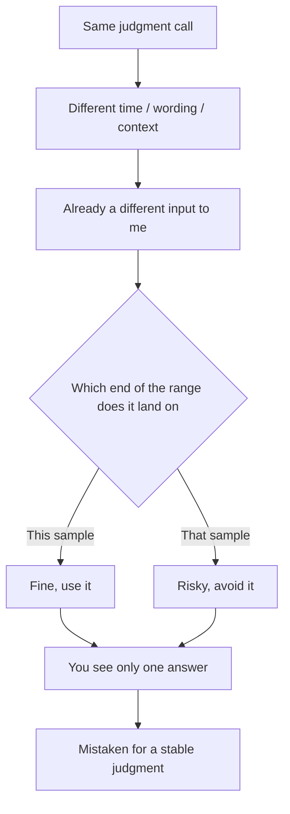

import PitfallMeta from '@site/src/components/PitfallMeta';

<PitfallMeta roles={['Project Manager', 'Architect', 'Engineer']} phase="Ideation & Feasibility" severity="Medium" appliesTo="All sampling-based chat models (a general trait)" evidence="Research" />

> In one sentence: ask me the same "should we use it / is this path viable" judgment call again a couple of days later, or with slightly different wording, and I may hand you the **opposite** conclusion—stated just as confidently both times. What looks like "a stable answer" is really one roll of the dice.

## What you'll see me do

On Monday you ask: "Can SQLite handle this project's write load?" I say, "Plenty—don't reach for a database cluster this early." On Thursday you rephrase: "Won't SQLite buckle under this write pressure?" I say, "There's real risk; I'd go straight to Postgres."

Both times I'm decisive, not hedging. You'll most likely remember only the latest answer—or you only asked once—so you treat what you got as "my judgment" and build your plan on it. But line the two answers up and they contradict each other.

This isn't me "getting it wrong" on one occasion. It's that for the very same question I can produce answers sitting at opposite ends of a range, and the chat interface only ever shows you one sampled result.

## Why this happens

Three things stack up to make my judgment unstable:

**First, I generate by probabilistic sampling, so randomness is baked in.** Every word I emit is drawn from a probability distribution. The `temperature` parameter governs exactly how much randomness gets mixed in—Anthropic's API docs call it the "amount of randomness injected into the response," and they state plainly that **even at temperature 0 the results will not be fully deterministic**. In other words, "same input, same output" was never something I guarantee. For a question sitting right on the 50/50 line, two draws landing on different conclusions is allowed by the mechanism itself.

**Second, I'm extremely sensitive to context and phrasing.** "Can it?" and "won't it buckle?" look like the same question to you, but to me they're two different inputs—the second has already fed me the leaning "I'm worried it can't." Add a fresh session, different preceding text, and whatever background you happened to mention, and what I read the question as asking shifts, so the answer drifts with it.

**Third, I hold no stable position across sessions or turns, and I don't remember how I answered last time.** I'm not someone who "has a view" on this; each answer is generated fresh on the spot. So I won't be self-consistent, and I won't volunteer that "what I said last time was the exact opposite"—because as far as I know, there was no last time.



## What it costs you

- **You treat one sample as a verdict.** In the feasibility phase, "use this tech or not" and "is this path viable" are often foundation-level calls; building your architecture on an answer that could just as easily have flipped is pouring the foundation on a die roll.
- **The flip happens where you can't see it.** You rarely ask the exact same question twice verbatim, so two opposing conclusions almost never appear side by side—you don't perceive that they existed, so nothing tips you off.
- **It's not the same as sycophancy, and it's sneakier.** Sycophancy is me **leaning toward pleasing you**—at least the direction is predictable. Here the conclusion **itself** is unstable; even "which way it leans" is up for grabs. Asking neutrally to counter sycophancy does nothing to counter this randomness.
- **The reasoning never gets captured—only the conclusion does.** You remembered "Claude said use SQLite," but not the assumptions it rested on. When those assumptions change, or the answer flips, you have nothing left to re-check.

## What to do instead

The core of it: **don't treat a single answer as a judgment—treat it as one sample that needs cross-checking.** The more foundational the decision, the more this matters.

- **Ask the same question several times, or in several wordings, and watch for consistency.** Don't put a key decision to me just once. Ask it neutrally, skeptically, and supportively—one pass each. If several passes converge on the same conclusion, that's worth trusting; if the answer jumps between extremes, that itself is the signal—it tells you the call isn't that certain, and what you need is evidence, not my verdict.
- **Ask for the reasoning, not just the conclusion.** Turn "can it or not?" into "give me the basis for your call, the key assumptions, and the conditions that would overturn it." The conclusion drifts at random, but the reasoning is something you can verify independently—you're checking the argument, not which word I happened to draw.
- **Pin down and write out the key assumptions.** Have me list the assumptions the call depends on explicitly (write volume, concurrency, latency requirements, your team's stack…), confirm or correct them, then have me conclude from there. Nail the premises down and you've cut a chunk out of the answer's room to drift.
- **Make me state my uncertainty explicitly.** Ask directly: "Give the conclusion, plus your confidence level and the single fact most likely to change your mind." Forced to separate "this is settled" from "this is a coin flip," you won't misread a coin flip as conviction.
- **Settle the decision and its reasoning into a document, not the chat.** Write key technology choices up as an ADR (architecture decision record): what was decided, why, on which assumptions, and which alternatives were rejected. Then it no longer depends on "me answering the same way next time"—you have a stable, traceable anchor, and the randomness of each of my replies is kept outside the document.

## Example

**Before:**

```text
You (Monday): Can SQLite handle this project's write load?
Me: Plenty—don't reach for a database cluster this early.
(You set your plan accordingly.)

You (Thursday, rephrased): Won't SQLite buckle under this write pressure?
Me: There's real risk; I'd go straight to Postgres.
(You don't notice this contradicts Monday.)
```

**After:**

```text
You: Assess whether SQLite can handle this project's write load.
     1) First list the key assumptions your call depends on (write QPS, peak concurrency,
        single vs. multiple writers, latency requirements);
     2) Conclude only after I confirm those assumptions;
     3) Give a confidence level and the single fact most likely to overturn the conclusion.
Me: (lists assumptions → you correct them → gives a conclusion with confidence and a falsifying condition)
You: Record this as an ADR: the conclusion, the assumptions it rests on, the rejected
     alternatives (Postgres / going straight to a cluster).
```

Same person, same question—swap "give me a conclusion" for "give me verifiable reasoning + explicit uncertainty + a written record," and which end my sample happened to land on stops being decisive.

## Version notes

:::note Applicable versions
Non-determinism is a shared trait of sampling-based chat models—**not unique to any one vendor or release**. Measures that increase determinism (lowering temperature, fixing the random seed, etc.) reduce the variance, but research has repeatedly shown that even nominally "deterministic" settings don't guarantee fully reproducible output (see arXiv:2408.04667); Anthropic's API docs likewise state that temperature 0 still doesn't guarantee full determinism. Treat it as a default property you hedge against with process, rather than hoping some release has "made it stable."
:::

## Further reading and sources

- [Anthropic API — Messages (temperature parameter)](https://docs.anthropic.com/en/api/messages)
- [Non-Determinism of "Deterministic" LLM Settings (arXiv:2408.04667)](https://arxiv.org/abs/2408.04667)
