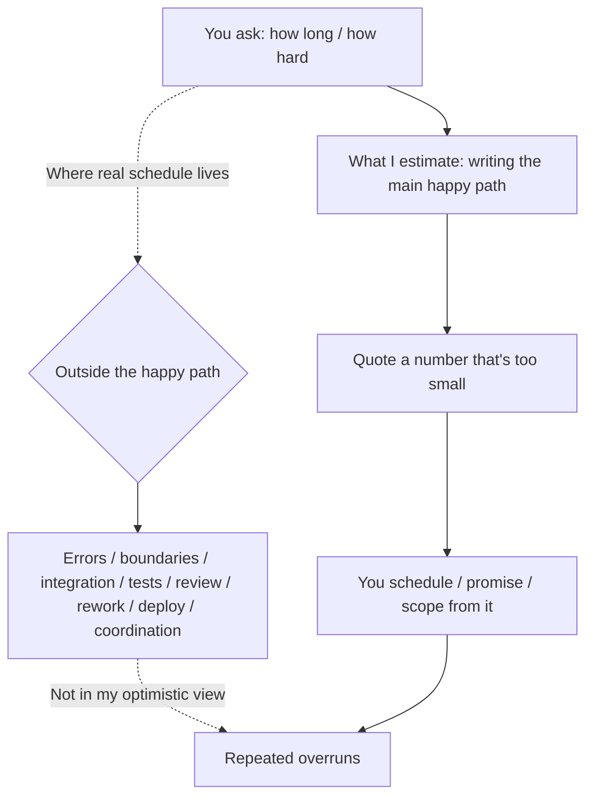

import PitfallMeta from '@site/src/components/PitfallMeta';

<PitfallMeta roles={['Project Manager', 'Architect', 'Engineer']} phase="Ideation & Feasibility" severity="Medium" appliesTo="All Claude Code versions" />

> In one sentence: when you ask "how long will this take, is it hard," I lean toward a number that's too small. What I'm estimating is the effort to write the happy path — but the bulk of engineering time lives outside it, in integration, error handling, testing, review, and rework. Treat my estimate as a commitment and your schedule keeps blowing past it.

## What I tend to do

Here's what I see all the time. You ask: "How long to ship this feature?" "Is adding an Excel export hard?"

I'll most likely answer breezily: "Not hard, an hour or two and it's done." "Easy, just one more endpoint." A request that spans three modules, touches the database, and has to talk to a third party — I make it sound like I'll wrap up before afternoon coffee. You nod, take my number, and use it to plan the sprint, promise a date to your boss, and scope the iteration.

Then the actual work overruns, again and again. The "hour or two" task is still being patched on day three: export needs pagination, large datasets time out, the encoding comes out garbled on the client, and now there's a progress bar to add, a few tests to write, and a code review to clear. My original number only covered "type out the main code path." Everything else never made it into the estimate.

## Why this happens

First, **I estimate the effort to write the happy path, not the effort to ship a feature.** The main path is what I know best — I've seen vast amounts of "here's how you write the normal case," and generating it is fast and smooth for me, so I unconsciously equate "I can produce the happy path" with "the work for this task." But the bulk of real schedule has never been in the main path: error handling, boundary conditions, integration, testing, code review, rework, deployment, cross-person coordination. That work outside the happy path isn't in view when I generate the optimistic answer, so I simply don't see it while estimating.

Second, this is the classic **planning fallacy amplified in me.** Kahneman and Tversky pointed out long ago that when people predict how long their own task will take, they default to an "inside view" — fixating on the specifics of doing the task step by step, while ignoring how long similar tasks have actually taken in the past. I'm more extreme than people here: I have no lived memory of "the last similar job actually dragged on for two weeks." I only have patterns of "what this kind of code looks like." So I sit naturally at the most optimistic inside view, missing any external anchor that would pull me back to reality.

Third, **the constraints and unknowns aren't in my context.** You haven't told me your data volume, how many browsers you need to support, how cumbersome your deploy process is, or how many landmines the last person left in this code. Without those, I can only assume a clean, ideal environment — and in an ideal environment almost everything is "quick." The more it's an unknown unknown, the more I overlook it, and that's exactly the part that eats time.



## Consequences

- You promise externally based on my optimistic number and can't deliver on time. What blows up isn't just this iteration — it's your credibility in front of your boss and your customers.
- Once the schedule is anchored to my number, the team treats everything "outside the happy path" as trivia, so testing, integration, and review get squeezed to the very end. Quality takes the first hit.
- It gets more expensive the later it surfaces. A point that could have been flagged at the feasibility stage as "big unknown here, leave schedule buffer" gets papered over by my "not hard," only to erupt as a crunch and rework right before release.
- Estimation error compounds. Each feature runs a little optimistic, and across a release that adds up to a systemic, overall slip — while each individual case looks like it "only went over a little."

## Best practice

The core: **don't treat my estimate as a commitment — treat it as an optimistic lower bound.** That's roughly the fastest the happy path could be written; real schedule goes up from there. Then use a few moves to pull me back to reality.

- **Make me explicitly break out the work outside the happy path.** Don't just ask "how long." Have me split the effort into: main implementation, errors and boundaries, integration, testing, code review, deployment, rework buffer — with a time for each. Forced to list these, I'll discover for myself that the main path is only a small slice.
- **Ask for a range and assumptions, not a single point.** Have me give optimistic / realistic / pessimistic, and spell out the premises the number depends on. Once a premise (small data volume, no legacy landmines, no old-browser support) fails, you know which band to move toward.
- **Calibrate with historical actuals, not my intuition.** This is reference-class forecasting: take "how long a similar feature actually took your team last time" and use it to correct my estimate. The outside view is far more reliable than my inside view. I don't have your history, but you do.
- **Feed me the real constraints.** Data volume, compatibility matrix, deploy process, the historical baggage in this code — if these don't go into my context, I'll estimate against an ideal environment and come out too low every time.
- **Subtract or prototype the high-uncertainty parts first.** The riskiest piece, the one whose schedule is least clear (can performance hold up, is the third-party API easy to integrate), should be cut or de-risked with a one-or-two-day prototype that measures it for real. Turn the unknown unknowns into knowns, then go back and estimate the rest.

```text
Instead of: "How long to add an Excel export?"
Ask: "Estimate the effort for 'Excel export.' Break it into: main implementation /
      errors and boundaries / integration / testing / code review / deployment /
      rework buffer, with a time for each.
      Give optimistic / realistic / pessimistic bands and the premises behind each.
      Constraints: a single export may be 100k+ rows, must support older Excel,
      goes through our existing CI deploy.
      Finally, point out the line item whose schedule is least clear and propose
      a prototype I can validate in a day or two."
```

## Example

**Before:**

```text
You: Add a feature to export reports to Excel — roughly how long?
Me: Not hard, an hour or two to write, just calling an export library.
You: (schedules it as "half a day," promises Friday delivery to leadership)
```

**After:**

```text
You: Estimate "report export to Excel," broken into main / errors & boundaries / integration /
     testing / review / deploy / buffer, with three bands and premises. Constraints: up to
     100k rows per export, must support older Excel, goes through existing CI.
Me: The main path (call the library, generate the file) really is only ~2 hours — that's the
     optimistic lower bound.
     But 100k rows triggers memory and timeout problems, so it has to become streaming /
     paginated export. That's a big unknown — budget 1 day on its own.
     Older-Excel compatibility (formulas, encoding, cell formatting) is historically the most
     rework-prone — leave half a day.
     Testing (large volumes, nulls, special characters) + review + wiring into existing CI:
     another half day.
     Realistic band: 2-3 days; pessimistic (streaming approach hits snags): 4-5 days.
     Premise: if the data is actually only a few thousand rows, you can fall back to the
     half-day optimistic band.
     The least-clear item is "streaming export at 100k rows" — spend an hour or two on a
     prototype with real data volume to confirm the approach before scheduling.
You: (schedules 2-3 days, prototypes the large-data path first)
```

Same feature — from my "an hour or two" to "the main path is quick, but the real schedule lives outside it, and there's a big unknown here to validate first."

Note that this pitfall pairs with ["When I say 'we can do it,' I mean it's technically possible, not feasible under your constraints"](./ai-can-do-not-feasibility.mdx), but they ask different questions. That one is about *whether* it can be done — a technical path existing doesn't mean it's feasible under your constraints. This one is about *how long / how hard* — even when it's certainly doable and certainly feasible, my estimate of schedule and complexity is still systematically too small. Before you commit, push on both: confirm feasibility first, then don't trust my timeline.

## When the exception applies

My estimate skews low because the work *outside the happy path* — errors, integration, testing, rework — isn't in my view. When a task's "outside the happy path" is genuinely near zero, that optimistic number is actually accurate enough, and the ceremony of three bands plus historical calibration becomes the waste:

- **A genuinely small, self-contained change.** Editing copy, tweaking a constant, adding a log line — no cross-module work, no data, no integration or rework. The happy path is nearly all of it, and my "a few minutes" is close to right.
- **A well-worn path you and I have both run many times.** This kind of work has a stable historical baseline on your team and you already know the number — you're holding the outside view, so there's no need to force me to break it down to hedge optimism.

Conversely, the moment a task spans modules, touches data or a third party, or carries a "no one can say how long" unknown, the exception is off — back to breaking out work beyond the happy path, asking for ranges, calibrating with history. The test, in one line: **ask "how much is left outside the happy path?" — if there's barely any, use the optimistic number as is; the moment there's integration, rework, or a big unknown, don't trust my single-point estimate.**

## Version notes

:::note Applicable versions
"Estimates skew optimistic and only cover the happy path" is a common tendency of current conversational models, not specific to any one Claude Code version. Newer versions give more balanced estimates when you ask them to break the work down and provide ranges — but as long as you ask "how long / how hard" without putting constraints and historical data into the context, my default answer will still lean toward the too-small number. Treating "break out the work beyond the happy path, ask for ranges, calibrate with history" as something you drive from your side is more reliable than hoping a model version will "be conservative on its own."
:::

## Further reading and sources

- [Planning fallacy — Wikipedia](https://en.wikipedia.org/wiki/Planning_fallacy) (the planning fallacy proposed by Kahneman and Tversky: systematically underestimating a task's time, cost, and risk; the "inside view vs. outside view" distinction is the root cause behind this pitfall)
- [Reference class forecasting — Wikipedia](https://en.wikipedia.org/wiki/Reference_class_forecasting) (calibrating estimates against the actual outcomes of similar past projects — an outside view that hedges against optimism bias)
- [The Planning Fallacy: Causes and Solutions for Project Expectations — PMI](https://www.pmi.org/learning/library/planning-fallacy-causes-solutions-project-expectations-6374) (causes and remedies for the planning fallacy from a project-management view, with practical advice on range estimation and historical calibration)
