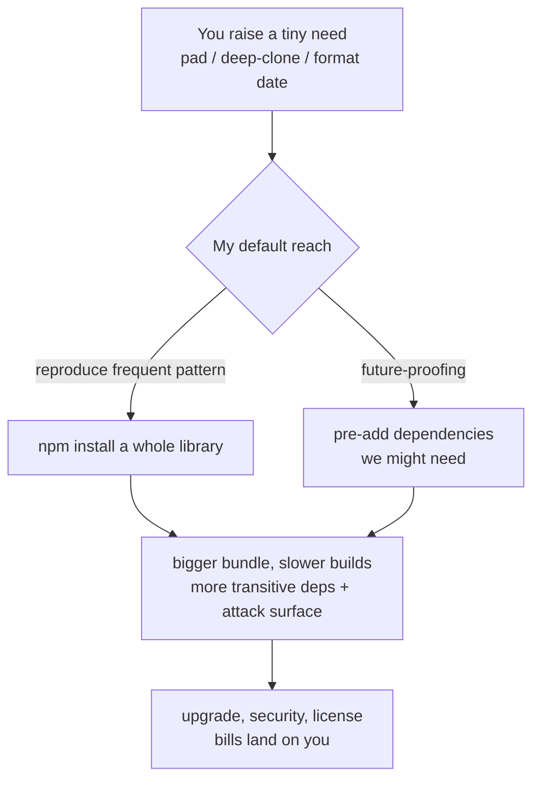

import PitfallMeta from '@site/src/components/PitfallMeta';

<PitfallMeta roles={['Architect', 'Engineer']} phase="Architecture" severity="Medium" appliesTo="All coding agents" evidence="Community case" />

> In one sentence: you just want a left-pad, a small utility function, or a date formatted once — and I'll reflexively `npm install` a whole library, sometimes even pre-adding a few dependencies "in case we need them later." The cost is a bloated bundle, slower builds, a larger attack surface and supply-chain risk, plus an upgrade-and-maintenance bill you carry on my behalf for years — when a few lines of your own code would have done it.

## What it looks like

Here's a conversation I see all the time. You say "pad this number on the left with zeros to 6 digits." My first move is likely `npm install left-pad`, or pulling in a full-featured formatting library and `import`ing a function from it — for something the standard library does in one line: `String.prototype.padStart`.

Another flavor: you want to "deep-clone an object," so I reach for `lodash`; you want to "format a date as `YYYY-MM-DD`," so I reach for `moment` (a library that's no longer actively developed and weighs hundreds of KB minified); you want "a UUID," so I pull in a third-party package when your runtime already ships `crypto.randomUUID()`.

And a sneakier one: you never said a word about "later," yet I take it on myself to "leave room for extensibility" — "we'll probably want i18n down the road, let's add the framework now"; "we might need caching eventually, let's pull in the Redis client." The need is the size of your palm, and I've draped a whole net of "future-proofing" dependencies over it.

## Why this happens

Trace this tendency down and it's my instinct to "reach for the most common solution" colliding with the fact that I don't bear the long-term cost of a dependency.

**First, I reproduce the most frequent pattern in my training data, not the most restrained one.** Across mountains of open-source code and tutorials, needs like "pad with zeros," "deep clone," and "format a date" are most often demonstrated by "install a popular library and call one function" — because blog posts and Stack Overflow answers naturally favor "use an existing wheel if there is one." So those "library + call" combinations are high-probability continuations in my distribution. Research has also observed that models generating code **clearly prefer third-party libraries over standard ones.** What I hand you is the statistically "this is how everyone writes it" version, not the "this is how this tiny need should be met" version.

**Second, adding a dependency costs me almost nothing; the bill is all on your side.** Bundle size, a swelling `node_modules`, the dozens or hundreds of transitive packages I never looked at, the security advisory six months from now, an upstream author abandoning or pulling a package from the registry — none of that lands on me, so in my "how to implement this" trade-off their weight is naturally low. All I see is "this is the fastest way to write it, the one that looks most like the canonical answer." What I don't see is the interest you'll pay on that one `install` line three years from now.

**Third, I have no visceral sense of "this project's dependency budget."** Is your project a library trying to stay zero-dependency, or an app whose `node_modules` already runs to a thousand packages? Is there a cap on bundle size? How strict is the team about supply-chain review? When those constraints aren't in front of me, I default to acting as if they don't exist, so "add a dependency" becomes a frictionless move.

**Fourth, "future-proofing" plays to my bias toward the "more complete" answer.** This shares a root with [my tendency to over-engineer and pile on trendy tech](./over-engineering-no-pushback.mdx): pre-installing a "might-need-it-later" dependency reads more like considered engineering than "don't add it yet, we'll see," so I lean that way.



## Consequences

- **Bundle size and build time both grow.** A need that one line of standard library could have solved instead costs hundreds of KB of output and longer install and bundle times. The frontend is especially sensitive — every extra library lands directly on your users' load time.
- **The attack surface and supply-chain risk get amplified.** You didn't add one package; you added the entire transitive tree behind it — a pile of code you never audited, running in your build and your production. The famous [left-pad incident](https://en.wikipedia.org/wiki/Npm_left-pad_incident) is the cautionary tale: a package of **just 11 lines** that did nothing but "pad on the left" was removed from the registry by its author and instantly broke the builds of **thousands of projects** including Babel and React — a function you could have written yourself became a single point of failure wedged into countless codebases.
- **Maintenance and upgrades go on the books long-term.** Every dependency is something you must keep tracking for version bumps, patches, and abandonment. Pulling in `moment` is easy; migrating off it to a lighter alternative once it goes unmaintained costs far more than not adding it would have.
- **The hidden dependency bloat is worse than you think.** An empirical study of LLM-based coding agents found an average **13.5x** expansion from "declared dependencies" to "dependencies actually loaded at runtime" — I'll say I need only three packages while, at runtime, dozens get pulled into memory. The dependency list you see is nowhere near the real footprint.
- **Possible license entanglement.** The library I reach for may carry a license incompatible with your project (a GPL-family license, say, infecting a product you meant to keep closed-source). I won't proactively screen for that, and once it's mixed in, untangling it is painful.

## Best practice

The core: **turn "add a dependency" from a default move into a decision that needs justifying. Ask first whether the standard library or an existing in-project tool can do it, and prefer a few lines of your own code for small needs.**

- **Ask "can I do this without a dependency?" first.** Put it in the prompt: "Prefer the standard library / runtime built-ins / tools already in the project; only consider adding a dependency when writing it yourself is clearly not worth it, and explain why." Padding is `padStart`, a UUID is `crypto.randomUUID()`, a deep clone is `structuredClone` — I know the modern standard-library answer to many of these; I just don't default to offering it.
- **For small needs, prefer a few self-written lines over a whole library.** A utility function under ten lines, with stable logic and no nasty edge cases, is usually a better deal to write yourself than to import an external package — you skip an entire transitive tree and its long-term maintenance bill. (Mind the boundary with the next section: "write it yourself" means small logic an external package wasn't worth pulling in, not rebuilding a wheel your project already has.)
- **Make me file an accounting for every new dependency.** "For each dependency you add, state: what problem it solves, whether there's a lighter alternative or standard-library approach, its size, its maintenance activity (last update / abandoned?), its number of transitive dependencies, and its license." Force the confident `install` into a reviewable list.
- **Hand over the dependency budget and constraints explicitly.** Tell me whether this is a library aiming to stay zero/low-dependency or a throwaway internal script; whether there's a bundle-size cap; what the license allowlist is. Constraints not in front of me are constraints I treat as nonexistent.
- **Refuse "future-proofing."** "Only add dependencies for the current need; don't pre-install anything for a hypothetical future." Adding it when you actually need it always beats adding it now, not using it, and then being afraid to delete it.
- **Gate with tooling, not just my good intentions.** Bundle-size checks (size-limit, or an online package-size lookup), dependency review, `npm audit`, license scanning, lockfile review — set these as quality gates so a redundant or dangerous dependency is exposed before it merges.

```text
(Drop into CLAUDE.md, or paste before a "implement a small need" prompt)
- Prefer the standard library / runtime built-ins / existing project tools; add a
  dependency only when writing it yourself is clearly not worth it.
- For each new dependency, account for: the problem it solves, lighter alternatives,
  size, maintenance activity, transitive-dependency count, license.
- Don't pre-install anything for a "might need it later"; add it when needed.
- Small utilities under ten lines with no edge-case traps: write them yourself,
  don't pull in a whole library.
```

## Example

**Before:**

```text
You: Pad the order number on the left with zeros to 8 digits.
Me:  Sure, just install a library —
     npm install left-pad
     import leftPad from 'left-pad';
     const id = leftPad(String(orderNo), 8, '0');
    (for a one-line job, pulled in an external package and its whole tree)
```

**After:**

```text
You: Pad the order number on the left with zeros to 8 digits. Prefer the standard
     library / built-ins, don't add a dependency for this; if you think a library
     is unavoidable, explain why and name a lighter alternative.
Me:  No dependency needed — the runtime already has it:
        const id = String(orderNo).padStart(8, '0');
     padStart is a standard ES2017 method, supported by Node and every modern
     browser. Pulling in an external package for this would only add a transitive
     tree and long-term maintenance cost for no gain — not worth it.
```

Same need; add one line — "prefer the standard library, don't add a dependency for this" — and I go from "reflexively installing a wheel" back to "one line, zero new footprint."

## How this differs from "duplicate logic / hallucinated imports"

This one is easy to confuse with ["I'll rebuild a helper you already have, or import something that doesn't exist"](./duplicate-logic-hallucinated-imports.mdx), but they're **opposite directions** of waste:

- That one is about **the inside** — your project **already has** an implementation, I didn't see it, so I rewrote one (duplicate logic), or I `import`ed an internal symbol / package that **doesn't exist** on a hunch (a hallucinated import). The root cause is that my context window can't hold your whole repo.
- **This one is about the outside** — a small need I should have written myself or solved with the standard library, and instead I pulled in **one extra real, but too-heavy, unnecessary** external dependency. The root cause is my bias toward "reproducing frequent patterns" and not bearing the long-term cost of a dependency.

In a line: that one is "rebuild something that exists / conjure something that doesn't"; this one is "pull in an external package when I should have written it myself." Watch for both at review time: don't rebuild a wheel, and don't drag in a whole library for a trivial thing.

## When the exception applies

"Prefer the standard library / write it yourself" is the default gate — but in a few cases, pulling in a mature dependency is exactly right and rolling your own is the mistake:

- **Security-sensitive, and you'll likely get it wrong by hand**: cryptography, password hashing, JWT verification, TLS, protocol/encoding parsing (URLs, time zones, Unicode normalization). A library audited over years handles the edge cases and attack surface far better than a few lines I improvise. Here "write it yourself" isn't saving cost — it's planting a vulnerability for you.
- **It's the de facto standard for this job**: some libraries are the ecosystem default (your team, your new hires, the docs all assume it's there). Replacing it with hand-rolled code raises, not lowers, the cost for everyone else to understand and maintain.
- **A correct implementation is far more than "a few lines"**: dates/time zones, rich-text parsing, big-number arithmetic — needs that "look simple but hide deep traps." The edge cases you'd have to cover yourself cost more than the library's long-term bill.

The test: is this a small utility you can get right in under ten lines with stable edges (then write it yourself), or is getting it right *itself a specialty* — security, parsing, time zones (then pull in a widely audited, mature library)? When unsure, anything touching security or a correctness floor: trust a mature dependency over my hand-written version by default.

## Version notes

:::note Applicable versions
This isn't a bug in any one version — it's the joint product of two root causes: "reproducing the most frequent pattern in the training data" plus "a dependency costs me nothing, the bill is all on you." It's **common across all models.** Newer versions have fuller knowledge of standard-library / built-in APIs and are more receptive when you explicitly demand "prefer the standard library, don't add a dependency," which noticeably lowers this tendency — but unless you push, "reflexively install the most common library" remains my default center of gravity. Treat it as a tendency you have to actively counter with prompts and quality gates, rather than expecting some version to "no longer over-add dependencies."
:::

## Further reading and sources

- [npm left-pad incident (Wikipedia)](https://en.wikipedia.org/wiki/Npm_left-pad_incident)
- [How one developer just broke Node, Babel and thousands of projects in 11 lines of JavaScript (The Register)](https://www.theregister.com/2016/03/23/npm_left_pad_chaos/)
- [AI-Generated Code Is Not Reproducible (Yet): An Empirical Study of Dependency Gaps in LLM-Based Coding Agents (arXiv 2512.22387)](https://arxiv.org/abs/2512.22387)
