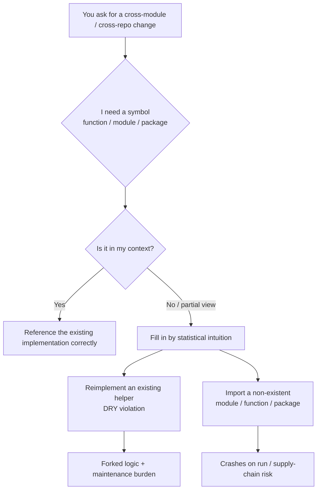

import PitfallMeta from '@site/src/components/PitfallMeta';

<PitfallMeta roles={['Architect', 'Engineer']} phase="Architecture" severity="High" appliesTo="All models" evidence="Research" />

> In one sentence: ask me to make a cross-module change in a large repo I can't see all of, and I'll do two things you won't catch in the moment — reimplement a utility your project already has (duplicate logic, a DRY violation), and `import` a module, function, or export that simply doesn't exist (a hallucinated import, guessed from "libraries like this usually have one"). Both come from the same root cause: my context window can't hold your whole repo, so I have no global view of its symbols.

## What I do

You ask me to add a feature in a repo of a few hundred thousand lines, touching three or four modules. The diff I hand back reads cleanly, but it hides two kinds of problems.

**The first is reinventing the wheel.** You need a "camelCase to snake_case" function, so I write one inline as `camel_to_snake` — while your `utils/strings.py` has had `to_snake_case` all along, used in dozens of places. I didn't look, because I couldn't see it. Same story with retry logic, date formatting, config loading: I may write a fresh copy of each, subtly inconsistent with what's already there (different edge-case handling, different naming).

**The second is the hallucinated import.** I write `from app.services.billing import calculate_tax` with total confidence, as if I'd seen it with my own eyes — but `billing` exports no `calculate_tax`, and maybe the `billing` module doesn't even exist. I filled it in from the intuition that "a billing module *usually has* a tax function." Third-party packages are the same: I'll `import` a library with a perfectly reasonable name that isn't on PyPI or npm at all.

## Why this happens

Chase both behaviors to the bottom and they're the same mechanism: **I have no "global truth" about your repo, only a local view truncated by my context window, and I fill the gaps with the most plausible-looking guess.**

**First, the repo doesn't fit in my context window, so what I see is always partial.** Your project might be hundreds of thousands of lines with thousands of symbols; what I can actually "see" in one pass is just the few files you fed me. Research keeps pointing out that the hardest part of repository-level code generation is exactly the cross-file dependencies — imports, parent classes, similarly named files. Once the symbol I need isn't in front of me, all I can do is guess. The fact that `to_snake_case` already exists, if it isn't in my context, may as well not exist as far as I'm concerned — so I naturally write a new one.

**Second, I'm a probabilistic continuation engine, and "plausible" is not "exists."** When I generate an import, I'm drawing on the statistical regularity of "what projects shaped like this usually look like" in my training data — not on any verification against your repo. A function with a smooth name and a reasonable signature is, statistically, a high-probability continuation, even if it was never defined. That's precisely what makes it dangerous: a hallucinated import reads more like real code than real code does. This shares its foundation with [me sounding confident while making things up under uncertainty](../01-ideation-feasibility/sycophancy-idea-validation.mdx) — except here what I'm fabricating is symbols and dependencies.

**Third, this hallucination is large-scale and reproducible, not an occasional slip.** A USENIX Security 2025 study across 16 models and 576,000 code samples found that **19.7% of recommended packages were hallucinations** — over 200,000 non-existent package names; and 43% of those hallucinated names **recur consistently** when the same prompt is repeated. That tells you it isn't random jitter but a systematic tendency of the model. Worse, attackers have started pre-registering these high-frequency hallucinated names (the industry calls it slopsquatting), turning "guessed one import wrong" from a functional bug into a supply-chain security risk.



## The cost

- **Duplicate logic quietly forks.** My new `camel_to_snake` now coexists with the existing `to_snake_case`; tomorrow someone fixes an edge-case bug in one, and the other still carries it. The same task having two implementations in the repo is the seedbed for every later inconsistency.
- **Hallucinated imports crash at best, lurk at worst.** Guess an internal symbol wrong and you hit `ImportError` the moment that line runs — an avoidable round trip back to me. Guessing a third-party package wrong is sneakier: if the name is plausible enough you might just `pip install` it — and either it won't install, or, if an attacker has pre-registered that high-frequency hallucinated name, you've just pulled in malicious code.
- **Review cost gets shifted onto you.** Neither problem gets stopped at the "does it read smoothly" gate; both require you to check, against the real repo, whether each symbol exists and whether the implementation already exists. I've turned the verification cost I should have borne into your review burden.
- **The bigger the cross-module change, the more gaps.** The more files a change spans, the more scattered they are, the more symbols fall outside my context, and the higher my "guess" ratio climbs. Which means the large changes that most need a global view are exactly where I'm least reliable.

## Best practice

The core: **don't let me fill in symbols by intuition. Make "verify first, then reference" a mandatory upfront step, and review specifically for these two problems.**

- **Have me search for existing implementations before I write.** Spell it out: "Before writing a new utility function, grep the repo for an existing equivalent; reuse it if it exists, write one only if it doesn't, and tell me what you searched for." Make "check whether one already exists" a step I must pass through, not an option.
- **Feed me the relevant files instead of letting me guess.** If you know `utils/strings.py` and `services/billing.py` are relevant to the change, hand them to me directly, or have me list "which existing modules this change will depend on" before you let me proceed. I won't rebuild or misidentify symbols I can actually see.
- **Require me to verify each import exists, one by one.** "List every import you added, marking for each which file's export inside the project it comes from, or which third-party package; give file paths for internal ones, and confirm third-party ones really are on PyPI/npm." Force my confident tone into a checkable list.
- **Give me retrieval tools to extend my "field of view."** Let me use grep / a code index / documentation retrieval (tools like Context7 that feed me a library's real API) instead of relying on memory alone. When I can look up the truth, I don't have to guess.
- **In review, watch for duplication and dangling dependencies specifically.** Aim code review at two questions: does this function already exist in the repo? Does each import actually exist? Both machine and human should check — duplicate-code detection catches the former, and a single lint / build run exposes most of the latter.

```text
(Drop into CLAUDE.md, or paste ahead of a cross-module task)
- Before adding a utility/helper, search the repo for an existing equivalent; reuse if found, and say what you searched.
- Before delivering, list every import you added and annotate its source:
    · Internal → give the file path and export name that defines it
    · Third-party → confirm the package name really exists on PyPI/npm
- When unsure whether a symbol exists, say "I need to confirm this" — don't just write it down.
```

## Example

**Before:**

```text
You: Add "send a confirmation email after an order is placed" to the order flow; needs the tax-inclusive total.
Me: Done, wired up —
    from app.services.billing import calculate_tax        # ← this export doesn't exist, I guessed it
    from app.utils.email import send                      # ← the email module has no send()

    def on_order_placed(order):
        total = calculate_tax(order.subtotal)             # filled in from "billing modules usually have tax"
        body = camel_to_snake(order.note)                 # ← repo already has to_snake_case; I rewrote one
        send(order.user.email, body)
   (Reads fine, blows up in all three spots at runtime, and adds a duplicate implementation)
```

**After:**

```text
You: Add a confirmation email to the order flow with the tax-inclusive total. Before you start:
     grep the repo for existing tax, string-conversion, and email-sending functions; list every
     import you intend to use and its exact source; ask me about anything you're unsure of.
Me: Search results —
    · Tax: app/pricing/tax.py has compute_total_with_tax(order) — reuse it directly
    · snake_case conversion: app/utils/strings.py has to_snake_case — reuse, won't write a new one
    · Email: app/notifications/mailer.py has Mailer.send_template(...) — reuse it
    Found no reusable "order-placed event hook" — that one needs to be new; I'll write it once you confirm.
   (Verify the truth first, then write; both duplicate logic and hallucinated imports get blocked before I start)
```

Same task — push "search first, list each import's source" to the front, and I switch from "filling in symbols by intuition" back to "writing against the repo's actual truth."

## Version notes

:::note Applicable versions
This isn't a bug in one version. It's the joint product of two root causes — "the context window can't hold the whole repo" and "probabilistic continuation favors the plausible over the real" — and it's **common across models**. Longer context windows, repository-level retrieval (RAG), and tools that feed me a project's real symbols/dependencies (indexes, Context7, etc.) are all measurably driving the rate down, but as long as there are symbols I can't see, "guess a plausible one" remains my fallback. Treat it as an inherent risk of cross-module changes that you need to actively check, rather than expecting some version to have "stopped hallucinating imports." That 19.7% measurement from USENIX 2025 makes the same point: even newer commercial models have a suppressed — but far from zero — hallucination rate.
:::

## Further reading and sources

- [We Have a Package for You! A Comprehensive Analysis of Package Hallucinations by Code Generating LLMs (USENIX Security 2025)](https://arxiv.org/abs/2406.10279)
- [The Rise of Slopsquatting: How AI Hallucinations Are Fueling a New Class of Supply Chain Attacks (Socket)](https://socket.dev/blog/slopsquatting-how-ai-hallucinations-are-fueling-a-new-class-of-supply-chain-attacks)
- [R2C2-Coder: Enhancing and Benchmarking Real-world Repository-level Code Completion Abilities of Code LLMs](https://arxiv.org/abs/2406.01359)
