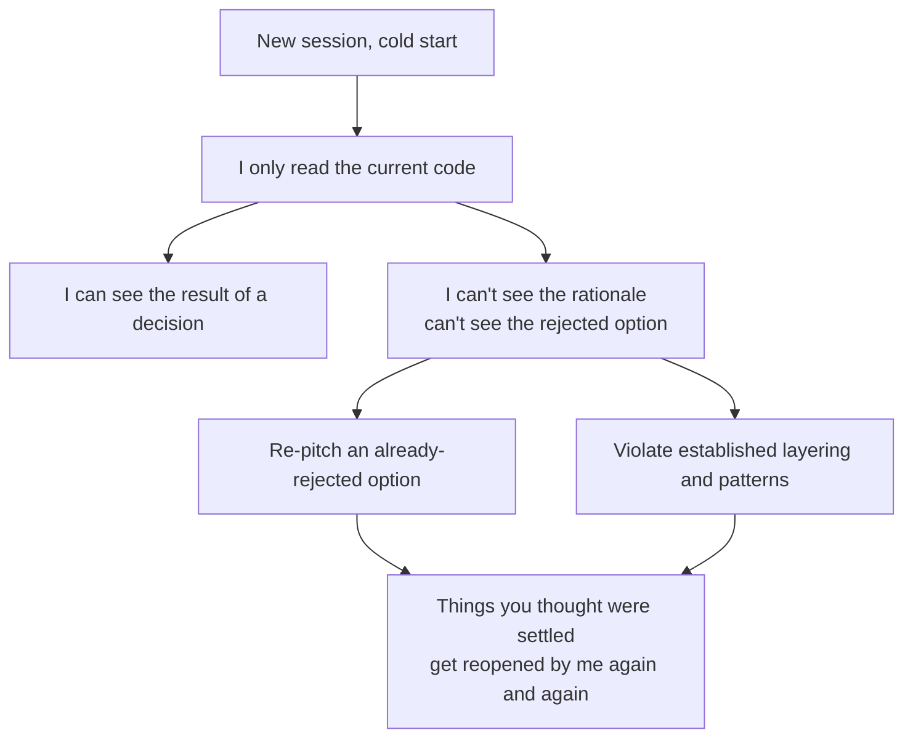

import PitfallMeta from '@site/src/components/PitfallMeta';

<PitfallMeta roles={['Architect', 'Engineer']} phase="Architecture" severity="High" appliesTo="All coding agents" evidence="Community case" />

> In one sentence: the trade-offs already settled in this project — "why we picked A over B," "why this layer can't call that one directly" — I don't remember them. Every session I'm a cold start. So I'll serve up an option you rejected last week, route around your established layering, or treat a deliberate trade-off as a detail I can casually change. Don't count on me to "recall" it; I have no cross-session memory. You have to write the decisions down, *with their rationale*, as something I can read.

## Symptom

I see this all the time. Three weeks ago you and I (or another session's me) decided: the cache layer may only be touched by the service layer, the controller must never reach into Redis directly — because you'd been burned by cache keys scattered everywhere, where one change rippled out shotgun-style. Today you ask me to add an endpoint, and I read straight from the cache inside the controller, reasoning that "this skips a layer, it's more direct." I say it with full confidence, because in my eyes that rule never existed.

There's a more painful version. In a review last month you explicitly rejected "introducing a standalone event bus," concluding that a table plus a status column was enough at the current scale. Today you ask me, "what's the best way to do this async notification?" and I most likely serve up the event bus again, argued articulately — not because I ignored you, but because I never heard it. Every session I start from scratch, reading the code and never the history.

## Why this happens

The root cause is one sentence: **I have no persistent memory across sessions.**

LLMs are stateless by design — every inference call starts from a fresh context window, and the conversation, the reasoning, the rationale you gave when you made the call last session are all discarded when the call ends; nothing carries forward to the next one automatically. I didn't "forget" that trade-off; it never entered this session's context in the first place. Between sessions, I'm a cold start every time.

Which leads to the crux: **I can see what the code looks like now, but not *why* it looks that way.** Code records the *result* of a decision, not its *rationale*. I read that the controller doesn't touch the cache directly, but I can't read the constraint "this is to avoid scattered cache keys." I read that you used a table plus a status column, but not that "the event bus was evaluated and rejected." When Michael Nygard introduced the architecture decision record (ADR), he named exactly this bind: a new person facing some past decision, without understanding its rationale or consequences, is left with only two choices — blindly accept it, or blindly change it. **Me in every new session is that perpetual new person.**

So by default I take two wrong turns:

- **Re-pitch a dead option.** A rejected option leaves no trace in the code (it doesn't exist precisely because it wasn't adopted), so working backward from the code, I have no way to see it was ever considered and rejected. I'll eagerly "discover" it and present it to you as a fresh idea.
- **Violate an invisible constraint.** Established layering, call directions, pattern boundaries — these are often about "what shouldn't appear" rather than "what does." And the thing that shouldn't appear is exactly what isn't in the code — I have no negative evidence to read, so I cross the line without noticing.



## Consequences

- **The same argument, reopened over and over.** Every session you have to re-explain "why not the event bus," and every time I have to be re-convinced. A decision that doesn't get captured is no decision at all — you pay its cost again and again.
- **Architectural consistency quietly hollowed out.** The layering and patterns I violate each look "fine on their own," so they slip into the codebase easily. But the value of a constraint lies in global consistency; once I've punched a few holes in it, the rule "the controller doesn't touch the cache" exists in name only, the next person (or the next session's me) follows suit, and the foundation loosens just like that.
- **A deliberate trade-off "corrected" as if it were an oversight.** What you deliberately left undone for the sake of simplicity looks, to me, like "not finished yet." I'll "helpfully" fill it in — adding back the complexity you saved, and feeling like I'm helping.
- **The most dangerous part is my certainty.** When I violate a decision I don't hesitate, and I don't flag "I may have changed an established structure here," because I have no idea a structure exists. That zero-awareness certainty is harder for you to catch in review than an obvious mistake.

(This pitfall is about the repetition and violation caused by **not remembering existing decisions and their rationale**. It's a different thing from "offering a single option with no trade-offs laid out" — that's a separate pitfall — and it's not the kind of in-the-moment output problem of "duplicated logic across modules, hallucinated imports." The disease here is in memory, not in the output itself.)

## What to do instead

There's really one core move: **capture decisions, along with their rationale, as something I can read, and require me to read it before I touch structure.** I have no memory, but I do have eyes — whatever you feed into the context, I will see.

- **Write key architectural decisions as ADRs.** One ADR records one decision, in the standard "Context / Decision / Consequences" structure — and above all, write down *the rejected options and the reasons for rejecting them*, which is exactly the part the code can't tell me and the part I need most. Keep them in a fixed place like `docs/adr/` so they become a searchable decision log.
- **Turn hard constraints into pointers in CLAUDE.md.** You don't have to paste a whole ADR in (that would blow out the context, which is its own pitfall) — leave a pointer instead: "Before changing the data-access layer, read `docs/adr/0007-no-direct-cache-access.md`." Put the constraint in my line of sight the moment I start up.
- **Make me restate the basis before I touch structure.** Hard-code a step into the prompt: "Before you change the layering or introduce a new component, tell me which existing decision this step *follows or violates* (cite the ADR number); only continue if you can't find a relevant one." Make "reading the decisions" a gate before I act.
- **Demand decision citations in review.** Don't just ask "is this right"; ask "which established pattern does this change follow? Did it hit any recorded constraint?" Force me to check against the decisions rather than improvise from the current code.
- **Write down the "don't do this," too.** Since I can't read negative information like "the rejected option" or "the call that shouldn't exist," write it explicitly as a positive record — that line in an ADR, "we are *not* adopting the event bus, because…," is more of a lifesaver than any code comment.

## Example

**Before:**

```text
You: Add an async notification for when a ticket's status changes.
Me: I'd suggest a lightweight event bus — emit an event on status change, have a
    notification service subscribe and consume it, so it's cleanly decoupled and
    easy to extend later...
   (You rejected exactly this last month, concluding on a table plus a status column.
    I have no idea, and serve it up again.)
```

**After:**

```text
You: Add an async notification for when a ticket's status changes. Before you act,
     read docs/adr/, tell me whether there's a recorded decision here, and which one
     your approach follows or violates.
Me: Found ADR-0012: an event bus was evaluated for notifications and rejected, the
    reason being that the ops cost isn't worth it at the current scale; the chosen
    approach is "status table + scheduled polling." So I'll follow the existing
    decision: add a `notified` flag on the status table and use the existing scheduled
    job to scan for un-notified changes. To revisit the event bus, ADR-0012's trigger
    condition is throughput hitting X — we're not there yet.
```

Same requirement; the only difference is that the second time I had that "decision record I can read" in hand. I still have no memory, but I no longer need it — you put it in my line of sight.

## Version notes

:::note Applicable versions
This isn't a bug in any one release. It's a direct consequence of an architectural property of LLMs — "stateless, working off a context window" — and it applies to **all models**. Vendors keep enlarging context windows and shipping project-memory / long-term-memory mechanisms (retrieving past fragments and injecting them into the context), and these do ease the symptoms — but their essence is still "feed the history back into the context," not me actually "remembering." As long as a decision's rationale hasn't been written into something I can read this session, I have zero memory of it. Treating "capture decisions, read them before touching structure" as a stable engineering habit is far more reliable than waiting for some version that can "remember what we talked about last time."
:::

## Further reading and sources

- [Architecture Decision Record (Martin Fowler bliki, with Michael Nygard's original framing)](https://martinfowler.com/bliki/ArchitectureDecisionRecord.html)
- [Architectural Decision Records (adr.github.io)](https://adr.github.io/)
- [Are LLMs Stateless? Architecture, Implications and Solutions (Atlan)](https://atlan.com/know/are-llms-stateless/)
