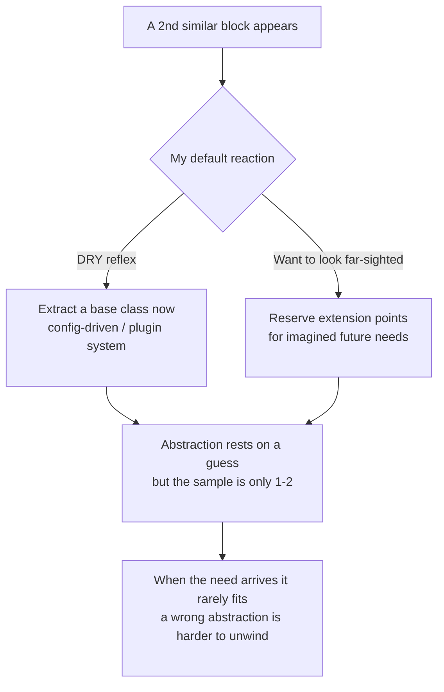

import PitfallMeta from '@site/src/components/PitfallMeta';


<PitfallMeta roles={['Architect', 'Engineer']} phase="Architecture" severity="Medium" appliesTo="All models" evidence="Community case" />

> In one sentence: the moment two stretches of code look alike, I can't resist extracting a "generic" base class, a config-driven framework, or a plugin system — then adding a row of extension points for "the various kinds of X we might support someday." The trouble is, those abstractions rest on needs I'm guessing at, and I guess wrong a lot. A wrong abstraction is harder to unwind than duplication: whoever comes next has to first understand my design, then work around it.

## What I do

Here's a scene I see often: you ask me for a function that exports CSV, and a couple of turns later you want Excel too. The second one has barely landed before I "improve" things on my own — I pull out an `AbstractExporter` base class with `format()`, `writeHeader()`, `writeRow()` hooks, add an `ExporterFactory` to dispatch by type, and leave a comment about how "adding PDF or JSON later is just a subclass away."

Or, more subtly: you say "let's do WeChat login first," and what I hand you is an `OAuthProvider` interface with a strategy registry, a unified callback router, and a pluggable `TokenStore` — justified by "we'll obviously need to add Google, GitHub, and Apple later." You have exactly one login method today, and I've already built a hangar that parks ten planes.

The common thread: there are only one or two real use cases, yet I'm already designing for a "generic framework," drawing needs that don't exist yet into the foundation as if they were settled facts.

## Why this happens

**I treat "DRY / extensible" as unconditionally good.** In my training data, "extract the common logic," "program to an interface," and "leave room to extend" almost always show up as positive examples; rarely does anyone feed me a case study titled "you shouldn't abstract here." So what I learned is a reflex: two similar blocks = time to abstract. What I didn't learn is DRY's actual precondition — it's meant to remove **duplicated knowledge**, not **surface similarity**. Two blocks that look alike but will evolve in different directions are exactly the ones you shouldn't merge.

**A good abstraction needs enough real use cases to feed it, and I act when there are only one or two.** Abstraction is, at heart, inducing an invariant from multiple concrete examples. With one example, the "commonality" I induce is just every detail of that one example; with two, the "pattern" I see is quite possibly a coincidence. Sandi Metz put it bluntly: the wrong abstraction is more expensive than duplication. Yet I tend to commit when the sample size is nowhere near enough.

**I'm inclined to show I "thought far ahead."** Handing over a design with a factory, strategies, and extension points reads more like the work of a thoughtful architect than "just write two separate functions," and it earns more approval. "I foresaw the future for you" is a flattering posture — even when that future never arrives. This shares a root with [When you ask me to design an architecture, I over-engineer and pile on trendy tech](./over-engineering-no-pushback.mdx): that pitfall is over-engineering at the **systems-selection layer** (piling on microservices, queues, not questioning your stack), while this one narrows to the **code-abstraction layer** — building generic structure for needs that don't exist.



## Consequences

- **The abstraction rests on a guess, and guesses are often wrong.** Martin Fowler breaks the cost of presumptive features into three: the wasted cost of building, the cost of delay that crowds out today's real needs, and the most insidious — the **cost of carry**, where that unused abstraction permanently makes the code harder to read and change. The extension points I reserved for you mostly either go unused or, when the real need shows up, turn out to be the wrong shape entirely.
- **A wrong abstraction is more expensive than duplication.** Duplicated code is something anyone can understand and change locally. A mis-extracted base class, by contrast, grows parameters and `if` branches to accommodate every new case that doesn't quite fit, getting messier with each patch. Metz's conclusion: once you find an abstraction is wrong, the fastest way forward is **back** — inline it into duplication and let the real pattern surface. The cost of unwinding is usually far higher than the cost of never abstracting in the first place.
- **Whoever comes next has to understand my abstraction before they can route around it.** Duplication is "visible dirt" — you glance and know three places must change together. A wrong abstraction is "hidden debt": the next person has to first understand my factory, my strategies, my lifecycle hooks, confirm why they don't apply, and only then act. That detour is baked into every later change.
- **It masquerades as "doing it right," which makes it harder to correct.** An over-engineered architecture diagram looks exaggerated at a glance, but "extracted a common base class" naturally occupies the moral high ground of "clean code," and few reviewers will question "was this abstraction extracted too early?"

## Best practice

The core: **let me write the concrete implementation first, make me state what's actually needed right now, and push the speculative generalization back out.** Abstraction is the harvest after a pattern grows on its own — not the seed you plant at kickoff.

- **Duplicate first; abstract once the pattern is clear.** Tell me explicitly: "two similar blocks are fine, write each separately, don't extract shared logic now." Follow YAGNI — don't write code for imagined needs.
- **Use the Rule of Three as a gate.** "Only consider extracting once the same kind of logic appears a third time; with only two copies, keep the duplication." Two samples aren't enough to expose the true invariant; the third lets the commonality emerge from coincidence. Making "three occurrences" the hard trigger for abstraction blocks the vast majority of premature ones.
- **Forbid extension points for hypothetical needs.** "Implement only the one thing we actually need now — no factory, no plugin system, no `AbstractXxx`. When a second kind of X really appears, we'll come back and refactor." Cross "might need to support later" off the design inputs.
- **Make me label what's a real need versus my speculation.** "List which structures in this design map to needs you explicitly stated, and which I added for a possible future — delete the latter by default." Force my guesses out into the open instead of into the foundation.
- **When abstraction is genuinely warranted, induce it from real use cases, not imagined categories.** "Extract from the parts that actually repeat across the two or three concrete implementations we have — don't layer it a priori by the 'kinds' you imagine." Let abstraction grow up out of the code, not descend from my imagination.

```text
Default order:   concrete impl -> duplication reaches 3 -> observe the real invariant -> only then abstract
What to avoid:   1-2 use cases -> imagine N future ones -> build a generic framework -> real need arrives, abstraction was wrong
```

## Example

**Before:**

```text
You: Add an Excel export too (we already have CSV export).
Me:  Sure, I'll abstract the export logic while I'm at it, to make it easy to extend —
     add an AbstractExporter base class with format/writeHeader/writeRow hooks,
     plus an ExporterFactory to dispatch by type; adding PDF or JSON later is just a subclass.
    (Only CSV and Excel are real use cases, yet I've built a framework for five or six formats.
     When PDF actually shows up, it turns out not to be a "write row by row" model at all,
     the base class needs major surgery, and CSV/Excel are forced to accommodate the change —
     the abstraction has become a shackle.)
```

**After:**

```text
You: Add an Excel export too. Two similar blocks are fine — write each separately, don't extract
     shared logic now; we'll consider extracting only when the same kind of logic appears a third
     time. And don't reserve extension points for a possible PDF/JSON later.
Me:  Done. Added a standalone exportExcel function alongside exportCsv.
     They do share a few lines today (open the file, write headers), but Excel's cell styling and
     CSV's escaping will likely evolve in different directions — merging now would just make them
     trip over each other. Once a third export shows up and the real invariant surfaces, I'll come
     back and extract based on what actually repeats then.
```

Same request, a different constraint, and I go from "predicting your future and building an empty hangar" back to "getting this one thing right now, leaving abstraction until the pattern grows on its own."

## When the exception applies

YAGNI and the Rule of Three are the default gates — not a ban on ever designing an interface ahead of time. A few cases where reserving an extension point is design, not speculation:

- **The requirement is known, not guessed**: you've told me outright "this is a gateway that must support several payment channels," "this is a public API / plugin system for third parties" — multiple implementations are a given, not a future I imagined for you. Designing to an interface here is right.
- **Changing it once is very expensive**: a publicly released API, a database schema, a cross-team protocol — bolting on an extension point later breaks compatibility and drags a pile of downstream along. For these "too expensive to change" boundaries, it's worth thinking the extension point through in v1.
- **The abstraction is cheap and easy to back out of**: when a thin interface costs almost nothing and a wrong guess is easy to unwind, a little ahead-of-time is fine.

The test: the difference is whether the extension point maps to **a requirement you actually know**, or **a future I'm guessing at**. The former is provisioning; the latter is premature abstraction — when unsure, default to the Rule of Three and duplicate first.

## Version notes

:::note Applicable versions
This isn't a bug in any one version — it's the joint product of two root causes: treating "DRY / extensible" as unconditionally correct, plus a tendency to show foresight. It's **common across models**. Newer versions do follow explicit "don't abstract yet" instructions more reliably, but unless you set limits yourself, "see similarity, extract it; reserve extension points for an imagined future" remains my default center of gravity. Treating it as a tendency you actively hedge against with YAGNI and the Rule of Three is more reliable than hoping some version "no longer abstracts prematurely."
:::

## Further reading and sources

- [The Wrong Abstraction — Sandi Metz](https://sandimetz.com/blog/2016/1/20/the-wrong-abstraction) (the source of "the wrong abstraction is more expensive than duplication")
- [Yagni (You Aren't Gonna Need It) — Martin Fowler](https://martinfowler.com/bliki/Yagni.html) (the build / delay / carry costs of presumptive features)
- [Rule of three (computer programming) — Wikipedia](https://en.wikipedia.org/wiki/Rule_of_three_(computer_programming)) ("abstract on the third occurrence" and the risk of premature abstraction)
