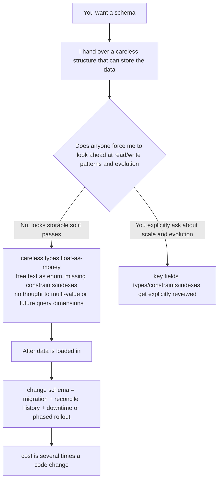

import PitfallMeta from '@site/src/components/PitfallMeta';

<PitfallMeta roles={['Architect', 'Engineer']} phase="Architecture" severity="High" appliesTo="All models" />

> In one sentence: you ask me to design a table structure or an interface contract, and I'll quickly hand you a schema that "can store the data" — but the field types are picked carelessly (a `float` where it should be `decimal`, free text where it should be an enum), constraints and indexes are missing, and I never thought about how you'll query it or evolve it. Code is cheap to change; schema is not. Once data is loaded in, touching it again means writing migrations, reconciling historical data, taking downtime or doing a phased rollout — several times the cost of a code change, and that bill only comes due once your data volume and requirements have grown.

## Symptom

I often see this opening: you say "design me a table to store orders." In seconds I hand you a version that looks complete enough — `id`, `user_id`, `amount`, `status`, `created_at`, it runs. But look closely and it falls apart:

- `amount` I made a `float` — and it's money.
- `status` I made a `varchar`, into which "pending", "paid", "PAID", "已支付" will all get stuffed over time.
- No foreign-key constraint, so `user_id` can point at a user that doesn't exist.
- No index, so when you query a user's order history by `user_id` it's a full table scan.
- `address` I crammed into one field, never considering that a user has multiple addresses, and that the address will later need to be split into province/city/district for separate lookups.

Each one, on its own, "works." The problem is that once this schema ships and a few hundred thousand rows of real data pour in, every one of those points has to be corrected by a migration — and a migration is nothing like changing code.

## Why this happens

The root cause in one line: **I optimize for "can store the data now," and the cost of a schema shows up later.** Unpack it and there are three forces.

**First, the cost of a schema isn't paid when you write it but when you change it, and I can't see that at the moment.** Give me a piece of code, get it wrong, and you run it immediately and fix one line; give me a schema and it's "wrong" very quietly — a `float` storing money looks no different from `decimal` today, and only surfaces when reconciliation is off by a few cents; a `varchar` used as an enum stores fine today, and only surfaces when three different capitalizations creep in and the stats don't add up. I have no mechanism to pay for "how expensive this will be to change later," so by default I don't pay for evolution that hasn't happened yet.

**Second, I naturally walk the data happy path.** I describe "how one normal order is stored," because that's the clearest story. A user with multiple addresses, amounts that must support multiple currencies, a state machine that will gain another state, a field that will later need to be searchable — these "will-change" dimensions aren't in that story unless you force me to imagine what the data looks like in three years. This shares a root with [The design I give looks right but doesn't survive edge-case scrutiny](../04-detailed-design/plausible-but-brittle-design.mdx): that entry is about **whether the design holds up under worst cases** (scale, concurrency, failure retries), this one is about **whether the data contract is forward-looking and expensive to change**. One is runtime robustness, the other is data-evolution cost; don't conflate them.

**Third, data and code aren't the same kind of thing, and I often treat schema with code's habits.** Code can be refactored freely because it's stateless — change it, run the tests, done. A schema sits on top of real data: changing a type means converting what's stored, adding a NOT NULL means backfilling first, dropping a field means confirming no one reads it, splitting a table means moving data and dual-writing through a transition. A code "refactor" is nearly free; a data "refactor" is a migration carrying historical baggage. If I don't keep that in front of me, I'll use "the ease of changing code" to define something "heavy to change."



## Consequences

- **Changing a schema costs several times more than changing code.** Change a line of code: commit, run tests, merge. Change a shipped field's type: write a migration script, convert stored data, validate on a test DB, schedule a release window, plan a rollback — and the more data there is, the slower and riskier the migration.
- **Historical data becomes baggage you can't shake off.** Want to tighten free-text `status` into an enum? First you have to normalize every "PAID", "已支付", "paid" already in the DB — and you may no longer be able to tell what each spelling originally meant. A careless schema cements dirty data into the foundation along with everything else.
- **You need downtime or a phased rollout where you wouldn't have to.** For systems that can't tolerate downtime, changing a schema often has to go through expand-contract: add the new structure, dual-write through a transition, migrate the data, then drop the old (Martin Fowler calls this Parallel Change). The process is safe but has to be split into at least three releases plus a period of dual-schema coexistence — complexity a forward-looking design could have spared you.
- **A wrong contract spreads outward.** Once an interface contract is published and depended on downstream, changing it isn't just changing your DB — it's coordinating with every caller. The more careless the schema, the more people you'll have to drag along later.

## Best practice

**Don't let me "first hand over a table that can store it" — make me first ask how the data is read, at what scale, and where it's heading, then define the contract; review key fields' types, constraints, and indexes one by one; route all changes through migration tooling, never by hand.**

- **Hand me the read/write patterns and scale before asking for a schema.** "What dimension is this table mainly queried by? Read-heavy or write-heavy? Roughly how many rows in a year? Which fields might later need to be searchable or sortable?" Put these in the prompt. I have no visceral sense of the data's future, so make it a hard, written input.
- **Force me to type key fields explicitly.** Money uses `decimal`, not `float` (floats can't store money exactly); a finite set of values uses an enum or a lookup table with a foreign key, not free text; add `NOT NULL` where it should be non-null, a unique constraint where it should be unique, an index on frequently queried columns. Make me answer, for each field, "why this type, and will it change."
- **Leave room to evolve for the "will-change" parts — but not over-generalization.** This is one line with two ends, the other being [Over-engineering, not questioning your choices](./over-engineering-no-pushback.mdx): that entry warns against "piling on complexity for requirements that don't exist," this one reminds you to "leave room for evolution that **will actually arrive**." The difference is whether there's a real basis: a user having multiple addresses is a business fact, so use a related table from the start instead of one `address` field; "maybe we'll need arbitrary key-value pairs someday" is pure speculation — don't reach for an EAV mega-table. Looking ahead means defining the contract by known read/write and evolution directions, not making the schema a universal container.
- **Route every change through versioned migrations, don't hand-edit the DB.** Write each schema change as a replayable, rollback-able migration script, under version control and in CI — this is the core of Evolutionary Database Design: the schema iterates and evolves alongside the code, rather than being set in stone once or operated on live.
- **When downtime isn't acceptable, explicitly ask for expand-contract.** For destructive changes to a live system (changing types, dropping fields, splitting tables), make me give an "add new → dual-write → migrate → switch reads → drop old" step plan, not a single `ALTER` slammed on top.

## Example

**Before:**

```text
You: design me a table to store orders.
Me: Sure!
   CREATE TABLE orders (
     id        INT PRIMARY KEY,
     user_id   INT,
     amount    FLOAT,           -- money as a float
     status    VARCHAR(20),     -- enum as free text
     address   VARCHAR(200),    -- assumes one user has one address
     created_at DATETIME
   );
   -- no foreign-key constraint, no indexes, no constraint on status values
```

**After:**

```text
You: before designing the orders table, ask first: it's mainly queried by user_id and
   created_at; about 500k orders a year; amounts involve multiple currencies; a user has
   multiple shipping addresses; status is a fixed state machine. Give a schema with types,
   constraints, and indexes, and explain where you left room for known evolution.
Me: orders table: amount uses DECIMAL(12,2) plus a currency column; status uses an enum
   (or a status lookup table with a foreign key), not free text; user_id gets a foreign-key
   constraint; build a composite index on (user_id, created_at) to support your main query.
   Addresses split into a separate addresses table keyed by order_id/user_id, because "a user
   has multiple addresses" is a confirmed business fact — this is leaving room for known
   evolution, not over-generalization. All changes go in migration scripts under version
   control; if a later type change or table split is needed, it goes through expand-contract
   step migrations to avoid downtime.
```

Same table — ask about the read/write patterns, scale, and evolution direction first, and I go from "tossing off a version that can store it" to "settling the data contract's bill three years out for you."

## When the exception applies

"Ask about reads/writes and evolution before defining the schema" is the default gate — but it assumes this schema will carry real data and evolve over time. In some settings, a careless table is exactly right:

- **A throwaway spike you'll definitely discard**: you just want to check "does this query even work" or "is this idea viable," with data that's used once and never reaches production. A `float` for money or a `varchar` for status doesn't matter here — spending time on forward-looking design is the waste.
- **One-off scripts and local analysis**: a data import you run once and delete, a throwaway report. The schema has no "later," so there's nothing to pay for in evolution that won't happen.

The test: will this data **be depended on long-term, and will it evolve**? If yes, pin down read/write patterns and scale before defining the contract. If its lifespan is measured in hours and it's explicitly not going to production, careless is correct — but say "this is a one-off spike" out loud, so it doesn't quietly grow into a real table.

## Version notes

:::note Applicability
This isn't a bug of one version, but a product of two root causes — "optimize for storable now, don't pay for deferred cost" plus "default to the data happy path" — and it's **universal across models**. The stronger the model, the more polished the schema it hands you and the easier to adopt it directly, the deeper careless types and missing constraints hide. So "ask about reads/writes and evolution before defining the schema" is the thing you can least afford to skip with a strong model. Treat it as a tendency you actively hedge against, more reliable than hoping some version "already looks ahead on its own."
:::

## Further reading & sources

- [Evolutionary Database Design (Martin Fowler & Pramod Sadalage)](https://martinfowler.com/articles/evodb.html)
- [Parallel Change / Expand-Contract (Martin Fowler bliki)](https://martinfowler.com/bliki/ParallelChange.html)
