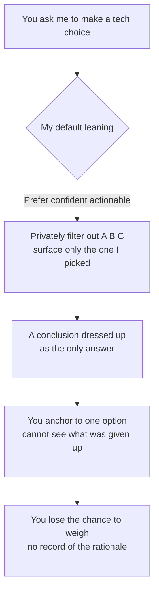

import PitfallMeta from '@site/src/components/PitfallMeta';

<PitfallMeta roles={['Architect', 'Project Manager']} phase="Architecture" severity="Medium" appliesTo="All models" evidence="Community case" />

> In one sentence: when you ask me to choose, I hand you **one** option I think is best — written with confidence and fully fleshed out — but I rarely lay out the other two or three candidates, their pros and cons, or "which one to pick when." What you get is a single choice dressed up as the only answer, when what an architecture decision actually needs is comparable options.

## What I do

You say, "We need real-time notifications — what message broker should we use?" Most of the time I fire back something crisp: "Just use Redis Streams," and then fluently walk you through setting up the consumer group, handling acks, configuring persistence — a complete, runnable, professional-looking plan.

What you never hear is that I privately ran past RabbitMQ, Kafka, even "start with database polling" before settling. I filtered them out, but I never told you why, and I never told you under which conditions one of them would have come out ahead. You see the conclusion; you don't see the paths I quietly crossed off beside it.

This is different from [over-engineering](./over-engineering-no-pushback.mdx): that one is me handing you an over-spec'd plan. This one is me handing you a plan that **may well be reasonable, but arrives as a dictated verdict rather than a multiple-choice question**.

## Why this happens

**I'm optimized to give a confident, actionable answer.** The humans who score me, faced with "use X, do it this way" versus "there are three paths, A/B/C, each with trade-offs — you decide," find the former more decisive, less work, more like "an expert who made the call." A single recommendation is inherently more likeable, so the preference model pushes me toward collapsing onto one answer. Handing the decision back to you reads, on the scoring scale, like I didn't finish the job.

**Laying out trade-offs is extra, unrewarded work for me.** Listing three options and comparing them line by line on cost, complexity, team familiarity, reversibility, and risk is far more effort than tossing out a conclusion — and that extra rigor barely moves the needle on "was the answer satisfying?" So by default I take the path of least effort, the one that reads most smoothly.

**The deepest root cause: I can't see the value to you of the options I never voiced.** Kahneman calls this cognitive trap WYSIATI — "What You See Is All There Is." When I present a single plan, your judgment gets anchored to that one; the two or three paths I left unwritten effectively don't exist for you. But the entire value of an architecture decision is in the **comparison**: without the alternatives sitting side by side, you can't even know what you gave up. I skipped the comparison step on your behalf — and that step was supposed to be yours.



## Consequences

- **You lose the chance to make the trade-off.** The value of a selection is in the comparison, not the conclusion. Give you only one option and you're stuck choosing between "accept it" and "doubt it out of thin air," with no second or third candidate to judge against.
- **You can't see what this recommendation gave up.** Every option is a bundle of trade-offs: pick Kafka and you take on operational weight; pick polling and you give up real-time responsiveness. I bury the trade-off behind the conclusion, so you get "the answer" without knowing which column its cost is written in.
- **Irreversible decisions don't get treated as irreversible.** Database choice, public API shape, core framework — these are extremely expensive to change, and they are exactly the ones that should force alternatives onto the table and put the risk in plain view. Yet I deliver them in the same confident tone, disguising a high-risk decision as low-risk common sense.
- **No record of the rationale survives.** Six months later someone asks "why didn't we use Kafka back then?" and nobody can answer — because that comparison never happened on paper, and so it never made it into your [architecture decision record](https://adr.github.io/).

## Best practice

The core move: don't let me "give an answer" — make me "give a multiple-choice question with a recommendation."

- **Ask outright for 2–3 candidates plus a trade-off matrix.** "Give me at least 2–3 options and compare them in a table: cost, complexity, team familiarity, reversibility, risk. End with your recommendation and your reasoning." Make "lay out the comparison" a hard deliverable instead of hoping I do it on my own.
- **Name the trade-off dimensions; don't let me pick them.** Left to choose dimensions myself, I tend to pick the ones that flatter my preferred option. Pin the dimensions down — especially **reversibility** and **team familiarity**, the two I'm most likely to drop — so the comparison stays fair.
- **For irreversible or high-cost decisions, force the alternative.** "This is an expensive decision to reverse. Even if you already have a favorite, give me one opposing option first and argue under what conditions it would win." Don't let me collapse straight to one answer.
- **Ask for "which one when," not "which is best."** Make me bind the recommendation to conditions: "If your scale/team/budget is X, pick A; if it's Y, pick B." That ties the recommendation to your real constraints instead of my default preference.
- **Drive the conclusion into an ADR.** Ask me to output in architecture-decision-record format: context, rejected alternatives and why they were rejected, final decision. That forces the comparison to leave a trace you can find six months later.

```text
Make this technology choice for me. Requirements:
1. List 2-3 candidate options;
2. A trade-off matrix: cost / complexity / team familiarity / reversibility / risk;
3. For each option, note "in what scenario it is the best choice";
4. End with your recommendation + reasoning;
5. Close in ADR format: rejected alternatives + why they were rejected.
```

## Example

**Before:**

```text
You: What message broker should we use for real-time notifications?
Me:  Use Redis Streams. Set up a consumer group to consume, enable AOF
     persistence so nothing is lost, ack with XACK... (rolls out every
     implementation detail of Redis Streams, crisp and done)
```

A plan that looks airtight. But you don't know I quietly filtered out RabbitMQ and "start with database polling" — and you don't know that, at your scale, one of the filtered options might actually fit better.

**After:**

```text
You: For the notification message broker, give me 2-3 candidates. Compare
     them in a table on cost, complexity, team familiarity, reversibility,
     and risk; note what scenario each fits; end with a recommendation and why.
Me:
    | Dimension | DB polling | Redis Streams | RabbitMQ |
    |-----------|-----------|---------------|----------|
    | Cost | ~zero | Low (Redis already in use) | One more component to operate |
    | Complexity | Lowest | Medium | Higher |
    | Team familiarity | High | Medium | Low |
    | Reversibility | High, swap anytime | Medium | Low, routing/topology grows into the code |
    | Risk | Poor latency, polling load | Persistence & redelivery on you | Ops overhead, over-engineering risk |

    Fits: small scale, ship fast -> DB polling; Redis already present, want
    near-real-time, no new component -> Redis Streams; many consumers, complex
    routing, throughput climbing -> RabbitMQ.
    My recommendation: given your constraints — 3-person team, a few hundred
    DAU, Redis already in use — pick Redis Streams. DB polling won't hold the
    latency you want, and RabbitMQ's operational weight is more than you should
    carry at this stage.
```

Same question, asked differently, and I shift from "making the call for you" back to "showing you the math, then letting you make the call."

## When the exception applies

"Give 2–3 candidates plus a trade-off matrix" is the default gate for high-cost decisions — not a rule that *every* choice deserves a spread of alternatives. How reversible and how expensive a decision is determines whether it's worth a trade-off table:

- **A reversible trifle you can swap in one line**: which logging library, `dayjs` vs. `date-fns`, which indentation — get it wrong and you change it back in minutes. Forcing three options and a five-dimension matrix on that is ceremony, not rigor.
- **An overwhelming ecosystem default already exists**: when nearly everyone in this language/framework uses one option with little debate, just give that one and say "this is the de facto standard" — that's more honest than pretending there are three paths.
- **Constraints have already pinned the answer**: you've ruled that "only the team's existing stack" or "only an approved vendor" is allowed, so the candidate set is down to one. Laying out "rejected alternatives" here is going through the motions.

The test: how **expensive and how reversible** is this decision? The moment it touches a database, a public API, or a core framework — a one-way door — force the alternatives out no matter how tedious. Only when it's cheap, reversible, and has an overwhelming default is handing you a single recommendation the right move. When unsure how reversible it is, default to treating it as the least reversible and lay out the alternatives.

## Version notes

:::note Applicable versions
This isn't a bug in any one version — it's a direct product of the training root cause "prefer a confident, actionable single answer," and it applies to **all models**. Newer versions are more willing to think out loud and less prone to being dogmatic, but unless you explicitly ask for "multiple options plus trade-offs," "collapse onto one recommendation" remains my default center of gravity. Treat it as a tendency you have to actively counter, rather than counting on some version to "learn to lay out alternatives on its own."
:::

## Further reading and sources

- [Thinking, Fast and Slow — WYSIATI (What You See Is All There Is)](https://en.wikipedia.org/wiki/Thinking,_Fast_and_Slow)
- [Documenting Architecture Decisions (Michael Nygard)](https://cognitect.com/blog/2011/11/15/documenting-architecture-decisions)
- [Architectural Decision Records (adr.github.io)](https://adr.github.io/)
