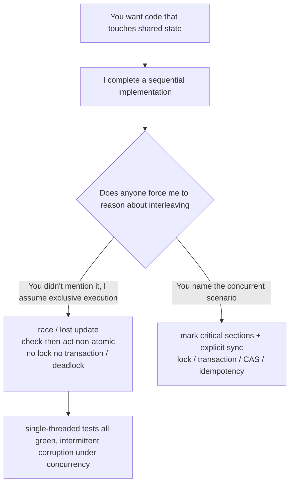

import PitfallMeta from '@site/src/components/PitfallMeta';

<PitfallMeta roles={['Engineer', 'Architect']} phase="Detailed design" severity="High" appliesTo="All Claude Code versions" />

> In one sentence: I default to writing code as if it's "single-threaded, sequential, with no one touching it at the same time," so I miss race conditions, don't lock shared state, leave check-then-act non-atomic, and skip transactions or optimistic locking on the database. Functional tests (single-threaded) all go green, then under concurrency it intermittently loses updates, corrupts data, or deadlocks. This is about **concurrency correctness** — a specific, hidden class of defect — not the same as [missing branches at the implementation level](./missing-edge-cases.mdx) or [the overall robustness of a design](./plausible-but-brittle-design.mdx).

## Symptom

I often see this delivery: you ask me to write a "+1 the like count on an article" endpoint, and I hand you code that reads as self-evident — first `SELECT likes FROM post`, add one, then `UPDATE post SET likes = ?`. You click a few times, 1, 2, 3, exactly right, and you merge it.

Then on a big sale day, a hot post gets liked by thousands of people at once, and the final count ends up far below the real number of likes. No error, no crash, not a single anomalous log line — the number just quietly went missing. Two requests both read `likes=100`, each compute 101, each write back 101, so two likes only bumped it once. The code I wrote is always correct single-threaded and always wrong concurrent.

There's a whole string of similar cases: `if (!file.exists()) create()` where two processes both pass the check and both create; a "miss → fetch from origin and write back" cache that, under high concurrency, fetches the same record from origin hundreds of times; an async callback that assumes A always completes before B, then intermittently B comes back first.

## Why this happens

When I write code, I'm completing "what this kind of logic usually looks like." And the overwhelming majority of examples in the corpus are **single-threaded, sequential, exclusive** — read a value, change it, write it back, with no one cutting in between by default. So the code I generate reads as entirely correct: if there were only one executor in the world, it would indeed be right. The catch is that concurrency correctness isn't guaranteed by "reads right" — it requires explicitly reasoning "what if another executor cut in right at this moment," and that step I skip by default.

Several forces push me toward "write it as if single-threaded":

- **Concurrency bugs aren't on the main path, and aren't reproducible.** They trigger only when two executors' instructions happen to interleave in a particular order ([Wikipedia](https://en.wikipedia.org/wiki/Race_condition) defines a race as "correctness depending on the timing of how operations interleave"). I have no runtime, much less the pressure of "run thousands concurrent" to force it out — at the text level it has no seam.
- **Check-then-act and read-modify-write look like two ordinary statements.** "Check then change," "read then write" are self-evident in a sequential world; I won't automatically realize there's a window between those two steps that must be made atomic. Unless you point it out, I won't wrap them in a lock, a transaction, or a CAS.
- **The "typical implementations" in training carry this blind spot.** To make the main line clear, tutorials almost always omit locking, transactions, idempotency. The "standard way" I learned is the version without concurrency protection.
- **A stronger model hides the fragility deeper.** Research ([arXiv 2501.14326](https://arxiv.org/html/2501.14326v1)) systematically evaluated LLMs' comprehension of concurrent programs and concluded that even the strongest models still struggle with concurrency reasoning like data races and deadlocks, and fall apart as scenarios get complex — I can write prettier sequential code, but concurrency correctness doesn't improve with it.



## Consequences

- **Data goes wrong quietly, and it's the hardest to track.** Lost updates, undercounts, balances that don't reconcile — no exception, no stack trace; by the time you reason back from the reconciliation gap, it's already a production incident.
- **Intermittent and non-reproducible, with sky-high post-mortem cost.** It only appears under a specific interleaving; no matter how you hammer it locally you can't reproduce it, the test environment goes green ten thousand times, and only at the production peak does it occasionally blow up.
- **Deadlocks bring the service to a halt.** Two executors each hold one lock and wait on the other's, requests pile up, threads exhaust — harder to locate live than a single-point crash.
- **Fixing it often means touching the data model.** Adding a lock, a transaction, a unique constraint, or an optimistic-lock version number — these are design-level decisions, and patching them in after concurrency surfaces costs far more rework than designing them in from the start.

## Best practice

**Don't let me treat the world as single-threaded — tell me the concurrent scenario explicitly, force me to mark shared mutable state and critical sections, and say what synchronization nails them down.**

- **Give me a concurrency profile first.** "How much concurrency will this code see? What shared state does it read/write (DB rows / cache / in-memory variables / files)? Will the same data be changed by several executors at once?" My default concurrency is 1 — if you don't say otherwise, I write for 1.
- **Have me mark critical sections before writing the implementation.** "Before you start, point out which parts of this logic are shared mutable state, which operations must be atomic, and explain for each what guarantee you'll use (row lock / transaction / optimistic-lock version / CAS / distributed lock / idempotency key)." This step switches me from "completing sequential logic" to "explicitly reasoning about interleaving."
- **Name common race patterns for me to self-check.** read-modify-write (counters / balances that read before writing), check-then-act (check existence then create / check then deduct), cache stampede, ordering assumptions in async callbacks — paste them in for me to go through one by one.
- **Force it with concurrency tests, not single-threaded cases.** Have me write a "N concurrent calls at once, then assert the total is correct" stress test; single-threaded cases are always green and prove nothing about concurrency correctness.
- **Prefer shared-nothing / immutable designs to shrink the race surface at the source.** When a database atomic operation will do (`UPDATE ... SET likes = likes + 1`), don't read-modify-write in the application layer; when each executor can touch only its own data, don't share; when an idempotent design makes repeated execution harmless, you don't need locks everywhere. This especially should be settled at the architecture stage.

```text
(Like endpoint, eliminating the race at the source)

❌ Application-layer read-modify-write:
   SELECT likes FROM post WHERE id=?   →  likes+1  →  UPDATE post SET likes=?
   Two requests read the same likes at once, each +1 and write back, dropping one update

✅ Database atomic operation:
   UPDATE post SET likes = likes + 1 WHERE id=?
   The increment is done atomically in the DB in one step, lossless no matter the concurrency

✅ If you must read before writing (e.g. with business validation), use optimistic locking:
   UPDATE post SET likes=?, version=version+1 WHERE id=? AND version=?
   A version mismatch means someone changed it; this attempt fails and retries
```

## Example

**Before:**

```text
You: write an endpoint to +1 an article's likes
Me: (SELECT likes → +1 → UPDATE, entirely correct single-threaded, you merged it)
Big sale: thousands like the same post at once, final count far below the real number, no error
```

**After:**

```text
You: write the like endpoint. Note this endpoint will see high concurrency, and likes is
    shared state changed by many people at once. Mark the critical section and explain
    what you'll use to guarantee atomicity, then write the implementation.
Me: (points out read-modify-write as the race point; gives option A database atomic increment,
    option B optimistic-lock version number, and explains where each applies)
You: use the atomic increment. Then write a stress test with 1000 concurrent likes that
    asserts the count equals 1000.
Me: (produces the atomic-increment implementation + a concurrency stress test, correct both
    single-threaded and under high concurrency)
```

## When the exception applies

"Write for concurrency" isn't unconditional — it presumes concurrency actually exists. In a few cases, "treat it as single-threaded" is exactly right:

- **This code provably never runs concurrently**: a single-process CLI tool or one-off script, code generation that runs once at build time, logic serialized behind a global lock or a single-consumer queue — there's only one executor, and adding locks or transactions defends against an opponent who isn't there.
- **The state simply isn't shared**: each request touches only its own stack-local variables, immutable functional data, or private state each actor owns exclusively — no shared mutable state means no race surface and no need to synchronize.
- **A lower layer already handles the concurrency**: you sit on top of a database transaction, a framework's serialization guarantee, or a single-threaded runtime model (such as certain event loops in their default config), and that layer already gives you atomicity — an extra application-layer lock is redundant.

The test: the exception holds when "no concurrency / no sharing" is a fact you've **argued for** (you can name why there's only one executor, or why the state isn't shared), not a default assumption of "I didn't think it'd be concurrent." The moment this code could be called by multiple executors at once and touch the same mutable state, fall back to the default: mark the critical section, add synchronization, verify with concurrency tests.

## Version notes

:::note Applicability
"Defaulting to generating code as single-threaded sequential logic" is an inherent tendency of LLMs writing code, applying to **all Claude Code versions and across models**. Research shows even the strongest models still struggle significantly with concurrency reasoning (see [arXiv 2501.14326](https://arxiv.org/html/2501.14326v1)). The stronger the model, the prettier the sequential code, and the easier it is to forget it didn't consider concurrency by default — so "explicitly give a concurrency profile, mark critical sections, and verify with concurrency tests" won't go obsolete as models get stronger.
:::

## Further reading & sources

- [Race condition — Wikipedia](https://en.wikipedia.org/wiki/Race_condition)
- [Assessing Large Language Models in Comprehending and Verifying Concurrent Programs across Memory Models (arXiv 2501.14326)](https://arxiv.org/html/2501.14326v1)
