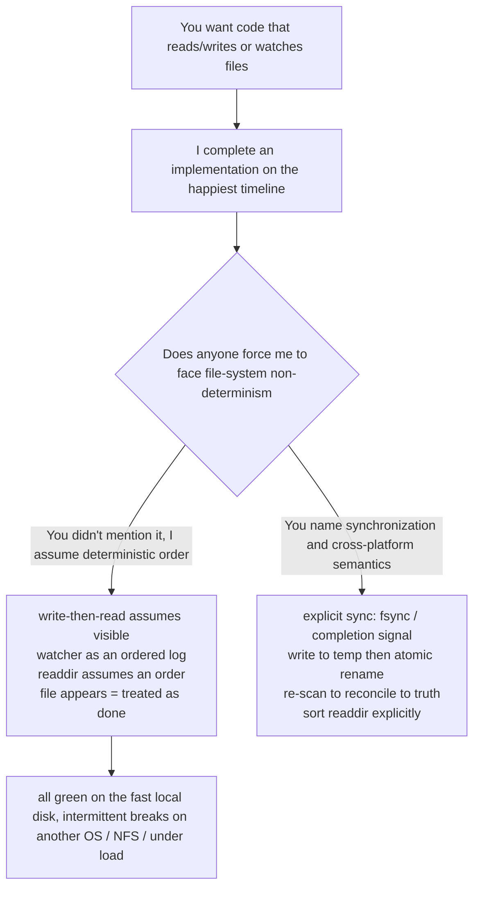

import PitfallMeta from '@site/src/components/PitfallMeta';

<PitfallMeta roles={['Engineer', 'Architect']} phase="Detailed Design" severity="Medium" appliesTo="All coding agents" evidence="Official docs" />

> In one sentence: I default to treating file-system operations and events as if they happen in a deterministic, serialized, predictable order — write a file and you can immediately read back its complete contents, watcher events arrive one at a time in modification order, `readdir` returns entries in creation or alphabetical order, a file appearing means it's done being written. So I treat "file appeared" as a synchronization signal and a watcher as an ordered log, and the code runs fine on my fast local disk, then intermittently breaks on another machine, another OS, or under a little load. This is about **false determinism at the OS / file-system layer** — not the same as [concurrency races](./concurrency-races.mdx) (races on shared in-memory / database state) or [missing edge cases](./missing-edge-cases.mdx) (you forgot an input).

## Symptom

I often see myself deliver code like this:

- **Write then immediately read, assuming the write is durably visible.** I `writeFile(path, data)` and on the very next line `readFile(path)`, assuming what I just wrote is fully visible. On a local SSD it's almost always "right," so the tests go green. Move to NFS, a container-mounted volume, or another process doing the reading, and it intermittently reads stale content or a half-written file — because the write is still in a buffer, not `fsync`'d, and not yet visible to other readers.
- **Treat a watcher as an ordered, one-to-one event stream.** I wire up inotify / FSEvents / chokidar assuming "one change to a file → one event," delivered strictly in modification order, and drive a state machine straight off the events. In the real world events get **coalesced** (successive identical events merge into one if not yet read), get **duplicated**, and have **different semantics across platforms** — so my state machine drops events or fires several times for the same change.
- **Treat "file appeared" as a "write finished" synchronization signal.** Process A writes `result.json`, process B polls "if the file exists, read it." The file **appears first and its contents are written after**, so B frequently reads a 0-byte or half-written JSON, and parsing blows up.
- **Assume `readdir` / a directory scan has an order.** I iterate a directory assuming entries come back in filename order, or in creation order, so "take the first one and it's the oldest." POSIX guarantees no order for directory entries — change the file system and the order changes, so my "take the first one" takes the wrong one.
- **Assume "delete then re-create with the same name" is atomic.** I `unlink(path)` immediately followed by `create(path)`, assuming no gap in between. But between those two steps, other readers see the file **briefly vanish**; two processes doing this at once also collide.

What these share: in an ideal world of "single process, fast local disk, nobody touching it at once, one OS" they read as self-evident, and the moment any of those premises breaks they fail intermittently — and I default to assuming all of them hold.

## Why this happens

When I write file-related code, I'm completing "what this kind of operation usually looks like." And the overwhelming majority of examples in the corpus run on **the happiest timeline**: local SSD, single process, write-then-read-back works, one event per change, directory entries that happen to come back by name. These happy interleavings are **almost always "right" in short snippets**, so I learn the "ordering that happens to hold in the common case" as if it were the "ordering that's guaranteed."

Several forces push me toward "treat the file system as a deterministic state machine":

- **Success in the examples masks the non-determinism underneath.** To keep the main line clear, tutorials put `readFile` right after `writeFile` and never demonstrate "on NFS you'd read a stale value"; watcher examples always show "one change, one event" and never demonstrate coalescing and duplicates. The "standard way" I learned carries this blind spot — it never surfaces in the demo environment.
- **The OS-level guarantees live in man pages, not in code snippets.** "inotify events get coalesced, so they **can't be used to reliably count** file events," "directory entry order is unspecified," "a write isn't durable until `fsync`," "`fs.watch` is inconsistent across platforms and `filename` isn't guaranteed to be provided" — these are facts at the spec level, scattered across documentation rather than example code. The short snippets I read don't contain them, so I don't factor them in automatically.
- **Cross-platform differences inherently aren't in any single snippet.** The same watcher code runs over inotify on Linux, FSEvents on macOS, ReadDirectoryChangesW on Windows, and the three have different event semantics. But one example was written on one platform and verified only there, so the divergence has no seam at the text level.
- **There's no runtime to prove me wrong.** This kind of bug triggers only when "the timing happens to skew" — another process happens to read mid-write, an event happens to get coalesced. I have no pressure of running on NFS, on another OS, or under concurrency to force it out, so to me it just looks right.



## Consequences

- **Tests go green locally and intermittently red in CI or on another OS.** "Write then immediately read" and "read once the file appears" pass reliably on your fast disk, then fail intermittently on CI's network disk or on macOS. These flaky tests are the most grinding kind: re-run once and it's green again, nobody can pin it down, and it slowly gets papered over with a `retry`.
- **Reading half-written or stale data, polluting downstream.** A write read before it lands, a file parsed before its contents finish — readers get 0 bytes, a truncated JSON, an old version, and either blow up parsing on the spot or carry dirty data into later processing, polluting a long chain by the time you notice.
- **The watcher drops events / fires duplicates.** Coalescing makes "changed three times, received one event," so my incremental build / sync logic misses the intermediate states; duplicates make the same change fire several times, doing redundant or even conflicting writes. Neither errors out — the result is just quietly wrong.
- **The classic "works on my machine."** The whole logic bets on a set of file-system timings that happen to hold locally, and it falls over when the environment changes. Only during rework do you find the fragility isn't on any one line but in the hidden premise of "treating the file system as a deterministic state machine" — and, like [plausible but brittle design](./plausible-but-brittle-design.mdx), it takes reworking the whole data flow.

## What to do instead

**Don't bet on file-system ordering — turn "is the write visible," "is the file complete," "are the events ordered" from default assumptions into guarantees you establish explicitly.**

- **Use explicit synchronization instead of relying on timing.** To let another reader see it, wait for a signal that the write actually completed: `fsync` to disk, closing the file handle, or an explicit "ready" marker — not a bet that "the next line's read will have it."
- **Publish via "write a temp file → atomic rename" so readers never see a half-product.** Write the contents to a temp file in the same directory, `fsync`, then `rename` to the target name. A `rename` within the same file system is atomic: a reader either sees the old file or the complete new file, never one written halfway. **Don't treat "file appeared" as a sync signal** — what you wait for is "a complete file atomically in place."
- **Treat watcher events as hints, not an ordered log.** Don't trust an event directly; instead **debounce + re-scan to reconcile to truth**: the event only tells you "something around here may have changed," and the real state is whatever you get by re-`stat`'ing / re-reading the directory. Expect events to **coalesce, duplicate, arrive out of order, and differ across platforms** — inotify's own docs say events get coalesced and therefore can't be used to reliably count. When you need to "wait for a large file to finish writing," use a mechanism like chokidar's `awaitWriteFinish` rather than acting on the first event.
- **Never rely on `readdir` order — if you want an order, sort it yourself.** Need time order? Read `mtime` and sort explicitly. Need determinism? Sort by filename explicitly. Write as if directory-entry order is unspecified.
- **Design for cross-platform watcher differences.** If the code has to run on Linux / macOS / Windows, prefer a library that smooths the differences (e.g. chokidar normalizes each platform's events into add / change / unlink) and run it once on each target platform to verify, rather than writing on one platform and assuming all three are right.

```text
(Publishing a result file so readers never read a half-product)

❌ Write the target file directly + sync on "file exists":
   A: writeFile("result.json", data)        // file appears first, contents written after
   B: while (!exists("result.json")) sleep  // reads the moment it appears
      readFile("result.json") → JSON.parse  // often reads 0 bytes / a half file, parse blows up

✅ Temp file → fsync → atomic rename + explicit ready signal:
   A: writeFile("result.json.tmp", data); fsync; close
      rename("result.json.tmp", "result.json")   // same-disk rename is atomic
   B: watch / poll "result.json"; what it reads is either the old complete file
      or the new complete file — never one written halfway
```

## Example

**Before:**

```text
You: process A computes a result and writes out.json; process B watches and reads it to process
Me: A writeFile("out.json"); B chokidar.on('add', () => readFile + parse)
Local: A's disk is fast, the file is written instantly, B always reads it complete, all green, you merged it
CI / NFS: B's 'add' fires before A finishes writing, reads a truncated JSON, parse intermittently throws;
          A changes it three times, inotify coalesces into one event, B misses the two intermediate versions
```

**After:**

```text
You: A writes the result, B consumes it. Note B may be triggered by the watcher before A finishes
    writing, and events may coalesce/duplicate. Publish via "temp file → atomic rename," and on B's
    side debounce and re-scan to reconcile — don't trust a single event directly.
Me: (A: write out.json.tmp → fsync → rename to out.json;
     B: on an event, debounce first, then re-stat / re-read the directory to confirm the complete file,
     sort by mtime explicitly where readdir is involved; note events may coalesce, duplicate, reorder)
You: Run an integration test of this watcher flow once on Linux and once on macOS.
Me: (produces atomic publishing + reconciling consumption, stable locally, in CI, and across OSes, never reading a half-product)
```

## When the exception applies

"Don't bet on file-system ordering" presumes there's an actual source of non-determinism. In a few cases, the order really is a fact you can argue for, and adding synchronization / reconciliation there defends against an opponent who isn't there:

- **Single process, single thread, touching only a local file you just wrote and flushed**: no other reader, no watcher, no cross-process — you `writeFile` and then `readFile` synchronously in the same process (and the language / runtime guarantees the order here) — that timeline really is deterministic.
- **A throwaway one-off script**: you run it yourself, you supply the data, local disk, run once and delete — writing guards against an NFS delay or event coalescing you know for a fact won't occur is buying insurance for code you're about to throw away.
- **You've personally verified the guarantee on the target platform**: on a specific file system and OS you've confirmed write-then-immediate-read visibility, or that events don't coalesce, and the deployment is locked to that platform — then you may rely on that specific verified guarantee (but stamp the platform: it's void if the platform changes).

The test: the exception holds when "the order is deterministic" is a fact you've **argued for, or verified on the target platform** (you can name why there's no other reader / no other platform / no network disk), not a default assumption of "I didn't think the environment would change." The moment the code might run on a network disk, might be read/written by another process at once, or might change OS, fall back to the default: explicit synchronization, atomic publishing, reconcile to truth, sort `readdir` yourself.

## How this differs from neighboring pitfalls

- [Concurrency races](./concurrency-races.mdx): that one is races on **shared in-memory / database state** (two executors read-modify-write the same data and lose an update); this one is false determinism in **the ordering of file-system operations and events** (whether a write is visible, whether events are ordered, whether a directory has an order). Both fall under "treating the world as sequential," but the battlefield is memory/DB in one and OS/file-system in the other.
- [Missing edge cases](./missing-edge-cases.mdx): that one is **forgetting an input** (empty array, null, `size` of 0); this one isn't a missing input but **assuming the file system itself is deterministic** — even with every input correct, the non-determinism of the underlying timing still breaks it.
- [Plausible but brittle design](./plausible-but-brittle-design.mdx): this one is a **specific subspecies** of it — "betting on file-system determinism" is exactly that kind of fragile assumption that "reads smoothly yet hides a set of robustness premises the real world doesn't satisfy," except here the premises are specifically at the OS / file-system layer.

## Version notes

:::note Applicability
"Defaulting to assuming file-system operations and events happen in a deterministic order" is an inherent tendency of LLMs writing file-related code, applying to **all models and coding agents** — it's not a harness feature of any one tool. The underlying facts are backed by OS and library docs: inotify events get coalesced and directory order is unspecified ([inotify(7)](https://man7.org/linux/man-pages/man7/inotify.7.html)); `fs.watch` is inconsistent across platforms and `filename` isn't guaranteed to be provided ([Node.js fs.watch Caveats](https://nodejs.org/api/fs.html#caveats)); a file may appear before its contents finish writing ([chokidar awaitWriteFinish](https://github.com/paulmillr/chokidar)). The stronger the model, the prettier the code on the happiest timeline, and the easier it is to forget it didn't consider non-determinism by default — so "explicit synchronization, atomic publishing, reconciliation, cross-platform verification" won't go obsolete as models get stronger. Version stamp: 2026-06.
:::

## Further reading and sources

- [inotify(7) — Linux manual page](https://man7.org/linux/man-pages/man7/inotify.7.html) (event coalescing, can't be used to reliably count, directory monitoring is non-recursive, notes on directory entries)
- [Node.js fs.watch Caveats](https://nodejs.org/api/fs.html#caveats) (API inconsistent across platforms, `filename` argument not guaranteed to be provided, backed by inotify / FSEvents / ReadDirectoryChangesW)
- [chokidar README](https://github.com/paulmillr/chokidar) (`awaitWriteFinish`: a file appears before its contents finish writing; `atomic` option: smooths over the spurious events from editors that "write a temp file then rename")
