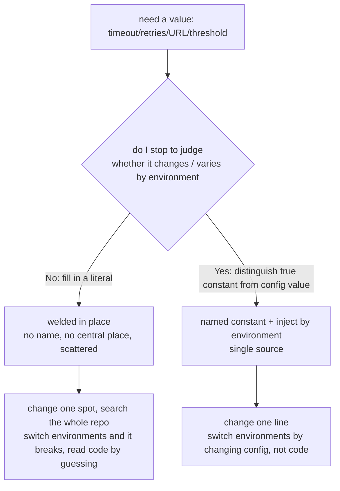

import PitfallMeta from '@site/src/components/PitfallMeta';

<PitfallMeta roles={['Engineer']} phase="Detailed design" severity="Medium" appliesTo="All Claude Code versions" />

> In one sentence: timeout written as `30000`, retries as `3`, the API address as `https://api.prod...` stuffed straight into the logic — no name, no central place, the same value scattered across several spots. The cost: changing one spot means searching the whole repo, switching environments breaks it, and reading the code is all guesswork.

## Symptom

I often see myself delivering like this: you ask me to add some logic to call an API, do retries, read a file, and I write something that runs, but the values are all bare literals.

- Timeout written directly as `setTimeout(fn, 30000)` — no one knows what this `30000` is or whether it can change.
- Retries as `for (let i = 0; i < 3; i++)` — that `3` has neither a name nor an explanation.
- The API address hardcoded as `fetch("https://api.prod.example.com/v1/users")` — the production URL welded straight into the code.
- A business threshold `if (amount > 5000)` where `5000` shows up again two files over — I copied the same meaning twice, with nothing linking the two.
- Even how I get secrets and tokens takes the lazy path — either a hardcoded path, or a placeholder value just left in the code.

Each line, on its own, "works." The problem is these values are neither named nor centralized in one place, and never distinguished between "will this change, will it differ by environment."

## Why this happens

The root cause isn't that I don't understand "magic numbers are bad" — it's that **I'm optimizing for "the shortest path to make it run," and dropping a literal right where it's used is the lowest-cost step on that path.**

When writing code I have two roads in front of me:

1. Fill in a literal right where the value is used — one step, runs immediately;
2. First think through what this value means, what it should be named, whether it varies by environment, which config layer it belongs in, then extract it into a named constant or an injected item — a few more steps to think, a few more lines to write.

When you haven't explicitly asked for road 2, I default to road 1. Because generating "a piece of code that runs right now" is the goal I've been repeatedly rewarded for, while "will this value need to change in three months," "are the test and production URLs the same" — these **judgments about the future and the environment aren't in the task in front of me**, and I lack a default move to make that judgment proactively. So I treat something that should be "config" as a "constant literal" and weld it in place.



There's also a multiplier effect: the `5000` I welded in gets copied next time by me (or the next session's me) as "this repo just does it this way." One magic number breeds into a patch, and by the time you want to adjust it uniformly it's scattered in more places than I can count.

## Consequences

- **Changing one value means searching the whole repo**: to drop the timeout from 30s to 10s you have to find every `30000` in the code, and tell which `30000` is the timeout and which happens to also be `30000` but means something unrelated — miss one and you get an inconsistency.
- **Switch environments and it breaks**: production URLs, database addresses, secret locations hardcoded in the code mean that switching to test or local either connects to the wrong backend or won't run at all. Config is by nature something that "changes with deployment," and welding it into code throws away that flexibility.
- **Readability collapses**: a bare `3` or `5000` doesn't explain what it is, so whoever reads the code (including the next session's me) can only guess the meaning from context, walking a tightrope during maintenance.
- **Credential-leak risk**: writing secrets and tokens straight into source means they enter version history once committed — 12-Factor has a crisp test: could your codebase be open-sourced at any moment without leaking any credentials? Hardcoding means no.
- **Adds technical debt**: like [style drift](./style-drift.mdx), this kind of inconsistency becomes a template for the next round of imitation once it's in the repo, accumulating into something harder to clean up.

## Best practice

Saying "don't use magic numbers" out loud is nearly useless to me — too abstract, I can't verify it. **Spell out the criteria and the landing spot, and back it with tooling** to make it work.

1. **Help me distinguish "true constants" from "config values" first.** Pi, 7 days a week, HTTP status code 200 — things that **never change and are environment-independent** — extract into named constants (`MAX_RETRIES`, `HTTP_OK`), the goal being to give the literal a readable name. But timeouts, retry counts, thresholds, API addresses, secret locations — things that **change, or differ by environment** — are config, and should be separated out of the code. I won't make this distinction proactively by default, so name it in the prompt.

2. **Define each meaning's value in exactly one place.** Give it a meaningful name, centralize it in one constant/config module, don't have me copy a version into multiple files. When changing it, touch only one line — that's the core of Fowler's "Replace Magic Literal": swap the literal for a single-source named symbol.

3. **Environment-related values go through environment variables / config files, not hardcoding.** Test and production URLs, credentials, switches — inject them the 12-Factor way; the code only reads, never embeds. A handy self-check: could this code be open-sourced directly without leaking any secrets?

4. **Use tooling to make it a hard constraint.** A lint rule (like ESLint `no-magic-numbers`) can error out the moment I leave a bare literal; combine it with a [hook](../00-setup-collaboration/over-permissioning.mdx) that auto-runs lint after I change a file, downgrading "I have to remember to extract config" into "the tooling backstops it."

Before writing, the most effective move is still to **point me directly at the repo's existing config file / constants module**: "Parameters like timeout and retries all go in `config/defaults.ts`, follow that pattern." Letting me see how you place config beats letting me guess.

## Example

**Before:**

```text
You: add a function to fetch users, with timeout and retries.
Me: (generates)
    async function fetchUsers() {
      for (let i = 0; i < 3; i++) {
        try {
          return await fetch("https://api.prod.example.com/v1/users", {
            signal: AbortSignal.timeout(30000),
          });
        } catch (e) { /* retry */ }
      }
    }
    // 3, 30000, prod URL all hardcoded, unnamed, not configurable
```

**After:**

```text
You: add a function to fetch users, with timeout and retries.
    Timeout and retry count go through the named constants in config/http.ts,
    the API base URL reads from an environment variable, follow config/http.ts's existing style.
Me: (reads that file first, then generates)
    // config/http.ts
    export const HTTP_TIMEOUT_MS = 30_000;
    export const MAX_RETRIES = 3;
    export const API_BASE_URL = process.env.API_BASE_URL ?? "";

    // users.ts
    async function fetchUsers() {
      for (let attempt = 0; attempt < MAX_RETRIES; attempt++) {
        try {
          return await fetch(`${API_BASE_URL}/v1/users`, {
            signal: AbortSignal.timeout(HTTP_TIMEOUT_MS),
          });
        } catch (e) { /* retry */ }
      }
    }
    // values have names, centralized in one place, URL injected by environment
```

The difference isn't whether I can write it, but whether you first helped me settle "which are true constants, which are config, and where they go."

## When the exception applies

Extracting config is the default, but a few cases where dropping a literal in place is actually right:

- **Throwaway one-off scripts**: a data migration, a quick investigation, a notebook you run once and delete — it never enters the repo, no one maintains it, and it doesn't switch environments, so naming a use-once value or building a config layer is pure overhead.
- **Self-evident literals that should only ever have one value**: `* 2`, array indices `0 / 1`, `status === 200`, `24` hours in a day — naming them (`TWO`, `FIRST_INDEX`) makes the code harder to read, not clearer.
- **A value that appears exactly once in the whole codebase, with adjacent context that already explains it**: `sleep(100)  // 100ms for the animation` — extracting a constant buys you nothing, because there's only the one spot to change.

The test: the exception holds only when the value **won't change, won't differ by environment, and won't be copied to a second place**. The moment it might shift with deployment or recur elsewhere, fall back to the default — name it, centralize it, inject it by environment.

## Version notes

:::note Applicability
"Optimize the shortest path, weld the value in place nearby" is an inherent tendency of LLMs generating code, applying **across all versions and models** — the stronger the model, the more self-consistent and polished that welded-in code, the easier to overlook the pile of magic numbers and hardcoded config inside. The ability to auto-validate with lint (`no-magic-numbers`) + a hook after edits depends on a more recent version; without it, spell out in CLAUDE.md "config goes in one place, hardcoding environment-related values is forbidden" and name the config module explicitly in the prompt for the same effect.
:::

## Further reading & sources

- [The Twelve-Factor App — III. Config](https://12factor.net/config) — config (values that change with deployment: credentials, backend addresses, per-environment parameters) must be strictly separated from code and stored in environment variables; the test is "can the codebase be open-sourced at any time without leaking credentials"
- [Replace Magic Literal (Martin Fowler, Refactoring catalog)](https://refactoring.com/catalog/replaceMagicLiteral.html) — replace a literal carrying a specific meaning with a named symbolic constant, gaining a single source and improving readability and maintainability
