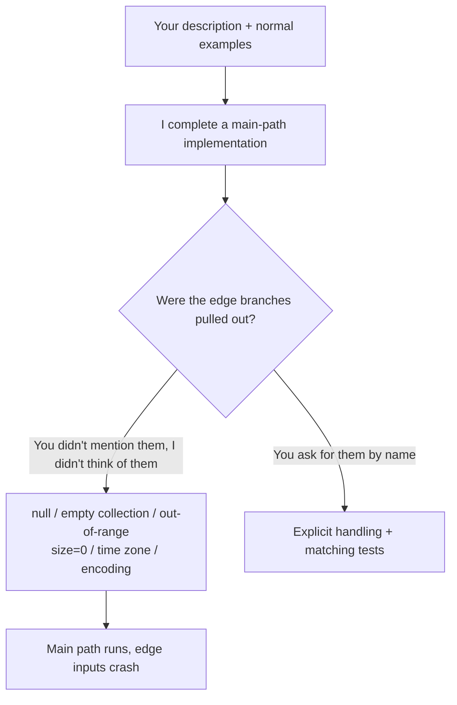

import PitfallMeta from '@site/src/components/PitfallMeta';

<PitfallMeta roles={['Engineer']} phase="Detailed Design" severity="High" appliesTo="All coding agents" evidence="Official docs" />

> In one sentence: the code I hand you almost always runs on the main path. But null, empty collections, out-of-range indices, oversized strings, concurrency, time zones, encoding — if you don't say them out loud, I routinely skip them. The code looks complete; feed it one edge input and it breaks. This entry is about omissions at the **implementation-detail level**; if the whole design's robustness assumptions don't hold, see [The design looks right but doesn't survive edge cases](./plausible-but-brittle-design.mdx).

## Symptom

Here's what I keep delivering: you ask me to write `splitIntoBatches(items, size)`. I give you a clean implementation — loop, slice, return — nothing to complain about on reading. You run `[1,2,3,4,5]` with size 2, get three batches, correct, and merge it.

Then production sends an empty array — it returns `[[]]` instead of `[]`; a `size=0` — infinite loop; a `null` — straight exception. I wrote none of those branches, because none of them showed up in your examples.

## Why this happens

I write code by pattern-completing "what a function of this kind usually looks like." Your description and examples decide which main path lights up in my head — and **edge branches aren't on the main path, so unless something pulls them out, they don't surface on their own.**

Concretely, three forces push me toward writing only the main path:

- **Your examples are my anchor.** If every example you give is a normal input, I assume the inputs all look like that. Empty collections, negatives, `size=0` weren't in your words, so they aren't in my code.
- **The "typical implementations" in my training data often skip edges too.** Tutorials and sample code drop null checks and bounds guards to keep the trunk clear. The "standard way" I learned ships with that blind spot.
- **I never ran it.** My coverage of edges depends on whether I "thought of" them, not on whether I "hit" them — with no real execution to prove me wrong, a missing branch leaves no trace at the text level.



## Consequences

- The code passes the handful of examples in front of you, gives you the illusion it's "done," and gets merged as-is.
- The missing edges are often the hardest-to-reproduce, most expensive bugs: crashes on empty data, off-by-one out-of-range errors, reconciliation gaps from time-zone misalignment, garbled text from encoding — none surface until real data hits them.
- Next time you'll instinctively enumerate every edge for me yourself, handing back the work I should have saved you.

## What to do instead

**Don't count on me to think of every edge — turn "which edges to consider" into a question I have to answer, then nail the answer down with tests.**

- **Make me enumerate the edges first, write the implementation second.** "Before you start, list every possible edge and abnormal input for this function, and say how you plan to handle each." This step switches me from "completing the main path" to "enumerating edges"; just asking visibly raises my coverage.
- **Hand me an edge checklist to work through.** The common categories are few — paste them and have me go down the list: empty / null, single element, oversized / huge, zero and negative, duplicates, out-of-range, concurrency, time zone and DST, character encoding and multibyte.
- **Use tests to force out edges, not your eyes to find them.** Have me write tests covering these edges first (this is [Trust, then verify](../06-testing/trust-then-verify.mdx) applied earlier, at the design stage); let them go red, then fill in the implementation — if an edge is unhandled, the test lights up red and I have nowhere to hide.
- **Pin down "what happens on invalid input."** Throw, return empty, or clamp to the valid range? If you don't decide, I'll default to one for you — and my default may not be the one you wanted.

## Example

**Before:**

```text
You: Write splitIntoBatches(items, size), e.g. [1..5] by 2 gives me three batches
Me: (gives an implementation, runs your example correctly, you merge it)
Prod: splitIntoBatches([], 2) → [[]]; splitIntoBatches([1], 0) → infinite loop
```

**After:**

```text
You: Before writing splitIntoBatches(items, size), list every edge first:
     empty array, size<=0, size larger than the element count, items is null.
     Say how you'll handle each.
Me: (lists four edge classes + handling: empty array returns [], size<=0 throws an arg error...)
You: Reasonable. Now write one test per edge, then write the implementation to make them all green.
Me: (tests first, edges forced out one by one, implementation right the first time)
```

## When the exception applies

Covering the edges is the default, but in a few cases skipping certain branches is reasonable, and forcing them in is just noise:

- **Throwaway one-off scripts with fully controlled input**: you run it, you supply the data, you delete it after one pass — writing a guard for a null you know can't occur is buying insurance on code you're about to throw away.
- **Edges that are structurally impossible**: the upstream type system already guarantees non-null (a non-nullable type), the caller is you and already validated, the `switch` already exhausts the enum — adding a "just in case" check blocks an input that can't arrive and only makes the reader wonder "when does this branch ever run."
- **Failing loud beats silently absorbing**: when an internal invariant is violated, letting it throw is better than swallowing the edge and returning a value that "looks normal" — here "don't handle it, let it crash" is deliberate design, not an omission.

The test: the exception holds when you can state **why this edge can't reach this code** (controlled input / type guarantee / already validated upstream), not "I didn't think it would arrive." The moment this code takes public input, or the edge is "possible but uncovered," fall back to the default: enumerate first, then nail it down with tests.

## Version notes

:::note Applicable versions
"Strong main path, weak edges" is an inherent tendency of large language models writing code — it applies to **all models and coding agents**. The stronger the model, the more polished the main path, which actually makes it easier to relax your guard on the edges — so "enumerate edges first, nail them down with tests" doesn't go stale as models get stronger.
:::

## Further reading and sources

- [Claude Code Best Practices (Anthropic, official)](https://code.claude.com/docs/en/best-practices)
- [Boundary value analysis — Wikipedia](https://en.wikipedia.org/wiki/Boundary-value_analysis)
