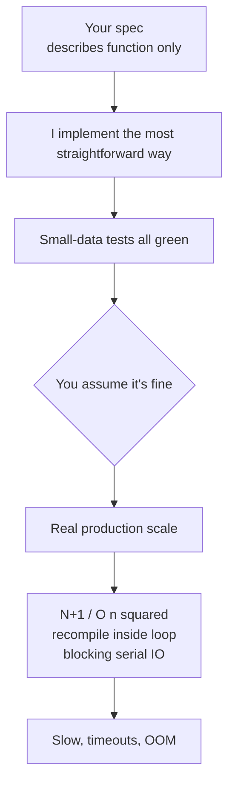

import PitfallMeta from '@site/src/components/PitfallMeta';

<PitfallMeta roles={['Engineer']} phase="Detailed Design" severity="Medium" appliesTo="All coding agents" evidence="Research" />

> In one sentence: the code I hand you is functionally correct and the tests pass, but hidden inside is a query fired once per loop iteration, an O(n²) scan, a regex recompiled on every pass. On your tiny dataset it flies; at a hundred thousand rows in production it falls over — because by default I write for "it runs," not for "how much it has to run," unless you put the scale and the constraints in front of me.

## Symptom

Here is the kind of code I tend to hand you:

- You ask me to "fetch each order's customer name," and I write a loop that fires `SELECT * FROM customers WHERE id = ?` one row at a time — 100 orders become 101 queries (the classic N+1).
- You ask me to "check this batch of users for duplicate emails," and I write a nested loop comparing every pair, O(n²). Fine at a thousand; at a hundred thousand that's tens of billions of comparisons.
- You ask me to "validate the format of each log line," and I put `re.compile(pattern)` inside the per-line loop, recompiling the same regex on every line.
- You ask me to "merge these two configs," and I make an unnecessary deep copy of a multi-megabyte object just to change one field.
- You ask me to "pull all the report data," and I load the whole table into memory with a single `findAll()` — no pagination, no streaming — and memory blows up as the data grows.
- You ask me to "call three external APIs in turn," and I dutifully `await` them serially, even though the three requests have no dependency on each other and could run concurrently.

Every one of these passes the tests you gave me and reads cleanly. The problem isn't whether it's correct; it's whether it holds up.

## Why this happens

**I optimize for "looks like it runs and passes the tests," not for "runs at your real data volume."** This shares a root with ["looking right isn't being right"](../06-testing/trust-then-verify.mdx), but that pitfall is about the boundary of correctness; this one is about **performance and complexity** — code that is perfectly correct in function can still be slow enough to be unusable.

There are three layers to it:

**First, "straightforward, runnable" code dominates my training.** The vast bulk of example code is pedagogical: get the logic working first, query inside the loop, compare directly — the easiest to read and explain. Batch queries, precompilation, indexes, concurrency tend to live in "advanced" contexts and are highly situation-specific. So my default center of gravity leans naturally toward the plain "make it run" form — in my distribution it's the more frequent, safer output.

**Second, I have no visceral sense of data scale.** Whether your loop runs ten times or ten billion, whether that table has a thousand rows or ten million, whether that endpoint is a sub-millisecond local call or a 300ms transoceanic one — none of that is in the code, and unless you tell me, I can't see it. And performance problems are almost all scale problems: the same O(n²) is the most elegant choice at n=10 and an incident at n=10⁵. By default I assume "small and gentle" input, because that keeps the code simplest.

**Third, tests usually prove "functionally correct," not "fast enough."** The cases you give me are mostly small samples of a few rows, and on small samples N+1 and O(n²) alike return instantly and turn everything green. So the verification loop hands me a green light — and that green light isn't testing performance at all. I take it as a signal that the code is fine.

One thing worth being precise about: on isolated **algorithmic puzzles** like Leetcode, research found LLM-generated code is on average even slightly more efficient than human submissions (Coignion et al., EASE 2024) — because those problems make performance an explicit goal. Real-world engineering is the opposite: performance problems are scattered across data access, IO, and object lifetimes, and by default no one asks for them. The RobuNFR evaluation found that once you add performance as an explicit **non-functional requirement**, models' pass rates drop noticeably. In other words, **it's not that I can't optimize — it's that by default no one asked me to.**



## Consequences

- **The small sample fools everyone.** Function correct, tests green, code review reads fine — until the data volume rises and the problem erupts at the most expensive stage (production, the customer site).
- **Slowness multiplies, it doesn't add.** The cost of N+1 and O(n²) grows superlinearly with data size. It feels "okay" today only because the data is still small; it won't slow down linearly — it falls off a cliff at some threshold.
- **The cost of optimizing is deferred and amplified.** Once the plain form is woven into the business logic and spread across its callers, retrofitting a batch query or a cache later touches far more surface than getting it right once would have.
- **The resource bill creeps up quietly.** Redundant queries, needless deep copies, serial remote calls translate into higher database load, more memory, longer response times — all real money, and hard to trace back to any single line of code.

## What to do instead

The core: **make scale and performance expectations explicit inputs, and hold me accountable for complexity with measurements.** I have no intuition for data volume, so don't make me guess.

- **State the magnitude and SLA before I write.** "This table is about 5 million rows, this endpoint needs p99 < 200ms, a single request scans at most ten thousand records" — one line pulls me back from assuming "small and gentle" to reality.
- **Name the anti-patterns to avoid, explicitly.** "Don't query inside the loop — solve it with one batch query / JOIN," "this runs over a large collection, don't use O(n²)," "precompile the regex outside the loop," "these independent IO calls should run concurrently." I know these forms; I just don't reach for them by default.
- **Ask for a complexity analysis, down to big-O.** "Give the time and space complexity of this code, and roughly how many operations at n=10⁵." Force the scale onto the table and the slowness can't hide.
- **Demand before/after measurements, not "I optimized it."** "After the change, post a comparison of query count / benchmark time, before vs after." An "optimized" with no numbers is no optimization.
- **Make the verification loop actually test performance.** Give a near-real-scale dataset or a benchmark assertion (e.g. "100k rows must finish within 1 second") so the green light means "fast enough," not just "functionally correct."
- **Default to pagination / streaming for large data.** "This result set could be very large — use pagination or streaming, don't load it all into memory at once."

## Example

**Before:**

```text
You: Give me a function that takes a list of orders and returns each order with its customer name.
Me: (loops and queries by customer_id one at a time — N+1)
    for o in orders:
        o.customer_name = db.query("SELECT name FROM customers WHERE id=?", o.customer_id)
You: (tested with 3 orders, instant pass, merged and shipped)
Production: a page with 2000 orders fires 2000+ queries and takes a dozen seconds to load
```

**After:**

```text
You: Input is a list of orders (a single page in production may be thousands).
     Return each order with its customer name. Requirements: don't query inside
     the loop; give the time complexity; post the before/after query count.
Me: Fetch all customers in one batch query, then map in memory — queries drop from N+1 to 2.
    ids = {o.customer_id for o in orders}
    names = db.query("SELECT id, name FROM customers WHERE id IN (...)", ids)  # 1 query
    (in-memory join)
    Complexity: O(n) time, O(n) space. before: 1+N queries (~1001 when N=1000);
    after: 2 queries, independent of order count.
```

Same requirement; add three things — scale, a ban on the anti-pattern, and a demand for measurements — and I go from "I can write it but it won't scale" to "I'll do the math on this cost for you."

## When the exception applies

Writing for scale is the default, but in a few cases the plain form is the right one, and forcing an optimization is the "premature optimization" Knuth warned about:

- **Cold paths**: a cron job that runs once a day, config loaded once at startup, an error-handling branch — even an O(n²) there, multiplied by "almost never executed," rounds to nothing. Spending engineering here is cooling code that was never hot.
- **A hard, small upper bound on size**: input drawn from a fixed enum, 7 days in a week, 52 cards in a deck — n is forever constant-scale, and a plain nested loop is shorter and more readable than a batch query or index; the added complexity is pure liability.
- **Readability outweighs the few microseconds here**: on a path that isn't hot, a straightforward loop beats code contorted to save time — no one feels the slowness, but everyone pays the unreadability on every maintenance pass.

The test: first decide whether this is a hot path (executed at high frequency, or n that grows unbounded with real data). **Optimize only if it's hot; if it's cold or n has a small upper bound, put simplicity and readability first** — but base that call on "I know it's cold," not on "I never thought about whether it's hot."

## Version notes

:::note Applicable versions
This isn't a bug in any one release; it's the joint product of two root causes — "plain forms dominate the training" plus "no visceral sense of data scale" — and it's **common across models**. Newer versions genuinely have better performance awareness: when you name the optimization, I can produce quite idiomatic batch queries, caching, and concurrency. But as long as you don't make scale and performance constraints explicit, "write it the way that just runs first" remains my default center of gravity. Treating it as a tendency you actively hedge against is more reliable than hoping some version "already optimizes automatically."
:::

## Further reading and sources

- [A Performance Study of LLM-Generated Code on Leetcode (Coignion, Quinton, Rouvoy, EASE 2024)](https://arxiv.org/abs/2407.21579)
- [RobuNFR: Evaluating the Robustness of LLMs on Non-Functional Requirements Aware Code Generation](https://arxiv.org/abs/2503.22851)
- [Donald Knuth — Wikiquote (the original "premature optimization" quote and its context)](https://en.wikiquote.org/wiki/Donald_Knuth)
