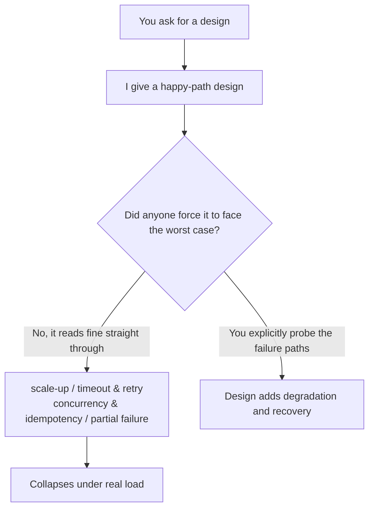

import PitfallMeta from '@site/src/components/PitfallMeta';

<PitfallMeta roles={['Engineer']} phase="Detailed Design" severity="High" appliesTo="All coding agents" evidence="Official docs" />

> In one sentence: I give you a design that's self-consistent under normal inputs and reads as reasonable, so you adopt it. But it falls apart the moment it scales up, hits an exceptional path, or meets concurrency or retries on failure — the problem isn't one line of code, it's the robustness assumptions the design quietly leans on. This entry is about **fragility at the design level**; if you missed a specific edge branch while writing the implementation, see [When I write the implementation, I miss the edge branches you didn't spell out](./missing-edge-cases.mdx).

## What I do

Here's the kind of design review I keep seeing: you ask me to design a scheme to "periodically sync orders to a downstream system," and I give you a clean flow — pull new orders, call the downstream endpoint one by one, mark as synced. Drawn as a diagram, written as steps, it looks smooth from every angle. You nod and implement it.

Until order volume grows from hundreds to hundreds of thousands: serial one-by-one calls are too slow to finish a single cycle; the downstream occasionally times out, my design said nothing about retries, so orders get dropped; the previous run hadn't finished when the next one started, and the same batch of orders gets synced twice. Each problem looks "obvious" on its own — yet not one of them was mentioned in that smooth-reading design.

## Why this happens

This is a different altitude from [When I miss edges while writing the implementation](./missing-edge-cases.mdx). That one is about "a missing null check in the code"; this one is about "the whole design assuming a set of premises that hold at small scale on the happy path but don't hold in the real world."

The root cause is that I **optimize for "reads as reasonable and self-consistent" rather than "still holds in the worst case":**

- **I design for the happy path by default.** My design naturally describes "how it runs when all goes well," because that's the clearest, best-told story. Failure, timeout, partial success, retry, concurrency — those "not-smooth" branches aren't in that story unless you force me to think about the worst case.
- **I inherit the classic fallacies of distribution and scale.** "The network is reliable," "latency is zero," "bandwidth is infinite," "nobody will trigger it twice" — these repeatedly disproven assumptions are exactly the most common default premises of a design, and I tend to assume them too.
- **Reasonable ≠ robust.** I'm at my best producing things that "look reasonable," and especially so at the design layer: there's no runnable code to puncture it, it all rides on you reading along — and while reading along, fragile assumptions are invisible.



## Consequences

- The fragility hides inside the design and surfaces only at integration, load testing, or even in production — by which point what gets reworked isn't a line of code but the whole data flow, costing several times the implementation effort.
- Dropped orders, duplicate processing, cascading failures hit data correctness and production stability directly — harder to clean up than a single-point crash.
- You scheduled and committed against a design that looked solid; when the fragility surfaces, what collapses is the timeline of the whole plan.

## Best practice

**Don't ask me "is this design OK" — it always reads OK. Force me to run the design through the worst case and put every implicit assumption on the table.**

- **Make me list the assumptions before evaluating the design.** "Before giving the design, list every premise it relies on: traffic scale, concurrency level, downstream reliability, behavior on failure. Which one breaking would bring it down?"
- **Use failure modes as a question checklist.** Probe each one: what happens at 10×, 100× scale? What if the downstream times out or returns an error? Will overlapping runs cause duplicate processing (is it idempotent)? How does it recover from partial success? These are exactly where designs collapse most often.
- **Require degradation and recovery strategies, not just the main flow.** A production-ready design has to spell out retries, timeouts, idempotency, resumable checkpoints, rate limiting — whichever is missing marks the direction it's fragile in.
- **Make me play a devil's-advocate architecture reviewer.** "Suppose you're going to reject this design at the review. Give three scenarios most likely to make it fail in production." This is the same move as [When you ask me to validate an idea, I lean toward supporting you](../01-ideation-feasibility/sycophancy-idea-validation.mdx) — forcing me from "agreeing" into "falsifying."

## Example

**Before:**

```text
You: Design a scheme to periodically sync orders to a downstream system
Me: Pull new orders → call the downstream endpoint one by one → mark as synced. (reads smooth, you adopt it)
At scale: serial is too slow to finish, downstream timeouts drop orders, overlapping runs cause duplicate syncs
```

**After:**

```text
You: Before the design, list the assumptions it relies on, and say what happens when each breaks.
Me: (lists: assumes a stable downstream, volume within X, non-overlapping runs... names each failure consequence)
You: Now redo it for "100k scale, downstream will time out, runs may overlap," and give
     idempotency, retry, batching, and resumable-checkpoint strategies.
Me: (produces a design with degradation paths that survives worst-case scrutiny)
```

## Version notes

:::note Applicable versions
"Optimizing for looking reasonable rather than worst-case robust" is an inherent tendency of large language models — it applies to **all models and coding agents**. The stronger the model, the more complete and polished the design it gives, which actually hides the fragile assumptions deeper — so "force the design to face the worst case" is something you can skip less, not more, the stronger the model you use.
:::

## Further reading and sources

- [Fallacies of distributed computing — Wikipedia](https://en.wikipedia.org/wiki/Fallacies_of_distributed_computing)
- [Claude Code Best Practices (Anthropic, official)](https://code.claude.com/docs/en/best-practices)
