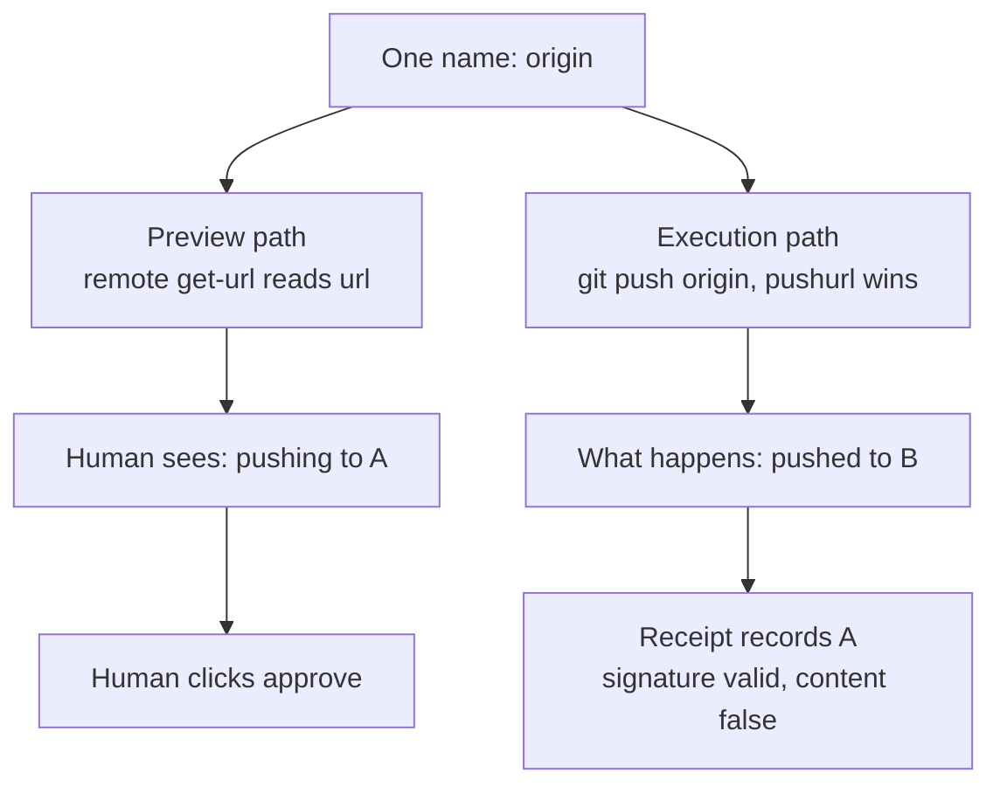

import PitfallMeta from '@site/src/components/PitfallMeta';

<PitfallMeta roles={['Architect', 'Engineer']} phase="Detailed Design" severity="High" appliesTo="All coding agents" evidence="Security advisory" />

> In one sentence: you ask me to build "show the human first, then execute," and I write it as two pieces of code — one renders the preview, one performs the action, each asking the system what the target is. "They read the same truth" is my assumption, not a property the code enforces — the two paths can return two different answers in the same instant, and the human nods at one of them.

## Symptom

You ask me to implement "show what this push will do, and execute it once they agree." I hand you two pieces of code:

- The preview: `git remote get-url origin`, take the address, print it along with the branch and the commit list.
- The execution: hand the remote name `origin` and a refspec to `git push`.

Looks fine — both say `origin`.

But when pushing, if the repository sets that remote's `pushurl`, git prefers it over `url`. **One `origin`, two paths, two different addresses.**

I reproduced this combination: the preview and the receipt afterwards both said "remote = A, result = pushed," while A hadn't changed by a single byte and the commit had landed in B. And that receipt was signed — the signature guaranteed it hadn't been tampered with; it guaranteed nothing about whether it was true.

## Why this happens

**I split code by function, not by "the same fact."** Preview is display, execution is action; to me those are two concerns, so I write two functions that each fetch their own data. Nothing between those functions forces them to get the same value — only that sentence in my head about how they read the same place.

**I optimize each call site separately for "the most reasonable way to write this."** For a human, show a readable URL. For execution, pass the remote name — that's what makes the credential and config machinery work. Two local optima; one lie when composed.

**The precedence rule isn't in my code.** "Pushing prefers `pushurl` over `url`" lives in git's documentation. Every system where one name resolves differently in different contexts has rules like this — layered environment variables, split-horizon DNS, container image tags being repointed, symlinks — and I default to assuming they don't exist, because they're invisible in the few lines I wrote.



## Consequences

- **What the human approved and what the system did are different things, and the approval record is still "valid."** It faithfully records an operation that never happened.
- **The audit trail breaks.** Logs and receipts take the value from the preview side, so what you find later is a coherent, complete, false story — worse than no log, because it makes you stop digging.
- **Attackers aim at the same spot.** Checkmarx's "Lies-in-the-Loop," published in September 2025 against Claude Code, poisons context so the approval prompt appears to ask for "write a code snippet" or "run `git status`" while the command actually queued up is concatenated with a reverse shell; they also demonstrated pushing the real command off-screen behind a wall of plausible text. The vendor's position at the time was that users must review what they approve; the researchers disagreed with that division of labor. **A bug and an attack landing on the same spot is a structural problem, not bad luck.**

## What to do instead

**What you show and what you execute must be constructed from one value, not derived twice.**

- **Resolve once, freeze it into an object.** The preview renders it; the execution uses it. Both share one immutable structure instead of each going back to the system.
- **Walk the fields one at a time: "could this be different at execution time? What forces it to be the same?"** The field nobody ever asked about is your next bug. In the example above, that field was the remote.
- **Don't pass names to the execution layer.** A name is a thing that gets re-resolved. Pass resolved values: URLs, object IDs, absolute paths, numeric primary keys.
- **Make the execution side pin both ends.** Source by object ID rather than branch name; destination with a precondition — "the remote must still be the one I showed the human" — so the underlying system refuses on mismatch instead of trusting a read you took milliseconds ago.
- **Test it by constructing an environment where the two paths disagree**, not by asserting they agree under normal conditions. Under normal conditions they do agree, which is exactly why this bug survives so long.

## Example

**Before:**

```python
def preview(repo, remote, branch):
    url = run(repo, ["remote", "get-url", remote])      # resolution path one
    print(f"will push to {url} on {branch}")

def execute(repo, remote, branch, oid):
    run(repo, ["push", remote, f"{oid}:refs/heads/{branch}"])   # resolution path two
```

Each function is right on its own; together they're wrong.

**After:**

```python
def resolve(repo, remote, branch):
    """Resolve once. Preview and execution both consume this."""
    return Target(
        url=run(repo, ["remote", "get-url", "--push", remote]),  # the one a push will use
        branch=branch,
        oid=run(repo, ["rev-parse", f"refs/heads/{branch}"]),
        remote_oid=lookup_remote_tip(repo, remote, branch),
    )

def preview(target):
    print(f"will push to {target.url} on {target.branch}")

def execute(repo, target):
    run(repo, [
        "push",
        f"--force-with-lease=refs/heads/{target.branch}:{target.remote_oid}",
        target.url,                                   # a value, not a name
        f"{target.oid}:refs/heads/{target.branch}",   # an object ID, not a branch name
    ])
```

The accompanying test isn't "preview and execution agree." It's: **build a repository whose `url` and `pushurl` point at different addresses, and assert the push lands on the one the preview displayed.**

## When the exception applies

When the preview is a **best-effort estimate** rather than a promise, letting the two sides compute separately is fine: a rough progress percentage, an "affects roughly N files" hint, an estimate report used for sorting rather than deciding. The condition is that the interface says it's an estimate.

The test: **if a human is making a yes-or-no decision based on that display, it must share a source with the execution.** A decision surface has no "approximately" setting.

## How this differs from neighboring pitfalls

- [Concurrency races](./concurrency-races.mdx): that one needs concurrency to go wrong. This one doesn't need concurrency, or even elapsed time — the two paths disagree in the same instant.
- **CWE-367 (TOCTOU)** is a neighbor, not the same thing: TOCTOU is **one evaluation going stale over time**; this is **two different evaluations disagreeing from the start**. The fixes overlap (freeze the value, carry a precondition into execution), which is why the "after" snippet above blocks both.
- [Missing autonomy and approval boundaries](../00-setup-collaboration/autonomy-approval-boundaries.mdx): that one is about not having a risk-graded ruler. Here the ruler exists — it's just measuring something other than what's about to run.

## Version notes

:::note Applies to
This is an inherent shape in any system where one name has multiple resolution paths, independent of AI tool versions. The `pushurl` case is just the easiest one to reproduce; siblings include layered environment variables, split-horizon DNS, container image tags being repointed, symlinks and mount points.

"Lies-in-the-Loop" was published 2025-09-15 against Claude Code as it stood then. Agent approval interfaces keep changing, so **whether any particular version blocks that specific technique needs checking separately**; it's cited here as proof that this spot gets actively exploited, not as a verdict on a version.
:::

## Further reading and sources

- [Bypassing AI Agent Defenses With Lies-in-the-Loop (Checkmarx)](https://checkmarx.com/zero-post/bypassing-ai-agent-defenses-with-lies-in-the-loop/): prying apart "what the human sees" from "what is about to run" is exactly the leverage point for this class of attack; the write-up also demonstrates pushing the real command out of view behind long text.
- [CWE-367: Time-of-check Time-of-use (TOCTOU) Race Condition](https://cwe.mitre.org/data/definitions/367.html): the classic shape where state changes between check and use — worth reading to see precisely where this entry differs from it.
- [git-config docs](https://git-scm.com/docs/git-config): the section on a remote's `pushurl` states it takes precedence over `url` when pushing; `git remote get-url --push` is the correct way to ask "which one will a push use?"
