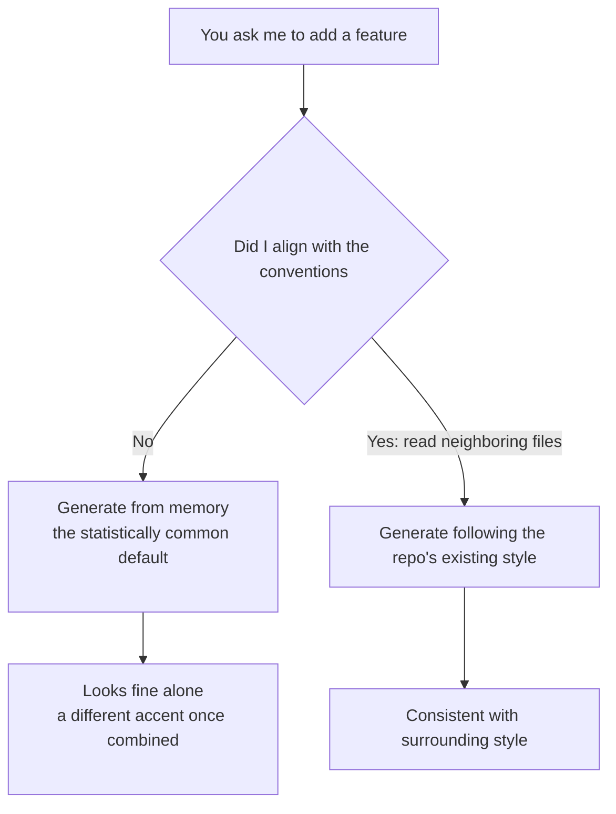

import PitfallMeta from '@site/src/components/PitfallMeta';

<PitfallMeta roles={['Engineer']} phase="Detailed Design" severity="Medium" appliesTo="All Claude Code versions" />

> In one sentence: in the same repo I'll use async/await in this file and a promise chain in the next, `camelCase` here and `snake_case` there. It's not that I'm being deliberately quirky—I just didn't read the file next door, and reached for "the default I'm most familiar with" from memory.

## Symptom

I see this all the time: you ask me to add a feature to an existing module. On its own, the code I hand back looks fine—it runs, it reads cleanly. But drop it into your repo and the mismatch jumps out:

- Your whole project uses `async/await`; I casually wrote a `.then().catch()` chain.
- Your service-layer functions are all named `fetchUserById`; I named mine `getUser`.
- Your code throws a custom `AppError` everywhere; I just did `throw new Error("...")`.
- You use single quotes, two-space indentation, and no semicolons; I gave you double quotes, four spaces, and semicolons.

Each one is individually "also fine." Put together, they're a different accent. A week later, in a different session, I might switch to yet another style—so in the same project, today's me and tomorrow's me write like two different people.

## Why it happens

The root cause isn't that I "don't care about consistency." It's that **I don't know this repo's conventions by default, and by default I won't go looking for them.**

Every session, I start from a blank slate. The implicit conventions that hold your project together without being written down anywhere—naming habits, error-handling patterns, where files go—aren't in my starting context. When I'm about to write some code, I have two paths in front of me:

1. Open a few neighboring files, see how you actually write things, and follow that;
2. Generate, from the enormous amount of code I saw in training, the **statistically most common, most plausible-looking default**.

When no one explicitly asks for path 1, I lean toward path 2—because producing a "plausible-looking default" is exactly what I'm best at and what costs me the least. And "plausible-looking" is not the same as "fits this repo": the former is decided by the majority of my training data, the latter by the one file sitting next to it. The two often disagree, and that's when drift happens.



What makes it worse is that it self-propagates: the out-of-place style I just added gets treated, next time, by me (or by the next session's me) as "this repo's existing style" and dutifully imitated. One bit of drift hatches a whole cluster.

## Consequences

- **Readability collapses**: multiple accents in one repo force newcomers (and me) to keep switching mental models, raising the cognitive cost.
- **Maintenance gets riskier**: when error handling and null conventions aren't uniform, a pattern that's safe in one file can plant a landmine when moved to another.
- **Reviews drown in trivia**: your energy gets eaten by mechanical fixes like "change the quotes back to single" and "this needs an await," squeezing out the logic you should actually be reviewing.
- **Drift spreads**: once inconsistency lands in the repo, it becomes the template for the next round of imitation, accumulating over time—the most inconspicuous and most stubborn kind of [technical debt](../03-architecture/over-engineering-no-pushback.mdx).

## Best practice

Telling me to "keep the style consistent" barely works—it's too abstract, and I can't verify whether I've actually done it. What works is to **make the conventions something I can't route around.** Three layers, from hard to soft:

1. **Whatever can be auto-fixed, hand to a tool—don't rely on my discipline.** A formatter (Prettier, gofmt, Black) and EditorConfig turn indentation, quotes, and semicolons into a deterministic step that has nothing to do with me; a linter (ESLint and friends) turns naming rules and things like `no-floating-promises` into hard rules that error out. Go a step further and use a [hook](../00-setup-collaboration/over-permissioning.mdx) to run lint/format automatically after every file edit I make—the official docs are explicit that CLAUDE.md is advisory while hooks are deterministic and guaranteed to run. Formatting thereby drops from "something I have to remember" to "something the tooling backstops."

2. **For implicit conventions a machine can't enforce, write them into CLAUDE.md—and be specific.** Naming patterns, error-handling style, file layout—the things a linter struggles to cover—belong as one or two **verifiable** rules in CLAUDE.md. The official guidance keeps stressing specificity: "Use 2-space indentation" beats "format code properly," and "API handlers live in `src/api/handlers/`" beats "keep files organized." Don't write "follow the project style"—I can't act on that.

3. **Before I write, point me directly at the neighboring file.** This is the most underrated move and the one with the most immediate payoff. The official best practices have a dedicated item, "Reference existing patterns": instead of "add a calendar widget," say "look at how existing widgets are implemented on the home page; `HotDogWidget.php` is a good example—follow that pattern." Once that file is in front of me, I'll write like it rather than rummaging through the defaults in my head. **Letting me see how the repo writes beats making me guess.**

## Example

**Before:**

```text
You: Add a function to the user module that looks up a user by email.
Me: (generates)
    function getUserByEmail(email) {
      return db.users.findOne({ email }).then(u => {
        if (!u) throw new Error("not found");
        return u;
      });
    }
    // The rest of the project is all async/await + a custom NotFoundError + fetchXxx naming
```

**After:**

```text
You: Following the style of fetchUserById in services/userService.js,
     add a function to the user module that looks up a user by email.
     Keep the error handling consistent with it too.
Me: (reads that file first, then generates)
    async function fetchUserByEmail(email) {
      const user = await db.users.findOne({ email });
      if (!user) throw new NotFoundError(`user not found: ${email}`);
      return user;
    }
    // async/await, NotFoundError, fetchXxx naming—all aligned
```

The difference isn't my ability; it's whether you put "how this repo writes" in front of me.

## Version notes

:::note Applies to
"Starting each session from scratch and leaning toward the statistically most common default" is an inherent trait of large language models, and **applies across versions and across models**—the stronger the model, the more self-consistent and polished its "default" looks, which paradoxically makes it easier to overlook that it never actually aligned with your repo. The ability to generate a starter CLAUDE.md via `/init`, and to run lint/format automatically after edits via a hook, depends on newer versions; without them, you can hand-write CLAUDE.md and explicitly name the neighboring file in your prompt for the same effect.
:::

## Further reading & sources

- [Best practices for Claude Code (Anthropic, official)](https://code.claude.com/docs/en/best-practices) — see the sections "Reference existing patterns," "Write an effective CLAUDE.md," and "Set up hooks"
- [How Claude remembers your project / CLAUDE.md (Anthropic, official)](https://code.claude.com/docs/en/memory) — CLAUDE.md is the place for coding standards / naming conventions and should be specific enough to verify; hooks are for enforcement
