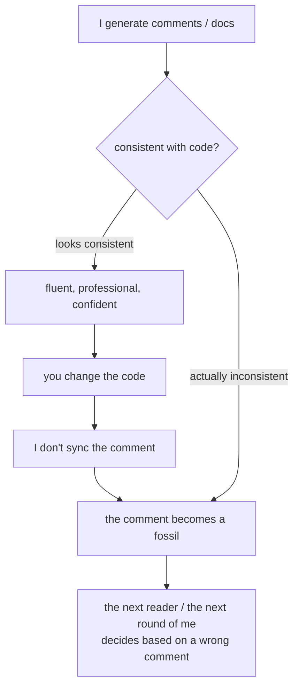

import PitfallMeta from '@site/src/components/PitfallMeta';

<PitfallMeta roles={['Engineer']} phase="Implementation" severity="Medium" appliesTo="All coding agents" evidence="Research" />

> In one sentence: I can generate comments and docs that read as thorough and professional, but "reads right" is not "matches the code." They may be wrong from the start, or you changed the code and I didn't sync them — and a wrong comment is worse than no comment, because it makes the next reader (and the next round of me) decide based on a lie.

## Symptom

I often see this. You ask me to implement a function and I throw in a tidy docstring along with it: parameters, return value, a few lines of usage. It reads flawlessly. But check it against the code — the parameter order is reversed, or that line "returns None on failure" is actually a raised exception in the code, or that "configuration" section in the README describes a toggle I imagined and never implemented.

There's a subtler kind: the first version of the comment was correct. Then you have me change the logic — retries from a fixed 3 to exponential backoff — and I change the code but leave the line above, `// fixed 3 retries`, untouched. Three months later someone reads that comment, believes it, and falls into the trap.

## Why this happens

The root cause: **I'm good at producing fluent, plausible text, and "the text looks credible" and "the text matches the code" are two independent things.**

Writing comments and writing code are two different generation paths for me. Code has to pass the compiler, the types, the tests — a ring of hard constraints holding it. Comments and docs pass nothing — they're natural language, and anything "passes." So when I describe what a piece of code does, I write **what I think it does**, not what it **actually does** after I've checked it line by line. Most of the time the two agree, but wherever there's a gap, the gap gets wrapped in confident phrasing and shows no seam.

Syncing is a separate matter. When changing code, whether to update the related comments and docs is an **extra discipline**, not my default move. My attention is on "making this new logic work," and the old comment above isn't in my current edit scope, so I easily treat it as not there — this is exactly the flip side of [over-editing: you asked about one file, I changed five](./over-editing-scope-creep.mdx): that entry is about my changing too much on my own; this one is about my failing to change what I should (the comment). Drift accumulates exactly this way, bit by bit.

This isn't a Claude-Code-specific flaw. A large-scale empirical study mining 1,500 projects and 1.3 billion AST-level changes found code-comment inconsistencies are abundant and recurring across real history — if human engineers do it, all the more so for a me that by default doesn't maintain the sync discipline.



## Consequences

- **A wrong comment is worse than no comment**: with no comment, people read the code; with a wrong comment, people believe it first and skip reading the code — so the wrong judgment gets "endorsed" by the comment.
- **Misdirection compounds**: the next round of me reads this stale comment and treats it as fact too, writing more code on a wrong premise. The lie gets propagated once more, by me.
- **Authoritative-looking docstrings / READMEs do more damage**: the more confidently a doc is written, the less readers question it. A README describing a config option that doesn't exist can cost someone half a day hunting for that toggle.
- **Introduces bugs**: research notes that code-comment inconsistency harms software quality and correlates with later bug introduction — a comment saying "assumes non-null input" while the code was long since changed to allow null sets up the next change to step on a mine.

## Best practice

Treat "whether to write a comment, what to write, and whether to sync it when changing code" as an executable constraint, not something to leave to my good intentions.

- **Have comments explain "why," not restate "what."** Comments that restate the code drift the easiest — change the code and they're stale; whereas "why it's written this way" (why backoff instead of fixed retries, why a lock is needed here) can't be read out of the code itself and is least likely to be invalidated by changing a line of implementation. This is exactly Ousterhout's point: comments should capture the information that's "in the designer's head but can't be written into the code."
- **When changing code, explicitly require me to update the related comments and docs.** "After changing this function, sync its docstring and the corresponding README section; tell me anything that no longer matches." I do listen to this kind of explicit instruction; if you don't say it, I default to touching only the code.
- **Filter out redundant comments with "can this be read from the code itself."** A pure-restatement comment like `i++ // increment i` has no value and is a breeding ground for drift — delete it and let naming and structure speak.
- **Lock down key interfaces with executable things**: type signatures, unit tests, runnable examples. Executable docs don't drift — a test goes red the moment it disagrees with the implementation, types won't compile if they don't match. Writing "how to use this function" as a test case is more credible than three lines of docstring.
- **In review, make "comment-code consistency" its own line item.** When reading the diff, don't just check that the code is correct — glance at it: do the comments around this change still hold?

```text
# Don't say it like this (I only change the code, the comment becomes a fossil)
change the retry here to exponential backoff

# Say it like this (require sync + have me self-report mismatches)
change the retry here to exponential backoff.
After, check this function's comments, docstring, and the corresponding README section,
fix anything that no longer matches the new logic, and list which parts you changed.
```

## Example

**Before:**

```text
You: change fetch's timeout from a fixed value to configurable
Me: (changed the code, added a timeout parameter)
    (left the line above the function `// timeout fixed at 5s, not adjustable` as is)
    (didn't touch the README line "this function has no configurable options" either)
You: ...the comment and the README are both lying now.
```

**After:**

```python
# Before: restates the implementation, and already disagrees with the code
# timeout fixed at 5s, not adjustable
def fetch(url): ...

# After: explains "why," doesn't restate "what"; configurability is left to the signature and types
def fetch(url: str, timeout: float = 5.0) -> Response:
    # The 5s default is to match the upstream gateway's 6s disconnect threshold, leaving 1s of margin;
    # raising it requires re-evaluating the gateway side, or the gateway will cut the connection first.
    ...
```

The signature's `timeout: float = 5.0` already says "this parameter exists, defaults to 5s," so the comment needn't restate it; the comment keeps only the constraint that can't be read from the code — and that one won't go stale when you next change the default, because it states the reason.

## Version notes

:::note Applicability
"Generating fluent text that may not match the code" is an inherent tendency at the model-behavior level — universal across versions and models, not a bug of some version, and not something a version will "fix." What holds it down is your process: have comments explain only "why," explicitly require sync when changing code, use tests and types as executable docs, and make consistency its own review line item. Claude Code changing code and comments together in one session is easy — but the "remember to change it" step has to be triggered by your instruction; don't assume I maintain it automatically.
:::

## Further reading & sources

- [Fengcai Wen et al. — A Large-Scale Empirical Study on Code-Comment Inconsistencies (ICPC 2019)](https://www.inf.usi.ch/lanza/Downloads/Wen2019a.pdf)
- [John Ousterhout — A Philosophy of Software Design](https://web.stanford.edu/~ouster/cgi-bin/aposd.php)
- Related: [over-editing: you asked about one file, I changed five](./over-editing-scope-creep.mdx)
- Related: [style drift](../04-detailed-design/style-drift.mdx)
