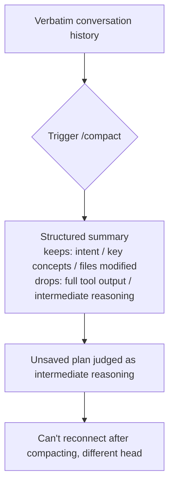

import PitfallMeta from '@site/src/components/PitfallMeta';

<PitfallMeta roles={['Engineer']} phase="Implementation" severity="Medium" appliesTo="All Claude Code versions" evidence="Official docs" />

> In one sentence: compaction is lossy. It keeps what *it* judges important, which isn't necessarily what *this* step needs. Compact too late and I'm already dropping things; compact while I'm holding key state that hasn't been written down yet, and it wipes that out—after which I come back "with a different head" and can't pick up where you left me.

## Symptom

I've seen two ways this goes wrong. They point in opposite directions, but they hurt the same.

One is **compacting too late**: you keep working, the context window is nearly full, I've already started ignoring conventions you set earlier and misattributing details from before—and *that's* when you remember `/compact`. Too late. Compaction summarizes a conversation that has *already* degraded; it can squeeze out redundancy, but it can't squeeze back the judgment I lost.

The other is **bad timing**: I've just worked out an approach, or I'm halfway through a change spanning several files that isn't committed yet—and at that exact moment you (or auto-compaction) fire `/compact`. Afterward, the plan that had just taken shape in my head and never made it to disk gets condensed into a couple of sentences. The detail is gone. I come back "with a different head" and can't reconnect with the me you were just talking to.

## Why this happens

`/compact` isn't a lossless snapshot—it's a **lossy summary**: it replaces the verbatim conversation history with a structured summary. Per the official description of compaction behavior, the summary keeps your requests and intent, key technical concepts, files examined or modified with important code snippets, errors and how they were fixed, pending tasks, and current work. But **the full tool outputs and intermediate reasoning are gone**—I can still reference what I did, but I no longer have the exact code I read at the time.

That explains both failure modes, which turn out to be the same root cause:

- **Too late**: compaction compacts *redundancy*, not *degradation*. By the time I'm dropping things, it's because the signal-to-noise ratio is already low (see [The kitchen-sink session](./kitchen-sink-session.mdx)); compacting now removes noise, but the bad calls and wrong turns I took along the way have already seeped into my later answers, and a summary can't undo that.
- **Bad timing**: compaction keeps what it *judges* important—and "the plan that just took shape in my head and isn't written into any file yet" is exactly the kind of thing with no anchor, the kind most likely to be classified as "intermediate reasoning" and dropped. It doesn't know those five minutes of thinking are the linchpin of this step.



## Consequences

- Compact too late: you expect compaction to make me "normal again," but it only frees some space—the quality doesn't come back, and you keep piling tasks onto a discounted me.
- Compact at a bad moment: the plan I just worked out, or the half-finished multi-file change, gets condensed away. You have to re-explain the background, or worse, I redo it with an approach inconsistent with the earlier one—undoing the progress.
- Both make you **misdiagnose this as me "getting dumber"** rather than "the context got mismanaged"—so you go fix my output instead of managing the timing, which is the wrong fight.

## What to do instead

**Compact at a natural break, before it overflows; write down the key state before you compact.** Three things to anchor on:

- **Pick a break**: the safe window to compact (or just `/clear`) is when a subtask is done, it's committed, and there's no state "held in my hands but not written down." The official guidance is to compact "when context starts affecting performance, or before a long new task"—the operative word is *before*, while I'm still lucid, not after I've gone foggy.
- **Save to disk first, then compact**: move the key state out of the conversation—into a file, a `git commit`, or have me summarize the current plan into a few sentences pasted into CLAUDE.md or notes. Anything on disk survives even if compaction drops it.
- **Don't compact while I'm holding a pile of unsaved state**: mid multi-file change, or a plan that's just formed and isn't written down—that's the worst moment. Either have me save it first, or wrap up this step before compacting.

There's also a cure for the root cause: **keep the session focused and reduce the need to compact at all** (see [The kitchen-sink session](./kitchen-sink-session.mdx)). One conversation, one related thing—the window doesn't fill up easily and you're rarely backed into "I have no choice but to compact."

When you do need it, you can steer the summary, telling me what to preserve for this step:

```text
/compact Focus on the file list and unfinished changes in the current refactor
```

## Example

**Before (bad timing):**

```text
You: split the order module into a service layer and a repository layer
Me: (mid-edit on the 3rd file—service is extracted, repository just started, nothing committed)
You: [sees the context is nearly full] /compact
Me: (after compacting) Sure—what change did you want to make to the order module?
You: ...weren't we in the middle of splitting it? (the first half of the progress is wiped, has to be re-explained)
```

**After:**

```text
You: split the order module into a service layer and a repository layer
Me: (service extracted) Service layer is ready; next is extracting the repository.
You: commit this step first.
Me: (git commit: refactor: extract order service layer)
You: /compact Focus on the fact that the repository isn't extracted yet
Me: (after compacting) Service-layer extraction saved; pending: extract the repository layer. Continue?
You: continue.   ← progress lives in the commit and the summary, so I pick up cleanly
```

## Tool differences

> As of 2026-07, mechanism level; trigger thresholds and defaults change fast across versions — defer to each tool's current docs.

Same root cause — **compaction is always lossy; timing decides what you lose** — but each tool turns "when to compact, and into what" into a different mechanism, so don't carry one tool's muscle memory into another:

- **Claude Code**: manual `/compact` (accepts a "what to keep" focus instruction) + auto-compaction near the limit, with `/context` visualizing current usage — the most controllable manual timing; the risk is the auto tier picking the moment for you.
- **Gemini CLI**: `/compress` **replaces** the entire history with one summary, plus an auto-compression threshold configured as a fraction of the limit; facts that must survive compression go into `/memory` first — the summary replacement itself is irreversible.
- **Codex CLI**: `/compact` summarizes to reclaim tokens; its compaction runs server-side — the summary carries prior state in an **encrypted, unreadable** form, so you can't inspect "what got dropped" the way you'd read a normal summary.
- **Cursor**: **automatic** summarization near the limit + manual `/summarize`; large files go through a separate on-demand condensation — "conversation summary" and "file condensation" are two parallel mechanisms, don't conflate them.

Whichever you use, the principle holds: **land the key facts outside the session before compacting** (memory / files / commits), and treat compaction as a lossy checkpoint, not a free context extension.

## Version notes

:::note Applies to
"Compaction is lossy, and timing makes or breaks it" is an inherent property of how compaction works, so **all Claude Code versions apply**. Exactly which fields compaction preserves, and how close to the limit auto-compaction triggers, will evolve across versions; but the fundamental trait—it keeps what *it* judges important, not what *this* step needs—doesn't change. Defer to the official docs for the version you're running.
:::

## Further reading and sources

- [Explore the context window — What survives compaction (Anthropic, official)](https://code.claude.com/docs/en/context-window)
- [Manage costs effectively — Manage context proactively (Anthropic, official)](https://code.claude.com/docs/en/costs)
- [Commands reference — /compact, /clear (Anthropic, official)](https://code.claude.com/docs/en/commands)
- On this site: [The kitchen-sink session](./kitchen-sink-session.mdx)
