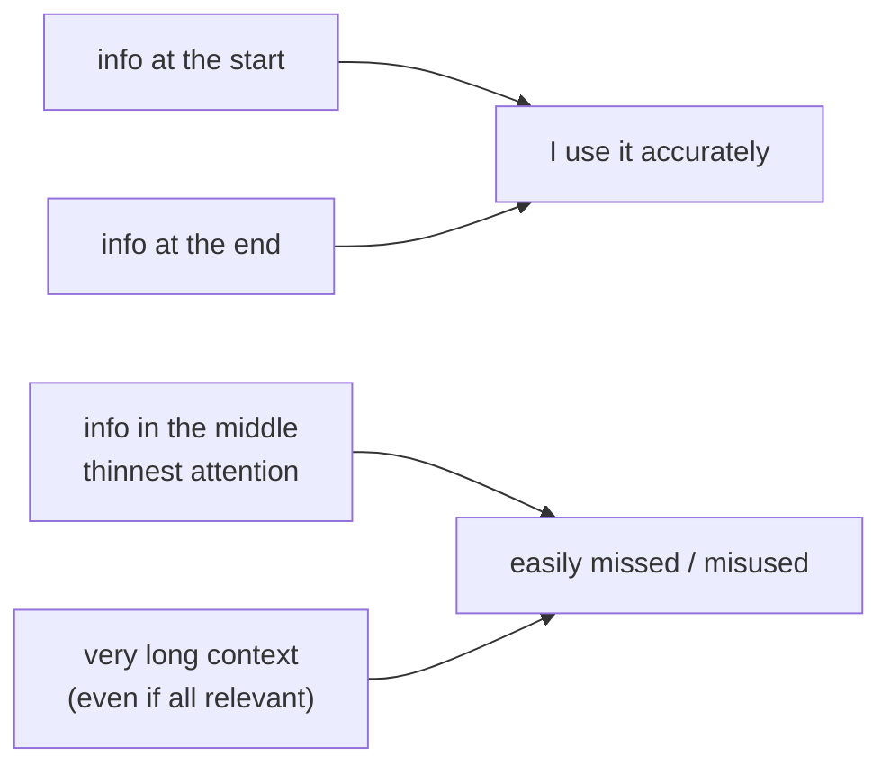

import PitfallMeta from '@site/src/components/PitfallMeta';

<PitfallMeta roles={['Engineer', 'Architect']} phase="Implementation" severity="Medium" appliesTo="All LLMs" evidence="Research" />

> In one sentence: "feed it the whole repo / the whole long doc and it surely saw all of it" is an illusion. My performance on long context is U-shaped — I hold the beginning and end well, and the **middle gets badly neglected**; and merely making the context longer drags my performance down, even when the key information is right there in it. More context ≠ better.

## Symptom

You want me to make fewer mistakes, so you stuff in everything you can: the whole directory, thousands of lines of logs, a very long spec doc, capped with "it's all up there, go by this." I answer fluently, but I miss the one key constraint buried in the 40th file — even though it's right there in what I "read."

You'll find it strange: the same information, pasted to me on its own, I use just fine; bury it in the middle of a big block of context and I act as if I never saw it. It's not that it isn't in my window — it's that it landed in the stretch where my attention is thinnest.

This is a **different mechanism** from several existing context pitfalls; don't conflate them:

- *[Kitchen-sink session](./kitchen-sink-session.mdx)* is about **mixing in unrelated tasks** that dilute focus; this entry: even if everything I'm fed is relevant, the length itself drags performance down.
- *[CLAUDE.md overload](./claude-md-overload.mdx)* is about **too many rules diluted to an average**; this entry is the more fundamental "attention decays in the middle of long context," not limited to rules.
- *[`/compact` timing](./compact-timing.mdx)* is about **when to compact**; this entry explains "why long context itself deserves caution" — the very reason you should compact and curate.

## Why this happens

**Research repeatedly finds LLMs use long context in a U shape: information at the beginning or end is used most accurately; in the middle, accuracy drops sharply.** This is the famous "lost in the middle" (*Lost in the Middle: How Language Models Use Long Contexts*) — move key info from the ends to the middle and performance can fall by more than 30%.

More counterintuitive: **it's not "too much irrelevant content" that hurts — length itself hurts.** Research controlled for exactly this: even when the relevant information can be retrieved perfectly, even with irrelevant tokens masked out so I only see what I should, **merely making the context longer** still degrades performance (*Context Length Alone Hurts LLM Performance Despite Perfect Retrieval*). In other words, "I read it all anyway" does not save the day.

The mechanistic root is attention itself: a Transformer's self-attention is a probability distribution spread over all tokens — the longer the sequence, the bigger the denominator, so **the attention weight each token gets is diluted**; stack on the positional encoding's long-range decay — similarity between more distant token pairs is systematically lower, so information in the middle, far from the current generation position, gets less attention. So "fits in the window" and "actually gets used" are two different things.



## Consequences

- **Key constraints get dropped while you think I "saw it all."** The dangerous case isn't me saying "I didn't read it" — it's me reading it and not using it, while you accept the work on the false security of "I fed it everything."
- **More is worse; past a point it's negative return.** You pour in more context "to be safe," which instead pushes key info into the middle and thins attention overall — quality falls, not rises.
- **Long sessions quietly get dumber.** As the conversation stretches, key decisions and constraints set early slide into the middle and fade, and I start contradicting myself — you think the model "got tired," but it's context rot.

## Best practice

**Core: feed a few relevant, high-quality snippets, put the most critical ones where they're seen, and don't count on "stuff it all in."**

- **Retrieve, don't dump.** Pick the few snippets truly relevant to the current task instead of pouring in the whole directory / whole log. A common empirical lesson in the research: a few curated snippets often beat dozens — the extras mostly dilute attention.
- **Put key info at the beginning or end, not buried in the middle.** Place "the constraint that must never be violated" and "this task's core goal" at the start or end of the prompt; the middle is my attention sink.
- **Repeat / pin key constraints.** For the most critical one, repeat it once in a long context or lift it out to a prominent spot rather than betting it'll still be used while buried in the middle.
- **Wrap up long sessions promptly.** When a subtask is done, `/clear` or compact (see *[`/compact` timing](./compact-timing.mdx)*) — don't let the window pile up endlessly; that's precisely the remedy for context rot.
- **Don't let "feed it everything" replace "think about what to feed."** Dumping the full corpus looks easy, but it outsources the step "pick out the relevant information" to my attention — the very stretch that is least reliable.

## Example

**Before:**

```text
You: (paste the whole 20-file directory + 3,000 lines of logs at once)
You: the requirements are all in there, change it accordingly
Me: (miss the "amounts must be in integer cents" constraint buried in the middle of file 12, use floats)
You: ...floats again? I literally gave it to you
```

**After:**

```text
You: only these three are relevant: models/money.py, the "amounts in integer cents" constraint from file 12 (I'm pinning it for you),
    and this failing case. The constraint matters most: amounts are always integer cents, no floats.
Me: (with curated relevant snippets + the pinned key constraint, get it right first try)
```

The difference isn't that I tried harder this time — it's that you picked out the relevant information and put the key constraint where my attention can reach it, instead of betting I'd fish it out of the middle of a huge block.

## When the exception applies

"Few and relevant" is the default, not an absolute. A few cases where feeding more is actually right:

- **The task genuinely needs a global view and the total stays within the effective window**: cross-file refactors, global consistency checks — where the information is tightly linked and dropping any piece loses something. The key is judging the *effective* length, not what the window nominally holds.
- **You've wired up retrieval + re-ranking + structured summaries**: you're not dumping raw text but compressing the long material into a structured summary / index first, then pulling snippets on demand — the cost of length is hedged by engineering. Here "it's all there" means an organized whole, not a bucket tipped in.
- **Key information sits at both ends and is repeated up top**: the ends of the U are the high ground; deliberately placing key constraints at the head and tail, repeating once if needed, can keep them alive even in a longer context.

The test: the exception holds only when you've actively managed the length (curation / retrieval / pinning / summarizing), rather than letting "I read it all anyway" stand in for "thinking about what to feed."

## Version notes

:::note Applicability
U-shaped attention, lost-in-the-middle, and "length itself drags performance down" are **model-mechanism** phenomena rooted in self-attention + positional encoding, **common to all models**, regardless of vendor or version. The nominal context-window size keeps growing across versions (hundreds of thousands, even millions of tokens), but "can hold it" has never meant "can use it evenly well" — the bigger the window, the more you must actively curate rather than feel freer to dump everything in.
:::

## Further reading & sources

- [Lost in the Middle: How Language Models Use Long Contexts (TACL; arXiv 2307.03172)](https://arxiv.org/abs/2307.03172) — U-shaped performance on long context, middle info drops sharply
- [Context Length Alone Hurts LLM Performance Despite Perfect Retrieval (arXiv 2510.05381)](https://arxiv.org/abs/2510.05381) — even with perfect retrieval and irrelevant tokens masked, length alone still degrades performance
- On this site: [kitchen-sink session](./kitchen-sink-session.mdx), [CLAUDE.md overload](./claude-md-overload.mdx), [`/compact` timing](./compact-timing.mdx)
