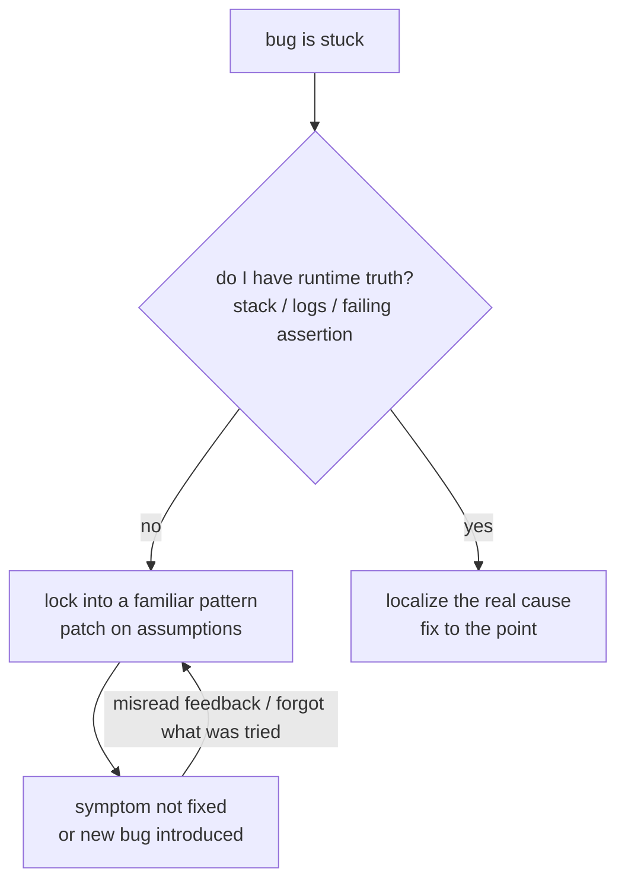

import PitfallMeta from '@site/src/components/PitfallMeta';

<PitfallMeta roles={['Engineer']} phase="Implementation" severity="High" appliesTo="All Claude Code versions" evidence="Research" />

> In one sentence: when a bug stumps me, I tend to decide "this is that kind of bug I've seen before" and keep applying the same fix. With no real runtime information to anchor me, each "fix" is really a patch based on a guess — and the more I patch, the messier it gets, until the code is worse than where it started.

## Symptom

You ask me to fix a bug. I glance at the error — "ah, null pointer / race / type mismatch, that family" — and hand you a fix. It doesn't work. I rephrase and try again — essentially the same idea. Still broken. On the third pass I wrap a try-catch over the symptom, or "improve" some unrelated nearby code and spawn a fresh problem.

By now you'll notice some strange things: I start losing track of what I've already tried and re-propose an approach I just rejected; looking at the same output, I say "it's caused by A" this round and "it's definitely B" the next, contradicting myself; you reply only "still broken" and I invent yet another direction and keep editing. I'm not converging — I'm spinning in place, and each lap hangs one more patch on the code.

This is **not** the same as [over-correcting](./over-correcting.mdx) — the direction is opposite. That one is about **you** correcting me round after round, packing flawed reasoning into the context (you drive the loop); this one is about **me** reapplying failed fixes, self-correcting my way further off course (I drive the loop). They can compound, but the root causes differ and need treating separately.

## Why this happens

The core is one line: **my self-correction has no reliable runtime truth to anchor it.** The truth of a bug lives at runtime — which exact line threw, how the stack unwound, what that failing assertion expected versus actually got. I often don't have these. Without runtime truth, all I can do is substitute "this error looks like a class I saw in training" for "what actually happened this time," so I lock into a familiar pattern (pattern locking) and reapply the same kind of fix.

Research has measured exactly how fragile "correcting myself by myself" is: in an *intrinsic* self-correction setting, with no external feedback and only the model's own judgment of right and wrong, post-correction performance often drops rather than rises — I can't reliably tell what was wrong with my last answer, so I drift further off (see *Large Language Models Cannot Self-Correct Reasoning Yet*). Applied to debugging, TraceCoder's observation is more concrete: a bare "pass / fail" signal is nowhere near enough to localize the cause, which is why it first instruments the code, captures fine-grained execution traces, and only then does causal analysis — **a fix without an execution trace is a guess.**

Multi-step execution adds another layer. MIRAGE-Bench sorts an agent's "hallucinated actions" into three kinds: unfaithful to the task instruction, unfaithful to the execution history, unfaithful to the environment observation. The last two are exactly what my degenerative loop looks like — forgetting what I tried a few rounds ago (unfaithful to execution history) and misreading the output you pasted back (unfaithful to the environment). Each round I keep reasoning on top of an increasingly untrustworthy "what I think happened," so of course I contradict myself and spin.



## Consequences

- **The code gets worse with each edit.** Every local patch (one more try-catch, a mystery null check, a casual edit to nearby code) can introduce a new problem, turning one bug into three.
- **Context fills up with failed attempts.** Every wrong fix I tried stays in the window, diluting attention and dragging quality down further (see [kitchen-sink session](./kitchen-sink-session.mdx)).
- **You're lured into pouring in more.** Each round I sound like "this time I've got it," so you wait one more round, feed one more "still broken" — time burns on spinning when you could have stopped early and changed tack.
- **Worst case, the symptom is hidden and the cause survives.** That try-catch stops the error from throwing; the bug didn't leave, it just submerged somewhere harder to find.

## Best practice

**Don't let me patch on, round after round, while I'm guessing. Give me runtime truth, cap the loop, and go in the order: reproduce, then localize, then fix.**

- **Feed real runtime information; don't just say "still broken."** Paste the full error, the call stack, the failing case's actual vs. expected output — or let me run the command and read it myself. A bare "nope" only forces me to guess another direction; a real stack often yanks me straight out of the wrong pattern.

```text
# Not this
You: still erroring, tweak it again

# This
You: run the test, paste the full failure before changing anything:
    $ pytest tests/test_order.py::test_split -x -q
    (or just let me run it and read the real output)
```

- **Set a hard iteration cap.** Agree that "if the same bug isn't fixed in two or three tries, stop." Stopping doesn't mean trying one more version — it means stepping back to question the root-cause hypothesis: what are we even fixing? Could the direction have been wrong from the start?
- **Reproduce, then localize, then fix.** Have me stably reproduce the bug first (one minimal command / one failing case), then require me to state "what I think the root cause is and which piece of runtime info supports it," and only act after you confirm. Skipping reproduction and editing straight away is tacit permission for me to patch on guesses.
- **When stuck, roll back to a clean point and restart — don't stack patches on a broken state.** After a few patches the code and the context are both dirty. Pressing `Esc` twice or `/rewind` back to before things broke is far cleaner than fixing on top of a patch pile (same handling as [over-correcting](./over-correcting.mdx)).
- **When needed, let a human localize and I just execute.** You decide the diagnosis (which line, why) and tell me exactly what to change; I land it. I'm good at executing a well-specified change, bad at judging a root cause out of thin air without runtime truth — split the labor right and the loop breaks.

## Example

**Before:**

```text
You: this split-billing algorithm is wrong, fix it
Me: (glances at the code) probably a rounding issue, switch to round
You: still wrong
Me: then maybe float precision, let me wrap it in Decimal
You: still wrong
Me: (adds a try-catch fallback, and casually edits the nearby FX conversion)
You: ...now the FX rate is wrong too
```

**After:**

```text
You: this split-billing algorithm is wrong. Run this case first, paste actual vs expected:
    $ pytest tests/test_split.py::test_three_way -x
Me: actual 33/33/33, expected 34/33/33 — the remainder of 1 wasn't allocated.
You: right, the root cause is remainder handling. Tell me how you'll change it, don't touch anything else.
Me: after allocating, add the remainder of 1 to the first share, changing only split().
You: do it.
Me: (minimal diff, passes first try, never touched FX conversion)
```

The difference isn't that I'm "smarter this time" — it's that you put the runtime truth on the table and pinned the scope, so I switched from "guessing" to "fixing the actual cause."

## Version notes

:::note Applicability
"Self-correction degenerates when runtime truth is missing" is a model-mechanism phenomenon, **applicable to all Claude Code versions**, independent of any specific version. The tools that help you break the loop (`/rewind`, `Esc` checkpoint rollback, letting me run commands to get real output) evolve across versions — defer to the official docs for the version you use — but the underlying trait, "without runtime truth I can only guess, and guessing degrades," does not change.
:::

## Further reading & sources

- [Large Language Models Cannot Self-Correct Reasoning Yet (ICLR 2024)](https://arxiv.org/abs/2310.01798) — intrinsic self-correction without external feedback often lowers, not raises, post-correction performance
- [TraceCoder: A Trace-Driven Multi-Agent Framework for Automated Debugging of LLM-Generated Code (arXiv 2602.06875)](https://arxiv.org/abs/2602.06875) — bare pass/fail signals are not enough to localize a cause; fine-grained execution traces are needed
- [MIRAGE-Bench: LLM Agent is Hallucinating and Where to Find Them (arXiv 2507.21017)](https://arxiv.org/abs/2507.21017) — an agent's hallucinated actions: unfaithful to execution history / environment observation
- On this site: [over-correcting](./over-correcting.mdx) (the human-driven correction loop, a mirror image of this one), [kitchen-sink session](./kitchen-sink-session.mdx)
