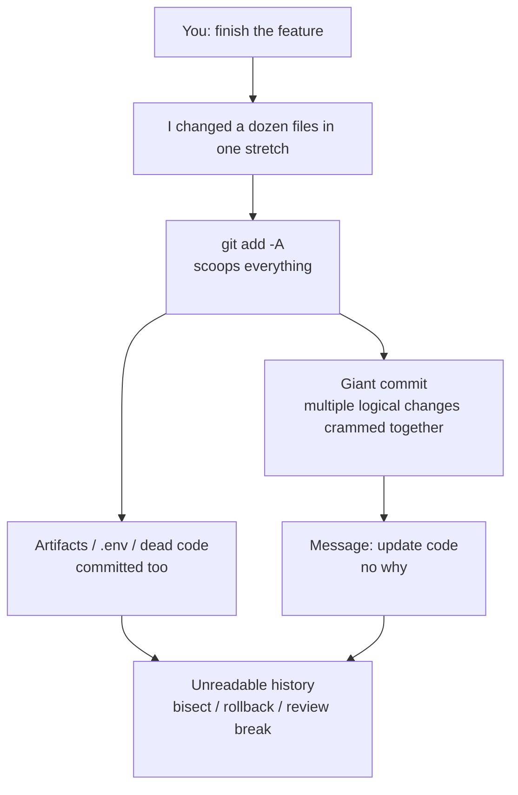

import PitfallMeta from '@site/src/components/PitfallMeta';

<PitfallMeta roles={['Engineer']} phase="Implementation" severity="Medium" appliesTo="All Claude Code versions" evidence="Official docs" />

> In one sentence: let me work for a stretch and what I pile up is usually one giant commit — dozens of files, a thousand-plus lines — with a message that just says "update code." On top of that, I'll sweep build artifacts, `.env`, and commented-out dead code straight into the commit. The result is an unreadable history: `git bisect`, rollback, and code review all stop working, and when something breaks you can't tell which change caused it.

## What you'll see

Here's how it tends to end: you ask me to "finish this feature," I head down for twenty minutes, touch a dozen files, and then do one `git add -A && git commit`. You open the history and find:

- **One giant commit**: the login logic, a utility function I refactored along the way, a new dependency, a config change, plus the imports I reordered — all crammed into the same commit, a 1,000-plus-line diff.
- **A message that says nothing**: the commit message is "update code" / "fix stuff" / "various changes" — it tells you something *changed*, but not **what** or **why**.
- **Junk swept in too**: artifacts under `dist/` and `node_modules/`, a `tmp.log` I generated while debugging, even a `.env` with real credentials, and a whole block of dead code I commented out "just in case" — all scooped up by `git add -A`.

Each commit "runs" on its own, but the history as a whole is no longer usable.

## Why this happens

**I treat "committing" as the wrap-up step after the task is done, not as part of the task.** My objective is set to "make the feature work"; the commit is just the last keystroke I tap out on the way out the door. So I don't stop to ask: should these changes be split into separate commits? Does this message explain *why*? Should this file even be in version control? Those judgments aren't in my objective function, so by default I skip them.

Drilling in, there are three concrete mechanisms:

**First, I have no default preference for atomic commits.** Everything I produce in one continuous work session looks, to me, like a single blob that accomplishes one task — I won't spontaneously slice it along "one logical change per commit." Staging it all in one `add` is the path of least resistance. Pro Git explicitly recommends that each commit be a logically separate changeset — but that's a constraint I follow when explicitly asked, not my default.

**Second, when I write a commit message I'm *describing the diff*, not *explaining the intent*.** Unless you ask for more, I lean toward generating the laziest sentence that isn't wrong — "update code" accurately summarizes "I changed code," so I feel done. But a good commit message answers what the diff *can't show*: why you made the change, and what previous behavior it replaces. That "why" lives only in the intent, not in the code, so I won't write it unless asked.

**Third, `git add -A` is too convenient for me, and I don't filter what should be committed.** In my eyes the files in the working tree have no tier — "source / artifact / secret / temp junk" — they're all just "files." A single `git add -A` or `git add .` pulls them into staging indiscriminately, and that's the route I take most often. I won't spontaneously decide for you that "this `.env` doesn't belong in the repo" or "this commented-out code is dead."

This is a **different pit** from two you may have already read — don't conflate them:

- *[Destructive, irreversible actions you only notice once they're done](../00-setup-collaboration/destructive-irreversible-actions.mdx)* is about **irreversible, destructive moves** like `git push --force` or wiping a database. This entry involves no destruction — the history is intact, the code is intact, it's just **messy**: granularity too coarse, messages useless, the wrong things mixed in.
- *[I treat security as an invisible default requirement](../07-acceptance-release/security-data-leaks.mdx)* is about the **security problem** of leaked secrets and vulnerabilities; committing a `.env` belongs to that entry. This entry focuses on **everyday commit hygiene** — granularity, message quality, what should and shouldn't be committed — and a leaked secret is just one of many downstream consequences of the root cause "I don't filter what should be committed."



## Consequences

- **`git bisect` is dead.** It works by bisecting commit by commit to pinpoint which one introduced a bug. When a commit stuffs in eight unrelated things, even if the bisect lands on it you still don't know which of the eight is the culprit — your precision drops back to "read a 1,000-line diff by hand."
- **Rollback becomes guilt by association.** You only want to revert that one buggy utility-function change, but it's bound to the login logic in the same commit. One `git revert` and you've reverted the good parts too.
- **Code review exists in name only.** A reviewer facing a 1,000-line diff spanning eight concerns can't review it seriously — they either wave it through or just LGTM. Only small, atomic commits are reviewable.
- **A message with no information strips the history of navigational value.** Six months later you `git log` to find "why did we change the timeout to 60 seconds back then" and you see a row of "update code / fix stuff." The history was supposed to be the project's record of decisions; now it's degraded into noise.
- **Things mixed into the repo cost extra to clean out.** Artifacts bloat the repo; dead code misleads whoever comes next; and once a `.env` is in the Git history, deleting one line isn't enough — that secret has leaked and must be rotated (see the security entry above).

## Best practice

**Conclusion first: don't let me accumulate one big commit. Require small, atomic commits, make each message explain *why*, and have me list the plan for your review before committing.**

1. **Require small, atomic commits — one thing per commit.** Say it directly: "Split this into multiple commits along logical changes, one thing per commit, and don't stuff unrelated changes into the same commit." I do listen to this kind of explicit constraint; without it, I'll `add` everything in one go.

2. **Have me list the plan before committing, and commit only after you nod.** One line does it: "Before committing, list which files and which changes this commit includes and why they belong together; wait for my confirmation before you commit." This step intercepts the giant commit before it lands, and incidentally forces me to surface the things that shouldn't be in the repo.

3. **Commit messages must explain *why*; you can adopt Conventional Commits.** Require me to use an imperative subject under 50 characters summarizing *what was done*, and a body that explains *why the change was made and what prior behavior it replaces* — exactly the Pro Git commit guideline. If you want machine-readable messages and auto-generated changelogs, adopt the [Conventional Commits](https://www.conventionalcommits.org/en/v1.0.0/) format: `<type>[scope]: <description>`, with breaking changes flagged by `!` or a `BREAKING CHANGE:` footer.

4. **Use `.gitignore` plus a pre-commit check to block artifacts, secrets, and temp files.** Put `dist/`, `node_modules/`, `.env`, `*.log`, and friends in `.gitignore`, and require me to "run `git status` before committing to see exactly which files will be committed, exclude any artifacts / secrets / temp files, and never use `git add -A` to scoop everything blindly."

5. **Break large changes into independently reviewable commits.** Don't mix a refactor with a new feature: first a "pure refactor, no behavior change" commit, then an "add new feature" commit. Each can be reviewed on its own and reverted on its own.

```text
# Don't instruct me like this (I'll accumulate a giant commit + "update code")
Finish this feature, then commit

# Instruct me like this (small atomic + plan-then-commit + explain why)
When done, split it into multiple atomic commits along logical changes, one thing per commit.
Before committing, run git status to list the files that will be committed, and exclude artifacts / .env / temp files.
Use Conventional Commits format for each message, with a body explaining why the change was made.
List the plan and wait for my confirmation, then commit one by one.
```

## Example

**Before:**

```text
You: Finish the shopping-cart checkout feature
Me: (changed 12 files: checkout logic, a price util I refactored along the way, a new
    dependency, a debug console.log, the generated dist/, and a .env with credentials)
Me: git add -A && git commit -m "update code"
You: ...how many separate things are in this one commit? Which parts are checkout, which aren't? How did .env get in?
```

```text
$ git log
a1b2c3d update code      # 1,200 lines, 12 files, includes .env and dist/
```

**After:**

```text
You: Finish cart checkout. Split into atomic commits, and list the plan for me before committing.
Me: I plan 3 commits — confirm the scope first:
   1. refactor(cart): extract the price calculation util (pure refactor, no behavior change)
   2. feat(checkout): implement the checkout flow
   3. chore: add dist/, .env, *.log to .gitignore
   Note: I found a .env with credentials and the build artifacts under dist/ in the working tree.
   These don't belong in the repo, so I've added them to .gitignore and won't commit them. Confirm this split?
You: Confirmed
Me: (commits one by one, each message's body explaining "why the change was made")
```

```text
$ git log
3c4d5e6 feat(checkout): add cart settlement with tax + coupon
2b3c4d5 refactor(cart): extract price calculation into pure util
1a2b3c4 chore: ignore build artifacts and local env files
```

The difference isn't that I got more careful — it's that before the giant commit lands, there's now a process to "split first, list the plan, and let you call a halt," and `.env` and `dist/` got blocked before they ever entered the repo.

## Version notes

:::note Applicable versions
"Treating the commit as a wrap-up step, not splitting proactively, writing messages that only describe the diff, not filtering what should be committed" is a model-behavior tendency that's **universal across versions and models** — not a bug in any one version. What changes it is **how you instruct me and the process constraints** (requiring atomic commits, plan-then-commit, explaining why, backstopping with `.gitignore` and a pre-commit check), not waiting for some version to "fix" it. Newer Claude Code versions follow commit conventions reasonably well when asked, but by default — when not asked — they still lean toward the lazy path of "one `add`, one 'update code.'"
:::

## Further reading and sources

- [Conventional Commits 1.0.0 (official spec)](https://www.conventionalcommits.org/en/v1.0.0/)
- [Pro Git — Distributed Git: Contributing to a Project (Commit Guidelines)](https://git-scm.com/book/en/v2/Distributed-Git-Contributing-to-a-Project)
- Related entry: [Destructive, irreversible actions you only notice once they're done](../00-setup-collaboration/destructive-irreversible-actions.mdx)
- Related entry: [I treat security as an invisible default requirement](../07-acceptance-release/security-data-leaks.mdx)
