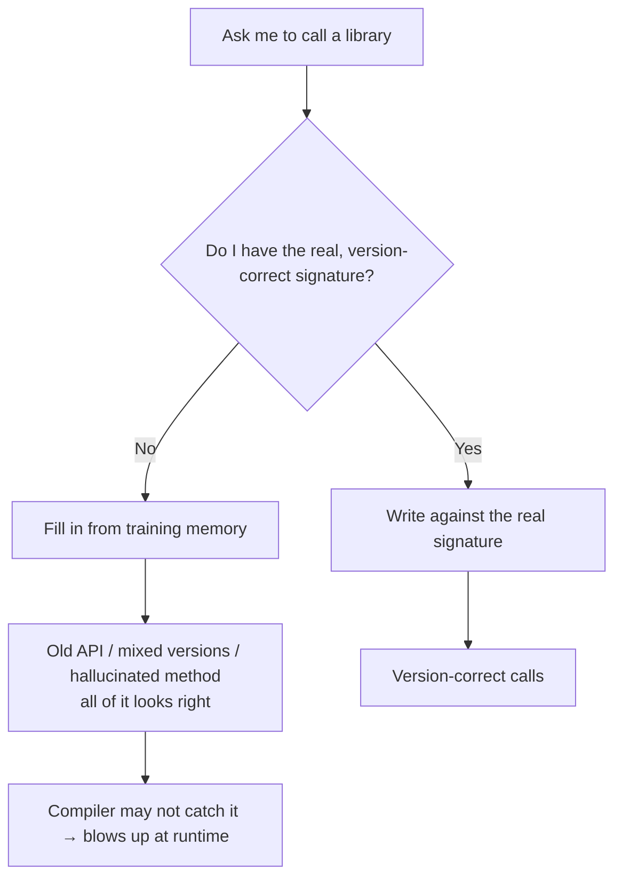

import PitfallMeta from '@site/src/components/PitfallMeta';

<PitfallMeta roles={['Engineer', 'Architect']} phase="Implementation" severity="High" appliesTo="All coding agents" evidence="Official docs" />

> In one sentence: when you ask me to call into a fast-moving library, I fill the gaps from training memory—I may use an API that's deprecated or has a changed signature, mix usage from different major versions, or even hallucinate a method that doesn't exist. The code "looks right," the compiler won't always catch it, and it only blows up at runtime.

## Symptom

You ask me to "write an X with this library." I write it fluently: method names, argument order, return values—no hesitation. Then you run it, and—

- `xxx is not a function`: the method I called doesn't exist in the version you pinned, or it was renamed a while ago;
- arguments don't line up: I passed them by an old signature from memory, but the new version moved that parameter, changed its type, or added a required one;
- half new, half old: in the same block, initialization uses the new-version style while the calls below use the old-version style, and the two don't fit together.

The faster a library iterates, the more likely I am to trip here—frontend frameworks, cloud-vendor SDKs, AI/LLM client libraries. The version I have the "strongest impression" of is often no longer the one you installed today.

## Why it happens

The root cause is one sentence: **my training has a cutoff date, and I have no awareness of the specific version you've pinned right now.** That unpacks into three things:

**First, I fall back on the version that appears most in my memory—usually an old one.** I haven't read the version pinned in your `package.json` or `requirements.txt`—unless you show me. Without that fact, I can only reach for the "most familiar" usage from training data, and an older version of a library tends to appear more often and sit longer in that data than the newest one. So what I emit by default is often the version you upgraded away from long ago.

**Second, lacking a real signature, I fill in with a shape that "looks right."** Generating code is, at bottom, predicting the token sequence "most like a correct answer." A method with a smooth name and a plausible signature that doesn't actually exist looks just as credible to me as a real one—that's where a hallucinated API comes from. I'm not lying to you; without a factual anchor, I mistake the statistically most likely shape for the truth.

**Third, version mixing happens because I've stitched corpora from multiple versions together.** The 2.x tutorials and 3.x docs for a library both live in my training data, and when I generate I can't always cleanly separate them—so I copy initialization from one place and calls from another. Each line reads as "right," but together they won't run.



This is the flip side of [*You don't connect me to a version-matched doc source*](../00-setup-collaboration/no-versioned-docs.mdx): that entry is about the **setup** phase—no version-correct source of truth wired into the environment; this one is about how that gap shows up in the **implementation** phase as a concrete line of stale or hallucinated code, and how to fix it on the spot. Leave the hole open in setup, and this is how the code derails during implementation.

## Consequences

- **Stale API.** I used a method that's deprecated or has a changed signature. In a strongly typed language the type checker may catch it on the spot; in weakly typed or dynamic languages it usually surfaces only when that line runs.
- **Mixed versions won't run.** Half-new, half-old usage stitched together passes review line by line, yet the whole thing won't start.
- **Hallucinated methods are the hardest to catch.** A method this library never had, with a convincing name—you can't easily spot it in review, until runtime reports "undefined."
- **The debugging cost lands on you.** These errors often don't surface while I'm writing the code; they show up when you run tests or even after release, far more expensive to track down than one trip to the docs would have been.

## Best practice

The core, in one line: **don't make me gamble from memory—give me a real signature to check against, and use tooling to disprove me on the spot.**

1. **Pin the version and tell me.** Name the version number in the prompt; don't make me guess: "write X with `<lib>@3.4`." If I know the version, at least I won't default back into old-version memory.

2. **Connect a versioned doc source so I check signatures instead of recalling them.** Wire in an MCP doc source like [Context7](https://github.com/upstash/context7); it feeds the official signatures for your specified library and version into my context. For the upstream fix, see [*You don't connect me to a version-matched doc source*](../00-setup-collaboration/no-versioned-docs.mdx)—that's the cure in the setup phase; this entry is the safety net at the moment of writing.

```text
# Name the version in the prompt, and have me check the doc source first, docs over memory
You: write an X with <lib>@3.4. First check Context7 for the real 3.4 signature, go by the docs, not your memory.
```

3. **Run type checks / compile / tests to disprove me on the spot.** This is the hardest gate: have me run `tsc`, the compiler, or a minimal smoke test the moment I finish. Hallucinated methods and wrong signatures show themselves here, not in production. Hand this step to me to run, read the errors, and fix—don't wire it up by hand yourself.

4. **For unfamiliar or fast-moving APIs, make me cite the source.** Have me confirm every method name and parameter I use against the doc source, one by one, and annotate it "per `<lib>` 3.4 official docs." When I'm unsure, I'd rather say "I couldn't find this in the docs, please confirm" than guess my way through.

## Example

**Before:**

```text
You: write a connection pool with somelib
Me: (calls somelib.createPool(...) from memory—that's the 2.x style;
    the 3.x you pinned changed it to new somelib.Pool(...), and it only errors at runtime: createPool is not a function)
```

**After:**

```text
You: write a connection pool with somelib@3.x. Check Context7 for the 3.x API first, docs over memory, then run a type check.
Me: (confirms from the doc source that 3.x is new somelib.Pool(...), writes to the real signature,
    runs tsc with no errors, and annotates "per somelib 3.x official docs")
```

The difference isn't that I understand the library better—it's that I now hold a fact that matches your version, plus a gate that can disprove me on the spot, so I don't have to gamble on what "looks right."

## Version notes

:::note Applies to
"Training has a cutoff date, and I have no awareness of the specific version you've pinned" is an inherent property of every large model—**independent of the specific model.** A newer model only pushes the cutoff later; it doesn't change the fact that everything after the cutoff is unknown. The faster a library updates, the wider the gap between memory and reality. Versioned doc sources (MCP doc tools like Context7) are a newer external capability; it depends on whether your client supports MCP and whether the doc source covers your library. This entry and [*You don't connect me to a version-matched doc source*](../00-setup-collaboration/no-versioned-docs.mdx) (Setup & Collaboration phase) are two sides of the same root cause: that one seals the hole at the source in the setup phase; this one fixes it at the moment of writing the code.
:::

## Further reading & sources

- [Context7 (upstash/context7, versioned-docs MCP source)](https://github.com/upstash/context7)
- [Connect Claude Code to tools via MCP (official)](https://code.claude.com/docs/en/mcp)
- [Claude Code Best Practices (Anthropic, official)](https://code.claude.com/docs/en/best-practices)
