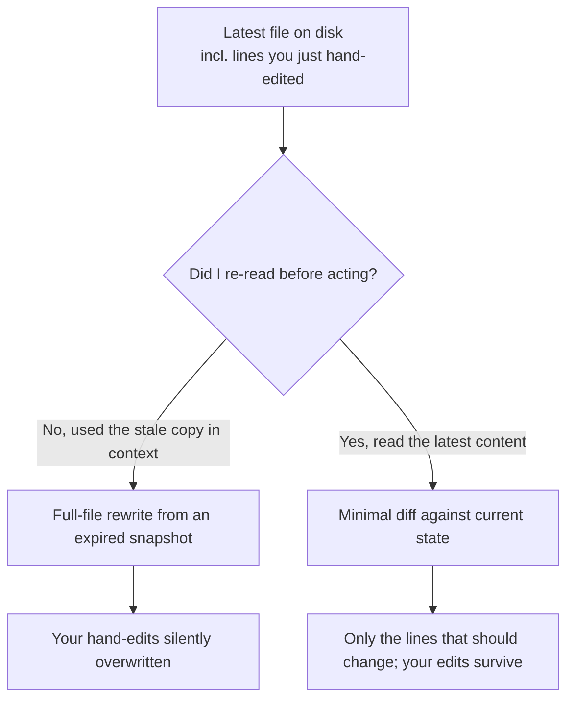

import PitfallMeta from '@site/src/components/PitfallMeta';

<PitfallMeta roles={['Engineer']} phase="Implementation" severity="High" appliesTo="All Claude Code versions" />

> In one sentence: the copy of the file I'm holding is several rounds old, and I never saw the lines you just hand-edited. I hand back a "complete rewrite" — clean, yes, but your changes are gone with it, and you usually only notice a while later.

## What it looks like

You ask me to "switch this file's logging to structured output." Instead of reading what the file looks like on disk right now, I regenerate the whole file from the stale copy that's been sitting in my context for several rounds. It looks complete and tidy.

But in the meantime, you hand-added two boundary checks, or a teammate's change just got merged in. I saw none of it. My "clean rewrite" quietly flattens those changes — you thought I only touched the logging lines, but in fact I relaid the entire file from the old version in my head.

## Why this happens

Two mechanisms stack on top of each other.

First, **I lean toward "handing you a fresh, clean version" rather than making the smallest change against what's already there.** A full-file rewrite is less effort for me — I don't have to line up exactly with the indentation on some line of yours, a variable name I've never seen, or a block of logic I'm afraid to touch because I don't understand it. Relaying the whole thing at once produces output that looks neat and complete. But it's neat relative to *the version in my memory*, not relative to *the real version on disk*.

Second, **I have too little respect for the file's current state.** The copy of the file in my context may have been read in several turns ago; in the meantime you hand-edited it and other changes landed, so the file has long since changed — and I don't automatically re-read it. I treat the stale copy in my context as the truth, so my "rewrite" is really overwriting the latest version with an expired snapshot.



## Consequences

- **Silent data loss.** No error, no conflict prompt — the changes are just gone. That's more dangerous than an error, because you don't even know what to go looking for.
- **Your work and your teammate's work, erased.** The boundary check you just hand-tuned, the fix your teammate just merged — my one rewrite zeroes them out.
- **Found late, costly to fix.** It often surfaces several turns later when tests fail, or only after release, and by then tracing "which step overwrote it" takes real effort.
- **Eroded trust.** You start being afraid to let me touch any file you've maintained by hand.

## Best practice

The core is a single sentence: **have me make the smallest change against the file's real current state, instead of rewriting the whole file from memory.**

- **Tell me explicitly to "read the latest content first, then make a minimal diff — don't rewrite the whole file."** That one line cuts off both mechanisms above.
- **Glance at the scope of the diff I hand back.** If you only asked me to change the logging but the diff sprawls across the whole file and touches things you never mentioned, that's a rewrite signal — stop me on the spot, the way you would for [over-editing](./over-editing-scope-creep.mdx).
- **Commit often, and use version control as your safety net.** As long as your change is committed, even if I overwrite it, `git diff` / `git restore` can bring it back intact. The real danger is a change still sitting in the working tree, unsaved, when it gets overwritten.
- **After you hand-edit a file, remind me: "you just changed this file — continue from its current content."** I don't automatically know the disk changed.
- **Don't let me work off a copy of the file that's been sitting around for a long time.** If we come back to the same file after many rounds, have me re-read its current content first.

```text
Edit src/logger.ts based on its real content on disk right now — read before you write.
Only replace console.log with structured logging, don't touch any other line, give me a minimal diff.
Do not rewrite the whole file.
```

This pitfall pairs with "losing track of which files were changed mid-refactor": that one is about me losing track of progress across a multi-file change, this one is about me overwriting the new version of a single file with an old one. The cure for both is the same — don't let me work from memory; make me check against the real state on disk.

## Example

**Before:**

```text
You: (hand-add two validations to config.ts, without saying so)
You: change the default timeout in config.ts from 30s to 60s
Me: (regenerate the whole file from the old config.ts I read several rounds ago,
     changing only the timeout — your two validations don't exist in my stale copy, so they're gone)
You: …where did my validations go?
```

**After:**

```text
You: First read config.ts's current content — I just hand-edited it.
   Then change only the default timeout from 30s to 60s, give me a minimal diff, leave the rest alone.
Me: (Read the current file → see the two validations → change only the timeout line)
You: (diff is one line; validations preserved as-is)
```

## Version notes

:::note Applicable versions
"Rewriting a whole file from a stale copy" is a tendency at the level of model behavior, so it applies across versions — it's tied directly to whether I "read before I write," not to a particular version number. One thing to note separately: Claude Code's checkpoints / `/rewind` **only track changes I make, not external processes** (the official docs say plainly that this "isn't a replacement for git"). So changes you made by hand, or that another tool landed, may not be recoverable via checkpoints once I overwrite them — your real safety net is git, and a change is only safe once it's committed.
:::

## Further reading and sources

- [Claude Code Best Practices (Anthropic official)](https://code.claude.com/docs/en/best-practices) — using `@` to make me read the file before answering; small, clear changes being more controllable than big rewrites; and the warning that checkpoints "aren't a replacement for git."
- [Git Book — Undoing Things](https://git-scm.com/book/en/v2/Git-Basics-Undoing-Things) — `git restore` / `git checkout` to recover committed changes that got overwritten; this is the final safety net for an overwrite accident.
