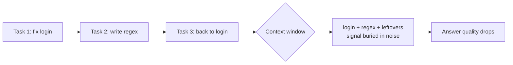

import PitfallMeta from '@site/src/components/PitfallMeta';

<PitfallMeta roles={['Engineer']} phase="Implementation" severity="Medium" appliesTo="All Claude Code versions" evidence="Official docs" />

> In one sentence: you fix a bug, then ask an unrelated question, then come back to the original task. My context fills up with irrelevant material and my answers start to degrade—and you assume I just "got dumber."

## Symptom

I see conversations like this all the time: you ask me to fix an error in the login endpoint, and we fix it. Then you remember something and casually ask, "Oh, by the way, how would you write this regex?" A while later you come back: "About that login thing—can you add some logging?"

Three unrelated things in one conversation. By the third, you'll feel my responses get noticeably duller: I start ignoring conventions you set earlier, or I wrongly drag the regex context into the login code.

## Why it happens

I don't have a switch that "forgets the last thing." Within a single session, **everything that came before is still sitting in my context window**—including that regex discussion that has nothing to do with the current task.

Every answer I generate is an allocation of attention over *everything currently in the window*. The more irrelevant material there is, the smaller the share held by what actually matters (the code style you set at the start, the key constraints of that login endpoint), and the easier those are to dilute and ignore. This isn't me "getting tired"—it's the signal-to-noise ratio dropping.



## Consequences

- I start ignoring instructions you gave earlier, because they're buried under unrelated material.
- I may wrongly carry details from one task into another.
- To correct the drift, you add even more conversation—which crowds the window further. A vicious cycle.

## Best practice

**When you switch tasks, start a clean conversation.** In Claude Code that's a single command:

```text
/clear
```

It wipes the current context so I face the new task from scratch. A simple rule of thumb: **if the new problem doesn't need any information from the old conversation, you should `/clear`.**

If you really are switching between related tasks and want to keep the key points, have me summarize the essential conclusions into a few sentences *before* you `/clear`, then paste them back at the start of the next conversation—trade a long, noisy history for a short, distilled one.

## Example

**Before (one conversation):**

```text
You: fix the null pointer error in login()
Me: (fixes it)
You: also, write me a regex that matches emails
Me: (gives the regex)
You: ok, back to login—add failure logging
Me: (cobbles things together in login, occasionally dragging in the email regex)
```

**After:**

```text
You: fix the null pointer error in login()
Me: (fixes it)
You: /clear
You: write me a regex that matches emails
Me: (gives the regex, cleanly)
You: /clear
You: add structured logging to login()'s failure branch
Me: (focused, accurate)
```

## Version notes

:::note Applies to
This is an inherent effect of how the context window works, independent of version—**all Claude Code versions apply**. Different models have different window sizes, which shifts *how soon* things start degrading, but not the underlying rule that irrelevant material dilutes the signal.
:::

## Further reading & sources

- [Claude Code Best Practices (Anthropic, official)](https://code.claude.com/docs/en/best-practices)
- [MuhammadUsmanGM/claude-code-best-practices](https://github.com/MuhammadUsmanGM/claude-code-best-practices)
