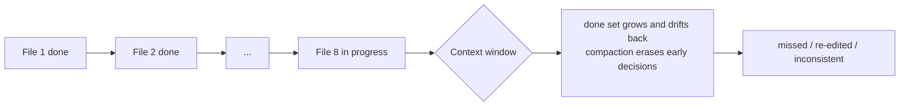

import PitfallMeta from '@site/src/components/PitfallMeta';

<PitfallMeta roles={['Engineer', 'Architect']} phase="Implementation" severity="High" appliesTo="All Claude Code versions" evidence="Official docs" />

> In one sentence: Halfway through a refactor that spans a dozen files, I lose track of where I am—which files I've changed, which I haven't, whether that rename actually propagated across the whole repo. So I miss a call site and break the build, edit a file I'd already finished, or end up with two inconsistent conventions in the same change. Don't make me use my memory as the to-do list.

## What I keep seeing

You ask me to rename a heavily used function, `getUser()`, to `fetchUser()`, and while I'm at it switch its return type from a bare object to `Result<User>`. This is a textbook cross-file refactor: the call sites are scattered across a dozen files, and every one of them has to change too.

I start working through them one by one. Around the seventh or eighth file, you'll see these symptoms:

- I miss two more call sites still sitting under `legacy/`, and the build breaks right there.
- I open `services/auth.ts` and edit it again—even though I already changed it ten minutes ago.
- The first five files use `Result<User>`; somewhere along the way the last five quietly slid back to `User | null`—two return conventions inside a single refactor.

## Why this happens

The "done set" of a refactor is a **continuously growing piece of state**: every file I finish adds a line to that list. But I don't have a dedicated, stable slot to keep that list in—it scrolls along inside the same context window as our entire conversation and every file I've read.

The trouble comes from both ends. One end is **the window getting longer**: by the eighth file, the details of the previous seven edits have been pushed far back, the share of attention they get keeps shrinking, and "did I already change auth.ts?" starts to blur. The other end is **compaction**: once a long session triggers it, what survives is the summary the system *thinks* is important—and a detail like "in the third file I chose the `Result<User>` form" is exactly the kind of thing most likely to get squeezed out. After compaction I've effectively "swapped brains" and can't pick up the convention I set in the first half.

Put plainly: **I'm using volatile memory as a to-do list that should have been written down.** Once the list grows long and the window gets compacted, memory stops being trustworthy.



## Consequences

- **Missed edits**: a call site doesn't get updated, and the build breaks—or worse, it compiles but the behavior changed, hiding until runtime.
- **Re-edits**: I edit a file I'd already finished, possibly turning something correct back into something wrong, wasting your review.
- **Inconsistency**: two forms (`Result<User>` and `User | null`) end up in the same refactor—fresh technical debt buried inside the cleanup.
- **The check makes it worse**: you ask me to "see what's still unchanged," and I answer from memory—but memory is the source of the error, so you get a progress report you can't trust.

## Best practice

The core idea is one sentence: **don't make me track progress from memory—externalize it into something checkable.** Four concrete moves:

**1. Small steps, one commit each.** Slice the big refactor into "one complete small change at a time," and commit after each step. Git history is the most reliable "changed list" there is—`git log` and `git diff` don't blur as the window grows. Anthropic's own best practices explicitly recommend committing often so every step stays traceable and reversible.

**2. Build an explicit to-do list first.** Before touching code, have me list the points to change (ideally based on a single repo-wide search) and tick them off as I go. Whether the list lives in the conversation or in a scratch file, it's more reliable than the impression in my head.

**3. Verify each step on the spot.** Run the build / the relevant tests after every step, so a failure surfaces at *that* step rather than piling up to the end—by which point you can't tell which step dropped the ball.

**4. Use search, not memory, to confirm "what's left."** Don't ask me "that's probably all done, right?"—have me sweep for the old symbol again with `grep` / a repo-wide search: still hits means not done; zero hits is what "done" means. Search is deterministic; memory isn't.

```text
# Instead of wrapping up from memory, let the leftovers reveal themselves:
You: search the whole repo for any getUser( calls, list files and line numbers
Me:  (grep results—3 still left, in …)
You: good, change those 3 too, then search again to confirm it's zero
```

This one pairs with [Not knowing when to `/compact`](./compact-timing): that entry covers how compaction can flush the critical state I'm holding, and this one is about how "the set of changed files" is exactly the kind of state you should externalize rather than gamble on compaction keeping. By the same logic, if the refactor has me edit based on a file's current contents, make me re-read it before editing rather than overwriting from memory—an impression is as unreliable as a recollection.

## Example

**Before (one big sweep, wrapping up from memory):**

```text
You: rename getUser to fetchUser, switch the return type to Result<User>, change it everywhere
Me:  (edits a dozen files in a row, no commits, no verification)
Me:  Done.
You: (build breaks—two sites under legacy/ missed; auth.ts edited twice; second half reverted to User | null)
```

**After (small steps + list + verification + search):**

```text
You: don't touch anything yet. grep the whole repo for getUser( calls and turn it into a list
Me:  (lists 12 sites across 9 files)
You: change them file by file, run tsc after each file, commit when it passes, then report progress
Me:  services/auth.ts done ✅ tsc passed ✅ committed (1/9)
Me:  legacy/cache.ts done ✅ tsc passed ✅ committed (2/9)
…
You: once it's all done, grep getUser( one more time to confirm zero
Me:  search returns 0 hits, refactor complete; git log has 9 traceable commits
```

In the second version, whichever step goes wrong, `git log` and that final search tell you exactly where—progress no longer lives in my memory.

## Version notes

:::note Applicable versions
This is an inherent effect of the context window and compaction mechanisms, independent of any specific version, and it **applies to all Claude Code versions**. A model with a larger window pushes the "start losing track" threshold further out (it can hold a few more files before it gets muddled), but as long as the refactor is large enough and the session long enough, the root problem—tracking a continuously growing done set from memory—doesn't go away. Externalizing progress (commits / a list / search) is the fix that doesn't depend on window size.
:::

## Further reading and sources

- [Claude Code Best Practices — Commit early and often (Anthropic)](https://www.anthropic.com/engineering/claude-code-best-practices)
- [Explore the context window — What survives compaction (Anthropic)](https://code.claude.com/docs/en/context-window)
