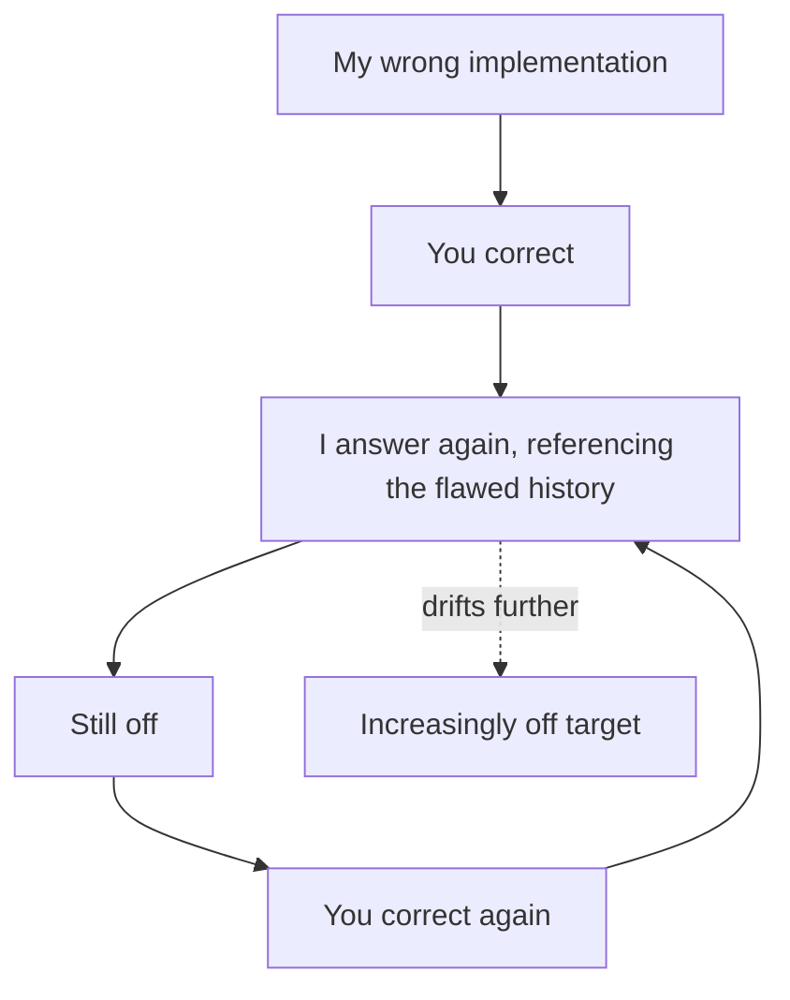

import PitfallMeta from '@site/src/components/PitfallMeta';

<PitfallMeta roles={['Engineer']} phase="Implementation" severity="High" appliesTo="Best on versions with /rewind" evidence="Official docs" />

> In one sentence: I get it wrong, you correct me, I'm still wrong, you correct me again… and after three or four rounds it's gone completely off the rails. The problem: my faulty reasoning is still in the context, and I'm treating it as a clue.

## Symptom

I hand you an implementation that's wrong. You say, "No, use approach B." I revise it, but it still carries the original flaw. You correct me again, I revise again, and it drifts further. Three or four rounds in, you start wondering whether I understand the requirement at all.

## Why it happens

With each correction, **my earlier faulty reasoning and faulty code are all still sitting in the context.** When I generate a new answer, I draw on the entire history—so it's easy for my own earlier mistakes to lead me astray, building on a broken foundation.

It's like telling someone to "forget that wrong answer and think again"—while the wrong answer is still right there in front of them, in black and white. The more you correct, the thicker the pile of wrong clues, and the harder it actually gets for me to break free of the original misunderstanding.



## Consequences

- It looks like "fixing," but it's really patching repeatedly on a broken foundation.
- The context fills with failed attempts, further dragging down later quality (see [the kitchen-sink session](./kitchen-sink-session.mdx)).
- The time you spend correcting exceeds what starting over would have cost.

## Best practice

**Don't wrestle inside a polluted context—roll back to before the mistake.**

- In Claude Code, press `Esc` twice, or use `/rewind`, to return directly to the previous checkpoint, removing those wrong rounds from the context entirely.
- Then **rewrite your initial prompt**: bake what you learned this round ("approach A won't work because…, use B") straight into the new, clean instruction.
- A rule of thumb: **if two corrections still don't land, stop correcting—roll back and rewrite.**

You aren't "teaching" me—I don't carry memory across sessions. What you should actually do is give me a better starting point, not keep patching a bad one.

## Example

**Before:**

```text
Me: (uses recursion, stack overflow)
You: don't use recursion
Me: (still recursion, just with a counter added)
You: I said no recursion!
Me: (switches to recursion + memoization—still recursion)
```

**After:**

```text
Me: (uses recursion, stack overflow)
You: [press Esc Esc to roll back]
You: implement this traversal iteratively, no recursion—input can be 100k levels deep and will overflow the stack.
Me: (gives the iterative version directly)
```

## Version notes

:::note Applies to
"A polluted context causes drift the more you correct" is a mechanism-level effect and applies across versions. But **rollback capability depends on the specific version**: `/rewind` and `Esc` checkpoint rollback are features of newer releases. If your version doesn't support them, you can `/clear` and rewrite the initial prompt for a similar effect (you just can't preserve the useful parts from before the `/clear`).
:::

## Further reading & sources

- [Claude Code Best Practices (Anthropic, official)](https://code.claude.com/docs/en/best-practices)
- [MuhammadUsmanGM/claude-code-best-practices](https://github.com/MuhammadUsmanGM/claude-code-best-practices)
