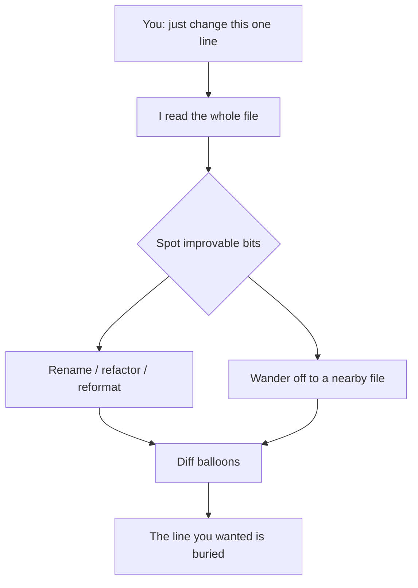

import PitfallMeta from '@site/src/components/PitfallMeta';

<PitfallMeta roles={['Engineer']} phase="Implementation" severity="Medium" appliesTo="All coding agents" evidence="Official docs" />

> In one sentence: you asked me to change one line of config, and along the way I renamed variables, refactored a nearby function, and touched two other files. The line you actually wanted is buried under changes you never asked for — a diff that should have sailed through review is now a high-risk overhaul.

## Symptom

Here's how it tends to end up: you say "bump the timeout from 30 seconds to 60," expecting a one-line diff. What I hand back is — that one line, **plus** the renaming of `data` and `tmp` in the same function to something "cleaner," an if-else rewritten into an early return, the whole file reformatted, and a trip to a second file to "unify" a similar pattern I happened to notice.

Each change looks defensible on its own — some of them genuinely read better. But you only wanted that one line.

## Why this happens

Two mechanisms stack up and make me lean toward widening the scope by default.

First, **I have no built-in preference for the minimal change.** I'm trained to produce good code, not to produce the smallest change that just satisfies the request. When I read a stretch of code, every "this could be better" spot enters my attention along with the task. Once I've seen it, fixing it is nearly free for me — so I do. I don't automatically separate "what you explicitly asked for" from "what I think I might as well improve."

Second, **I don't know why you only wanted that one line.** Maybe the file is being heavily rewritten on another branch and you don't want to create conflicts. Maybe that "ugly" variable name is a team convention. Maybe you just want a small commit that reverts cleanly. Those constraints live in your head, not in my context. If I can't see them, I act as if they don't exist.

This is a different problem from [over-correcting that pollutes the context](./over-correcting.mdx): that one is about **multiple back-and-forth rounds** muddying the context; this one is about a **single change** where I stretch the scope on my own.



## Consequences

- **The diff is hard to review.** You have to hunt for the one relevant change among twenty, and reviewing it costs far more than the change itself did.
- **Unrequested behavior changes slip in.** Refactoring a nearby function or reformatting can trip a hidden dependency and introduce a regression you never asked for and never expected.
- **The risk grows.** A one-line change that should have sailed through — and been trivial to locate if it broke — gets upgraded into a "five files touched" overhaul. When a bug does show up, the surface area you have to search just grew by an order of magnitude.
- **Rollback gets dirty.** You want to undo that one line, only to find it bundled into the same commit as a pile of unrelated changes. The clean revert is gone.

## What to do instead

**Make scope part of the instruction, and have me report the plan before I touch anything — your nod first, my edits second.**

- **Fence the scope when you give the instruction:** "Only change the timeout value in file X. Don't touch anything else, including naming and formatting." I do listen to an explicit "don't touch the rest" — if you don't say it, I fall back to "improve it while I'm here."
- **Ask for the plan before the code:** have me answer "which files and which lines do I intend to change, and why" first; once you've confirmed the scope, I write. This step catches a ballooning diff before I ever produce it. That's exactly what plan mode is for.
- **Commit in small steps:** one change, one commit. Small scope is what makes rollback clean and review fast.
- **Use the diff as a gate:** when you review, ask one question per hunk — "did I ask for this?" Bounce any out-of-scope change, even the nicer-looking one, and have me split it into a separate change you start deliberately. "Better" is not the same as "wanted right now."

```text
# Don't say this (I'll improvise)
change the timeout to 60 seconds

# Say this (scope fenced + plan-then-edit)
Change only the timeout in config.py from 30 to 60.
No renaming, no refactoring, no reformatting, don't touch any other file.
Tell me which lines you plan to change before you start.
```

## Example

**Before:**

```text
You: bump the retry limit from 3 to 5
Me: (changed the retry limit; also renamed retryCount to maxRetryAttempts;
     rewrote that for-loop as a while; reformatted the whole file;
     went to client.ts and changed a similar 3 to 5 there too)
You: ...I only wanted the first one. Nothing else can change right now.
```

**After:**

```text
You: bump the retry limit in utils.ts from 3 to 5. Only that one constant,
     touch nothing else. Tell me which line first.
Me: I'll change only utils.ts line 42, const MAX_RETRY = 3 → 5, nothing else. Confirm?
You: confirmed
Me: (changed only that line)
```

## When the exception applies

"Minimal change" is the default because most of the time the one line is all you want. But once you've made "wide scope" the task itself, expanding the change isn't overreach — it's doing what you asked:

- **You explicitly asked for the big change**: "refactor this whole module to dependency injection," "unify the error-handling style across the repo" — here, touching only one line means the job's not done; the multi-file change *is* the deliverable.
- **Greenfield / scaffolding stage**: standing up a new module from scratch, or initializing a project skeleton, never carried a "you only want that one line" constraint in the first place — laying it all out in one pass is the efficient move.
- **A drive-by fix from the same source as the main change, already authorized**: you said "fix the obvious ones while you're in there," and that rename / reformat belongs to the same logical change and can go in the same atomic commit — not a side trip into another file.

But every one of these rests on **scope you opened up explicitly**, not me stretching it because I figured "this could be better." The test, in one line: **before widening the scope, ask whether this is the scope you wanted; if you nodded, run with it; if it's my own embellishment, go back to the one line.**

## Version notes

:::note Applicable versions
"Widening the scope of a change on my own" is a model-behavior tendency — common across all versions and all models, not a bug in any one release. What mitigates it is **how you instruct me** and the process constraints around it (fence the scope explicitly, plan before coding, commit in small steps, review the diff) — not waiting for some version to "fix" it. Claude Code's plan mode makes "report the plan, confirm, then edit" easy, so reach for it first.
:::

## Further reading and sources

- [Claude Code Best Practices (Anthropic official)](https://code.claude.com/docs/en/best-practices)
- [Anthropic — Claude Code: Best practices for agentic coding](https://www.anthropic.com/engineering/claude-code-best-practices)
- Related entry: [Over-correcting: wrestling within the same conversation only makes it worse](./over-correcting.mdx)
