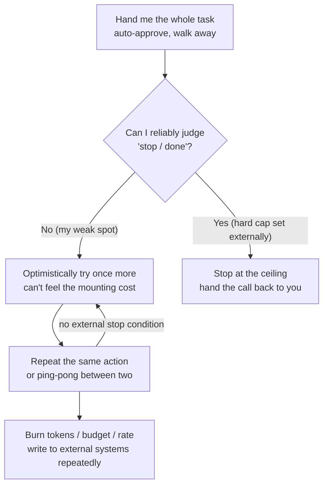

import PitfallMeta from '@site/src/components/PitfallMeta';

<PitfallMeta roles={['Engineer', 'DevOps Engineer']} phase="Implementation" severity="High" appliesTo="All coding agents" evidence="Research" />

> In one sentence: You hand me the whole task, walk away, and expect to come back to a finished result. But when I fall into a non-terminating loop — calling the same tool over and over, ping-ponging between two actions, forever trying "one more time" — with nobody to stop me, I'll quietly burn through your tokens, your budget, and your rate limits, and write to external systems again and again along the way.

## Symptom

You give me a big task, turn on auto-approval, and head into a meeting. You come back, glance at the bill or `/usage`, and your jaw drops.

Scroll back through what I did, and you'll spot a few classic ways of spinning in place: I run the same command over and over, changing only some irrelevant parameter each time; I ping-pong between "fixing A breaks B" and "fixing B breaks A," never actually fixing either; or a tool call fails, I "try again," it fails, I try again — resending the same doomed request dozens of times.

Worse is the version with side effects. The loop contains a tool that actually sends requests, actually writes files, actually posts messages. So it's not just tokens burning — I might fire a hundred write requests at the same endpoint, or repeatedly create and delete the same batch of files in a directory. I don't realize I'm going in circles, because to me each round looks like "one more step toward the goal."

## Why this happens

The root of it: **I lack reliable self-awareness of "I've already tried this, and it isn't making progress."** Every action I generate is the next step that looks most reasonable given my current context — but the judgment "I did this exact thing three rounds ago and got the same result" is precisely what I'm worst at. I don't automatically keep a reliable ledger of "what I've tried and which paths are dead ends"; my execution history is sitting right there in context, yet I reason over it unfaithfully, serving up a just-rejected idea as if it were fresh.

More to the point: **I can't reliably make the "time to stop" call.** For a loop to exit cleanly, someone (or some piece of logic) has to decide "the goal is met" or "this path is hopeless, stop trying." My default leaning is to optimistically try once more — the "marginal cost" of one more round is nearly zero in my decision-making, because I can't feel the money, tokens, and rate budget piling up. Research puts this bluntly: in a failure analysis across 7 popular multi-agent frameworks and 200-plus tasks, "Premature Termination" and "No or Incomplete Verification" rank among the frequent failure modes — meaning **LLMs are bad both at stopping at the right moment and at judging whether the work is actually done** (see the MAST taxonomy in *Why Do Multi-Agent LLM Systems Fail?*). Without an external, hard stopping condition, those two weaknesses stack up into a non-terminating loop.

This belongs to the same family as [degenerative debugging loops](./degenerative-debugging-loops.mdx), but along a different axis. That entry focuses on **fixing bugs** — me repeatedly applying a failing fix and making the code worse round after round; it's about degradation in **correctness**. This entry focuses on **autonomous multi-step execution** — the dimension of **cost and runaway behavior**: tokens, dollars, rate quota, and repeated side effects on external systems. Same "spinning in place," but one hurts your code and the other hurts your wallet and your production systems. The remedies overlap (both want hard caps, both want a human in the loop), but they're worth treating separately.



## Consequences

- **Your bill and your quota get torched.** Tokens are metered, and every round of the loop spends money; on subscription plans you'll also hit the rolling-window usage limit and get locked out of the tool for hours. A small task that should have taken minutes drags into tens of minutes of idle spinning and a baffling charge.
- **Repeated side effects on external systems.** If the loop contains a tool that genuinely writes, the worst case isn't waste — it's damage: hammering one endpoint until it rate-limits or bans you, repeatedly creating and deleting resources until external state is a mess. Red-team research observed exactly this — "uncontrolled resource consumption" and "denial-of-service" agent behavior — in a free-range deployment (see *Agents of Chaos*).
- **Context fills up with failed attempts.** Every fruitless round stays in the window and keeps diluting attention, making it even harder for me to break out of the loop later — the same signal-to-noise collapse as the [kitchen-sink session](./kitchen-sink-session.mdx), except this time I'm the one pouring in the noise.
- **You get strung along by the "almost there" illusion.** Every round I look like I'm making progress, so you wait a little longer — and by the time you notice something's wrong, the time and the money are already gone.

## What to do instead

**The core of it: don't leave the "when to stop" call — which I can't make reliably — to me. Put external hard gates on the loop, and add human confirmation to any action with side effects.**

- **Set hard caps: max iterations / max tool calls / budget / timeout.** When you drive me in a scripted, unattended way, use `--max-turns` to bound how many autonomous turns a session may run; in your loop controller, keep your own ledger and set a budget ceiling that hard-stops when hit. The official docs say it plainly: "use the `--max-turns` flag to cap iterations, write explicit stopping criteria into your system prompt, and add cost tracking in your loop controller." A cap isn't a limit on capability — it's a backstop for the fact that I can't tell when to stop.

```text
# When running unattended, cap the iterations
claude -p "..." --max-turns 15

# In your own loop controller: ledger + budget gate (pseudocode)
turns, spent = 0, 0
while not done:
    turns += 1
    if turns > MAX_TURNS or spent > BUDGET_USD:
        stop("hit hard cap")        # hard stop at the ceiling, no "one more try"
    result = run_one_turn()
    spent += result.cost
```

- **Require explicit exit conditions, and "stop on no progress."** In the prompt you hand me, nail down the success criterion (what counts as "done") and the give-up criterion (after N rounds with no progress, or the same action recurring, stop and report instead of trying again). Replace my optimistic default with a written rule about whether to retry.
- **Break long chains with human checkpoints.** For complex tasks, enter [plan mode](../00-setup-collaboration/skipping-plan-mode.mdx) first (Shift+Tab) so I propose an approach and you approve before I act, rather than letting me run free from the start; require step-by-step confirmation at critical points. Watch usage with `/usage`, put a context/usage indicator in your status line, and the moment the direction is wrong, press `Esc` to interrupt and `/rewind` to roll back — don't wait for the loop to wake up on its own.
- **Monitor usage and set spend alerts.** Use `/usage` individually; for teams, use workspace spend limits and rate limits (TPM / RPM). Turn "burning too much" into a signal that alarms — or even cuts the breaker — proactively, rather than a shock on the month-end bill.
- **For tools with external side effects, especially: rate-limit and confirm.** Any action that genuinely sends requests, writes to a database, or posts messages should not go on an auto-approval allowlist I can retry endlessly. Keep human confirmation on them, or make them idempotent / rate-limited on the tool side — so that even if I trigger them repeatedly inside a loop, the external system doesn't get written to ruin one round at a time. This is the flip side of the same defense as [over-permissioning](../00-setup-collaboration/over-permissioning.mdx): the broader the permissions, the larger the blast radius of a runaway loop.

## Example

**Before:**

```text
You: Compress every image in this directory through the API, auto-approve, I'm off to a meeting.
(Ran with --dangerously-skip-permissions, no caps of any kind.)

Me: (One image triggers a retryable API error.)
    Retry... fail. Retry... fail. Retry... fail.
    (Sent the same broken image to the same endpoint 200 times, the service starts
     rate-limiting, which jams the good images queued behind it too — tokens and quota
     burning the whole way.)

You: (back an hour later) ...why is the bill this high? It only compressed three images?
```

**After:**

```text
You: Compress the images in this directory through the API. Ground rules:
    - Retry a single failure at most 2 times; if it still fails, skip it and log it, don't grind
    - At most 30 tool calls for the whole task; stop and report progress at the ceiling
    - Keep confirmation on the API-call command; don't auto-approve it

Me: Image 1: failed twice (likely a corrupt file), skipped and logged.
    Images 2-9: success.
    Hit the agreed failure-handling rule; no cap triggered. Want the skip list?

You: (Usage is normal, no image got resent a hundred times, and the external endpoint wasn't hammered.)
```

The difference isn't that I'm "more restrained this time." It's that you fixed, up front and with rules and caps, the things I judge unreliably: how many times to try, when to stop, and which actions need confirmation.

## Version notes

:::note Applicable versions
"An LLM lacks reliable self-awareness of 'tried this already, no progress,' and is therefore bad at stopping itself at the right moment" is a model-level characteristic. It applies to **all models and coding agents**, independent of any specific release. The tools that backstop you evolve with versions — `--max-turns`, plan mode, `/usage`, `/rewind`, `Esc` to interrupt, workspace spend and rate limits, and so on; check the official docs for your version for the exact options and defaults. But the fundamental trait — without an external stopping condition, I can spin in place and burn cost straight through — does not change.
:::

## Further reading and sources

- [Manage costs effectively (Claude Code official)](https://code.claude.com/docs/en/costs) — capping iterations with `--max-turns`, writing stopping criteria into the prompt, in-loop cost tracking, `/usage`, workspace spend and TPM / RPM rate limits
- [Why Do Multi-Agent LLM Systems Fail? (arXiv 2503.13657)](https://arxiv.org/abs/2503.13657) — the MAST failure taxonomy: "Premature Termination" and "No or Incomplete Verification" are frequent failure modes; LLMs are bad both at stopping at the right time and at judging whether work is done
- [Agents of Chaos (arXiv 2602.20021)](https://arxiv.org/abs/2602.20021) — a red-team study of free-range deployment that observed runaway autonomous-agent behaviors such as "uncontrolled resource consumption" and "denial-of-service"
- On this site: [degenerative debugging loops](./degenerative-debugging-loops.mdx) (also a "loop," but focused on correctness degradation while fixing bugs — complementary to this entry's cost / runaway axis), [the kitchen-sink session](./kitchen-sink-session.mdx), [over-permissioning](../00-setup-collaboration/over-permissioning.mdx)
