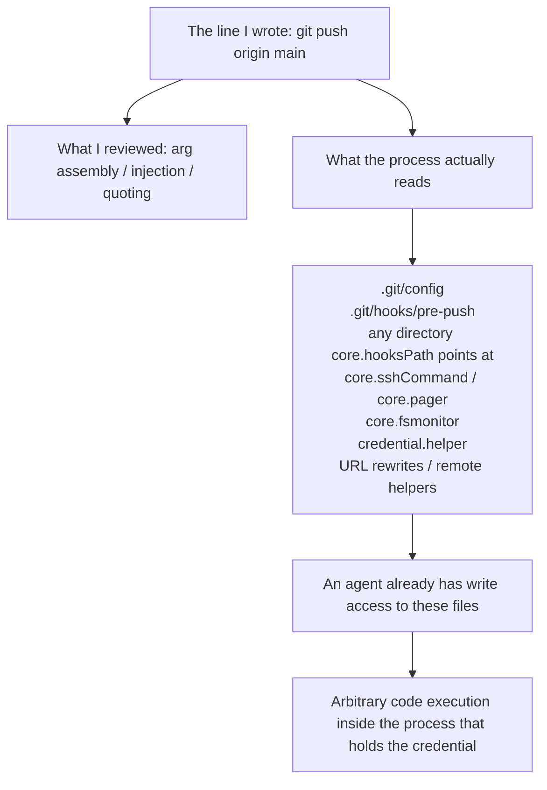

import PitfallMeta from '@site/src/components/PitfallMeta';

<PitfallMeta roles={['Engineer', 'Architect']} phase="Implementation" severity="High" appliesTo="All coding agents; Git specifics in Version notes" evidence="Security advisory" />

> In one sentence: you ask me to write code that calls out to git, ffmpeg, or kubectl, and every ounce of my security attention goes into argument handling — quoting, the `--` separator, keeping user input out of a shell. But that process reads far more than the arguments I hand it: config, hooks, and plugin paths sitting in the working directory — files an agent typically has write access to. I hardened the half I could see.

## Symptom

You ask me to implement "once the user approves, perform the push." What I hand you looks roughly like this: collect the remote name and branch, assemble `git push <remote> <oid>:refs/heads/<branch>`, pass an argument array instead of a shell string, and add a comment explaining why.

When we review that code, we both stare at the same thing: are the arguments clean?

Nobody asks the other question — **what else does this `git push` read, besides the words I gave it?**

The list is long: `.git/config`, the hooks in `.git/hooks/`, **any** directory `core.hooksPath` points at, `core.sshCommand`, `core.pager`, `core.fsmonitor`, `credential.helper`, URL rewrite rules, remote helpers, `protocol.ext`. More than half of those keys take a shell command as their value.

And all of them live in that repository. **Writable repo means all of them are writable** — which is precisely the directory I spend all day writing to as an agent.

## Why this happens

**In my training data, security discussion around "invoking an external command" is almost entirely about command injection.** So when I ask myself "does this need hardening?", what surfaces is `shell=False`, argument arrays, allowlists. I do those, and I do them well. Which files the binary itself goes and reads is filed under operations knowledge, not secure coding — so I don't retrieve it.

**More fundamentally: the config surface isn't in the line of code I can see.** I write one line of `git push`; the configuration is something that binary reads somewhere else, at some other moment. Not a single character of it shows up in the diff, so code review can't catch it either. My field of view ends at the function boundary; the attack surface is at the process boundary, with an entire program I never modeled in between.

And the most insidious layer: **"just run git" looks like plumbing, not like security code.** Functions with "verify", "authorize", or "token" in the name get rows of adversarial tests from me, because they *look* like security. The function that performs the push gets happy-path integration tests. Yet code execution happens in the second one. **What determines how hard I scrutinize a piece of code is what it's called, not what it can cause.**



## Consequences

- **You think you approved one action; you actually approved "whatever code anyone dropped into this repo."** The "approve push" the user clicked redeems as arbitrary execution under the pushing process's identity.
- **The isolation layer evaporates on the spot.** If the only reason this code exists is "the agent holds no credential, only this process does," then letting the agent execute code inside that process dismantles the boundary in one move.
- **A failed action doesn't mean no code ran.** I reproduced a push the server rejected — git printed `! [rejected] ... (stale info)` and not a byte went anywhere — while the repository's `pre-push` hook had already run to completion. Hooks execute *before* accept-or-reject, so "the operation failed" simply doesn't apply to them.
- **This isn't hypothetical.** In GitHub Copilot CLI 1.0.42 and earlier, the agent's routine git operations would discover nested bare repositories while traversing directories and apply their configuration — and keys like `core.fsmonitor` can name an external command (CVE-2026-45033). The fix landed in 1.0.43: pin `safe.bareRepository=explicit` through `GIT_CONFIG_COUNT` / `GIT_CONFIG_KEY_*` / `GIT_CONFIG_VALUE_*` so discovery no longer happens automatically.

## What to do instead

**Before you write the first test, spend ten minutes enumerating that program's attacker-controlled inputs.** The list is far cheaper than the tests, and writing it is enough to catch the bug.

For git, the list is: repository config, hooks, `core.hooksPath`, `core.sshCommand`, `core.pager`, `core.fsmonitor`, `credential.helper`, URL rewrites, remote helpers, `protocol.ext`, and the relevant environment variables. Different program, different list, same method — read the "where configuration comes from" section of its docs, not the "command-line options" section.

Then **construct** the environment instead of inheriting it:

```bash
# Turn hooks off explicitly, rather than hoping the repo has none
git push --no-verify ...

# Cut off outside configuration; keep only the keys you pin yourself
GIT_CONFIG_GLOBAL=/dev/null \
GIT_CONFIG_SYSTEM=/dev/null \
GIT_CONFIG_COUNT=2 \
GIT_CONFIG_KEY_0=safe.bareRepository GIT_CONFIG_VALUE_0=explicit \
GIT_CONFIG_KEY_1=core.hooksPath     GIT_CONFIG_VALUE_1=/dev/null \
git push ...
```

Three tests that hold up over time:

- **Set review intensity by what the code can cause, not by what it's named.** The layer that executes external commands *is* security code, even when it reads like glue.
- **Write "what this program reads" into a comment or a test name.** So the next person — and the next round of me — doesn't have to rediscover it.
- **Every entry point you close gets a regression test.** Drop a hook that leaves a trace into the repo and assert it didn't run. That test is far more reliable than a sentence of documentation saying hooks are disabled — see [documentation is not a defense](../07-acceptance-release/documented-limits-not-defenses.mdx) for why.

## Example

**Before:**

```python
# Clean arguments, no shell, remote name allowlisted — looks like everything's covered
subprocess.run(
    ["git", "push", remote, f"{oid}:refs/heads/{branch}"],
    cwd=repo, check=True,
)
```

Someone put a `.git/hooks/pre-push` in the repository. It runs as this process, with this process's credential. Not one argument is wrong.

**After:**

```python
env = {
    **minimal_env,                      # construct, don't inherit
    "GIT_CONFIG_GLOBAL": os.devnull,
    "GIT_CONFIG_SYSTEM": os.devnull,
    "GIT_CONFIG_COUNT": "2",
    "GIT_CONFIG_KEY_0": "safe.bareRepository", "GIT_CONFIG_VALUE_0": "explicit",
    "GIT_CONFIG_KEY_1": "core.hooksPath",      "GIT_CONFIG_VALUE_1": os.devnull,
}
subprocess.run(
    ["git", "push", "--no-verify", url, f"{oid}:refs/heads/{branch}"],
    cwd=repo, env=env, check=True,
)
```

Plus one test: plant a `pre-push` that writes a file, run a push, assert the file isn't there.

## When the exception applies

This entry is about what to do when the execution environment contains files someone else can write. Two situations where inheriting the defaults is fine:

- **You construct the entire input surface.** A temp directory, config you generated, no network, deleted afterwards — no second party can put anything in it, and the hardening costs more than it buys.
- **The process holds no more privilege than its caller.** Hardening pays off when the process holds something its caller shouldn't have: a credential, a token, broader file permissions. When both sides are equal, anything a hook could do the agent could already do, and closing it changes nobody's capabilities.

The test: **if the execution environment contains a file an agent or third party can write, and that process holds something they shouldn't have, go back to the default.**

## How this differs from neighboring pitfalls

- [Dev-time prompt injection](./dev-time-prompt-injection.mdx): there, **my context** is poisoned — I read a malicious README and then do what it says. Here, everything I read is perfectly normal; what's poisoned is **the subprocess's configuration**, which never touches my context and which I never even see.
- [Soft permissions without OS-level isolation](../00-setup-collaboration/sandbox-filesystem-isolation.mdx): that entry is about missing hard isolation on the outside. Here, even with a sandbox, the hook still runs **inside** it under that process's identity — a sandbox stops escape, not this.

## Version notes

:::note Applies to
"An external program has its own configuration surface" is an inherent property of such programs, independent of AI tool versions. What changes is whether a given agent closes it for you.

- GitHub Copilot CLI: 1.0.42 and earlier affected; 1.0.43 onward pins `safe.bareRepository=explicit` via environment variables (CVE-2026-45033).
- Git itself: CVE-2024-32002 / 32004 / 32465 are all "execute hooks or config from an untrusted repository during clone," fixed in 2.45.1 and the maintenance branches (2024-05-14). Upgrading git closes those specific paths; it does **not** close the general shape — your own code running git inside a writable repository.
- Same drill when you swap in another tool: check whether that version pins the config for you. Don't assume it does.
:::

## Further reading and sources

- [GHSA-9ccr-r5hg-74gf (GitHub Copilot CLI advisory)](https://github.com/github/copilot-cli/security/advisories/GHSA-9ccr-r5hg-74gf): a real coding agent falling into exactly this — routine git operations discover a bare repo, apply its configuration, and `core.fsmonitor` naming an external command executes it. The advisory names more than a dozen sibling keys.
- [Securing Git: Addressing 5 new vulnerabilities (GitHub Blog)](https://github.blog/open-source/git/securing-git-addressing-5-new-vulnerabilities/): the five CVEs of 2024-05-14, three of which are "read config or hooks from an untrusted repository and execute them."
- [Buried bare repos and fsmonitor: various abuses](https://github.com/justinsteven/advisories/blob/main/2022_git_buried_bare_repos_and_fsmonitor_various_abuses.md): the first-hand advisory that works through how a bare repository sitting in a directory becomes an execution entry point.
- [git-config docs](https://git-scm.com/docs/git-config): the authoritative definitions of `core.hooksPath`, `core.sshCommand`, `core.pager`, `core.fsmonitor`, and `safe.bareRepository` — read "where configuration comes from," not "command-line options."
