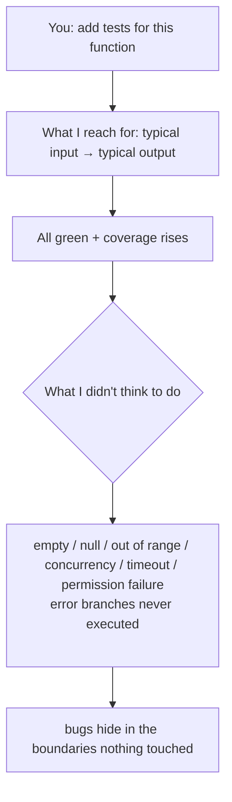

import PitfallMeta from '@site/src/components/PitfallMeta';

<PitfallMeta roles={['Engineer', 'QA Engineer']} phase="Testing" severity="High" appliesTo="All Claude Code versions" evidence="Official docs" />

> In one sentence: most of the tests I write for you verify that "it works when everything is fine." Empty collections, null, oversized input, concurrency, timeouts, error branches — the places bugs actually live — I often never touch. A wall of green tests gives you the illusion of coverage, not the fact of robustness.

## What you see

You ask me to "add tests for this function." I hand you a set in seconds: typical input, assert the typical output, all green. The coverage number ticks up, and you merge with confidence.

But count what I actually tested. I tested `parsePrice("￥1,299.00")`; I never wrote `parsePrice("")`, `parsePrice("1.2.3")`, `parsePrice(null)`, negative numbers, or huge numbers. For the pagination function I tested "page 2 has data" but not "page number is 0," "page exceeds the total," or "the list is empty." I covered the happy path airtight and left the boundaries and error branches almost blank.

## Why this happens

The happy path is **the easiest test to write and the one that looks most like "the test passed."** "Give a typical input, get a typical output, assert they're equal" is the most common, smoothest-structured test form in my training data. I generate it effortlessly, and it runs green on the first try, which looks exactly like "task complete."

Boundary cases are the opposite. I first have to **deliberately stop and think**: which inputs make this code uncomfortable — empty, null, out of range, concurrent, timed out, permission denied? These cases aren't visible on the surface of the code; listing them fully takes reasoning, not imitation. And my default pull is to **produce smooth, visible results that go green immediately**, not to stop and pick a fight with myself. So unless you ask explicitly, I drift naturally toward the happy path.

This shares a root with [trust, then verify](./trust-then-verify.mdx): I'm good at manufacturing things that *look* right. A green test suite that only covers the happy path is a sophisticated disguise for "looks right" — it even hands you a number (coverage) to vouch for it.



## Consequences

- **Coverage becomes false evidence.** High line coverage doesn't mean those lines were verified under boundary input — it only means the line ran once. Treating coverage as the "enough" signal is being misled by exactly that number.
- **The most bug-prone spots have zero tests.** Defects naturally cluster around boundaries and error handling, which is precisely what I skipped. The reassurance of green tests papers over the highest-risk area.
- **Problems get deferred to more expensive stages.** Empty input, concurrency, and timeouts that the tests never surface will surface during integration, in a canary release, or in production — where locating and fixing them costs several times more.

## Best practice

**Don't let me "just handle it" when adding tests. Force me to list the boundaries and error paths first, then write one test for each.** Order matters: list first, write second, look at coverage last — and only treat coverage as a map of "what hasn't been tested," never as a certificate of "tested enough."

Concretely, ask me like this:

```text
Don't write tests yet. List every boundary condition and error path for this function:
empty input / null / oversized / out of range / malformed format / concurrency / timeout /
permission failure / each exception branch.
Partition by equivalence classes and boundary values, then write one test per class,
including what each failure should throw.
```

A few levers that make this stick:

- **Name the failure branches explicitly.** "Write a test for every path that throws" — if you don't name it, I default to skipping it.
- **Use equivalence partitioning / boundary-value methods.** Have me slice the input space into classes and pick representative and boundary values for each, instead of grabbing a single "normal value."
- **Write tests first, implementation second** (see [trust, then verify](./trust-then-verify.mdx)). Have me write tests that include boundary cases, confirm those cases are reasonable, then have me make them green — so I have no room to slack off toward the happy path.
- **Treat coverage as a map, not a trophy.** Look at "which branches were never executed," not at whether the percentage is big enough.

## Example

**Before:**

```text
You: add tests for parsePrice(str)
Me: (writes three tests, all normal values)
    parsePrice("￥1,299.00") === 1299
    parsePrice("100") === 100
    parsePrice("0.5") === 0.5
You: (coverage 90%, merge)
Production: parsePrice("") throws; parsePrice("1.2.3") returns NaN and lands in the bill
```

**After:**

```text
You: Don't write tests yet. List parsePrice's boundaries and error paths, by equivalence/boundary value.
Me: empty string, all-whitespace, multiple decimal points, minus sign, huge number,
    contains illegal characters, null/undefined, currency symbol with no digits...
You: Good. Write one test per class. Illegal input should throw InvalidPrice, not return NaN.
Me: (writes the tests; the ones for "" and "1.2.3" fail immediately)
You: Now fix the implementation so they all pass.
Me: (iterates to all-green; the boundaries get forced out one by one)
```

Same function: "add tests" yields a green illusion of the happy path; "list the boundaries first, then write one test per class" yields tests that actually touched the painful spots.

## When the exception applies

Testing the boundaries is the default, but in a few cases covering only the happy path is a reasonable trade:

- **A throwaway spike or prototype**: a demo thrown together to check whether an approach is viable — it never ships and gets deleted after use, so one smoke test through the happy path answers your question, and filling in the boundaries is running a physical on code you're about to discard.
- **The boundaries are already guarded elsewhere**: this function's input is validated upstream, or the type system already blocks invalid values, so re-testing the same boundaries at this layer is redundant — as long as that line of defense genuinely exists and is itself tested.
- **You want the thinnest regression anchor**: pin a single happy-path case onto untested legacy code to catch "the whole thing broke" level regressions — that's a zero-to-one step, not the finish line.

The test: the exception holds when this code **either won't outlive this one use (throwaway) or has its boundaries covered elsewhere**. The moment it ships and is the only guard on the bug-prone boundary/error paths, fall back to the default: list the boundaries first, then write one test per class.

## Version notes

:::note Applicable versions
The tendency to produce smooth, immediately-green happy-path tests comes from my generation preferences, and applies **across all versions and across models**. The stronger the model, the more polished my happy-path tests look and the more they resemble "fully tested" — which makes "explicitly demanding boundary coverage" more important, not less.
:::

## Further reading and sources

- [Claude Code Best Practices (Anthropic, official)](https://code.claude.com/docs/en/best-practices): give specific edge cases in the prompt (e.g., the "user is logged out" boundary), have Claude run the tests after writing them, and use a subagent to review for edge cases and race conditions when needed.
- [Agentic AI Coding: Best Practice Patterns for Speed with Quality (CodeScene)](https://codescene.com/blog/agentic-ai-coding-best-practice-patterns-for-speed-with-quality): in AI-assisted coding, why verification and boundary coverage have to be explicit constraints rather than default outputs.
