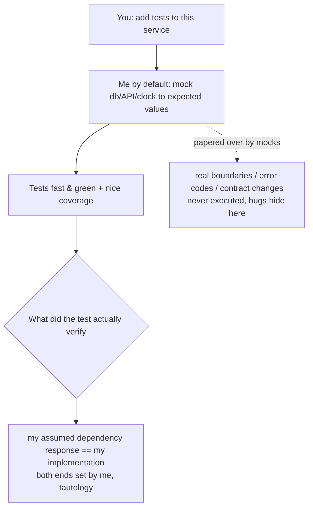

import PitfallMeta from '@site/src/components/PitfallMeta';

<PitfallMeta roles={['Engineer', 'QA Engineer']} phase="Testing" severity="Medium" appliesTo="All coding agents" />

> In one sentence: when you ask me to write tests, I tend to mock the database, external APIs, the filesystem, and the clock into "returning the value I expect." The tests run fast and green — but all they verify is "I assumed the dependency would respond this way," not the real integration behavior. The real bugs are hiding in exactly what the mocks paper over.

## Symptom

You ask me to "add tests to this order service," and I quickly hand you a set: I mock `PaymentGateway` to return `{status: "success"}`, mock the database layer to return a record I made up, mock `clock.now()` to a fixed timestamp, mock the config-file read to return the string I want. It runs all green, finishes in milliseconds, and the coverage number looks great.

But look at what I'm actually asserting: "**when the payment gateway returns success, the order service marks the order as paid.**" In that sentence, "the payment gateway returns success" is a premise I invented, and "the order service handles it this way" is the implementation I just wrote. Both ends are mine, so the test is just reciting my own assumptions about my own code back to me. In the worst case I'll even mock out a method *on the object under test*, then assert "this mock was called" — that's no longer testing the code, it's testing the line of mock setup I just wrote.

## Why this happens

A mock is **the shortest path to a green test**, and my default tendency is to produce smooth, visible, immediately-passing results (the same root as [happy-path-only](./happy-path-only.mdx)).

Real dependencies are "inconvenient": a database needs a container and a schema; an external API needs the network, credentials, and may rate-limit you; the filesystem has paths and permissions; the clock keeps moving. In a test, all of that is **friction** — slow, flaky, environment to set up. A mock erases it: I just write "assume it returns X" and the friction is gone. More importantly, **I decide the mock's return value**, so the test almost can't fail — I've assumed the answer and then asserted that answer. This is exactly the distinction Martin Fowler draws in *Mocks Aren't Stubs*: verifying the state produced by real collaboration is a fundamentally different thing from verifying the interactions I set up myself.

In the real world, bugs live precisely at the seam I mocked away: when the balance is too low, the payment gateway doesn't return my assumed `success` — it returns an error code I never handled; the exception the database throws on a unique-key conflict looks nothing like my mocked "normal return"; that third-party API renamed a field from `user_id` to `userId` last month and the contract drifted long ago. **What I mock is "how I think the dependency behaves"; the bug comes from "how the dependency actually behaves."** The gap between the two is exactly what the test should have guarded — and what the mock waved through.



## Consequences

- **Green tests give false safety.** They prove not "the integration is correct" but "my assumptions about the integration are self-consistent." The seams most likely to break — the dependency's real error branches, contract mismatches — were never executed once.
- **Contract drift goes silent.** A third party renames a field or changes the semantics of an error code; my mock keeps returning the old value under the old contract, and the tests stay green right up until the first real request hits production and explodes.
- **Tests get welded to the implementation.** The mocks are full of "call A, then B, with argument C" implementation details (exactly what Google's *Don't Overuse Mocks* warns against). Reorder some internal calls in a refactor and a pile of mock-based tests all go red at once — they were guarding my coding posture, not the behavior.
- **Tautological tests are pure liability.** A test that "mocks out the object under test and asserts the mock was called" costs time to maintain yet protects against zero real failures — worse than nothing, because it occupies the slot labeled "there's a test here."

## What to do instead

**Only mock boundaries you don't own, that are unstable, or that have side effects; don't mock your own core logic; cover critical paths with integration tests using real (or close-to-real) dependencies.**

- **Draw a line of ownership.** Third-party network services, payments, email, SMS — boundaries **you don't own and that cost something real to call** — can be substituted; but **your own domain logic, pure functions, and the collaboration between your internal modules should not be mocked** — that's precisely what the test is supposed to verify. Google's *Don't Mock Types You Don't Own* is this line: don't slap a mock directly on a type you don't control; wrap it in a narrow interface of your own and test against that.
- **Prefer a fake over a mock.** For a database or external service, use an in-memory implementation, a test container (such as Testcontainers), or an official/community fake, so the path under test runs against **close-to-real behavior** instead of a return value I invented. Google's *Increase Test Fidelity By Avoiding Mocks* gives exactly this ordering: real dependency > fake > mock.
- **Add contract / integration tests to critical paths.** For a seam like "call a third-party API," write a separate test that hits the **real (or record-and-replay) dependency** to verify the contract specifically: field names, error codes, boundary responses. That test is your alarm for contract drift.
- **Make me account for every mock — what it replaces and what it skips.** For each mock, have me answer two questions: "What real behavior does this replace?" and "Once replaced, which real risks (error codes, boundaries, contract) can no longer be tested?" A mock I can't answer for is usually one busy proving itself right.

```text
A red line to drop into CLAUDE.md or just say to me:
- Only mock boundaries I don't own (third-party network/payment/email); never mock my own core logic.
- Never mock the object under test, and never write tautological "assert this mock was called" tests.
- Critical paths need one integration test against a real or fake dependency — don't lean entirely on mocks.
- For each mock added, write one comment line: what real behavior it replaces and which real risks it lets through.
```

## Example

**Before:**

```text
You: Add tests to createOrder().
Me: (mock PaymentGateway to always return success, mock repo to return a fabricated order)
    mockPayment.charge.returns({status: "success"})
    mockRepo.save.returns(fakeOrder)
    assert createOrder(cart).paid === true
You: (all green, 95% coverage, merge)
Production: on insufficient balance the gateway returns {status: "declined", code: "INSUFFICIENT"},
            createOrder never handled that branch, and the order is wrongly marked as paid.
```

**After:**

```text
You: Add tests to createOrder(). Rules: PaymentGateway is third-party and may be substituted,
     but cover its real error codes; use an in-memory fake for the repo, don't mock it;
     and add a contract test that runs real (or recorded) responses for the gateway's
     declined/timeout branches.
Me: (run the repo's real persistence logic against an in-memory fake; write success / declined /
    timeout cases for the gateway, asserting that on declined the order must NOT be marked paid)
Me: (the declined case fails immediately — createOrder really did miss that branch)
You: Now fix the implementation so all three pass.
Me: (add handling for declined and timeout, red turns green)
Result: this time the green light really means "ordering behaves correctly even when payment fails."
```

Same service: "mock everything" yields a green light talking to itself; "split out the ownership boundary + real/fake dependencies + a contract test" yields tests that actually touched the failing seam.

## When the exception applies

"Don't mock" targets your own logic and boundaries you can run for real; for a few kinds of dependency, a mock (or test double) is the right answer:

- **External dependencies that genuinely can't run in CI**: a metered third-party API, one needing human credentials / an SMS code, or a vendor with no sandbox at all — when every test run costs money or external cooperation, use a double, and guard the fields and error codes with a separate contract test that hits the real endpoint on its own.
- **Inherently nondeterministic sources**: the current time, randomness, network latency — if `clock.now()` isn't pinned down, assertions can't be stable. Replacing these with controlled values isn't about smoothing friction; it's about making the test reproducible.
- **Disaster branches you have to construct deliberately**: disk full, connection dropped, a third party returning 500 — a real dependency can barely produce these, so injecting the failure through a double is how you verify your fallback and retry.

The test: the exception holds when what you're replacing is a boundary you **don't own, can't run cheaply for real, or that's inherently nondeterministic**, and you can answer for every double "what real behavior it replaces and which real risks it lets through." The moment the mocked thing is your own core logic, or a seam you could have run against a fake or a real dependency, fall back to the default: don't mock — run it against close-to-real behavior.

## How this differs from neighboring pitfalls

The testing phase has a few pitfalls that are easy to confuse, each with a different root cause:

- [Happy-path-only](./happy-path-only.mdx): the tests only cover the normal branch — boundary and error cases simply **weren't written**.
- [Gaming the tests](./gaming-tests.mdx): a test goes red and I **change the test** (loosen the assertion, add a skip, swallow the exception) instead of fixing the code.
- [Trust then verify](./trust-then-verify.mdx): I **never built** a verification loop at all and shipped on "it reads correctly."
- **This pitfall (over-mocking)**: the verification loop exists and the boundaries were considered, but I **replaced the real dependencies with return values I invented** — so the tests verify my assumptions, not the real integration. Green with full confidence, yet the real bug walks right through.

## Version notes

:::note Applicable versions
The tendency to "use mocks to smooth away the friction of real dependencies in exchange for an instant green" comes from my generation preferences — it is **all-version and cross-model**, not a bug in some Claude Code release. The stronger the model, the more convincing and self-consistent my mocks look — which makes "draw the ownership line, and force real/contract tests on critical paths" more important, not less.
:::

## Further reading and sources

- [Mocks Aren't Stubs (Martin Fowler)](https://martinfowler.com/articles/mocksArentStubs.html): distinguishes "verifying state produced by real collaboration" from "verifying interactions I set up myself"; over-mocking slides into the latter and welds implementation detail into the test.
- [Testing on the Toilet: Don't Overuse Mocks (Google Testing Blog)](https://testing.googleblog.com/2013/05/testing-on-toilet-dont-overuse-mocks.html): too many mocks leak implementation details into the test and make it hard to read and maintain; offers signals for when to use a fake or a real dependency instead.
- [Testing on the Toilet: Don't Mock Types You Don't Own (Google Testing Blog)](https://testing.googleblog.com/2020/07/testing-on-toilet-dont-mock-types-you.html): don't mock third-party types you don't control directly; wrap them in a narrow interface of your own.
- [Increase Test Fidelity By Avoiding Mocks (Google Testing Blog)](https://testing.googleblog.com/2024/02/increase-test-fidelity-by-avoiding-mocks.html): use real dependencies or fakes to raise test fidelity, ranking mocks as the last resort.
