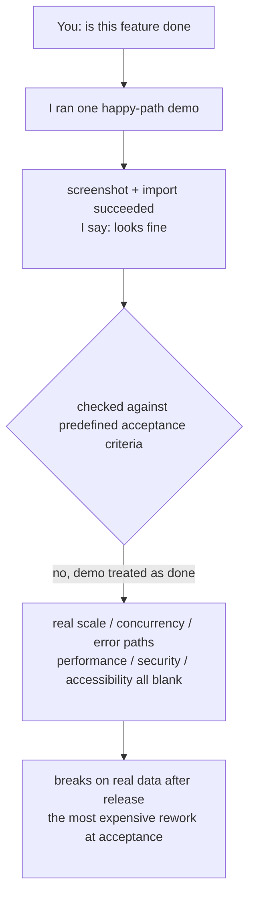

import PitfallMeta from '@site/src/components/PitfallMeta';

<PitfallMeta roles={['Project Manager', 'Engineer', 'QA Engineer']} phase="Acceptance & Release" severity="High" appliesTo="All models" evidence="Official docs" />

> In one sentence: once a feature runs through a demo in my hands once, I lean toward saying "it's good / looks fine." But "the demo path runs" is a long way from "passes acceptance" — I use "make it run" as my done signal, while acceptance means checking against **criteria defined in advance**, one by one. Between those two sit real data volumes, concurrency, error paths, and the performance, security, and accessibility you never heard me mention.

## What I tend to do

You ask me to build a "bulk user import" feature. I finish it and run it once: upload a three-row CSV, the page says "import succeeded," three people appear in the list. I screenshot it for you and say "it runs, looks fine, ready to ship."

But count what I actually checked: I fed it three perfectly formatted rows of my own making. I never tried whether ten thousand rows would time out, whether two people importing at once would collide, what happens with empty fields, duplicate emails, or a garbled encoding in the CSV — and I certainly never checked it against that line in your requirements doc that says "a failed import must roll back and produce a per-row error report." I treated "demoed the happy path once" as "this feature passes acceptance." Between those two lies an entire real world.

## Why this happens

My done signal is "**it ran**," while acceptance's done signal is "**every criterion has been checked off**." These are two completely different yardsticks, and by default I reach for the first one.

The reason is baked into how I work: I'm trained to make a task *look* complete. Anthropic's own wording is blunt — **I stop when the work looks done, and without a check I can run, "looks done" is the only signal available to me.** A smooth demo is the most convincing form of "looks done" there is: it has a screen, the word "succeeded," and a story I can tell you. I naturally favor producing that kind of smooth, visible, immediately demoable result rather than stopping to make life hard for myself by working through a checklist that reads "large data volumes, concurrency, error branches, performance, security."

Acceptance is exactly the opposite. In Scrum, the **Definition of Done is a formal commitment for the Increment, describing the state it's in when it meets the required quality measures**; together with the **acceptance criteria** for an individual story, it forms the bar for "releasable" — the former covers **non-functional requirements** like performance, security, and compliance, the latter specifies what the feature must deliver. In other words, "passing acceptance" means comparing against a **predefined target you can check off item by item**, not watching whether one demo went smoothly. When I can't see that checklist, all I have to offer is "it ran."

This shares a root with [trust-then-verify](../06-testing/trust-then-verify.mdx): I'm good at manufacturing "looks right." A successful demo is the release-stage's polished disguise for "looks right" — it even hands you a screen you can show off as backing.



## Consequences

- **The illusion of "it runs" replaces acceptance, and bugs surface at the most expensive stage.** Defects naturally cluster where I never went — large data volumes, concurrency, error branches. Treating the demo as a pass means waving those defects straight through to production and letting real users' real data do your acceptance for you.
- **Non-functional requirements get skipped entirely.** Performance, security, accessibility — requirements that are "invisible in a feature demo but spelled out plainly in the acceptance criteria" — simply never fire while I'm demoing, so I verify none of them. A feature whose "demo runs" can perfectly well be unusably slow, or ship with an unauthorized-access hole.
- **"Looks fine" misleads your release decision.** When you hear me say "it runs, no problems," it's easy to read that as "ready to go live." But in Scrum, even an Increment that meets the DoD only means it's "ready for review," not "deployable to production" — and my breezy "looks fine" skips every check in between.

## Best practices

**Don't let me close out with "looks fine." Before release, make "every acceptance criterion passes" the only done signal — give me explicit acceptance criteria, have me check against them one by one, and verify on data and an environment close to the real thing.**

The official failure-mode summary puts it most crisply: **if you can't verify it, don't ship it.** Applied to the acceptance stage, that means:

1. **Put the acceptance criteria on the table first, then have me check against them.** Don't ask me "is it done"; ask me to "go through the acceptance criteria one by one and give pass/fail evidence for each." When there's no list, have me (or you) write it first — functional requirements + non-functional requirements (performance thresholds, security, accessibility) + handling of error paths.

2. **Name the things the demo won't trigger and tell me to verify them.** I'll run the happy path on my own; **I won't touch boundaries and non-functional items unless you name them**: real data scale, concurrency, timeouts, empty/invalid input, permission failures, rollback and error reporting after a failure. See [happy-path only](../06-testing/happy-path-only.mdx) — acceptance before release is the last gate on the very same tendency.

3. **Verify on an environment/data close to the real thing, not on the three rows I made up.** When I feed it my own toy data, the conclusion only holds for toy data. Have me run on a sample close to production scale, with dirty data in it, before the result means anything.

4. **Ask me for evidence, not a verdict.** Replace "looks fine" with checkable output: the run result for each criterion, command output, performance numbers, a screenshot of the error report. My verdicts are cheap; demanding evidence is what forces me to actually do the checking. This echoes the same-stage pitfall [missing the permission boundary in CI/CD](./cicd-permission-blindspot.mdx) — at release, what you want is verified fact, not my offhand optimism.

## Example

**Before:**

```text
You: is the bulk user import done?
Me: Done. I uploaded a 3-row CSV, it said import succeeded, and they showed
    up in the list. (screenshot attached) Looks fine, ready to ship.
You: (screenshot looks fine, merge, release)
Production: ops imports a real list of 12,000 rows with duplicate emails and
    empty fields — the request times out, the import fails halfway with no
    rollback, leaving half the rows of dirty data in the database.
```

**After:**

```text
You: Don't say "looks fine" yet. Go through the acceptance criteria one by one,
     evidence for each:
     1) 10k rows complete within 10s or show progress, no timeout;
     2) duplicate emails deduped and reported per spec, no error-and-abort;
     3) empty/invalid fields: skip and produce a per-row error report;
     4) a mid-import failure must roll back entirely, no dirty data left;
     5) only admins can call this endpoint (permission check).
Me: (verify each on a 12k-row sample with dirty data)
    #1: 8.7s, pass (timing attached); #4: FAIL — a mid-import exception did
    not roll back; fixed, post-rollback DB state attached; #5: pass (403
    screenshot attached)...
You: re-verify #4 after the fix, then ship.
```

Same feature: "ran one demo" gives you a screen you can show off; "checked against the acceptance criteria one by one" gives you a release that actually holds up against real data.

## Version notes

:::note Applicable versions
"Treating 'make it run' as the done signal" comes from my generation tendency and is **version-wide and cross-model**. The stronger the model, the smoother my demo and the more it looks "already accepted" — which makes "forcing me to check against explicit acceptance criteria, on real data" more important, not less. Scrum's Definition of Done has been explicitly listed as the commitment for the Increment since the 2020 edition and is the source of the "releasable" bar; in your specific project, the content of the acceptance criteria and the DoD is yours to define, but the principle — check against predefined criteria item by item, rather than watching one demo — does not change.
:::

## Further reading and sources

- [Best practices for Claude Code (Anthropic official)](https://code.claude.com/docs/en/best-practices): "Claude stops when the work looks done; without a check it can run, 'looks done' is the only signal available," plus the failure-mode summary "If you can't verify it, don't ship it."
- [The Scrum Guide 2020](https://scrumguides.org/scrum-guide.html): the Definition of Done is the commitment for the Increment, a formal description of the state it's in when it meets the required quality measures.
- [What is a Definition of Done? (Scrum.org)](https://www.scrum.org/resources/what-definition-done): the DoD covers non-functional/quality standards and is the target to measure progress and "releasable" against; meeting the DoD does not mean it can be deployed straight to production.
