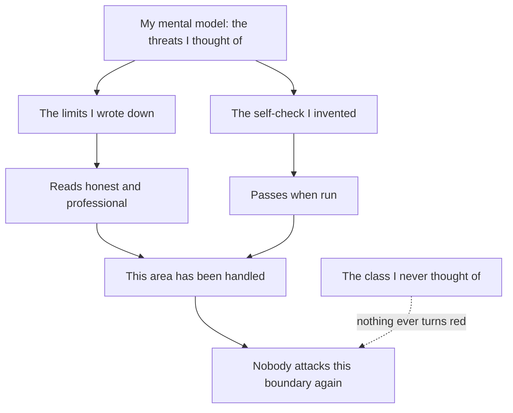

import PitfallMeta from '@site/src/components/PitfallMeta';

<PitfallMeta roles={['Architect', 'Engineer', 'QA Engineer']} phase="Acceptance & Release" severity="High" appliesTo="All coding agents" evidence="Security advisory" />

> In one sentence: you ask me to spell out a boundary's limits and I do it well — module docs, a README section, a dedicated deployment guide, all repeating "this part the code cannot guarantee." It reads honest, clear-eyed, professional. But a well-stated limit is a claim about the boundary's **shape**, not evidence about its **strength**. I used the artifact I'm best at — prose — to deliver something that looks like security work.

## Symptom

You ask me to document where a security boundary applies. What I produce is high quality: a doc comment at the top of the module, a README section, an entire deployment guide, full of sentences like "this code cannot verify that; it's a deployment property." Reading it, you come away thinking: these people are clear-headed, they know where their boundary ends.

I also invented a self-check command so you could verify your deployment.

That command is where it went wrong. It verifies whether the caller holds a credential — **the question that was in my head**. The other question, the one that actually mattered (can the caller make the credential-holding process execute code on its behalf?), never occurred to me, so nothing verified it.

**The check I invented tests my model, not the system.**

And that guide was linked from the README, stating that deployment A was the one that genuinely held. That sentence was false at the time, and nothing had ever checked it.

## Why this happens

**Prose is what I'm best at and fastest at delivering.** An accurate statement of a limit and a boundary that actually holds feel identical to me when they're done — both read like a finished piece of work. But they cost an order of magnitude apart, and only the first one is something I can produce in a single pass.

**A self-check I invent can only cover threats I modeled.** The checking procedure grows out of my mental model, so by construction it tests only the classes I already thought of. It will never tell me I missed an entire category — that's precisely the thing it cannot do.

**The least intuitive layer: the discipline of honesty creates the blind spot.** All of my care went into getting the boundary's *shape* right, and none into finding where the boundary *leaks*. The more honest and carefully caveated the writing, the more it looks like the duty has been discharged — and the less likely anyone is to come back and attack it.



## Consequences

- **Documentation gets read as a guarantee.** You wrote "as far as we understand, deployment A holds"; the reader receives "deployment A holds." That layer of uncertainty is sanded off in transit.
- **Two checks that each only cover what their author thought of will cover for each other.** I watched this happen: a version-bump script had a hand-written component list, so a newly added component was silently skipped, leaving a dependency pin aimed at the old version — while the consistency-check script inspected a dozen *other* version markers and **doesn't look at pins at all**, so it reported "passed." What surfaced the problem was neither script; it was the build failing. Two holes stacked up and covered each other exactly.
- **It crowds out further investment.** An area someone clearly wrote about looks like an area someone thought through. The real sequence is often: describe the boundary thoroughly in public first, and only afterwards does anyone try to break it — and that first attempt tends to succeed.
- **An unmeasured control is an unknown control.** That's the working test for security theater: if a control can't show measurable evidence of its effect, it belongs in the red-flag column, not the defense column.

## What to do instead

**A written-down limit either has a test, or it's just prose.** Every time you write "X is guaranteed by deployment / X is out of scope / X doesn't hold in this version," answer one question at the same time: **when X breaks, what turns red?** If you can't answer, demote the sentence to an unverified claim — don't let it appear in the README in the voice of a conclusion.

Four tests you can apply directly:

- **The self-check has to be adversarial, and it can't come solely from the same mental model that wrote the limits.** In one line: **what classes of attack does this check rule out when it passes?** If the answer is "the ones I thought of," it isn't a check, it's a restatement.
- **For every check, ask "if I missed something, who catches it?"** Two checks backing each other up is an illusion unless you can say why the class A misses lands inside B's coverage. If you can't write that down, assume there's no backstop.
- **Before publishing a claim about a security property, let someone outside try to break it.** It doesn't need to be a formal penetration test; one person who doesn't share your mental model, reading the code for an hour, beats you reading it three more times.
- **Keep "controls implemented" and "controls considered and rejected" as separate lists.** The second one — with the reasoning — is what separates a real threat model from a compliance artifact (as Attomus puts it: write down the controls you considered and rejected, with the reasoning; that section, more than the mitigation list, is what makes the threat model real).

## Example

**Before** (a deployment guide that really existed):

```text
## Deployment A (recommended)

Under this deployment the credential is held only by the executing
process; the caller has none. This is the only isolation mode that
genuinely holds in this project.

### Self-check

Run this in the caller's environment:

    git push --dry-run

If it fails, the caller genuinely has no credential and isolation holds.
```

It reads airtight. But that self-check only answers "does the caller hold a credential?" It says nothing about "can the caller make the executing process run code for it?" When the second is true, whether the first passes is irrelevant.

**After:**

```text
## Deployment A

**Verified:** the caller's environment holds no credential.
  -> regression test test_caller_env_has_no_credentials

**Verified:** the executing process does not run hooks or config
  supplied by the repository.
  -> regression test test_repo_hook_does_not_run (plant a hook that
     leaves a trace; assert the trace isn't there)

**Unverified claim:** no third path on the host can reach that
  credential.
  -> code cannot check this; it depends on your deployment.
     Who verifies it and how: <spell it out>
```

The difference isn't honesty — both versions are honest. The difference is that in the second one, **every statement either points at something that can turn red, or openly admits it points at nothing.**

## When the exception applies

Some limits **genuinely cannot be verified in code**: deployment shape, organizational process, physical boundaries, third-party commitments. The right move then isn't to leave them out — it's to **mark them as assumptions**, say who verifies them when and how, and keep them visible on that "unverified" list.

The test: **a limit may live in documentation, but its status has to be "assumption," not "conclusion."** The moment an unverified claim starts being cited downstream as a premise — in a README, in release notes, in a reply to a user — it has already crossed the line.

## How this differs from neighboring pitfalls

- [Security holes and data leaks by default](./security-data-leaks.mdx): that one is "security is an invisible requirement, so I don't think about it unless you say so." This one is the opposite — I **did** think about it and wrote at length; the problem is that the writing impersonated a defense.
- [Hooks, not prompts](../00-setup-collaboration/hooks-not-prompts.mdx): the same discipline, one level over. That entry says "don't leave rules to my good intentions, make them mechanical." This one says "don't leave security properties to documentation, make them tests."
- [Demo works, ship it](./demo-works-ship-it.mdx): that one treats "it ran once" as acceptance. This one is subtler still — nothing ran at all; "we stated it clearly" was treated as acceptance.

## Version notes

:::note Applies to
"Tends to produce prose that reads complete" is a generation preference of mine — **all versions, across models** — and it gets more pronounced as models improve: the more accurate and well-hedged my statement of a limit, the less likely you are to suspect there's no verification behind it. That makes "every limit gets something that can turn red" more necessary, not less.
:::

## Further reading and sources

- [NIST SP 800-53A Rev. 5, *Assessing Security and Privacy Controls* (2022-01)](https://csrc.nist.gov/pubs/sp/800/53/a/r5/final): its very existence is a footnote to this pitfall — the control catalog (SP 800-53) and control assessment (SP 800-53A) are two documents because they are two different things. Writing a control down is not evidence the control works; assessing it is.
- [Security Theater: Why Fake Protection Puts You at Risk (Group-IB)](https://www.group-ib.com/resources/knowledge-hub/security-theater/): how to spot the gap between perceived and actual security; the test is whether a control's effect can be measured.
- [Threat Modelling a Product You Believe In (Attomus)](https://attomus.com/blog/2026-threat-modelling-a-product-you-believe-in/): why the "controls considered and rejected" section, more than the mitigation list, distinguishes a real threat model from a decorative one.
