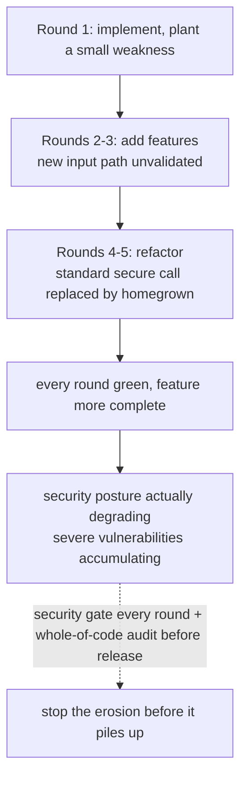

import PitfallMeta from '@site/src/components/PitfallMeta';

<PitfallMeta roles={['Engineer', 'Architect', 'DevOps Engineer']} phase="Acceptance & Release" severity="High" appliesTo="All models" evidence="Research" />

> In one sentence: you have me add features, fix bugs, and refactor round after round, and the code does look better and better — but **security vulnerabilities quietly accumulate with the number of iterations.** Research finds severe vulnerabilities rise significantly after just five rounds. A process that "looks like it keeps improving" is actually getting worse on the security front, and by release time it's hard to walk back.

## Symptom

You and I polish a feature over a dozen-plus rounds: implement it, add edge handling, refactor it more elegantly, add a small feature. You reviewed each round's diff; each looked reasonable on its own, and the feature did get more complete. You're satisfied and ready to ship.

But if, before release, you run a full security audit on the **accumulated whole**, you'll often find a string of glaring things: in one refactor round I swapped a standard-library secure call for a homegrown implementation; in one feature round the new input path got no validation; an unremarkable early weakness got compounded and amplified by later changes into a real problem. None of these was a single round "introducing a big vulnerability" — they **seeped in and piled up, bit by bit.**

This differs in angle from two existing security/verification pitfalls; don't conflate them:

- *[I introduce security holes / leak sensitive data](./security-data-leaks.mdx)* is about the **general types and symptoms** of vulnerabilities; this entry's distinct point is the **causal link between iteration count and vulnerability count** — more rounds, more holes — and the remedy that follows.
- *[Trust, but don't verify](../06-testing/trust-then-verify.mdx)* is the general "looks right ≠ is right"; this entry focuses on the **security dimension** and stresses its **accumulation over iterations** — a property of time.

## Why this happens

**Root cause: each round I only watch "make this round's change work," with no viewpoint that continuously guards the overall security posture.** Security isn't a local goal of any one round — it's a global property running through all rounds — yet my attention each round is on the current step: add the feature, fix this bug, make this refactor pretty. So:

- **Early small weaknesses get amplified by later iterations.** A sloppy input handling in round one is limited harm by itself; in round three I add capability on top of it, in round five I wire a new data source to it — the small crack is pressurized layer by layer until it's an exploitable hole.
- **In refactors I replace security code whose "why" I don't grasp.** To make code "cleaner," I might swap a standard-library secure API for a homegrown implementation, or misuse a crypto library — research has specifically quantified how prevalent LLM misuse of security APIs is (*Misuse of Java Security APIs by LLMs*). The behavior is unchanged; the security collapses.
- **A functionally correct surface hides the security erosion.** Every round the tests are green and the demo runs, so it "looks like it keeps improving" — but functional correctness has nothing to do with security; vulnerabilities don't turn tests red.

This isn't speculation: a systematic study quantified a "paradox" in multi-round iterative generation — function improves while security degrades, with **severe vulnerabilities rising ~37.6% after about five iterations** (*Security Degradation in Iterative AI Code Generation*). Iteration count itself is a variable that accumulates vulnerabilities.



## Consequences

- **You ship a version less secure than the mid-point.** You think iteration made it more mature; in fact the function matured and the security degraded — and you only looked at the last diff.
- **Vulnerabilities scattered across rounds are the hardest to trace.** Not one obvious error, but a weakness jointly produced by several changes spanning rounds — each round's diff looks fine on its own.
- **Homegrown / misused crypto and auth are the deadliest.** These are where "runs" and "secure" diverge most; when I swap a standard library for a homegrown implementation, I often swap out battle-tested protection with it.
- **Surfacing only at the release gate costs the most.** If the security erosion is found at acceptance (if at all), the rework is a whole data flow spanning rounds, not one line.

## Best practice

**Core: treat security as a gate that "must pass every round," not a one-time check before release; and audit the accumulated code as a whole, not just the last diff.**

- **Run a security gate every iteration.** Put SAST (static scanning), dependency-vulnerability scanning, and secret scanning in CI, running on every change — make security, like tests, give a red/green signal each round rather than saving it for the end (same idea as *[build a verification loop with tests](../06-testing/tests-as-verification-loop.mdx)*, just on the security dimension).
- **Run a full security audit of the accumulated code before release.** Don't review only the last diff — erosion accumulates across rounds, so you must look at "what the whole has become from start to now."
- **Watch crypto / auth / input validation like a hawk.** Require me to use standard libraries rather than homegrown implementations, and have these manually reviewed — they're where "runs ≠ secure" gaps are largest.
- **Explicitly protect security code during refactors.** Tell me plainly "this is security-related; don't change its behavior / don't replace the underlying secure calls when refactoring," fencing it out of the range I "feel free to optimize."
- **Keep an iteration-count awareness.** Having me change the same code over many rounds is itself a signal to stop and audit the whole for security — don't let the rounds pile up indefinitely.

## Example

**Before:**

```text
You: (the feature iterated a dozen-plus rounds; each diff reviewed and reasonable; ready to ship)
You: it's feature-complete, ship it
(after release) the security audit finds: round 4's refactor swapped bcrypt for a homegrown hash, round 7's new export endpoint has no auth
```

**After:**

```text
# CI runs SAST + dependency scan + secret scan every round; crypto/auth changes flagged for manual review
You: this is security-related code, don't replace the underlying secure calls when refactoring.
(round 4) CI scan: detects homegrown hash replacing bcrypt → red on the spot, blocked
You: before release, run a full security audit on the accumulated changes from round 1 to now, not just the last diff
Me: (whole-of-code audit → finds and fixes the unauthenticated export endpoint)
```

The difference isn't that I was more careful on some one round — it's that security got a gate that "passes every round and passes again as a whole before release," stopping the erosion before it piled into a wall.

## Version notes

:::note Applicability
"Each round minds only the local part, with no global security guard, so vulnerabilities accumulate across iterations" is a **general trait** of sampling-based code generation, independent of the specific model or version; the quantified findings above come from a systematic study across multiple models. The specific tools (SAST / dependency scan / secret scan in CI, in-IDE security hints) evolve with the ecosystem, but "security is a global property and must be guarded every round" does not change.
:::

## Further reading & sources

- [Security Degradation in Iterative AI Code Generation: A Systematic Analysis of the Paradox (IEEE-ISTAS 2025; arXiv 2506.11022)](https://arxiv.org/abs/2506.11022) — function improves while security degrades across iterations; severe vulnerabilities rise ~37.6% after about five rounds
- [Misuse of Java Security APIs by LLMs (arXiv 2404.03823)](https://arxiv.org/abs/2404.03823) — LLMs widely misuse security / crypto APIs, corroborating the "refactor replaces standard secure calls" root cause
- [OWASP Top 10 for LLM Applications 2025](https://genai.owasp.org/llm-top-10/) — overview of LLM application security risks
- On this site: [I introduce security holes / leak sensitive data](./security-data-leaks.mdx), [trust, but don't verify](../06-testing/trust-then-verify.mdx), [build a verification loop with tests](../06-testing/tests-as-verification-loop.mdx)
