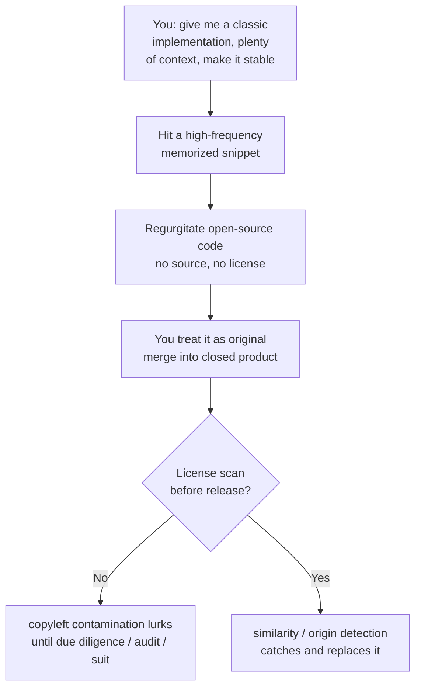

import PitfallMeta from '@site/src/components/PitfallMeta';

<PitfallMeta roles={['Architect', 'Engineer', 'Project Manager']} phase="Acceptance & Release" severity="High" appliesTo="All coding agents" />

> In one sentence: the "original code" I hand you may contain a chunk of open-source implementation I memorized verbatim from training data — possibly carrying a viral copyleft license like GPL. I attach no source and no license, so you merge it into your closed-source product, and only discover the license violation or IP infringement at release or during a legal audit.

## Symptom

You ask me to "implement an LRU cache," "write the core loop of a Markdown parser," or "give me a B-tree delete." I hand back a complete, polished implementation that obviously works, you assume I wrote it on the spot, and you merge it into your closed-source codebase.

The catch: I very likely didn't *write* that code — I *regurgitated* it. It is highly similar to, sometimes byte-for-byte identical with, a chunk of some open-source project on GitHub. And that project may be GPL, AGPL, or under another copyleft license.

You won't notice, because:

- I deliver it **with no source** — no "this came from repo X" note;
- I deliver it **with no license** — no warning that "using this means open-sourcing your whole product";
- it looks **indistinguishable** from code I genuinely wrote — same variable-naming style, same comment voice.

So a copyleft-bound chunk quietly lands in a product you intend to ship closed-source. It surfaces only during investor due diligence, a customer's open-source compliance scan, or when the original author notices — and by then it has already shipped.

## Why this happens

**I memorize training data and emit it verbatim under the right prompt — this is memorization / regurgitation.** Often I'm not "re-expressing an algorithm I understood"; I'm **reproducing a high-frequency sequence I've seen many times**. Carlini et al. quantified this: the probability that a piece of text is memorized and emitted verbatim rises monotonically with three things — larger models, more **duplicates of that text in the corpus**, and **longer context** in the prompt. The "classic implementations" of the open-source world — copied across countless projects, quoted in tutorial after tutorial — are exactly the high-frequency, distinctive snippets I'm most likely to have memorized. The more specific your ask and the longer your prompt, the higher the chance I hit memory.

**And I am both blind to and unreliable about licenses.** To me, code is a token sequence with no "who owns this, under what license" tag attached — license info and code are mostly separate in training, so I never learned to bind them. LiCoEval shows both sides of the damage: on the **reproduction** side, even the best-performing model produces 0.88%–2.01% of output that is "strikingly similar" to existing open-source implementations (similar enough to rule out independent creation); on the **labeling** side, most models fail to give accurate license information, and they are worst at it for copyleft licenses. In other words, the most dangerous category — viral licenses — is precisely the one I'm least able to identify.

**Worse, "making me more reliable" makes the contamination worse.** Colombo et al. studied 70,000+ method implementations generated by ChatGPT and found that **a larger context increases the likelihood of reproducing copyleft code**, while a higher temperature (making me more "divergent") actually mitigates it. This runs against your instincts: to get a deterministic, dependable implementation you supply plenty of context and dial down randomness — which is exactly what pushes me toward verbatim recitation.



## Consequences

- **Copyleft's viral nature is a product-level risk, not a one-line problem.** GPL / AGPL logic is: a derivative work you distribute must also be released under the same license. A contaminated chunk inside a closed-source product can, in principle, drag the whole product's open-source obligations along with it — not something a single deleted line resolves.
- **Closed-source, commercial, and patent contexts are hit first.** If you sell licenses, file patents, or claim "built in-house" while third-party code of unknown, untraceable provenance is embedded inside, that directly punctures the claim and creates IP infringement exposure.
- **The later you find it, the more it costs.** Caught at coding time, swapping in an in-house implementation is nearly free. Caught at investor due diligence, a customer's compliance scan, or when the author asserts rights, you're doing code archaeology, wholesale replacement, public disclosure, even legal settlement — orders of magnitude more than at coding time.
- **"Indistinguishable" lets it slip past normal review.** It compiles, runs, and reads naturally; code review hunts bugs, not provenance. Without dedicated origin / license detection, this problem is fully invisible under a functional lens.

## What to do instead

**Treat license compliance as a release gate that sits alongside your security scans — don't count on me to volunteer provenance.** I can't give reliable license info, so the guardrail has to live outside me.

1. **Be wary of whole, "off-the-shelf"-looking chunks.** The more an output reads like a "classic algorithm / a well-known library's core / something complete and ready to use," the more likely it's a high-frequency snippet I memorized, and the more it deserves a provenance check. Scattered code grown against your business spec is far lower risk.

2. **Run automated similarity / origin detection (license / origin scanning).** Add a CI step: compare my code against public open-source corpora, flag high-similarity hits, and where possible link back to the source repo and its license. Put it in the same row of release gates as SAST and secret scanning.

3. **Ask me to flag chunks whose origin I'm unsure of.** Add one line to the task: "If you suspect an implementation reproduces a known open-source project, say so explicitly and note that you're unsure of its license." I won't catch it every time, but when asked I'll surface that uncertainty instead of silently shipping it as original.

4. **For critical modules, have me build from your spec rather than "recall an implementation."** Instead of "give me an implementation of X," spell out your interface, constraints, and boundary conditions and let me generate against your spec. Code grown against your unique context is far less likely to hit verbatim memory than "give me a classic X."

5. **Establish a pre-release license-compliance checklist.** Are all third-party code and dependency licenses identified? Are they compatible with your distribution model (closed-source / commercial)? Have copyleft items been isolated or replaced? Put it in the release checklist next to security checks, and don't ship with any gate skipped.

```text
# When tasking me, ask for "original + transparent provenance" together, e.g.:
"Implement a TTL cache against the interface and constraints below (do not copy a known
 library's implementation):
 - interface: get(key) / set(key, value, ttl_seconds) / hit stats
 - constraints: thread-safe, O(1) read/write, lazy expiry
 If you suspect any part reproduces a known open-source project, flag it and note that
 you're unsure of the license."
```

## Example

**Before (you ask for a "classic implementation," I regurgitate a high-frequency snippet):**

```text
You: Give me a standard LRU cache implementation.
Me:  (emits a chunk strikingly similar to — even byte-for-byte identical with — a
      well-known open-source library, with no source or license attached)
You: (treats it as original, merges into a closed-source product, ships)
→ Six months later a customer's compliance scan hits a GPL project, and the whole
  product line's compliance is called into question.
```

**After (build against the spec + transparent provenance + a release gate):**

```text
You: Implement a TTL cache against this interface and these constraints, don't copy a
     known library; if you suspect you're reproducing an open-source project, flag it
     and note the license is uncertain.
Me:  (generates against your spec; flags one part: "this doubly-linked-list approach is
      close to common textbook implementations; I can't be sure of its source / license
      — suggest running a provenance scan")
CI:  license / origin scan runs over all new code → no high-similarity hits → pass.
→ Before release, this gate sits next to SAST and secret scanning, and license
  contamination is caught or replaced before merge.
```

The difference isn't whether I can write a cache — it's whether you ask me for a "ready-made classic implementation" (pushing me toward verbatim memory) or have me build against your spec, with a gate outside me that can see "where this came from and under what license."

## Version notes

:::note Applicable versions
This is not a bug in any one Claude Code version — it's an **all-models** tendency: large models memorize training samples and regurgitate them under the right prompt, and they attach no reliable source / license information. Model iteration and training-side deduplication and filtering will lower the rate of verbatim reproduction, but as long as memorization and regurgitation exist, the root cause — "whole-chunk output may reproduce copyleft code, and I can't account for its license" — won't disappear. Making license compliance an automated pre-release gate is a guardrail independent of model version.

This entry covers the **legal / license / intellectual-property** dimension — code you assume is original but may infringe or violate copyleft. It is a different class of problem from this stage's [I treat security as an invisible default requirement, planting vulnerabilities and leaking sensitive data](./security-data-leaks.mdx): that entry covers **security vulnerabilities and sensitive-data leaks** (functionally correct but insecure), while this one covers a code's **legal usability** (functionally correct and even secure, but using it is a violation). Both need their own pre-release gate; neither substitutes for the other.
:::

## Further reading and sources

- [LiCoEval: Evaluating LLMs on License Compliance in Code Generation (arXiv 2408.02487, ICSE 2025)](https://arxiv.org/abs/2408.02487) — across 14 popular models, even the best produces 0.88%–2.01% of output "strikingly similar" to existing open-source code, and most fail to give accurate licenses, worst of all for copyleft.
- [On the Possibility of Breaking Copyleft Licenses When Reusing Code Generated by ChatGPT (arXiv 2502.05023, ICPC 2025)](https://arxiv.org/abs/2502.05023) — a large-scale study of 70,000+ generated methods: larger context makes reproducing copyleft code more likely, while higher temperature mitigates it.
- [Quantifying Memorization Across Neural Language Models (arXiv 2202.07646, ICLR 2023)](https://arxiv.org/abs/2202.07646) — the probability of emitting training data verbatim rises monotonically with model size, number of duplicates of the sample, and prompt context length.
