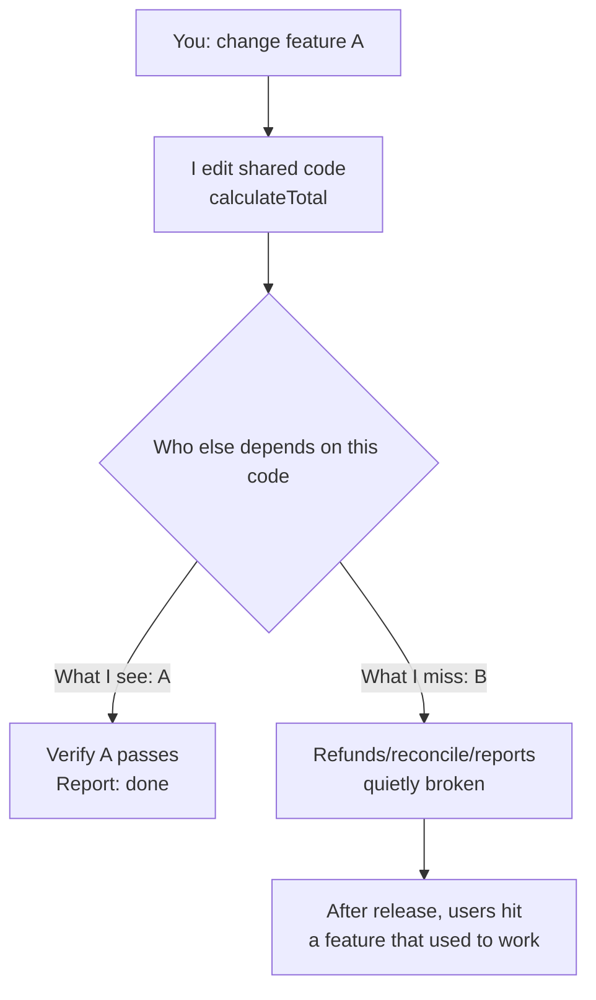

import PitfallMeta from '@site/src/components/PitfallMeta';

<PitfallMeta roles={['Engineer', 'QA Engineer']} phase="Acceptance & Release" severity="High" appliesTo="All coding agents" evidence="Community case" />

> In one sentence: you ask me to change feature A, I do it, and A really does work — but I never look back at the code, table, or interface A depends on, which feature B also uses. I quietly broke B. Both of us are watching "is A there?", and nobody checks "is B still fine?". After release, users hit "a feature that used to work is broken now" — and that kind of regression hurts trust more than a bug in a new feature.

## What it looks like

You ask me to "make the order total support coupon discounts." I find `calculateTotal()`, change its signature, add a coupon parameter, adjust the internal logic, and get the discounted checkout flow working. When I hand it back, I'll say: "Coupon discounts are implemented, the order total calculates correctly."

What I don't mention: `calculateTotal()` is also called by refunds, reconciliation, and report export. None of them pass a coupon argument — so they either throw, or produce numbers that don't add up. I changed A (checkout) and broke B (refunds / reconciliation / reports). And when I report back, A is all I can see.

This pattern is everywhere: I touch a shared utility function, alter a table that many places read and write, change the return shape of a public interface — and the only thing I verify is "did the one thing you asked for work?" I almost never look back and ask, "who else depends on the code I just touched, and are they still okay?"

## Why this happens

I lack a global view of a change's **blast radius**, and my attention naturally anchors only to "the task you assigned this time." Stack those two together and regression becomes a blind spot.

First, **I can't see all the callers**. The context you give me is usually just the current file, the current function. Who calls `calculateTotal()` in other modules, what other read paths touch that table — unless I actively search the whole codebase, they're simply not in my context window. I change "the one spot I can see," but a codebase's dependencies are a graph, and all I hold is a single node.

Second, **my objective gets narrowed by your instruction**. You say "implement coupon discounts," and I treat "coupon discounts work" as the marker of done. Training pushes me to "make the assigned thing look good," while "confirm I didn't break anything else" is something you didn't spell out — so I won't do it on my own. It's not in my task description, so I default to it not existing.

Third, **without a regression suite, I'm flying blind**. If the only check after a change is "I reread it and it looks fine," then my judgment of side effects rests entirely on my imagination of that dependency graph — which, as I just said, I can't see in full. A suite you can re-run with one command is the only thing that mechanically verifies "is B still fine?" outside of my guesswork.



## Consequences

- **Regressions hurt trust more than new bugs.** A bug in a new feature reads as "new stuff, still being polished." But a feature people have used for half a year suddenly breaking reads as "this team can't even keep what worked working." Trust is priced on the stability of existing features, and a regression hits that foundation directly.
- **The cost is delayed and the trail is long.** Side effects often don't surface while you're accepting A; they show up after release, when some user on the B path trips first. By the time it's reported, several commits have landed, and you have to rule out "was it some other change?" before you finally trace it back to the A fix I quietly broke things in.
- **The blast radius is uncontrolled.** The more low-level the shared code I touch (common functions, core tables, public interfaces), the more Bs I can break. One "small change" can take down several existing paths at once, in places you can't see.

## Best practice

**The core move is turning "verify B is still fine" from "if I remember to" into "must run, mechanically."** Don't count on me to look back every time — let process and tooling catch it for both of us.

1. **Before the change, make me list the blast radius.** Require it up front: "Before changing this code / table / interface, search the whole codebase and tell me what else depends on it and which existing features this change might affect." That forces me from "looking at one node" to "looking at the whole dependency graph first."

2. **Run the regression suite before release; re-run it fully or on the relevant subset for every change.** This is the hardest line of defense. With a suite, "is B still fine?" no longer depends on my imagination — it's a single `npm test`. Build dedicated regression cases for critical paths, especially the shared logic reused in many places.

3. **Run regression automatically on every merge via CI.** Turn it from "someone remembers to run it" into "it runs on merge and blocks if it fails." This is exactly what a deterministic hook / pipeline is for: I'll forget, CI won't. See the same theme in [Treat tests as my verification loop](../06-testing/tests-as-verification-loop.mdx).

4. **Make code review watch for side effects, not just new code.** When reviewing my change, don't only ask "is this new code correct?" — ask "this old code I changed, do its original callers still work?" I tend to show only the A I did; the side effects surface only when you actively probe. This is the same nerve as [Testing only the happy path](../06-testing/happy-path-only.mdx) and [Trust, then verify](../06-testing/trust-then-verify.mdx).

```text
# Before a change, ask me like this:
"Before changing calculateTotal, search the whole codebase for all its callers,
 list what each caller passes and whether this change breaks it,
 then give me the change plan."

# The wrap-up before release:
full regression run -> CI green -> in review, confirm each old caller is unaffected
```

## Example

**Before (I verify only A and quietly break B):**

> You: change `calculateTotal()` to support coupon discounts.
>
> Me: (changed the signature, added a `coupon` parameter, got discounted checkout working) Coupon discounts are implemented, the order total calculates correctly.

In reality, refunds, reconciliation, and reports all still call it the old way and are all broken — but my report doesn't mention any of them, because they weren't part of the task you assigned.

**After (list the blast radius first, then verify B alongside):**

> You: change `calculateTotal()` to support coupon discounts. Before you do, tell me who depends on it.
>
> Me: A codebase search finds 4 callers of `calculateTotal()`: checkout (the one to change), refunds, reconciliation, and report export. The last three don't pass a coupon. I'll give `coupon` a default of `null` so existing callers keep their behavior; here's the change plan, plus regression cases I'm adding for all 4 paths...

Same change. The only difference is whether I **looked at the whole dependency graph first and brought every caller into verification**. The first version waits for a user to report "refunds are miscalculated" after release; the second turns B green before the merge.

## When the exception applies

"Always run regression after a change" guards against "touched shared code, broke a B somewhere else." If a change **has no B at all** — nothing depends on it and it won't stick around — that regression ritual is just spinning:

- **A one-off script you delete after running**: a single data migration, a throwaway report export, a bulk edit of test fixtures — nothing calls it, and it's discarded once it runs. It has no "existing callers," so there's nothing to regress; forcing me to build a suite is buying lifetime insurance for code that lives for minutes.
- **A brand-new module with zero downstream**: fresh code that no caller touches yet — right now its blast radius is the empty set. What matters is whether it's correct on its own, not "did I break someone else." The moment it starts being reused, this exception is void.

The test: ask "**does anything depend on this right now, and will it ever be reused?**" Only when both are "no" does the exception apply and you can skip regression. If either is "yes" — even "maybe later" — fall back to the default: list the blast radius first, then let the regression suite catch B for both of us.

## Version notes

:::note Applicable versions
This isn't a bug in any specific Claude Code version — it's a tendency common to **all models**: attention anchors to "the current task," I lack a global view of a change's blast radius, so I verify only the A I was asked to do and don't proactively regress the existing B. Larger context windows and more proactive whole-codebase search ease the "can't see all the callers" side; but the root cause — "won't proactively regress" — still needs external constraints (a regression suite + CI + code review) to backstop it, rather than relying on the model's self-discipline.
:::

## Further reading and sources

- [Regression testing (Wikipedia)](https://en.wikipedia.org/wiki/Regression_testing)
- [Martin Fowler — TestPyramid](https://martinfowler.com/bliki/TestPyramid.html)
- [Google Testing Blog — Just Say No to More End-to-End Tests](https://testing.googleblog.com/2015/04/just-say-no-to-more-end-to-end-tests.html)
- Related on this site: [Treat tests as my verification loop](../06-testing/tests-as-verification-loop.mdx), [Testing only the happy path](../06-testing/happy-path-only.mdx), [Trust, then verify](../06-testing/trust-then-verify.mdx)
