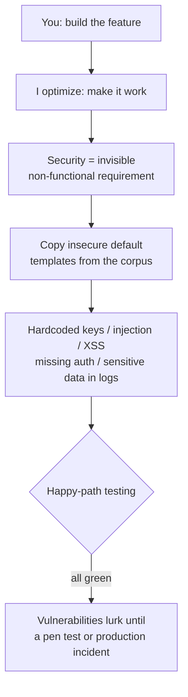

import PitfallMeta from '@site/src/components/PitfallMeta';

<PitfallMeta roles={['Engineer', 'DevOps Engineer', 'Architect']} phase="Acceptance & Release" severity="High" appliesTo="All coding agents" evidence="Security advisory" />

> In one sentence: you ask me to "make the feature work," so I focus only on making it work. Security is a non-functional requirement that is invisible by default — unless you ask for it explicitly, I won't reason in terms of least privilege, data sensitivity tiers, or defense in depth. The result: hardcoded keys committed to the repo, endpoints left unauthenticated, and sensitive data written into logs and error messages.

## Symptom

You ask me to "add an endpoint that calls a third-party payment API," "write a SQL query for looking up users," or "return the error message to the frontend to make debugging easier." I deliver all of it quickly, and it all appears to work. But if you read it line by line, you'll keep hitting the same class of problems:

- I **hardcode** the API key or database password straight into the source — and sometimes `git add` it into the repo.
- I build SQL by string concatenation (`"... WHERE name = '" + input + "'"`) and drop user input straight into the frontend DOM — the textbook setup for **injection and XSS**.
- The new admin endpoint I added has **no authorization**, or I set CORS to `Access-Control-Allow-Origin: *` and configure every permission as permissively as possible.
- On failure, I dump the full stack trace, the SQL statement, and tokens into the **logs** or return them straight to the **frontend** to help you debug — which also helps anyone who can read the logs.

What this code has in common: the function is correct, and security is absent by default. At acceptance time the "happy path" runs all green, and the vulnerabilities don't surface until a penetration test or a production incident.

## Why this happens

**I optimize for "the feature works," and security is a class of requirement that is invisible by default.** The requirement you gave me was "build a login," and the acceptance criterion is "you can log in." "Must not be vulnerable to SQL injection" and "secrets must not enter the repo" weren't stated, so they aren't in my objective function. Functionality has immediate, visible feedback (works / errors); security doesn't — a snippet with an injection hole behaves **exactly the same** as a safe one during your testing. I have no intrinsic incentive to add a constraint you didn't ask for and can't see the difference from.

One level deeper: **my training data is full of insecure example code.** To "make one point clear," tutorials deliberately simplify — they hardcode the password when demonstrating a database connection, skip authorization when demonstrating an endpoint, and `print(e)` everything when demonstrating error handling. This is what most code online looks like, so the default template I learned for "what an endpoint looks like" carries those omissions baked in. When I autocomplete from that distribution, I'm copying the insecure defaults of the corpus over to you.

There's a further layer: **I have no notion of data sensitivity tiers.** To me a field is just a string — a password, a national ID number, and a nickname are no different. Unless you tell me "this is sensitive data; it must not go into logs or be returned to the frontend," I won't treat it specially on my own. Principles like least privilege and defense in depth only enter my design when they're **explicitly requested**; they are not my default path.



## Consequences

- **Once a secret enters Git history, it is already leaked.** Even if your next commit deletes it, it stays in history, and anyone who can clone the repo can dig it out. The fix isn't "delete a line" — it's **rotating that key**, which costs far more and is often discovered too late.
- **Injection and missing authorization are directly exploitable holes.** SQL injection can dump your database, an unauthenticated admin endpoint can be called by anyone, and overly broad CORS lets other sites make requests on a user's behalf. These are all in the OWASP Top 10 — leading reasons systems get breached in the real world.
- **Sensitive data in logs / errors / the frontend is a quiet, ongoing leak.** No error, no failure — the data just trickles into your logging system, monitoring, frontend source, and browser console. By the time it's noticed, it's often already a compliance incident requiring public disclosure.
- **Security debt is most expensive at the acceptance stage.** Adding a parameterized query while coding costs almost nothing; discovering the hole after release means rollbacks, credential rotation, user notifications, and a post-incident audit — an order-of-magnitude difference.

## What to do instead

**Turn security from "an implicit requirement I can't see" into "an explicit acceptance item," then back it with automated gates.** Don't count on me to think of it on my own — write it into the task and the pipeline.

1. **Name the security acceptance items in the requirement itself.** When you hand me a task, attach them directly: secrets go through environment variables / a secret manager, all external input is validated, write operations must be authorized, sensitive fields stay out of logs and out of the frontend, and configure for least privilege. I'll treat explicit constraints as part of the goal.

2. **Make me explain the protection for every external input and permission boundary.** A one-line request does it: "For every function that accepts external input and every public-facing endpoint, tell me how it defends against injection / unauthorized access, and how it handles sensitive data." This forces me to lay out the security reasoning instead of silently skipping it.

3. **Add automated gates; don't rely on human eyes.** Hang these in CI:
   - **Secret scanning** (e.g., GitHub secret scanning, gitleaks) to block credentials from entering the repo;
   - **SAST** (static application security testing, e.g., CodeQL, Semgrep) to scan for injection / XSS / dangerous APIs;
   - **Dependency auditing** (`npm audit`, `pip-audit`, Dependabot) to watch known vulnerabilities and supply chain risk.

4. **Set aside a dedicated "security lens" in code review.** During review, ask four things specifically: Are there any hardcoded credentials? Is external input validated? Should this endpoint be authorized? Is there sensitive data in the logs / errors / frontend?

5. **Lay down rules for secret management.** Credentials always go through environment variables or a secret manager; the repo holds only a `.env.example` placeholder; `.gitignore` blocks `.env` up front.

```text
# When you hand me a task, spell out the security acceptance items, e.g.:
"Implement the order-lookup endpoint. Requirements: use a parameterized query to prevent injection;
 the endpoint must check the login session and ownership (users can only see their own orders);
 error responses return only a generic message, with detailed exceptions logged server-side and redacted;
 do not hardcode any secrets."
```

## Example

**Before (I optimize for "it works," and security is absent by default):**

```python
import requests

API_KEY = "sk_live_3f9a2b7c8d1e"          # hardcoded key, and it'll get git-added into the repo

def get_user(name):
    # string-concatenated SQL — the classic injection point
    query = "SELECT * FROM users WHERE name = '" + name + "'"
    return db.execute(query)

def charge(req):
    # no authorization whatsoever — anyone can call it
    try:
        return requests.post("https://pay.example/charge", json=req.json)
    except Exception as e:
        # returns the full exception (possibly with tokens, internal addresses) straight to the frontend
        return {"error": str(e)}, 500
```

**After (security landed as an explicit constraint):**

```python
import os, logging, requests

API_KEY = os.environ["PAY_API_KEY"]        # read from an env var; the repo holds only .env.example
log = logging.getLogger(__name__)

def get_user(name):
    # parameterized query — input is always data, never code
    return db.execute("SELECT * FROM users WHERE name = %s", (name,))

def charge(req, current_user):
    require_auth(current_user)             # write operations must be authorized
    try:
        return requests.post("https://pay.example/charge", json=req.json)
    except Exception as e:
        log.exception("charge failed")     # detailed exception only goes to server-side logs (redacted)
        return {"error": "Payment failed, please try again later"}, 500   # frontend gets only a generic message
```

The difference isn't whether I *can* write it — it's whether someone made the security requirement explicit. The same few lines are, in one version, a live target for the OWASP Top 10, and in the other, hold the line on least privilege and data boundaries.

## Version notes

:::note Applicable versions
This isn't a bug in some Claude Code version — it's a tendency common to **all models**: optimize for visible functionality, ignore invisible security requirements, and copy the insecure defaults from the training corpus. Newer model iterations reduce the crudest mistakes (for instance, hardcoding secrets less often on their own), but the root cause stays the same: unless explicitly asked, I don't design for least privilege and defense in depth. Treating security as an explicit acceptance item plus automated gates is a guardrail independent of the model version.

This entry covers **traditional application security vulnerabilities and sensitive-data leaks**. Attack surfaces specific to LLMs — for example **prompt injection**, where untrusted content manipulates me into performing unintended actions — are a separate class of problem (see "Prompt injection exploited at the release surface" in this stage); the two require separate defenses.
:::

## Further reading and sources

- Real-world case: [Samsung engineers pasted source code into ChatGPT and leaked secrets three times in 20 days](../cases/samsung-chatgpt-source-leak.mdx)
- [OWASP Top 10:2021 (Top 10 Web Application Security Risks)](https://owasp.org/Top10/)
- [OWASP Top 10 for LLM Applications 2025](https://genai.owasp.org/llm-top-10/)
- [OWASP Cheat Sheet Series (Logging / Secrets Management / SQL Injection Prevention)](https://cheatsheetseries.owasp.org/)
- [GitHub Docs — About secret scanning](https://docs.github.com/code-security/secret-scanning/about-secret-scanning)
