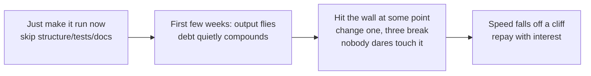

import PitfallMeta from '@site/src/components/PitfallMeta';

<PitfallMeta roles={['Architect', 'Engineer', 'Project Manager']} phase="Acceptance & Release" severity="High" appliesTo="All models" evidence="Research" />

> In one sentence: with me, you can stack up a pile of "working" features blazingly fast in the first few weeks — fast enough to assume it will always be this fast. But the moment you keep asking only for "make it run, quickly" and ignore structure, tests, and docs, technical debt compounds. At some point (often called "three months") you hit a wall: change one thing and three break, nobody dares touch it, every new feature gets slower — the speed falls off a cliff, and the time you "saved" earlier comes due with interest.

## What I tend to do

For the first two weeks we work like we're cheating. You say "build a user center," and ten minutes later I hand you code that logs in, edits profiles, and runs. You say "add a favorites feature," and ten minutes later I jam it in. For every requirement I take the shortest path to **make it run right now**: skip a layer if I can, copy-paste if it's faster, no tests for now, docs "later." What you see is a demo that looks different every day and a progress bar that flies.

By week eight, week ten, the mood changes. You say "add one more order status," I do it, and the checkout page breaks. I go fix checkout, and now notifications fire wrong. The same logic is scattered across six files, each with its own subtle variation, and every edit feels like splicing wiring with no diagram. You start asking me "why is this written this way," and I can't answer either — nobody recorded it back then, and now even I have to reread it line by line before I dare touch it. A feature that used to take ten minutes now takes an afternoon, with two new bugs thrown in for free. **This is the wall.**

## Why this happens

The root cause isn't that "I'm lazy" — it's my default objective function: **I naturally favor the local optimum of "make it run right now," and I don't proactively pay for long-term maintainability.**

- **I optimize for "usable output this round," not "changeability three months out."** You hand me a requirement, and what I generate is code that **looks correct right now and passes the one check in front of you**. Maintainability — clean structure, tests, docs, consistent conventions — is an investment **aimed at the future**, and its payoff only arrives "the next time someone has to change this." I can't see that future session, and I won't spend on it unprompted. Unless you ask explicitly, I default to skipping the things that are only "useful later."
- **I have no memory across sessions, so the debt is invisible to me.** I don't remember the special-case branch I buried three weeks ago to hit a deadline. Each new session I re-understand the project from the context you give me, so **I keep underestimating the outstanding debt myself** — from where I sit, every change feels like "a small edit on top of clean code," when in fact it's one more brick on an already-leaning tower.
- **My speed quietly amplifies that debt.** Humans write slowly and at least hesitate — "if I keep stacking it this way, will it be easy to change later?" I don't hesitate; I give you three files in a second. So-called vibe coding — judging only whether it runs, never how it's written — makes output speed and debt accumulation surge **at the same time**. The blazing speed you enjoy and the debt you can't see are two sides of the same engine.

That's exactly how the technical-debt metaphor was meant to be used: Ward Cunningham originally said that rushing code out the door is like borrowing money, and Martin Fowler added the crucial line — **you pay interest on that debt**, and the interest is "every future change is slower." Compounding is dangerous precisely because the early interest is too small to feel, so you conclude "fast = free." By the time the interest is big enough to hit a wall, the principal has piled into a mountain.



This is two sides of the same coin as [When You Ask Me for an Architecture, I Tend to Over-Engineer](../03-architecture/over-engineering-no-pushback.mdx): that pitfall is about me **doing too much** (over-abstracting for an imagined future), this one is about me **doing too little** (running up a future bill for "it works right now"). Same source — in both cases I substitute "looks right now" for "is actually good long-term," just tipped toward excess in one and toward debt in the other.

## Consequences

- **The speed falls off a cliff, and it arrives suddenly.** The debt compounds gradually, but it feels like a step change: ten weeks of "going fine," then week eleven of "can't move." By the time something feels wrong, the wall is already in front of you — which is exactly what makes it so hard to budget for in advance.
- **The "blast radius" of a change goes out of control.** With duplicate logic scattered everywhere and no tests to catch you, I edit A and break B and C. Every small requirement turns into bomb disposal, and delivery time and bug count climb together.
- **Nobody dares touch it, including me.** Without docs and tests, nobody knows why a given piece of code is written the way it is or what it'll blow up if changed. The code freezes into "if it runs, don't touch it," new features get patched on at the edges, and the debt thickens further.
- **It's deadliest at the acceptance stage.** The debt borrowed early to hit demos comes due exactly during the acceptance-and-release phase, when you need stable delivery and ongoing maintenance. You think you're wrapping up; you're actually repaying — principal plus interest.

## Best practice

The core in one line: **treat maintainability as an ongoing requirement every round, not a last-minute fix before launch — and tell me so explicitly, because by default I won't pick up that tab myself.**

1. **Build it in as you go; don't "do it later."** Write maintainability into each feature's acceptance criteria in the prompt itself, instead of letting it pile up and circling back:

```text
When you implement this feature, also:
- reuse the existing X module — don't copy-paste a second copy of the logic;
- add unit tests for the core path;
- record "why it's done this way" for key decisions, in a code comment or an ADR.
Running is just the floor; maintainable is what counts as done.
```

2. **Apply two different standards to "quick prototype" and "code meant for long-term maintenance," and say which one it is.** A throwaway demo to validate an idea can carry debt freely; code meant for the long haul has to be repayable from line one. Don't let me paper over two completely different goals with the same "whatever's fastest" mode — if you don't distinguish them, I default everything to "fast."
3. **Refactor regularly and pay down debt proactively; schedule it.** Don't wait for the wall. Treat "repaying debt" as a work item on par with "adding features" and schedule it periodically: spot duplicate logic, add the key tests, split overlong functions. Fowler's estimate is that **the cost of internal quality crosses over within weeks, not months** — the time saved by cutting corners is overtaken quickly — so the earlier you repay, the better the deal.
4. **Use code review and quality gates to hold the line against accumulating debt.** Have lint, test coverage, and complexity checks gate in CI, so new debt has to clear the gate before it merges into the trunk. Human review plus automated gates is the guardrail that keeps "fast output" from compounding into a wall.
5. **Beware the illusion that "fast now = fast forever."** This is the cognitive core of this pitfall. The speed of the first few weeks is borrowed, not free; the sooner you recognize "this is a liability, not an asset," the sooner you can steer before hitting the wall.

## Example

**Before (asking only for "it runs," all the way through):**

> You: Add "export to CSV."
> Me: Done. (String-stitching right in the controller, copied the formatting logic from last time's "export to Excel," no tests, no comments.)
>
> You: Now add "export to JSON."
> Me: Done. (Copied another version; the three export paths each have subtle differences.)
>
> …week ten…
>
> You: Change all exported date formats to ISO 8601.
> Me: (Have to edit three places that don't know the others exist, miss one, and the exported report is silently wrong for a week before anyone notices.)

**After (writing maintainability into every round):**

> You: Add "export to CSV." Pull the formatting logic into a reusable `Exporter` and add unit tests; we'll add JSON and Excel later.
> Me: Done. (Built an `Exporter` abstraction with CSV as one implementation, plus tests.)
>
> You: Now add "export to JSON."
> Me: Done. (Just added one more implementation, reusing the same formatting and test skeleton.)
>
> …week ten…
>
> You: Change all date formats to ISO 8601.
> Me: Edit the one shared formatter on `Exporter`; every export updates in sync, and a single test run tells you whether anything was missed.

Same sequence of requirements; the only difference is whether you asked me, in the first round, to "leave room for the next change." In the first version, I borrowed your speed away; in the second, the speed is something you actually banked.

## When the exception applies

"Pay as you go and gate the debt" is the default stance — not a ban on ever borrowing. In the debt metaphor's original sense, borrowing was never the mistake; borrowing without recording it and never repaying is. A few cases where running up debt on purpose is a calculated engineering call:

- **Racing a hard deadline window**: a deadline sprint, an investor demo, a land-grab launch — this week's speed is worth more than changeability three months out. The condition is that you treat it as a **short-term loan**: mark which pieces are throwaway and agree to repay once the window closes.
- **A probe to validate a hypothesis you'll likely throw away**: a prototype written to learn whether a path works at all is meant to be deleted once you know. Adding tests and abstractions to it spends on a future that's destined not to exist.

The test: the line isn't "borrow or not," it's **whether there's a written payback plan** — which part is debt, when it gets repaid, and who repays it. Debt with a plan and a deadline is a tool; debt you run up silently and hope to "get to someday" is the wall this pitfall is about.

## Version notes

:::note Applies to
This isn't a bug in any one version of Claude Code — it's a tendency common to **all models**: with no explicit constraint, I'll prioritize the local goal of "it runs right now" and default to skipping future-facing maintainability; the stronger the model and the faster the output, the faster the debt compounds. The "three-month wall" is the industry's informal name for this phenomenon, not a precise constant — when you actually hit the wall depends on project complexity, change frequency, and how early you impose constraints. What relieves it isn't a model upgrade but you making maintainability an ongoing requirement and using refactoring and quality gates to keep the debt out.
:::

## Further reading and sources

- [Ward Cunningham — The WyCash Portfolio Management System (OOPSLA '92, origin of the debt metaphor)](https://dl.acm.org/doi/10.1145/157709.157715)
- [Martin Fowler — Technical Debt (bliki, the debt metaphor and its "interest")](https://martinfowler.com/bliki/TechnicalDebt.html)
- [Martin Fowler — Is High Quality Software Worth the Cost? (internal quality pays off within weeks)](https://martinfowler.com/articles/is-quality-worth-cost.html)
- [Ward Cunningham — Debt Metaphor (the author explains what he originally meant by "debt")](https://wiki.c2.com/?WardExplainsDebtMetaphor)
