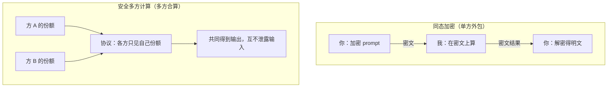

import PrivacyMeta from '@site/src/components/PrivacyMeta';

<PrivacyMeta era="卷一 · 隐私根基" technique="隐私保护计算" audience={['隐私工程师', '安全工程师', 'ML 工程师']} severity="中" maturity="试验" evidence="研究支持" />

> 一句话摘要：同态加密（HE）让你把数据**加密后发出去**，服务器**直接在密文上算**、算完你才解密——服务器全程看不到明文；安全多方计算（MPC）让多方**各自不交出输入**地合算一个函数。两者和 TEE 的根本区别：**不依赖任何硬件信任**，安全来自密码学假设。代价是**慢一大截**（HE 尤甚），所以今天多用于窄场景，LLM 全程私有推理仍很贵。卷一交代它们**保证什么、贵在哪、和 TEE 怎么选**。

## 机制：我这边发生了什么

- **同态加密（HE）**：你把 prompt 用同态加密发来，我（服务器 / 模型）在**密文**上做加法、乘法，返回**密文**结果，只有持私钥的你能解密；全程我这边没有出现过明文。Gentry 用 ideal lattices 给出**首个全同态加密**方案，并用 **bootstrapping**（对密文自身的解密电路再同态求值以「刷新」噪声）让**任意深度的电路**可算（Gentry, STOC 2009）。
- **安全多方计算（MPC）**：把计算拆给多方（客户端与服务器、或多台服务器），用**混淆电路**或**秘密分享**让每一方只见到自己那份「份额」，**没有任何单方看到完整输入**，却能共同算出正确输出（Evans et al., 2018，系统综述了 Yao 混淆电路、SPDZ 等）。

红线：这里我不该说「我**保证**不看你的数据」——准确说法是：**在密码学假设下，我（计算方）拿到的只有密文 / 份额，看不到明文**。这是数学性质，不是承诺。



## 威胁面：防什么、不防什么

- **防**：计算方窥视输入与中间值——HE 防的是**单个**外包计算方；MPC 防的是**在合谋阈值内**的若干参与方。
- **不防 ① 威胁模型不匹配**：协议分**半诚实（honest-but-curious）**与**恶意（malicious）**——半诚实只防「偷看」、不防「乱改」。把半诚实协议用在有恶意方的场景，是常见假安全。
- **不防 ② MPC 合谋**：超过协议假设阈值的参与方一旦合谋，保证就破。
- **不防 ③ 输出本身的泄露**：协议保证「过程不泄露输入」，但**函数的输出**可能反推输入——要私密还得给输出叠 DP。
- **不防 ④ 解密之后**：HE 结果你一解密、MPC 输出一公开，明文就回到普通世界，照样受其他隐私风险约束。

## 防护原理

安全不来自「藏在某个硬件里」，而来自**密码学假设**：HE 靠格上的困难问题 + bootstrapping 控噪；MPC 靠秘密分享 / 混淆电路 + 通信轮次，并在**明确的威胁模型与合谋阈值**下证明「除输出外不泄露任何信息」。承重点正在于此——**这是与 TEE 正交的信任模型**：TEE 把信任压在硬件隔离与证明上；HE / MPC **不把远端执行环境当信任根**，而把安全性建立在密码学假设、参数选择、协议模型与实现正确性上——你仍要信自己客户端的密钥安全、随机数质量与密码库实现，只是不必信对方的硬件。

## 落地实现（配方）

```text
1. 选范式：数据外包给「单方」算 → HE；数据分散在「多方」、要合算 → MPC。
2. HE：选方案——CKKS（近似算术，适合 ML 的浮点）/ BFV·BGV（整数精确）；
   用成熟库（OpenFHE、Microsoft SEAL）；为深电路降深度 / 配 bootstrapping 控噪。
3. MPC：选协议与威胁模型——半诚实还是恶意、两方还是多方、合谋阈值；
   用成熟框架（如 MP-SPDZ）；评估通信轮次与带宽（MPC 多是通信受限）。
4. 定安全参数：目标至少 128-bit，但 HE 别只看一个抽象 λ——用所选库配套的 lattice estimator
   复核具体参数集（环维度 / 密文模数 / 噪声预算 / 乘法深度）；MPC 写明威胁模型（半诚实 / 恶意）
   与合谋假设，别留默认。
5. 配 DP 兜输出：若输出可能反推输入，对输出再加差分隐私。
```

每个参数（方案、λ、合谋阈值、电路深度）都要带上**你的威胁模型与负载**；HE / MPC 的可行性强烈依赖电路深度与数据规模，论文 demo 未必迁得到 LLM 规模。

**最小可测试断言**（把上面的配方收成可回归的检查）：

- 怎么测：① 功能——密文 / 多方算出的结果与明文直算对比（HE 近似方案 CKKS 要带**误差界**）；② 安全——安全参数目标 ≥ 128-bit 且 HE 参数集经 estimator 复核（非只看抽象 λ）、威胁模型与合谋阈值是否写明并与协议匹配。
- 通过：结果落在声明误差界内；安全参数达标；威胁模型（半诚实 / 恶意、合谋阈值）明确且与所选协议一致。
- 失败：参数不足 / 威胁模型不清 / 拿半诚实协议套恶意场景 → 不算达到声称的隐私保证，回去换协议或补参数。

## 真实案例 / 工程可行性

（本条 maturity 标「试验」：HE / MPC 的**密码学原语成熟**，但在 LLM 规模上仍是工程可行性问题，以下是现状而非「已生产」背书。）

HE / MPC 已在**窄场景**落地：隐私集合求交（PSI）、联邦学习里的安全聚合、加密数据库查询等。机器学习上有私有推理原型，但**LLM 全程私有推理受开销限制**，目前多见于小模型、部分环节，或与 TEE / DP 组合。奠基与系统化分别是 Gentry（2009，首个 FHE）与 Evans 等（2018，MPC 工程综述）。

## 残余风险与权衡

逐条点破假安全：

- **「加密了就安全」要看威胁模型。** 半诚实 ≠ 恶意；用错协议，保证名存实亡。
- **MPC 合谋会破保证。** 安全绑定「合谋方不超过阈值」这一假设，假设不成立就不成立。
- **输出仍可能泄露。** 协议只管「过程」，输出反推风险要靠 DP 补。
- **性能是头号门槛。** HE 是**数量级**开销，MPC 是**通信**开销，都可能把 LLM 推理拖慢到不实用——必须按你的电路深度与数据规模实测。

:::caution 待核验
HE 的具体开销倍数（常被引为「约 10⁴×」量级）强烈依赖方案、电路深度、参数与是否 bootstrapping，**本条不裸写单一倍数**；落地必须用你的负载实测。具体一手基准待核（已记入 `BACKLOG-privacy.md`「写作前必核」）。
:::

- **近似方案有数值误差。** CKKS 在密文上做的是近似算术，会引入误差，影响模型精度——要按误差界评估。

## 合规映射

- **GDPR / 数据最小化**：HE / MPC 能在「不向计算方暴露原始数据」的前提下完成处理，是「数据最小化 / 适当技术措施」的强技术论据。
- **责任不被自动免除**：即便计算方看不到明文，数据流转、输出处置、参与方关系仍受合同与法律约束（与 TEE 同理，技术保证 ≠ 法律责任解除）。

（合规随法条版本演进，本段打戳 2026-06，引用前核对最新生效文本。）

## 与相邻技术的区别

- **HE·MPC vs TEE**：同是「把数据交出去算却不泄露」，但信任模型相反——TEE 靠**硬件信任**（快、通用，但信芯片厂商 + 有侧信道，见《[可信执行环境](./trusted-execution-environment.mdx)》）；HE / MPC 靠**密码学**（不把远端执行环境当信任根，但慢一大截）。选型就是拿「速度」换「不信远端硬件」，或反过来。
- **HE·MPC vs 差分隐私**：HE / MPC 护「**计算过程中输入不被计算方看到**」；DP 护「**输出不泄露单样本**」。二者正交、常叠加——用 HE / MPC 算、再给输出加 DP，才同时堵住「过程」与「结果」两面。

## 版本说明

:::note 适用版本
HE / MPC 是**与具体模型无关**的密码学机制，原语层（FHE 自 Gentry 2009、MPC 自 Yao 1980s）成熟稳定；但**在 LLM 规模上的可行性随方案、硬件加速与库的进展快速变化**。本条按 2026-06 的工程现状表述，性能与适用范围以你的实测与库的当下版本为准。（出处核验于 2026-06。）
:::

## 延伸阅读与出处

证据为混合——**主要：研究支持**（Gentry、Evans 等）；**补充：标准 / 框架**（CCC 的 HE / MPC / TEE 对比）。

- [Fully Homomorphic Encryption Using Ideal Lattices（Gentry，STOC 2009）](https://research.ibm.com/publications/fully-homomorphic-encryption-using-ideal-lattices) —— 研究：首个全同态加密方案 + bootstrapping，使密文上可算任意深度电路。
- [A Pragmatic Introduction to Secure Multi-Party Computation（Evans 等，2018）](https://www.cs.virginia.edu/~evans/pragmaticmpc/pragmaticmpc.pdf) —— 研究：MPC 工程综述（Yao 混淆电路、秘密分享、SPDZ、半诚实 vs 恶意）。
- [A Technical Analysis of Confidential Computing（CCC，v1.3）](https://confidentialcomputing.io/wp-content/uploads/sites/10/2023/03/CCC-A-Technical-Analysis-of-Confidential-Computing-v1.3_unlocked.pdf) —— 标准：把 HE / MPC 与 TEE 放在同一信任模型框架下对比。
