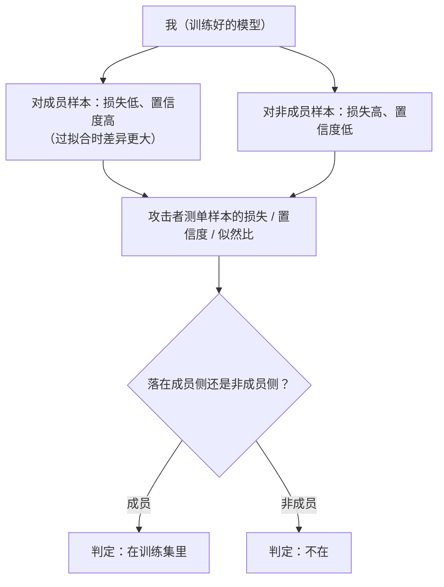

import PrivacyMeta from '@site/src/components/PrivacyMeta';

<PrivacyMeta era="卷一 · 隐私根基" technique="推断类攻击" audience={['隐私工程师', 'ML 工程师', '安全工程师']} severity="高" maturity="研究" evidence="研究支持" />

> 一句话摘要：成员推断（MIA）问一个看似无害、实则要命的问题——「**这条样本在不在我的训练集里**」。它**不需要原文**（这是它和训练数据抽取的根本区别），只要一个是 / 否；可一旦「是」本身就敏感（比如「这个人在某病种数据集里」），这个比特就是泄露。它是差分隐私要防的核心对象，也是抽取、属性推断等一连串隐私攻击的**地基**——所以放在卷一第一条。

## 机制：我这边发生了什么

我对**训练时见过**的样本和**没见过**的样本，行为有可测的差异：在见过的样本上，我的损失更低、对正确答案的置信度更高、输出更「笃定」。这是拟合训练集的自然副作用——尤其当我**过拟合**时，这道「见过 / 没见过」的缝被撑得更宽（Yeom et al., CSF 2018 把成员推断风险直接归因到过拟合与单样本影响）。

红线：这**不是**「我记得见过这条」——我无法可靠内省。可被外部观测、可复算的是：**我在成员样本与非成员样本上的输出统计（损失 / 置信度 / 似然）分布不同，且这个差异可被测量**。攻击者不需要我「承认」，他只要测这两个分布。



## 威胁面：如何被利用

攻击者要的只是「是 / 否」，门槛比抽取低：

- **影子模型（shadow models）**：Shokri 等的奠基做法——攻击者用同分布数据训练一批「影子模型」，模仿目标模型在「成员 / 非成员」上的行为，再训一个分类器去读目标模型的输出、判定成员。黑盒即可，且在 Google / Amazon 的商用 ML 服务、医院出院数据等真实敏感数据集上跑通（Shokri et al., S&P 2017）。
- **损失 / 置信度阈值**：最朴素的——成员样本损失更低，卡个阈值就能猜。简单，但容易高估「平均」效果。
- **似然比攻击（LiRA）**：Carlini 等指出，过去用**平均准确率**评估 MIA，掩盖了「攻击能不能**有把握地**揪出哪怕个别成员」；正确的口径是**在极低误报率（如 < 0.1% FPR）下的命中率（TPR）**。他们的 LiRA 按此口径**在低误报率下强约 10×**（Carlini et al., S&P 2022，逐样本校准的似然比）。

攻击者模型要写清：是否黑盒（只看输出 / 置信度）、能否拿到同分布数据训影子模型、判定口径（别用平均准确率，用低 FPR 下的 TPR）。

## 防护原理

MIA 的信号来自「成员 / 非成员行为差异」，所以防护要么**缩小这道缝**，要么给它**形式上界**：

- **降过拟合**（正则化、早停、数据增广、更多数据）：缩小成员 / 非成员的差距，削弱信号。但**没有形式保证**——高准确、看似不过拟合的模型仍可能在个别样本上泄露（LiRA 正是揪这些尾部样本）。
- **差分隐私训练（DP-SGD）**：从数学上限制单样本对我参数的影响，从而**给「区分某条样本在不在训练集」的优势一个 (ε, δ) 上界**——这正是 MIA 的形式化防御（见《[DP 微调](../03-conversational-llms/dp-fine-tuning.mdx)》）。代价是效用与算力。

点破：**降过拟合是「让信号变弱」，DP 是「给信号封顶」**——前者无保证、后者有代价，二者常叠加。

## 落地实现（配方）

把 MIA 当**审计工具**反过来用——主动攻自己的模型，量化「最脆弱的样本有多容易被认出来」：

```text
1. 切数据：留出一组确定「在训练集」(members) 与一组「不在」(non-members)。
2. 跑逐样本攻击：对每条样本算损失 / 置信度；有条件就上 LiRA（训若干影子模型、
   按逐样本似然比打分），别只卡单一全局阈值。
3. 用对口径报结果：画 ROC，看**低 FPR（如 0.1% / 1%）下的 TPR**，别只报平均准确率
   ——平均数会把「个别样本被高置信揪出」这种真风险抹平。
4. 不达标就回去：加正则 / 早停 / 更多数据压过拟合；高敏数据上 DP-SGD 给形式上界。
```

每个数字（阈值、FPR 档、影子模型数）都要带上**你自己的模型与数据条件**；论文口径未必直接迁到你的场景。

**最小可测试断言**（把上面的审计收成可回归的检查）：

- 怎么测：CI / 审计里跑逐样本 MIA（LiRA 风格），report 低 FPR 档（0.1% / 1%）下的 TPR。
- 通过：低 FPR 下 TPR 接近随机基线（≈ FPR），且加正则 / DP 后较基线明显下降。
- 失败：低 FPR 下 TPR 显著高于基线 → 有样本可被高置信认出，回去压过拟合 / 上 DP 再测。

## 真实案例

成员推断不是黑板推演。Shokri 等（2017）就在 **Google Prediction API、Amazon ML** 这类商用「机器学习即服务」上、对包括**医院出院记录**在内的真实敏感数据集，黑盒跑通了成员推断——证明「把模型 API 开出去」本身就可能泄露「谁在训练集里」。后续 Carlini 等（2022）没有推翻这件事，而是**修正了怎么量它**：用低误报率下的命中率，揭出过去「平均准确率看着低、其实尾部样本很危险」的假象。两步合起来说明：MIA 的风险是真的，且**此前可能被乐观的评估口径低估了**。

## 残余风险与权衡

逐条点破假安全：

- **「平均准确率不高」≠ 安全。** 平均数掩盖尾部——哪怕整体只略好于瞎猜，攻击仍可能在低 FPR 下**高置信揪出个别成员**（Carlini 2022 的核心）。要按低 FPR 下的 TPR 看。
- **「没过拟合」≠ 不泄露。** 降过拟合削弱信号但无形式保证；泛化良好的模型仍可能在罕见 / 离群样本上泄露成员。
- **不需要原文也算泄露。** MIA 只给「是 / 否」，但当「在某数据集里」本身敏感（病种、性取向、涉案），这个比特就是隐私事件。
- **DP 是最主流、最通用、最可组合的形式化防护框架，但要看 ε。** DP 给可证明上界，可 ε 太大时上界形同虚设；且有效用代价（见 DP 微调）。
- **成员推断是「根」，不是「顶」。** 属性推断、训练数据抽取都建立在「模型对见过的数据行为不同」之上——堵不住 MIA 的信号，上层攻击就有地基。

## 合规映射

- **GDPR**：「某人是否在某数据集中」可识别到个人，属个人数据；模型若让外部推断出成员身份，等于经由模型泄露个人数据，触及最小化、目的限制与安全义务。
- **匿名化的门槛**：MIA 是检验「去标识 / 匿名化是否真成立」的试金石——若能从模型 / 发布物高置信反推成员，所谓「匿名」就不成立（与 GDPR 对「真正匿名数据」的高门槛一致）。

（合规随法条版本演进，本段打戳 2026-06，引用前核对最新生效文本。）

## 与相邻技术的区别

- **成员推断 vs 训练数据抽取**：MIA 问「在不在」（一个比特，不要原文）；《[训练数据抽取](../02-memorization-extraction/training-data-extraction.mdx)》问「能不能把原文逼出来」。抽取通常更难、信息量更大，但两者同源——都来自「模型对见过的数据行为不同」。MIA 是更底层的那一层。
- **成员推断 vs 属性推断**：MIA 判定「这条样本在不在训练集」；属性推断判定「训练数据 / 某条记录的某个隐藏属性是什么」。前者关乎参与与否，后者关乎内容属性。
- **成员推断 vs DP**：MIA 是**攻击 / 度量**，DP 是**防御 / 保证**——DP 的 (ε, δ) 直接上界化「区分成员」的优势，二者是同一枚硬币的两面。

## 版本说明

:::note 适用版本
成员推断是**机器学习模型的机制层现象**（源自对训练集的拟合），不限某个模型或厂商，对 LLM 同样成立。方法学在演进：2017 年 Shokri 用影子模型确立黑盒 MIA、2018 年 Yeom 把风险归因到过拟合、2022 年 Carlini（LiRA）把评估口径修正为低 FPR 下的 TPR。**评估口径很关键**——用平均准确率会低估风险，本条按当前公认的低 FPR 口径表述。（出处核验于 2026-06。）
:::

## 延伸阅读与出处

- [Membership Inference Attacks Against Machine Learning Models（Shokri 等，IEEE S&P 2017；arXiv 1610.05820）](https://arxiv.org/abs/1610.05820) —— 影子模型 + 黑盒成员推断的奠基，在商用 ML 服务与医疗等敏感数据上跑通。
- [Privacy Risk in Machine Learning: Analyzing the Connection to Overfitting（Yeom 等，IEEE CSF 2018；arXiv 1709.01604）](https://arxiv.org/abs/1709.01604) —— 把成员 / 属性推断风险归因到过拟合与单样本影响。
- [Membership Inference Attacks From First Principles（Carlini 等，IEEE S&P 2022；arXiv 2112.03570）](https://arxiv.org/abs/2112.03570) —— 批评平均准确率口径，主张低 FPR 下的 TPR；LiRA 在低误报率下强约 10×。
