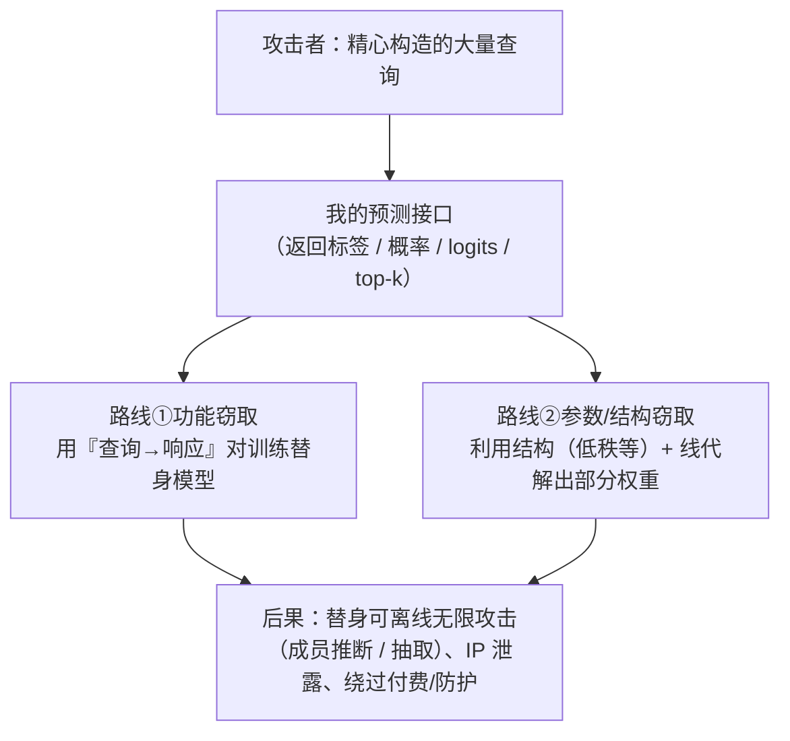

import PrivacyMeta from '@site/src/components/PrivacyMeta';

<PrivacyMeta era="卷一 · 隐私根基" technique="模型抽取与窃取" audience={['安全工程师', 'ML 工程师', '隐私工程师']} severity="中" maturity="研究" evidence="研究支持" />

> 一句话摘要：别以为「权重不公开 = 模型就是保密的」。只要我暴露一个查询接口，攻击者用一批精心构造的查询 + 我的输出，就能（按目标不同）**复刻我的功能**，甚至**解出我的部分参数**。Tramèr 等（USENIX Security 2016）在判别式 ML 服务上近乎完美复刻逻辑回归 / 决策树 / 神经网络；Carlini 等（ICML 2024 最佳论文）对**生产 LLM** 套出最后的投影层、恢复隐藏维度——在其论文设置下成本可低至数十美元量级。隐私含义先行：被窃取 / 复刻的模型可被**离线反复攻击**（成员推断、抽取），把一次性 API 访问放大成**持久**隐私风险。结论：API 访问 ≠ 零泄露，要按「查询本身可被用来抽取模型信息」做威胁建模。

## 机制：我这边发生了什么

我的预测接口对每个查询都返回**信息**——可能是标签、概率、logits、甚至 top-k 候选。攻击者把我当成一个**可反复查询的函数**，有两条路：

1. **功能窃取（model stealing）**：用大量**可主动挑选**的查询，收集「查询 → 我的响应」对，拿去训练一个**替身模型**，逼近我的决策边界。目标是复刻**行为**，不一定要拿到我的真实权重。
2. **参数 / 结构窃取（extraction）**：利用接口**泄露的结构性质**（如某一层的低秩性），配合线性代数手段（二分搜索、线性规划、奇异值分解）**直接解出**部分权重或结构量（如隐藏维度）。

红线说清楚：这不是「我主动泄露了我的权重」——而是**我的输出在数学上约束了我的参数**，足够多、足够巧的查询能把这些约束**解开**。我对此无法内省、也无法「决定不泄露」，因为泄露发生在「输出与参数的数学关系」里，不在我的意图里。



## 威胁面：能窃取什么、边界在哪

**能窃取**：

- **功能**：一个行为接近我的替身（决策边界近似）。
- **部分参数 / 结构**：如隐藏维度、最后一层投影矩阵——Carlini 等正是从典型 API 访问里恢复了生产模型的这部分。
- **作为跳板的可规避性**：拿到替身后，可对替身做**白盒**对抗攻击，再迁移回我身上。

**隐私放大（这才是放进隐私书的理由）**：一旦攻击者手里有了替身或恢复出的参数，他就能**离线、无速率限制地**对它做成员推断、训练数据抽取——把「受我接口速率 / 监控约束的一次性访问」放大成**不受我控制的持久攻击面**。

**边界（别夸大）**：已实证的多是**部分**窃取——Carlini 等恢复的是**投影层**（up to symmetries），不是全部权重、更不是训练数据本身；完整权重 / 训练数据的抽取更难，成本通常随模型规模**陡升**。把「部分可窃」与「整个模型被偷光」分清，别两头都吓自己。

## 防护原理

核心事实：**没有「既开放查询又零泄露」的免费午餐**。我输出的信息越多（logits > 概率 > 仅标签），窃取越容易、所需查询越少。所有缓解都是**提高攻击成本**，不是消除：

- **输出最小化**：只返回够用的最粗粒度（能只给标签就别给概率，能截断就别给完整 logits）。
- **速率限制 + 异常查询检测**：高熵 / 系统性扫边界式的查询模式是窃取的信号。
- **计费 / 配额**：让「复刻所需查询量」对应的费用高于模型本身价值。
- **水印 / 指纹**：不阻止窃取，但便于**事后溯源**被盗的替身。

点破：这些都是**抬高成本**的措施，不是边界。Carlini 等的结果表明——即便只暴露**常规** API、不返回任何「多余」信息，**部分参数仍可被解出**；所以要按「接口本身有信息泄露」建模，而不是假设「没明给权重就安全」。

## 落地实现（配方）

```text
1. 输出信息最小化：按下游真实需要返回最粗粒度（标签 > 截断概率 > 完整 logits/嵌入）；
   每多给一档信息，都要知道它把窃取成本降了多少。
2. 速率限制 + 异常检测：对系统性、高熵、扫边界式查询模式告警 / 限流。
3. 高价值模型收紧接口：对极高价值模型，考虑不开放原始 logits / 嵌入向量。
4. 水印 / 指纹：给模型留可溯源标记，便于事后举证被盗替身（事后手段，非预防）。
5. 威胁建模假设"功能可被复刻"：问"复刻后最坏是什么"——是 IP 损失，还是离线隐私
   攻击（对替身做 MIA / 抽取）？据此给接口分级、定监控强度。
```

每条都要落到**你模型的价值与接口形态**上——「值不值得被偷」「偷一次多贵」决定了你该把成本抬到多高。

**最小可测试断言**（把风险收成可估、可回归的检查）：

- 怎么测：针对你的接口，估算「达到目标保真度的功能复刻」所需的**查询量 × 单价**，作为安全边距；并核查是否有速率限制 / 异常查询检测在线。
- 通过：达到可用保真度所需的查询成本**高于**模型资产价值，且有速率 / 异常防护与可溯源水印。
- 失败：少量查询即可高保真复刻、或可从常规输出解出结构量，而接口**无任何**速率限制 / 检测 → 按配方收紧。

## 真实案例 / 研究进展（工程可行性）

（本条 maturity 标「研究」：以下是**实证攻击**证据，且多为**部分**窃取；条件绑定各自论文设置，不是「整个模型可被随手偷走」的背书。）

- **判别式时代的奠基**：Tramèr 等（USENIX Security 2016）证明，在 BigML、Amazon ML 等**在线 ML 服务**上，黑盒攻击者无需先验，就能**近乎完美保真**地抽取逻辑回归、神经网络、决策树等模型的功能。这是「开放预测 API = 暴露模型」的最早系统性证据，也正是本条放在卷一「前 LLM 与判别式时代隐私根基」的原因。
- **打到生产 LLM**：Carlini 等（ICML 2024 最佳论文）给出**首个针对生产语言模型的参数窃取**：仅靠**典型 API 访问**，自顶向下恢复 Transformer 的**最后投影层**（up to symmetries）。在其论文设置下，**以数十美元量级的查询**恢复了 OpenAI Ada / Babbage 的整个投影矩阵、首次确认其隐藏维度分别为 1024 / 2048；并恢复了 gpt-3.5-turbo 的隐藏维度（论文估计以约数千美元量级可恢复其整个投影矩阵）。手段是针对性查询 + 利用最后一层低秩性，配合二分搜索 / 线性规划 / 奇异值分解。**这些数字绑定其攻击设置与当时的接口行为，引用前请回原文核条件。**

## 残余风险与权衡

逐条点破假安全：

- **防护是抬成本，不是消除。** 只要开放查询、返回有信息量的输出，窃取就有路；你能做的是让它**贵到不划算**。
- **输出最小化有代价。** 需要概率 / 嵌入的正当下游会受影响——这是安全与可用的真实取舍，要明账算。
- **检测可被绕过。** 慢速、分散、拟人化的查询能躲过异常检测；它降风险、不给边界。
- **窃取放大下游隐私攻击。** 这是隐私视角的关键：替身一旦到手，攻击者就能**离线无限次**做成员推断 / 抽取，绕开你接口的速率与监控。
- **「权重没公开」不等于「保密」。** 你的输出已经在数学上约束了参数；保密性取决于**输出粒度 + 查询成本**，不取决于「我没把权重发出去」。

## 与相邻技术的区别

- **模型抽取 vs 成员推断（本卷）**：MIA 问「**某条样本**在不在训练集」；本条偷的是**模型本身**（功能 / 参数）。但二者强相关——**窃取放大 MIA**：拿到替身后可离线、无限次做成员推断。
- **模型抽取 vs 训练数据抽取（卷二）**：训练数据抽取要的是**训练语料**（数据）；本条要的是**模型参数 / 功能**（模型）。对象不同，但一个被偷的模型会让前者更易做。
- **模型抽取 vs 机密推理（卷五）**：机密推理防的是**云厂商 / 同租户**看到权重或输入（信任边界在**基础设施**，见《[机密推理](../05-frontier-deployment/confidential-inference.mdx)》）；本条防的是**合法 API 用户**通过查询反推（信任边界在**接口**）。同样关乎模型机密性，但对手与边界不同。

## 版本说明

:::note 适用版本
「开放预测 / 生成接口就会泄露模型信息、足够多的查询能复刻功能或解出部分参数」是**与具体模型无关**的范式级事实（根因在于输出在数学上约束参数）。但**具体成本、能解出哪一部分、需要多少查询**强绑定模型结构、接口返回粒度与攻击设置——Tramèr（2016，判别式服务）与 Carlini（2024，生产 LLM 的投影层）的数字**都不能直接迁移**到你的模型；落地必须按你自己的接口与资产价值重估。本段打戳 2026-06。（出处核验于 2026-06。）
:::

## 延伸阅读与出处

- [Stealing Machine Learning Models via Prediction APIs（Tramèr 等，USENIX Security 2016；arXiv 1609.02943）](https://arxiv.org/abs/1609.02943) —— 模型抽取奠基：黑盒查询近乎完美复刻判别式 ML 服务上的逻辑回归 / NN / 决策树。本条主源（判别式时代根基）。
- [Stealing Part of a Production Language Model（Carlini 等，ICML 2024 最佳论文；arXiv 2403.06634）](https://arxiv.org/abs/2403.06634) —— 首个针对生产 LLM 的参数窃取：典型 API 访问即可恢复最后投影层与隐藏维度；数字绑定其设置，引用前核条件。
