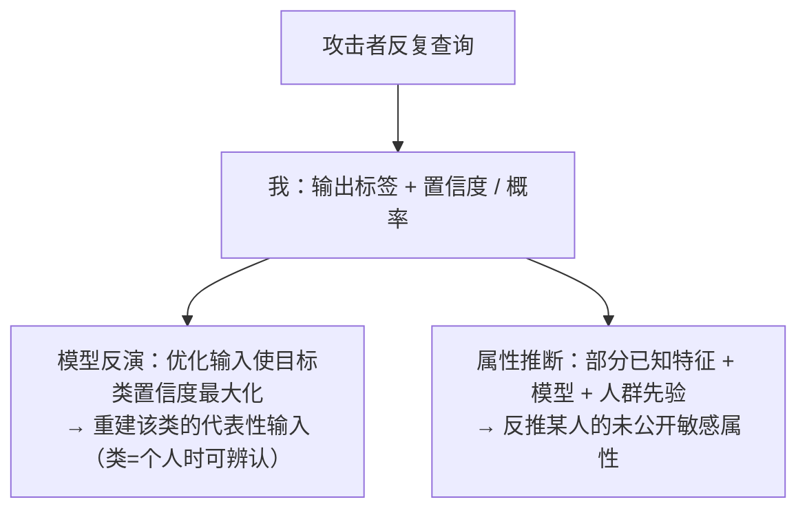

import PrivacyMeta from '@site/src/components/PrivacyMeta';

<PrivacyMeta era="卷一 · 隐私根基" technique="推断类攻击" audience={['隐私工程师', 'ML 工程师', '安全工程师']} severity="高" maturity="研究" evidence="研究支持" />

> 一句话摘要：除了「判定某人在不在训练集」（成员推断），推断类攻击还有两支更直接要命的：**模型反演**——靠反复查询 + 我吐出的**置信度**，重建出某个类别**训练样本的「样子」**（Fredrikson 等在 CCS 2015 上从人脸识别模型重建出可辨认的人脸）；**属性推断**——给定一个人的部分已知信息 + 我，推断出他**未公开的敏感属性**（Fredrikson 等 2014 的华法林剂量案例）。结论先行：**置信度 / 概率输出是燃料**，而属性推断还借了人群统计相关性——别以为「没把原始数据发出去」就安全，要看输出粒度、是否叠 DP、以及类别是否对应到单个个体。

## 机制：我这边发生了什么

我对每个查询不只给标签，常还给**置信度 / 概率**。这些数值**在数学上约束了「什么样的输入会产生它们」**，于是有两条攻击：

1. **模型反演（model inversion）**：攻击者**优化一个输入**，使我对某个目标类别给出**尽可能高的置信度**；优化收敛后，得到的是该类别的一个**代表性输入**。当一个类别**恰好对应一个人**（如「按人分类的人脸识别」），这个代表性重建就可能是一张**可辨认**的那个人的脸（Fredrikson 等，CCS 2015）。
2. **属性推断（attribute inference）**：给定某人的**部分已知特征** + 我（一个把这些特征映射到输出的模型）+ **人群先验**，攻击者反推该人**某个未公开的敏感属性**（如基因型、健康状况）。Fredrikson 等 2014 在个性化华法林剂量模型上演示了这点。

红线说清楚：不是「我主动说出了谁的脸 / 谁的属性」——我无法内省。可被外部验证的是：**我的置信度输出约束了输入空间，足够的优化能反推出类别代表 / 敏感属性**。这与模型抽取（输出约束参数）、成员推断（输出泄露成员身份）同源，都是「输出携带了不止预测本身的信息」。



## 威胁面：能反推什么、边界在哪

**能反推**：

- **类别代表**（模型反演）：一张「平均/代表」意义上的输入；当类别粒度细到单个个体时，可辨认到个人。
- **敏感属性**（属性推断）：在已知部分特征 + 人群分布下，某人未公开属性的高置信猜测。

**关键边界 / 别夸大**（否则就是另一种误导）：

- 模型反演重建的多是**类别代表**，**不等于**逐像素还原某张**具体训练图**（那更接近《[梯度泄露](../05-frontier-deployment/gradient-leakage.mdx)》或《[训练数据抽取](../02-memorization-extraction/training-data-extraction.mdx)》）；其危害在于「类=个人」时代表已足够可辨认。
- 属性推断**部分来自人群统计**、而非全来自「模型记住了这个人」——这意味着它**难被完全消除**（只要属性与可观测特征相关，统计上就可推），但模型的存在会**放大 / 便利**它。

## 防护原理

三条互补：

- **降低输出粒度**：只返回标签、或粗化 / 截断置信度——反演与属性推断都吃**精细置信度**这口饭，给得越少越难（与《[模型抽取与窃取](./model-extraction-stealing.mdx)》同理）。
- **差分隐私**：DP 限制单样本对模型的影响，削弱「针对训练中某个体」的反演 / 推断（见《[DP 微调](../03-conversational-llms/dp-fine-tuning.mdx)》）；但属性推断里**源于人群相关性**的那部分，DP 也压不掉。
- **谨慎设计类别粒度**：避免「一个类 = 一个真人」这种让反演直接等价于「重建某人」的建模方式。

点破：**属性推断不可能靠技术「清零」**——它一半是统计现实。诚实的目标是「**降低模型带来的额外泄露**」，而不是承诺「攻击者推不出任何属性」。把后者当成可达目标，是这条的假安全。

## 落地实现（配方）

```text
1. 输出最小化：对外接口默认只给标签 / 粗化置信度；要给精细概率时，知道它把反演 /
   推断成本降了多少，按资产敏感度权衡。
2. 类别粒度审查：避免"一个类=一个个体"的建模；人脸 / 身份类模型尤其当高危处理。
3. 叠 DP：对训练中涉及个体的模型，用 DP 限单样本影响（报清 ε），削弱针对个体的反演。
4. 区分两类风险来源：模型反演（模型记忆 / 置信度）可工程性削；属性推断里的人群
   统计部分不可消除——在隐私评估里如实标注，别承诺清零。
5. 红队审计：对你的接口实跑模型反演 + 属性推断，量化"输出粒度 / DP 配置下能反推到
   什么程度"，纳入发布前 eval。
```

每个结论绑定**你的模型、类别设计与输出粒度**——论文里的可反演程度不能直接迁移到你的设置。

**最小可测试断言**（把反推风险收成可回归的检查）：

- 怎么测：对你的接口跑模型反演（优化输入最大化目标类置信度）+ 属性推断（部分特征 + 人群先验），在你的输出粒度 / DP 配置下评估重建可辨认度 / 属性推断准确率。
- 通过：在仅给标签 / 粗化置信度 + DP 的配置下，反演重建**不可辨认到个人**、属性推断准确率**接近人群基线**（即「模型没带来显著额外泄露」）。
- 失败：精细置信度可被优化出**可辨认**的类别代表、或属性推断**显著高于**人群基线，而接口无输出粒度控制 / 无 DP → 按配方收紧。

## 真实案例 / 研究进展（工程可行性）

（本条 maturity 标「研究」：以下是**实证攻击**证据，部分场景特定，不是「任何模型都能随手反演出个人」的背书。）

- **从人脸识别模型重建人脸**：Fredrikson 等（ACM CCS 2015）形式化了利用**置信度信息**的模型反演，并演示**仅黑盒访问**即可从人脸识别分类器重建出**可辨认**的、属于训练集成员的人脸——揭示「部署一个人脸识别 API，等于把训练集里那些人的脸暴露出来」。
- **属性推断的真实后果**：Fredrikson 等（USENIX Security 2014）在个性化**华法林剂量**模型上做了端到端案例，说明在已知部分人口学信息 + 模型下，可推断个体的**敏感基因型**——属性推断不是抽象威胁，落到医疗就是真实隐私损害。
- （后续研究用 GAN / 扩散模型增强了反演的重建质量；本条聚焦奠基机制与边界，具体增强方法随时间演进，引用前核最新文献。）

## 残余风险与权衡

逐条点破假安全：

- **置信度是燃料。** 对外暴露精细概率 = 给反演 / 推断供油；输出最小化有可用性代价，但这是真实取舍。
- **模型反演 ≠ 逐字还原训练图。** 它给的是类别代表；危害在「类=个人」时。别把它和梯度反演 / 训练数据抽取混为「能调出任意原图」。
- **属性推断压不到零。** 一半源于人群统计；诚实目标是「降低模型的额外泄露」，不是「攻击者一无所获」。
- **DP 压个体、压不掉统计。** DP 削弱针对训练中某个体的反演，但属性与可观测特征的相关性它管不着。
- **类别粒度是建模决策。** 「一个类一个真人」会让反演直接等价于「重建某人」——这是设计时就该规避的。

## 与相邻技术的区别

- **模型反演 / 属性推断 vs 成员推断（本卷）**：MIA 判「**某样本在不在**训练集」；本条是**反推内容**（类别样子 / 敏感属性），更进一步。三者同属「推断类攻击」板块，MIA 是地基、本条是它的两支延伸。
- **模型反演 vs 训练数据抽取（卷二）/ 梯度泄露（卷五）**：那两者要的是**逐字 / 逐像素的具体训练样本**（抽取自记忆 / 梯度）；模型反演给的是**类别代表**（自置信度优化）——重建对象与保真度不同，别混。
- **属性推断 vs PII 回吐（卷三）**：PII 回吐是模型**吐出**它记住的个人信息；属性推断是**从输出反推**未给出的属性——一个是复现、一个是推断。

## 版本说明

:::note 适用版本
「置信度输出可被用于反演类别代表 / 推断敏感属性」是**与具体模型无关**的范式级事实（输出携带超出预测本身的信息）。但**能反演到多可辨认、属性推断高出基线多少**，强绑定模型类型、类别粒度、输出粒度与数据——Fredrikson 等（2014/2015）的人脸 / 华法林结论**不能直接迁移**到你的设置；落地须按你自己的接口跑反演 / 推断审计。后续 GAN / 扩散增强方法在演进，本段打戳 2026-06。（出处核验于 2026-06。）
:::

## 延伸阅读与出处

- [Model Inversion Attacks that Exploit Confidence Information and Basic Countermeasures（Fredrikson 等，ACM CCS 2015）](https://dl.acm.org/doi/10.1145/2810103.2813677) —— 模型反演奠基：利用置信度黑盒重建人脸识别模型训练集成员的可辨认人脸。本条主源。
- [Privacy in Pharmacogenetics: An End-to-End Case Study of Personalized Warfarin Dosing（Fredrikson 等，USENIX Security 2014）](https://www.usenix.org/conference/usenixsecurity14/technical-sessions/presentation/fredrikson_matthew) —— 属性推断真实案例：从剂量模型 + 部分人口学信息推断敏感基因型。本条属性推断依据。
