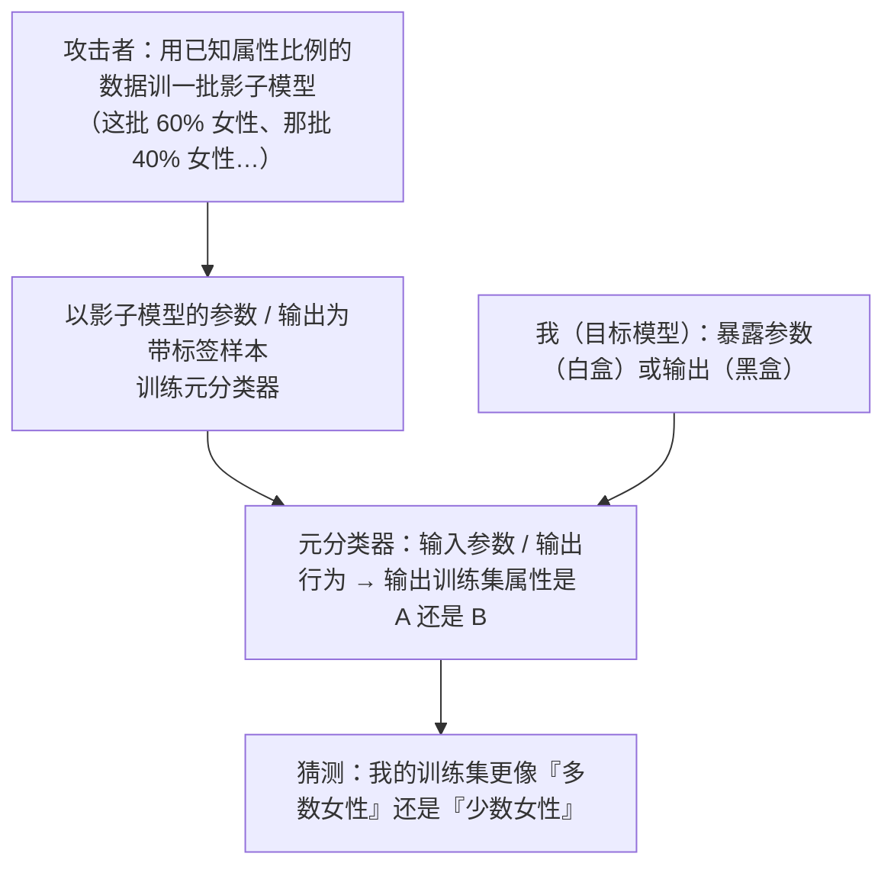

import PrivacyMeta from '@site/src/components/PrivacyMeta';

<PrivacyMeta era="卷一 · 隐私根基" technique="推断类攻击" audience={['隐私工程师', 'ML 工程师', '安全工程师']} severity="中" maturity="研究" evidence="研究支持" />

> 一句话摘要：这条不是判定某人在不在（成员推断），也不是重建某条样本（反演），而是套出我整个训练**集**的**统计属性**——「这个模型是用『多少比例女性 / 某族裔』的数据训出来的」。Ganju 等（CCS 2018）用一个**元分类器**做到了：在美国人口普查收入数据上，能区分「训练集 38% 女性 vs 65% 女性」、「0% 白人 vs 87% 白人」两种构成。Suri & Evans（PoPETs 2022）进一步把它**形式化**为「分布推断」，并给出 `n_leaked` 指标量化风险。结论先行：**训练集的群体构成本身就可能敏感**（商业机密 / 群体隐私），别只盯着保护单个个体——有时攻击者要的根本不是某一条记录。

## 机制：我这边发生了什么

我的**参数**和**输出统计**，在数学上携带了训练集**整体分布**的痕迹——不是某一条记录，而是「这批数据长什么样」。攻击者据此训一个**元分类器（meta-classifier）**：输入是我的参数（白盒）或我的输出行为（黑盒），输出是「这个模型的训练集属性更像 A 还是 B」（如「女性占多数还是少数」）。

具体到 Ganju 等（CCS 2018）的白盒做法：全连接网络（FCNN）的神经元有**置换不变性**——同一层里把神经元换个顺序，函数完全不变，但**原始权重向量的排列**会变。直接把权重喂给元分类器，它会被这种无意义的排列噪声淹没；他们用一个**对神经元置换不变的表示**（先把每个神经元的参数映射成特征、再对一层内做置换不变聚合）来喂元分类器，于是元分类器学会从「一层的整体参数分布」里读出训练集属性。攻击者先用**已知属性比例**的数据训出一批「影子模型」（这批训练集 60% 女性、那批 40% 女性…），拿它们的参数当带标签样本来训元分类器；训好后，对着我的参数跑一次，就得到对我训练集比例的猜测。

红线说清楚：不是「我知道我训练集里有多少比例女性 / 我记得这批数据的构成」——我无法内省自己训练集的比例。可被外部复算验证的是：**我的参数 / 输出统计随训练集的群体构成而变，足以让攻击者训一个元分类器把不同构成区分开**。



## 威胁面：能推什么、攻击者要什么前提

**能推**：训练集的**聚合 / 群体属性**——某敏感特征的**比例 / 构成**（多少比例女性、某族裔占比、某地区样本占比、正负样本比例），而不是任何一条具体记录。Ganju 等在人口普查收入数据上区分的是 38% vs 65% 女性、0% vs 87% 白人这类**整体构成**差异。

**攻击者模型 / 前提**（决定可行性，照 BACKLOG-privacy.md「分类必核清单」写清）：

- **白盒 vs 黑盒**：Ganju 等的演示是**白盒**——攻击者拿得到我的参数（如开源 / 共享权重、联邦学习中传参、模型外泄）。这是最强、也最直接的设定。属性 / 分布推断也有**黑盒**变体（只查询、看输出行为来训元分类器），但黑盒一般更难、信息更少。**先认清你的暴露面是哪种。**
- **能训影子模型**：攻击者需要能用**已知属性比例**的数据训出与我同架构的影子模型（知道或能逼近我的训练流程与架构）。
- **二选一 / 区分式**：经典设定是**区分两种构成**（A vs B），不是直接读出连续比例；要估到「具体百分之多少」更难，且强依赖影子模型覆盖的比例范围。
- **成功判定**：元分类器在留出的目标模型上的**区分准确率**——以及（见下）Suri & Evans 把它折算成的 `n_leaked`。

## 防护原理

先把话说死：**分布推断压不到零，这是统计现实**——就像《[模型反演与属性推断](./model-inversion-attribute-inference.mdx)》里源于人群相关性的那部分。只要参数 / 输出在统计上随训练集构成而变（它必然变，否则模型学不到东西），原则上就有可学习的信号。所以诚实的目标是「**评估并知情**」，不是「承诺攻击者推不出任何群体属性」。把后者当可达，就是这条的假安全。

在此前提下，能做的是**抬高攻击成本、缩小泄露**：

- **差分隐私有一定帮助、但靶心不对**：DP 限制**单个样本**对参数的影响，对「针对训练中某个体」的攻击（成员推断 / 个体反演）直接有效；但分布推断要的是**整体构成**这个聚合量，DP 的个体级保证**不直接覆盖**它——别把 DP 当分布推断的银弹。（DP 机制见《[DP 微调](../03-conversational-llms/dp-fine-tuning.mdx)》。）
- **控制参数暴露面**：白盒是最强设定。能不公开原始权重就别公开（蒸馏 / 仅暴露 API / 联邦学习里加安全聚合），把攻击者从白盒推回黑盒，信号大幅减少。
- **用 `n_leaked` 量化、而非感觉**：Suri & Evans（PoPETs 2022）把「元分类器的区分准确率」折算成一个直觉量——**攻击者若改为直接从总体分布里采样、要采多少条记录才能达到同样的区分力**。这把抽象的「攻击成功率」变成「相当于泄露了 N 条采样」，便于和你的资产敏感度对齐。

## 落地实现（配方）

```text
1. 先认清暴露面：你的模型是开源权重 / 联邦传参（白盒），还是仅 API（黑盒）？
   白盒下分布推断信号最强——把"是否必须公开权重"当成隐私决策，而非工程默认。

2. 把"训练集群体构成"列入资产清单：它可能是商业机密（数据来源构成）或群体隐私
   （某敏感属性比例）。别只在威胁建模里写"保护单条记录"。

3. 跑分布推断红队（区分式）：用已知比例的数据训影子模型 + 元分类器，评估"在你的
   暴露面（白盒 / 黑盒）下，能否区分你关心的两种构成（如某属性 30% vs 70%）"。
   白盒可参照 Ganju 等的置换不变表示思路。

4. 用 n_leaked 报风险，而不是只报一个准确率：把元分类器的区分力折算成"相当于
   攻击者直接采样多少条记录"（Suri & Evans）。区分越容易，n_leaked 越小、风险越实。

5. 收紧暴露面：能蒸馏 / 仅暴露 API / 加安全聚合就做，把白盒推回黑盒。叠 DP 可削
   个体级攻击，但在隐私评估里如实标注"DP 不直接覆盖分布推断"，别承诺清零。
```

每个结论都绑定**你的模型架构、暴露面与你关心的属性**——论文里在人口普查数据上的可区分程度**不能直接迁移**到你的设置。

**最小可测试断言**（把分布推断风险收成可回归的检查）：

- 怎么测：用已知属性比例的数据训一批影子模型 + 元分类器，在你的真实暴露面（白盒参数 / 黑盒输出）下，测元分类器对「你关心的两种群体构成」的区分准确率，并折算 `n_leaked`。
- 通过：在你**实际对外暴露**的形态下（如仅 API、加安全聚合），元分类器区分准确率**接近随机**、或对应的 `n_leaked` **大到攻击者直接采样更划算**（即模型没带来显著额外的分布泄露）。
- 失败：在你暴露权重的形态下，元分类器能**显著区分**你关心的两种构成、`n_leaked` 小 → 按配方收紧暴露面（蒸馏 / 撤回白盒 / 安全聚合），并在隐私评估里如实记录残余风险。

## 真实案例 / 研究进展（工程可行性）

（本条 maturity 标「研究」：以下是**实证攻击 / 形式化**证据，强绑实验数据集与设定，不是「任何模型都能随手读出训练集比例」的背书。）

- **从全连接网络读出训练集群体构成（白盒）**：Ganju 等（ACM CCS 2018）提出利用 FCNN **置换不变性**的元分类器属性推断，在美国**人口普查收入**数据上，能区分训练集「**38% 女性 vs 65% 女性**」「**0% 白人 vs 87% 白人**」这类整体构成——揭示「共享一个在敏感人群上训出的模型权重，等于泄露了这批训练数据的群体构成」。（本条不引一个具体的「顶线准确率」数字：该数字未能核验；这里只描述其设置与可区分的构成条件。）
- **把风险形式化 + 给出 `n_leaked`**：Suri & Evans（PoPETs 2022）把上述现象形式化为**分布推断（distribution inference）**，并提出 `n_leaked` 指标——把区分准确率折算成「攻击者要直接从分布采样多少条记录才能达到同等区分力」。区分**难**的比例对（如 0.5 vs 0.51）需要更多采样（论文给出的一个量级是 95% 区分准确率 ≈ `n_leaked` 84），而区分**易**的比例对（如 0.5 vs 0.9）只需极少（同样 95% 准确率 ≈ `n_leaked` 3）。这让「分布推断有多严重」可被量化对齐到资产敏感度。
- （奠基线索：元分类器式属性推断最早可追溯到 Ateniese 等「Hacking Smart Machines with Smarter Ones」，Int. J. Security and Networks 2015；上述两篇把它推进到神经网络与形式化量化。引用具体增强方法前核最新文献。）

## 残余风险与权衡

逐条点破假安全：

- **分布推断压不到零。** 只要参数 / 输出随训练集构成而变（它必然变），统计上就有可学习信号；诚实目标是「评估并知情、缩小额外泄露」，不是「攻击者一无所获」。
- **DP 不是这条的银弹。** DP 给的是**个体级**保证，分布推断要的是**聚合构成**——靶心不重合。叠 DP 能削个体攻击，但别把它当分布推断的解药。
- **白盒是最强设定。** 公开权重 / 联邦传参把信号开到最大。能蒸馏 / 仅暴露 API / 加安全聚合就把攻击者推回黑盒——这是设计期就该做的暴露面决策。
- **「群体构成」也是要保护的资产。** 它可能是商业机密（数据来源）或群体隐私（敏感属性比例）。只防「单条记录」会漏掉这一整类风险。
- **数字强绑设定。** Ganju 的可区分构成（38% vs 65% 等）、Suri & Evans 的 `n_leaked`（84 / 3 等）都死绑人口普查数据集与具体比例对——别迁移成「我的模型也是这个数」。

## 与相邻技术的区别

把「**个体 vs 群体**」这条轴讲清——这是本条与两个邻居的根本分界：

- **vs 《[成员推断](./membership-inference.mdx)》（本卷）**：成员推断问「**某一个个体在不在**训练集」（一个是 / 否比特）；本条问「训练**集整体**的群体构成是什么」（一个聚合属性）。前者是个体级，后者是群体级——同属「推断类攻击」板块，但泄露的单位不同。
- **vs 《[模型反演与属性推断](./model-inversion-attribute-inference.mdx)》（本卷）**：那条的「属性推断」是推**某一个个体**未公开的敏感属性（这个人的基因型），或重建**某一类的代表样本**；本条推的是**整个训练集**的群体属性（多少比例女性）。一个落在**个体**身上，一个落在**总体**分布上——名字都带「属性」，但作用单位正相反，别混。

## 版本说明

:::note 适用版本
「参数 / 输出统计携带训练集分布痕迹、可被元分类器读出群体属性」是**与具体模型无关**的范式级事实。但**能区分到多细的构成、`n_leaked` 是多少**，强绑模型架构、暴露面（白盒 / 黑盒）、影子模型覆盖的比例范围与数据集——Ganju 等（2018）的人口普查可区分构成、Suri & Evans（2022）的 `n_leaked` 数值**不能直接迁移**到你的设置；落地须按你自己的暴露面跑分布推断审计。两篇之外的增强方法在演进，本段打戳 2026-06。（出处核验于 2026-06。）
:::

## 延伸阅读与出处

- [Property Inference Attacks on Fully Connected Neural Networks using Permutation Invariant Representations（Ganju 等，ACM CCS 2018）](https://dl.acm.org/doi/10.1145/3243734.3243834) —— 白盒属性推断：利用 FCNN 置换不变性的元分类器，在人口普查收入数据上区分训练集群体构成（38% vs 65% 女性、0% vs 87% 白人）。本条主源。
- [Formalizing and Estimating Distribution Inference Risks（Suri & Evans，PoPETs 2022）](https://petsymposium.org/popets/2022/) —— 把属性推断形式化为分布推断，并提出 `n_leaked`（区分难的比例对 ≈84、易的 ≈3）量化风险。本条分布推断形式化与量化依据。
- （奠基，选读）Ateniese 等，「Hacking Smart Machines with Smarter Ones」（Int. J. Security and Networks 2015）—— 元分类器式属性推断的源头。
