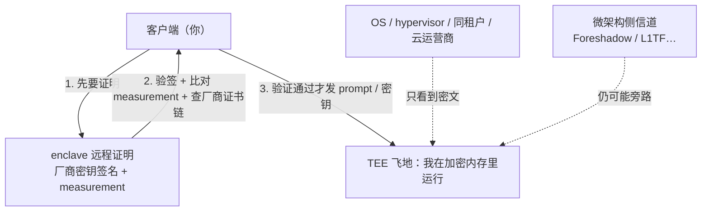

import PrivacyMeta from '@site/src/components/PrivacyMeta';

<PrivacyMeta era="卷一 · 隐私根基" technique="隐私保护计算" audience={['隐私工程师', '安全工程师', 'ML 工程师']} severity="中" maturity="生产" evidence="官方文档" />

> 一句话摘要：可信执行环境（TEE）用**硬件**把「**使用中的数据**」（data in use）圈进一个加密、可远程证明的飞地（enclave），让同租户、恶意 OS / hypervisor、甚至云运营商都看不到里面——这是把 LLM 的 prompt 与权重**对云厂商保密**的硬件路线。但记牢两条边界：**信任根是芯片厂商**（你信的是 Intel / AMD / NVIDIA 的密钥与实现），且 TEE 反复被**微架构侧信道**攻破（Foreshadow 一类）。它是卷五「机密推理」的承重墙，所以先在卷一交代清楚它**保证什么、不保证什么**。

## 机制：我这边发生了什么

当我（模型）跑在 TEE 里，这边发生两件事：

1. **内存 / 显存被硬件加密、隔离。** 我处理你 prompt 的那块内存，由具体 TEE 机制在运行时加密、隔离，**部分平台**另提供完整性或回滚防护——具体保证取决于 SGX / TDX / SEV-SNP / GPU TEE 的型号、固件与证明范围，别当作所有 TEE 等同；OS、hypervisor、同机其他租户即便有更高权限，读到的也是密文。机密计算联盟（CCC）把 TEE 的保证定义为三条：**数据机密性、数据完整性、代码完整性**（CCC, *A Technical Analysis of Confidential Computing*）。
2. **远程证明（remote attestation）。** 硬件用**厂商签名的密钥**生成一份报告，证明「这是真 enclave、跑的是你指定的那份代码（measurement 匹配）」。你**先验证这份证明，再**把 prompt / 密钥发进来。NVIDIA H100 是首个支持机密计算的 GPU：片上信任根 + 签名证明报告，CPU 与 GPU 之间用 **AES-GCM-256** 加密传输（NVIDIA 官方）。

红线：TEE 给的是「**外部看不到 + 可证明身份**」，**不是**「绝对安全」。它把信任**转移**到芯片厂商，不护 enclave 内代码自身的 bug，也挡不住下面会说的侧信道。



## 威胁面：TEE 防什么、不防什么

- **防**：同租户偷窥、恶意 OS / hypervisor、（部分型号下）有物理访问的云运营商——核心是「把数据交给云，但云看不到明文」。
- **不防 ① 信任根失守**：你被迫信任芯片厂商的密钥体系与实现；厂商的根密钥或证明服务一旦出问题，整条信任链垮掉。
- **不防 ② 微架构侧信道**：Foreshadow（L1 Terminal Fault）用瞬态乱序执行从 SGX enclave 读出受保护内存，演示中**连 Intel 用于远程证明的密钥都被提取**（Van Bulck et al., USENIX Security 2018）；此后 SGAxe、ÆPIC Leak 等一再证明，TEE 的机密性会被新的微架构攻击周期性攻破。
- **不防 ③ enclave 内代码的漏洞**：TEE 保证「外面看不到」，不保证里面的代码没 bug——飞地内的内存损坏照样泄密。
- **不防 ④ 旁路**：数据一旦被你的代码从 TEE 里导出去（写日志、发给非 TEE 服务），保护即终止。

## 防护原理

TEE 靠三件套成立：**硬件隔离 + 运行时内存加密 + 远程证明**。承重点是**远程证明**——没有它，「我把数据发给一个声称是 TEE 的东西」毫无意义（对端可能是个冒充的普通进程）；有它，你能在交出明文**之前**，用密码学验证对端确实是真硬件上的真代码。所以工程上「用了 TEE」与「正确验证了证明」是两回事，后者才是安全边界。

## 落地实现（配方）

```text
1. 选硬件：CPU TEE（Intel TDX / SGX、AMD SEV-SNP）保护 CPU 侧；
   GPU TEE（NVIDIA H100 / H200 机密计算）保护 GPU 侧的模型推理。
2. 客户端做证明验证（关键）：发数据前——验厂商签名、比对 measurement（是否
   你指定的代码 / 模型）、检查厂商证书链与撤销状态；任一不符就拒发。
3. 链路加密：CPU-GPU、客户端-enclave 全程加密（如 H100 的 AES-GCM-256），
   别让数据在进出飞地的通道上裸奔。
4. 缩小 TCB：飞地内只放必要代码（模型 + 最小运行时），减少「enclave 内 bug」面。
5. 跟微码 / 补丁：侧信道靠厂商微码与缓解持续打补丁，锁定具体 CPU 型号与微码版本。
```

每个选择都要带上**你的威胁模型**：你是要防同租户、防云运营商、还是防有物理访问的攻击者？不同目标对应不同硬件与不同残余侧信道假设。

**最小可测试断言**（把证明验证收成可回归的检查，别停在「我们用了 TEE」）：

- 怎么测：篡改 / 伪造 enclave 或改动代码 measurement，跑客户端验证流程。
- 通过：measurement 不匹配、厂商签名无效、或证书链 / 撤销检查失败时，客户端**一律拒绝发送明文**；只有全部通过才发。
- 失败：客户端不验证证明（或只建了 TLS、却不比对 measurement）→ 等于没用 TEE，回去把证明验证设成发送前置闸门。

## 真实案例 / 厂商现状

TEE 是**在产**技术：Intel SGX / TDX、AMD SEV-SNP 是 CPU 侧的成熟产品；**NVIDIA H100 是首个支持机密计算的 GPU**——标准 PyTorch / TensorFlow / ONNX 模型**不改动**即可在 GPU TEE 里跑，客户端只需在发数据前加一步证明验证（NVIDIA 官方）。这把「机密推理」从理论推到了「能在主流 AI 栈上落地」。

:::caution 待核验
Apple Private Cloud Compute（PCC）被宣传为面向消费级的机密推理生产实例，本条**未深核**其机制细节（远程证明范围、对 Apple 自身的信任假设）。引用前请核 Apple Security 官方文档（已记入 `BACKLOG-privacy.md`「写作前必核」）。
:::

## 残余风险与权衡

逐条点破假安全：

- **「跑在 TEE 里」≠ 安全。** 侧信道史（Foreshadow / SGAxe / ÆPIC…）一再证明机密性会被攻破；安全性绑定具体 CPU 型号、微码版本与补丁状态，不是一劳永逸。
- **「有 TEE 就不用信云厂商」≠ 消除信任。** 你只是把信任**从云运营商转移到芯片厂商**——根密钥、证明服务、硬件实现都得信。信任没消失，只换了对象。
- **不验证远程证明 = 没用 TEE。** 最常见的落地错误：建了飞地却不在客户端比对 measurement，等于把明文发给一个「自称」TEE 的黑盒。
- **TEE 不管 enclave 内的 bug。** 飞地内的内存损坏、逻辑漏洞照样泄密；TCB 越大风险越高。
- **性能开销随场景差异大。** 内存加密、CPU-GPU 加密传输、权重换入换出都会带来开销，**从个位数百分比到数倍均有报告**，取决于 workload / 模型规模 / batch / 是否含权重保护与远程证明——落地必须用你的负载实测，别搬单一乐观数（具体数字待一手核，见 `BACKLOG-privacy.md`）。

## 合规映射

- **GDPR Art.32（适当技术措施）**：TEE 把「使用中数据」也纳入保护（补上 at-rest / in-transit 之外的缺口），有助于论证「已采取适当技术与组织措施」。
- **责任不因 TEE 消失**：把推理放进云上 TEE，云厂商在法律上仍可能是**处理者 / 子处理者**——技术上看不到明文，不等于合同与责任关系自动解除（仍需 DPA、子处理方披露等，见《[推理服务数据边界](../06-governance-compliance/inference-service-data-boundary.mdx)》）。

（合规随法条版本演进，本段打戳 2026-06，引用前核对最新生效文本。）

## 与相邻技术的区别

- **TEE vs HE / MPC**：TEE 靠**硬件信任**换性能——快、通用，但要信芯片厂商、且有侧信道；HE / MPC 靠**密码学**——不信任何硬件，但慢得多（见《[HE·MPC](./he-mpc.mdx)》——同卷另一条地基）。三者常被放在一起选型：用硬件信任换速度，还是用密码学换「零硬件信任」。
- **TEE vs DP**：TEE 护「**使用中的数据不被外部看到**」（运营 / 部署面）；差分隐私护「**模型输出不泄露单样本**」（训练面）。一个挡外部窥视、一个限内部泄露，正交，可叠加。

## 版本说明

:::note 适用版本
TEE 是**与具体模型无关**的硬件机制，但**强绑定具体芯片与微码**：保证、性能、已知侧信道都随 CPU / GPU 代际和补丁变化。本条按 2026-06 的产品现状（Intel SGX/TDX、AMD SEV-SNP、NVIDIA H100/H200 机密计算）表述；具体型号的安全与开销以厂商当下文档和你的实测为准。（出处核验于 2026-06。）
:::

## 延伸阅读与出处

证据为混合——**主要：官方文档 / 标准**（CCC、NVIDIA）；**补充：研究**（Foreshadow 侧信道）。

- [A Technical Analysis of Confidential Computing（CCC，v1.3）](https://confidentialcomputing.io/wp-content/uploads/sites/10/2023/03/CCC-A-Technical-Analysis-of-Confidential-Computing-v1.3_unlocked.pdf) —— 标准：TEE 的机密性 / 完整性 / 代码完整性定义与「data in use」缺口。
- [Confidential Computing on H100 GPUs（NVIDIA 官方）](https://developer.nvidia.com/blog/confidential-computing-on-h100-gpus-for-secure-and-trustworthy-ai/) —— 官方：首个机密计算 GPU、片上信任根、远程证明、CPU-GPU AES-GCM-256 加密。
- [Foreshadow: Extracting the Keys to the Intel SGX Kingdom（Van Bulck 等，USENIX Security 2018）](https://www.usenix.org/conference/usenixsecurity18/presentation/bulck) —— 研究：L1TF 瞬态执行从 SGX enclave 抽出受保护内存，连证明密钥都被提取。
