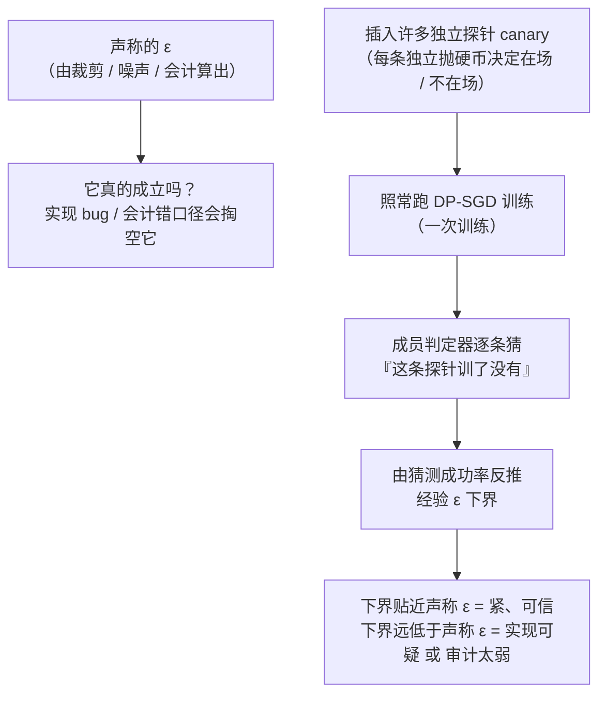

import PrivacyMeta from '@site/src/components/PrivacyMeta';

<PrivacyMeta era="卷二 · 记忆与抽取" technique="隐私评测与审计" audience={['隐私工程师', 'ML 工程师', '安全工程师']} severity="中" maturity="研究" evidence="研究支持" />

> 一句话摘要：你打开 DP-SGD、在模型卡上报了「ε=8」——但这个 ε 是真的吗？裁剪写错、噪声加少、会计用错口径，都会**悄悄**把那条保证掏空，而报告上的数字纹丝不动。**DP 审计**就是那道测试：往训练里插入大量独立探针，训练后用「猜哪些探针在场」的成功率，反推出一个**经验 ε 下界**——你实际交付的隐私，不会比这个下界更强。Steinke 等（NeurIPS 2023 杰出论文）把它做到了**一次训练**就能跑，便宜到可以当回归项。结论先行：**「用了 DP 库」不等于「ε 成立」**，审计是把「声称的 ε」变成「审计过的 ε」的唯一经验手段。

## 机制：我这边发生了什么

普通训练里，单条样本能在多大程度上拽动我的参数，没有差分隐私意义上的统一上界；DP-SGD 用逐样本裁剪 + 加噪给它装了一个可证明的 (ε, δ) 天花板（怎么做见《[DP 微调](../03-conversational-llms/dp-fine-tuning.mdx)》）。**但那条 (ε, δ) 是从代码里的裁剪范数、噪声乘子、采样率、步数，经由隐私会计算出来的——算出来不等于真的成立。** 只要实现里有一处偏差（梯度没真裁到、噪声加在错的地方、会计把采样率填错、批采样不是 Poisson），报告的 ε 就是纸面数字，实际泄露可能大得多。

审计换一个方向逼近它：不信任「算出来的 ε」，而是**从可观测行为里下界出「实际交付的 ε」**。做法是往训练集里插入许多**独立的探针（canary）**——每条探针以一枚独立的随机硬币决定「在场 / 不在场」。训练结束后，用一个成员判定器逐条**猜**「这条探针到底训了没有」。猜得越准，说明我对「某条样本在不在训练里」区分得越开；而 (ε, δ)-DP 恰恰是给这种可区分性设上界的——于是「猜测成功率」可以被翻译回一个 **ε 的经验下界**：任何声称的 ε，都不该低于审计逼出来的这个下界。

这里必须把红线说清楚，否则就是在制造假安全：审计**不是**我在内省「我记得这条探针、我知道它在我的训练集里」——我无法可靠地内省训练数据的影响。审计测的是一个**外部可观测、可复算的量**——由「对插入探针的成员猜测成功率」推出的经验 ε 下界。主语可以是「我」，但谓语（成员可被猜中的程度、由此下界的 ε）是别人能从我的输出 / 权重上算出来的，不是我自陈的记忆。经验下界大到贴近声称的 ε，说明保证「紧」、比较可信；下界远小于声称的 ε，只说明「要么实现 / 会计出了问题，要么这次审计本身太弱」——它是一个**下界**，两种可能它区分不了（见「残余风险」）。



## 威胁面：审计能测什么、测不到什么

这条是**防御方的测量工具**——你拿它验自己的 DP 实现，不是攻击别人。所以「威胁面」换成**能力与盲区**：

**能测**：

- **经验 ε 下界**：一个「你实际交付的隐私不会强于此」的可核数字。它给「声称的 ε」立起一道经验对照——报了 ε=8，就该问审计能不能逼出接近的下界。
- **实现 / 会计 bug**：审计逼出的下界**明显超过**你声称的 ε，是硬红灯——意味着你的实际隐私比声称的差，八成是裁剪没生效、噪声加错、会计口径填错、或采样不是 Poisson。这类 bug 靠读代码常常看不出来，审计能从行为上照出来。
- **一次训练的成本**：Steinke 等的关键贡献是把审计从「训几百个模型」压到「训一个模型」——靠在**同一次**训练里插入许多**独立**探针、用它们的在场 / 不在场当多次独立试验（Steinke et al., NeurIPS 2023）。便宜到可以挂进 CI 回归。

**测不到 / 局限**（必须说清，否则又是一种假安全）：

- **审计只给下界，不给上界。** 上界（「最坏泄露不超过多少」）仍然只能靠**证明**——即隐私会计。审计过关只是「没抓到反例」，绝不等于「ε 已被证成立」。下界与上界要合起来看：会计给上界、审计给下界，两头夹逼才有意义。
- **松下界 ≠ 实现是对的。** 审计逼出的下界远小于声称 ε，可能是实现真的好，**也可能只是这次审计太弱**（探针设计差、成员判定器弱、黑盒只能看最后一步）——审计弱和实现对，从一个松下界里**分不出来**。
- **黑盒常松于白盒。** 攻击者能看到的越多，下界越紧：能看到所有中间步（白盒）比只能看最后一个模型（黑盒）逼得紧。同一实现，黑盒审计给的下界通常更松——别把黑盒的松下界当成「实现很安全」。
- **只在你测的探针 / 威胁模型内有效。** 换探针设计、换成员判定器、换威胁模型，下界会变；论文里的下界数字不能直接迁到你的场景。

## 防护原理

审计能成立，靠的是**差分隐私与统计可区分性之间的对应**：(ε, δ)-DP 给「一条样本在场 / 不在场对输出分布的影响」设了上界，因此也给「从输出反猜某条样本是否在场」的成功率设了上界。反过来用——**如果你观测到的成员猜测成功率，高到只有『ε 至少是某个值』才解释得通，那这个值就是一个经验下界**。这就是把「声称的 ε」变成「审计过的 ε」的数学支点。

它保护什么、不保护什么，得说死：

- **它把「我声称 ε=X」升级成「我审计出实际交付的隐私不强于 ε≥L」。** L 越接近 X，越说明你的会计没在骗自己；L 远小于 X，是让你回去查实现 / 会计的信号（而非「已证明安全」）。
- **它不替代证明。** 形式上界永远来自隐私会计；审计是经验侧的**证伪器**——能抓假，不能发证。二者是上界（证明）与下界（审计）的两半。

Steinke 等之所以让这件事真正实用，是把审计从「训数百个模型才能逼出一个有意义的下界」降到**一次训练**：在一次运行里插入许多**独立**探针，靠「能否独立地加 / 删每条探针」制造出多次独立试验，再用 DP 与统计泛化的联系把它们汇成一个下界（Steinke et al., NeurIPS 2023）。成本从「几百次训练」压到「一次」，审计才从论文动作变成可回归的工程动作。

## 落地实现（配方）

回归中性技术笔。审计的骨架是「插探针 → 训一次 → 猜成员 → 反推下界」：

```text
1. 设计探针集：构造许多条独立探针（canary），每条以一枚独立的随机硬币决定
   「插入 / 不插入」本次训练。探针要贴你真实敏感串的形态（罕见、格式固定、
   高影响），并且彼此独立——独立性是「一次训练当多次试验」的前提。
2. 照常跑你的 DP-SGD：用你要审计的那套真实实现与超参（裁剪范数 C、噪声乘子
   σ、采样率 q、步数 T），别为审计换一套「干净」的代码——要审的正是线上这套。
3. 逐条猜成员：训练后用成员判定器（如按每条探针的损失 / 打分排序）猜「这条
   探针在不在这次训练里」。白盒可用所有中间步的信息，黑盒只用最终模型——
   记下你用的是哪种，下界只在该威胁模型内有效。
4. 反推经验 ε 下界：由猜测成功率（命中 / 误报）用审计公式算出经验 ε 下界 L，
   并标注威胁模型（黑盒 / 白盒）、探针数、模型与数据集。
5. 与声称 ε 比对、设门槛：把 L 与你会计报出的 ε 摆一起。L 超过声称 ε → 硬失败
   （实际泄露超预算，回去查实现 / 会计）；L 远低于声称 ε → 只说明「没抓到反例」，
   别据此宣称「已验证私密」——记下这次审计的强度（探针数 / 判定器 / 黑盒还是白盒）。
```

每个数字都绑定**你的模型、数据、探针设计与威胁模型**——论文里「白盒下经验 ε≥1.8、对照的分析上界约为 4」（WideResNet / CIFAR-10、DP-SGD 声称 (ε=8, δ=10⁻⁵)、白盒；Steinke et al., NeurIPS 2023，核验于 2026-06）这类取值**不能照搬**，它只在那套设置里可比。

**最小可测试断言**（把审计收成可回归的检查，别停在「我们插了探针」）：

- 怎么测：在你要发布的 DP 训练流水线里插入固定的一组独立探针，跑一次审计，用同一口径算出经验 ε 下界 L，与隐私会计报出的声称 ε 比对；记录威胁模型（黑盒 / 白盒）、探针数、模型与数据集。
- 通过：L **不超过**你声称的 ε（未发现「实际泄露超预算」的反例）；且审计强度（探针数、判定器、白盒 / 黑盒）与上一版一致或更强，L 在版本间可比。**注意**：通过只证明「这次没抓到反例」，不证明「ε 已成立」——形式上界仍由会计给。
- 失败：L **超过**声称 ε（实际隐私弱于声称，回去查裁剪 / 噪声 / 会计 / 采样是否 Poisson）；或根本没有审计基线；或换了更强的判定器 L 就窜上去 → 审计未通过，别按声称 ε 发。

## 研究进展（工程可行性）

（本条 maturity 标「研究」：方法学来自经过同行评审的学术工作，下面是方法与工程可行性证据，不是「DP 审计已成为标配生产闸门」的背书。）

- **一次训练审计（本条主源）**：Steinke、Nasr、Jagielski 的《Privacy Auditing with One (1) Training Run》获 **NeurIPS 2023 杰出论文奖**。它靠在**同一次**训练里插入许多**独立**探针、用成员猜测反推经验 ε 下界，把此前「需训数百个模型」的审计压到**一次训练**；方法对算法假设极少，黑盒 / 白盒都能用。论文在 WideResNet / CIFAR-10、DP-SGD 声称 (ε=8, δ=10⁻⁵) 的设置下，**白盒**逼出经验 ε≥1.8（对照其分析中约为 4 的上界；核验于 2026-06）——下界与上界间仍有可见间隙，正说明「审计给下界、不给上界」。
- **前序审计工作（多模型路线）**：Jagielski、Ullman、Oprea 的《Auditing Differentially Private Machine Learning: How Private is Private SGD?》（NeurIPS 2020）用**数据投毒攻击**构造最坏样本、经**多次训练**逼近经验隐私下界，用来经验检验「DP-SGD 实际隐私是否比分析保证更好」。它奠定了「用攻击成功率反推经验下界」的思路，但成本高（要训很多模型）——正是一次训练审计要解决的痛点。

## 残余风险与权衡

逐条点破假安全：

- **「用了 DP 库 = ε 成立」是错的。** ε 是从你代码里的裁剪 / 噪声 / 会计算出来的；实现或会计一处偏差就把它掏空，而报告数字不会变。审计存在的理由，就是这个数字**默认不可信**、要被经验证伪。
- **审计给下界，不给上界。** 它能抓「实际泄露超预算」，但抓不到就**不等于**「ε 已被证成立」。上界永远来自证明（会计）；审计是另一半，别让它单独顶「已验证私密」。
- **黑盒审计常松于白盒。** 攻击者能看的越少，逼出的下界越松；黑盒给的松下界**不代表实现更安全**，只代表这次审计看得更少。跨威胁模型比下界毫无意义。
- **审计弱 ≠ 实现对。** 松下界可能是实现真好，也可能是探针差 / 判定器弱 / 只能黑盒——从一个松下界里分不出这两者。别把「没抓到」当「证明没有」。
- **下界随审计强度变。** 换更强的成员判定器、更多探针、白盒信息，下界会上移；今天的松下界，换个更强攻击可能就顶到声称 ε 之上。审计是**每版重做、且要用够强攻击**的回归项，不是一次性体检。

## 与相邻技术的区别

- **DP 审计 vs 量化记忆审计（本卷）**：《[量化记忆与审计](./quantifying-memorization.mdx)》测的是**记忆**——用探针的暴露度（exposure）量「我记住了多少」；本条审的是**形式 (ε, δ) 保证**——「你声称的隐私上界，经验上真的成立吗」。一个照记忆强度，一个照 ε 是否被掏空；都用探针，问的问题不同。
- **DP 审计 vs DP 微调（卷三）**：《[DP 微调](../03-conversational-llms/dp-fine-tuning.mdx)》讲**怎么做** DP 训练（裁剪 + 加噪 + 会计给出声称 ε）；本条讲**怎么验**你声称的那个 ε——把「算出来的 ε」放到经验下界前对质。前者产出声称 ε，后者证伪 / 支撑它，配套用：做完 DP 微调，用审计逼一个经验下界，看它和声称 ε 差多少。

## 版本说明

:::note 适用版本
「用成员 / 攻击成功率反推经验 ε 下界」的审计范式（多模型路线，NeurIPS 2020）与「一次训练即可审计」的降本方法（NeurIPS 2023）是**与具体模型无关**的方法学，跨厂商通用。但**经验 ε 下界的绝对值、与声称 ε 的间隙、黑盒 / 白盒差距**都绑定你的探针设计、成员判定器、威胁模型、模型与数据集，论文取值（如白盒 ε≥1.8 对照上界约 4）**不能直接迁移**；每个新版本都要用你自己的实现、够强的攻击**重审**。本段打戳 2026-06。（出处核验于 2026-06。）
:::

## 延伸阅读与出处

- [Privacy Auditing with One (1) Training Run（Steinke、Nasr、Jagielski，NeurIPS 2023 杰出论文奖；arXiv 2305.08846）](https://arxiv.org/abs/2305.08846) —— 本条主源。一次训练插入多条独立探针、用成员猜测反推经验 ε 下界，把审计从「数百次训练」降到「一次」；含 WideResNet / CIFAR-10、声称 (ε=8, δ=10⁻⁵) 下白盒经验 ε≥1.8 的实测。
- [Auditing Differentially Private Machine Learning: How Private is Private SGD?（Jagielski、Ullman、Oprea，NeurIPS 2020）](https://papers.nips.cc/paper/2020/hash/fc4ddc15f9f4b4b06ef7844d6bb53abf-Abstract.html) —— 前序审计工作：用数据投毒攻击经多次训练逼近经验隐私下界，奠定「攻击成功率 → 经验下界」思路，也点出多模型路线的高成本。
