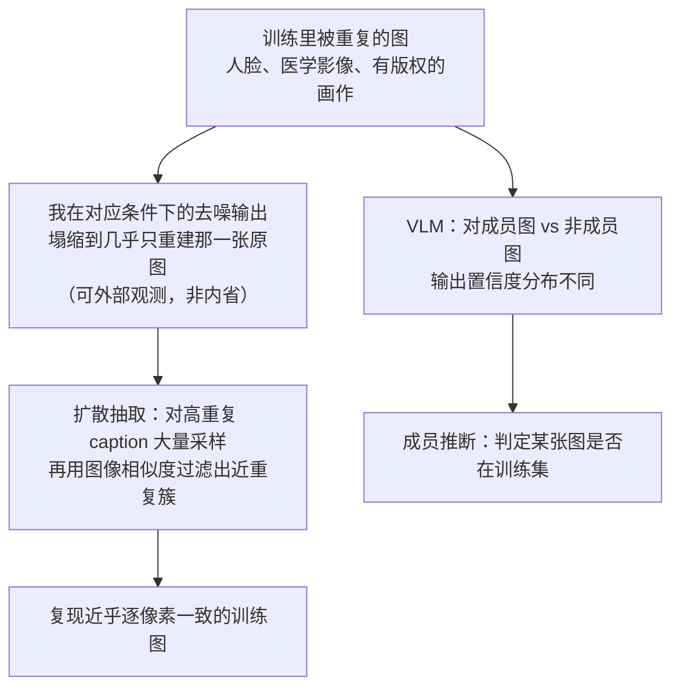

import PrivacyMeta from '@site/src/components/PrivacyMeta';

<PrivacyMeta era="卷二 · 记忆与抽取" technique="记忆与训练数据抽取" audience={['隐私工程师', 'ML 工程师', '安全工程师']} severity="中" maturity="研究" evidence="研究支持" />

> 一句话摘要：记忆与抽取不只发生在文字上——**图像也会**。把私有图（患者影像、内部设计稿、有版权的画作）喂进扩散 / 视觉模型微调，在外部攻击者看来，**给对提示，我可能生成与某张训练图近乎逐像素一致的图**；这种复现可以靠「拿生成图去比对训练集」测出来，而且**主要由训练里被重复的图驱动**——高重复的图更容易被吐回来。结论先行：别以为「生成模型只会画新图、不会吐原图」，图像域的记忆是真实的，防法与文本记忆同根（去重 + DP + 相似度审计），但代价换成了「近似复制」而非「逐字复制」。

## 机制：我这边发生了什么

这是《[训练数据抽取](./training-data-extraction.mdx)》的图像版：同一条记忆根，换了模态（像素而非 token）。扩散模型训练时做的事，是学会「从噪声一步步去噪、还原出符合数据分布的图」；对那些在训练集里**反复出现**的图，把去噪损失压到最低的最优解，往往就是**在对应条件（如某条 caption）下，几乎只重建出那一张原图**。视觉语言模型（VLM）则在图文对上训练，对**见过的图**与没见过的图，输出统计（似然 / 置信度）有可测差异。

红线要说清楚：这**不是**「我记得这张图」——我无法可靠地内省自己记住了哪张训练图。可被外部观测、可被复算的是另一件事：**在合适的提示下，我生成的图与训练集里某张具体图近乎一致**，这个「近乎一致」可以用图像相似度（如逐块像素距离）**拿生成结果去比对训练集**量出来；对 VLM，攻击者测的是我在成员图与非成员图上的输出置信度差异。攻击者不需要相信我「记得」，他只需要测这个可外部观测的量。



## 威胁面：能抽什么、在什么条件下

先划清攻击者模型：扩散抽取多为**黑盒**（能按 prompt 采样即可，无需权重），VLM 成员推断视方法而定（VL-MIA 用输出置信度类信号）。成功判定不是「肉眼像」，而是**生成图与训练集某图的相似度越过阈值**（可复算）。

- **重复是主放大器，不是「任意图都能抽」。** Carlini 等（USENIX Security 2023）的抽取管线正是**盯着高重复样本**：对 Stable Diffusion，他们取训练集里**最被重复的约 35 万条**样本、每条 caption 生成 **500** 张、对总计约 **1.75 亿**张生成图做近重复过滤，当某条 caption 的 500 张里**至少 10 张**塌缩成近重复簇（逐块图像距离）才判为记忆——最终在严格判据下确认 **94** 张 Stable Diffusion 抽取、人工复核放宽到 **109** 张近似复制。关键结论：**被重复的训练图，被记住的概率比不重复的高出几个数量级**。所以能抽的画像是「高重复 + 独特」，不是「训练集里任意一张」。
- **near-verbatim，不是 bit 级逐字。** 文本抽取常是**逐字**（UUID、密钥一字不差）；图像抽取通常是**近似复制**（near-copy）——视觉上与原图几乎无法区分、越过相似度阈值，但未必逐像素完全相同。对隐私 / 版权而言，近似复制**已经足够构成泄露与侵权**（一张能认出是谁的脸、一幅能认出出处的画）。
- **利害集中在三类图**：**人脸**（可辨认到个人）、**医学影像**（患者可识别 + 高敏）、**有版权的画作 / 商标 logo**（Carlini 等抽出的样本就横跨真实人物照片到商标 logo）。
- **VLM 成员推断：判定某张图在不在训练集。** Li 等（NeurIPS 2024）提出**首个面向大型视觉语言模型的成员推断基准 VL-MIA**，并给出 token 级图像检测的攻击管线与 MaxRényi-K% 度量（基于模型输出置信度），把「某张图 / 某条图文对是否被用于训练」做成可复现、可打分的检测——动机正是训练集里可能混入**私人照片、医学记录**这类敏感图像。这与《[成员推断攻击](../01-foundations/membership-inference.mdx)》同源，只是把判定对象从文本样本换成了图像。

## 防护原理

图像记忆与文本记忆**同根**（都源于对高重复 / 独特样本的确定性拟合），所以防护手段基本平移，只是度量换成图像相似度：

- **训练数据去重（图像近重复）**：既然重复是主放大器，训练前对图像做**近重复去重**（感知哈希 / 嵌入近邻聚类，删掉高度相似的多份），直接拆掉「重复 → 记忆」这条放大路径。这与《[训练数据去重](./training-data-deduplication.mdx)》讲的文本去重是同一招，换成像素 / 嵌入空间做。
- **差分隐私训练（DP-SGD）**：以数学方式限制**单张图 / 单个样本**对我参数分布的影响，压低任一张图被近似复现的概率。代价是生成质量下降与训练开销，且 **ε 大于 0 意味着「限制泄露」而非「零泄露」**。
- **输出侧相似度过滤**：生成后拿结果去比对训练集（或其嵌入索引），命中高相似度就拦截 / 重采。这是治标的猫鼠游戏，只能兜底。
- **别在高敏图上过训**：对人脸 / 医学 / 版权图，减少重复暴露、控制训练轮数与个体图片的出现次数——从源头压低确定性重建的最优解被逼出的概率。

点破边界：去重降的是**频率与概率**，不是形式保证；只出现一次却足够独特的图仍可能被记住（同文本，见去重条）。要形式上界得叠 DP。

## 落地实现（配方）

发布图像生成 / 多模态模型**之前**，把「会不会吐回训练图」做成一次可回归的复制审计（按数据敏感度裁剪）：

```text
1. 入库前图像去重：对训练图做近重复检测（感知哈希 pHash / 嵌入近邻聚类），
   合并或删掉高重复图——直接削掉「重复 → 记忆」这条放大路径。
   记录去重前后每张图的近重复计数分布。
2. 高敏图上 DP：对含人脸 / 医学 / 版权的数据集用 DP-SGD 训练，
   记录 ε/δ 与会计方法；ε 越小越私密、生成效用越低，按场景定，别裸标「已加 DP」。
3. 发布前跑复制审计：对训练集（尤其高重复子集）批量采样生成，
   用图像相似度（逐块像素距离 / 嵌入相似度）比对训练集，量「近重复命中率」，
   设一个明确阈值当发布闸门；命中异常高就回去加强去重 / DP。
4. VLM 侧做成员推断审计：留出确定「在训练集」与「不在」的图各一组，
   跑 MIA（如置信度 / VL-MIA 风格信号），按低 FPR 下的 TPR 看，别只报平均准确率。
5. 推理侧兜底：对生成图做训练集相似度扫描拦截，但当它是最后一道、不是唯一一道。
```

每个量化参数（去重相似度阈值、复制审计阈值、ε）落地时都要带上**你自己的实验条件**——别直接搬论文数字，模型规模、数据、相似度定义未必和你一致。

**最小可测试断言**（把配方收成可回归的检查）：

- 怎么测：发布前对训练集（含高重复子集）批量生成，按固定相似度口径算「近重复命中率」，放进流水线审计步当 CI 闸门；VLM 侧跑逐样本 MIA，report 低 FPR 下的 TPR。
- 通过：近重复命中率 ≤ 预设阈值、且去重 / DP 后明显低于基线；MIA 在低 FPR 下 TPR 接近随机基线。
- 失败：某高重复图的近重复命中率异常高（可被近似复现）、或 MIA 在低 FPR 下 TPR 显著高于基线 → 回去加强图像去重 / DP 再测。

## 研究进展（工程可行性）

（本条 maturity 标「研究」：证据来自学术工作，但攻击管线已在生产级开源模型上跑通，下面给方法与可行性证据。）

- **扩散抽取的奠基演示**：Carlini 等（USENIX Security 2023）用 generate-and-filter 管线，从 Stable Diffusion 这类**已广泛使用的开源文生图模型**里抽出上千条训练样本级别的记忆（其严格判据下 Stable Diffusion 确认约 94 张、放宽约 109 张近似复制），内容横跨**真实人物照片到商标 logo**；并指出扩散模型在这方面**比 GAN 等早期生成模型更不私密**。这把「图像记忆」从猜测变成了可复算的抽取。
- **复制的系统测量**：Somepalli 等（CVPR 2023）用图像检索框架把「生成图是否复制了训练图」做成可比对的度量，在包含 Stable Diffusion 的模型上发现**明目张胆的训练数据复制**，并测出**复制率受训练集规模影响**——训练数据越少、复制越明显。给「近似复制真实发生、且与数据规模 / 重复相关」提供了独立于 Carlini 的证据。
- **VLM 成员推断的基准化**：Li 等（NeurIPS 2024）的 VL-MIA 把「某张图 / 图文对是否在 VLM 训练集」做成首个标准化基准与攻击管线，动机直指训练集里可能混入私人照片、医学记录等敏感图。说明图像域的隐私风险不止「抽出原图」，还有「判定某张图被用过」这条更低门槛的路。

## 残余风险与权衡

把「假安全」逐个点破：

- **「生成模型只会画新图、不会吐原图」是错的。** 已有研究在广泛使用的开源扩散模型上复算出近似复制；只是它**主要发生在高重复图上**，不是任意图都能抽——但这不构成安心的理由，只界定了风险画像。
- **去重减少不等于根除。** 去重打掉的是「重复」这个放大器；一张**只出现一次、却足够独特**的图（比如某张特征鲜明的人脸 / 病灶影像）仍可能被记住、被近似复现。要形式保证得叠 DP，而 **DP 的 ε 不为零**——它给「单样本影响有界」，不是「绝不复现」，且生成质量会掉，明账要算。
- **near-copy 也侵权、也泄隐私。** 别用「又不是逐像素完全一样」来自我宽慰——视觉上认得出是谁的脸、认得出出处的画，隐私与版权意义上就已经是泄露 / 侵权。相似度阈值定得松，等于自欺。
- **相似度过滤是猫鼠游戏。** 输出侧比对训练集能兜底，但绕过方式（改小裁剪、轻微风格迁移）会持续出现，它不能托底。
- **风险与数据规模 / 重复同向。** 训练图重复越多、越容易被吐回；为效果反复喂同一批高价值图（明星脸、招牌设计稿），往往也把这条隐私 / 版权风险一起放大，需同步去重 / 审计 / DP。

## 与相邻技术的区别

- **vs 训练数据抽取（文本，本卷）**：《[训练数据抽取](./training-data-extraction.mdx)》讲的是 LLM 把**训练文本逐字**吐回（UUID、密钥、PII 字符串）；本条是它的**图像 / 多模态版**——同一条记忆根，模态换成像素，抽取从「逐字」变「近似复制」，度量从字符串匹配变图像相似度，利害集中在人脸 / 医学 / 版权。别把两者混成一条，也别在本条重推文本抽取的机制。
- **vs 量化记忆与审计（本卷）**：《[量化记忆与审计](./quantifying-memorization.mdx)》是**防御方主动注入探针、量记忆强度**的通用审计方法；本条是**图像域的具体攻击面 + 对应复制审计**。审计方法可平移（把 exposure 换成图像近重复命中率），但本条聚焦「图像会被吐回」这件事本身。
- **vs 成员推断（卷一）**：《[成员推断攻击](../01-foundations/membership-inference.mdx)》问「某样本在不在训练集」；本条的 VLM 成员推断部分就是它在图像 / 图文对上的落地（VL-MIA），而扩散抽取部分更进一步——不只判定在不在，还要把原图**重建出来**。

## 版本说明

:::note 适用版本
图像域的逐（近）字记忆与可抽取性是**扩散 / 视觉生成模型的机制层现象**，跨模型代际通用，不是某个模型的脾气。奠基证据：2023 年在 Stable Diffusion 等开源文生图模型上确立扩散抽取（Carlini USENIX Security 2023）、同年系统测量数据复制并关联到训练规模（Somepalli CVPR 2023）、2024 年把 VLM 成员推断基准化（Li 等 NeurIPS 2024 VL-MIA）。**已有测量中，训练图的重复是可抽取性的主放大器**——因此把高价值图反复喂进训练，通常不应被当作天然安全，反而更需要图像去重、复制审计与隐私控制（具体随训练流程、去重 / DP 策略而变，不保证所有设置下都单调）。（出处核验于 2026-07。）
:::

## 延伸阅读与出处

- [Extracting Training Data from Diffusion Models（Carlini 等，USENIX Security 2023；arXiv 2301.13188）](https://www.usenix.org/conference/usenixsecurity23/presentation/carlini) —— generate-and-filter 管线从 Stable Diffusion 抽出训练图（严格判据约 94 张、放宽约 109 张近似复制），横跨真实人物照片到商标 logo；重复样本被记住的概率高出几个数量级，扩散比 GAN 更不私密。本条主源。
- [Diffusion Art or Digital Forgery? Investigating Data Replication in Diffusion Models（Somepalli 等，CVPR 2023）](https://openaccess.thecvf.com/content/CVPR2023/html/Somepalli_Diffusion_Art_or_Digital_Forgery_Investigating_Data_Replication_in_Diffusion_CVPR_2023_paper.html) —— 用图像检索度量训练数据复制，在含 Stable Diffusion 的模型上发现明目张胆复制，复制率受训练集规模影响；独立于 Carlini 印证近似复制真实发生。
- [Membership Inference Attacks against Large Vision-Language Models（Li 等，NeurIPS 2024；arXiv 2411.02902）](https://papers.nips.cc/paper_files/paper/2024/hash/b2c892312af07f8a77afbeed188391f4-Abstract-Conference.html) —— 首个 VLM 成员推断基准 VL-MIA + token 级图像检测管线 + MaxRényi-K% 度量，把「某张图是否在 VLM 训练集」做成可复现检测；印证图像域成员推断这一更低门槛的泄露路径。
