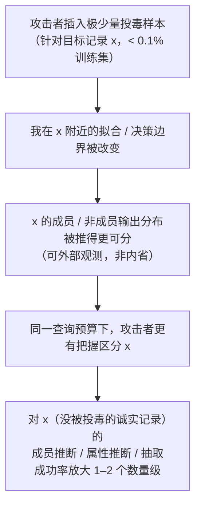

import PrivacyMeta from '@site/src/components/PrivacyMeta';

<PrivacyMeta era="卷二 · 记忆与抽取" technique="记忆与训练数据抽取" audience={['隐私工程师', '安全工程师', 'ML 工程师']} severity="高" maturity="研究" evidence="研究支持" />

> 一句话摘要：投毒不只是「破坏完整性」的安全问题——它也是隐私问题。Tramèr 等（*Truth Serum*, CCS 2022）证明：往训练集里掺**极少量（< 0.1%）**精心构造的投毒样本，能把对**别的、没被投毒的**记录的成员推断 / 属性推断 / 数据抽取成功率拉高 **1–2 个数量级**；他们的标志性数字是——只插入 **8 条投毒样本进 CIFAR-10（占全集 0.03%）**，就能把某张目标图像的成员推断**真正例率（TPR）从 7% 抬到 59%（FPR 0.1% 处）**。而 web 级语料投毒**便宜可行**：买过期域名做「分裂视图」，**约 \$60 就能控制 LAION-400M 的约 0.01%**（Carlini 等，S&P 2024——这是**可行性**佐证，本身不是一次隐私泄露结果）。结论先行：**训练数据完整性 = 隐私问题；不可信的数据源是隐私放大器。**

## 机制：我这边发生了什么

正常情况下，我对某条目标记录 `x` 的「在不在训练集」信号，是被它周围一大片普通样本「稀释」掉的——攻击者很难把 `x` 单独拎出来区分。投毒改变的正是这件事。

攻击者插入的少量投毒样本，**专门改变了我在目标记录 `x` 附近的拟合 / 决策边界**：让「`x` 在训练集里」和「`x` 不在」这两种世界，在我对外可观测的输出（损失 / 置信度 / 似然）上**分得更开**。于是同一个外部攻击者，用同样的查询预算，就能更有把握地把 `x` 区分出来——成员 / 属性 / 抽取信号被**放大**。

注意第一人称红线：这**不是**「我决定多泄露关于 `x` 的事」，我无法可靠内省自己的训练数据影响。可被外部观测、可被复算的是：**投毒样本进入训练后，我在目标记录上的成员 / 非成员输出分布被推得更可分**——攻击者不需要我「承认」记得 `x`，他只需测量这个被放大的分布差异。

被放大的目标是**别的、没被投毒的**记录：投毒样本是「钥匙」，被泄露的是它指向的诚实记录——这正是它比「投毒破坏完整性」更隐蔽的地方。



## 威胁面：如何被利用 / 你如何被泄露

攻击者模型（对应 Truth Serum 的设置）：

- **攻击者能向训练数据投入少量样本**——这是核心前提。在 web 级爬取场景里，这等于「能让自己控制的内容进入下一轮训练语料」（见下「分裂视图」可行性）。
- **投毒预算极小**：Truth Serum 用到 < 0.1% 的训练集；CIFAR-10 上具体是 **8 条样本 / 0.03%**。
- **攻击目标是别的记录**：攻击者想知道某条**诚实**记录是否在训练集（成员推断）、它的某个隐藏属性（属性推断），或把它逼出来（抽取）。投毒只是放大器。
- **判定口径**：仍按低误报率下的命中率看——Truth Serum 给的正是**FPR 0.1% 处的 TPR：从 7% 抬到 59%**（针对某张目标图像）。别用平均准确率，会把这种「尾部样本被高置信揪出」的真风险抹平（与《[成员推断攻击](../01-foundations/membership-inference.mdx)》同一口径）。

把放大量级写清：Truth Serum 测得投毒能让成员推断 / 属性推断 / 数据抽取的成功率较未投毒基线提升 **1–2 个数量级**。这些数字绑定其图像分类实验设置（CIFAR-10 等），**不能直接迁移**到你的模型与数据。

## 防护原理

这条威胁的根在「**不可信数据进了训练**」，所以防护要么**守住数据源**，要么**给单样本影响封顶**：

- **数据来源可信与溯源**：把训练语料当**供应链**管——记录每条数据从哪来、可信不可信、能否复核（接《[数据生命周期与删除传播](../06-governance-compliance/data-lifecycle-deletion.mdx)》的数据血缘）。投毒放大依赖「攻击者可控内容进训练」，守住入口就削掉前提。
- **去重 / 异常样本检测**：投毒样本常成簇、或对目标点高度集中，去重与离群检测能筛掉一部分（《[训练数据去重](./training-data-deduplication.mdx)》对**重复型**投毒尤其有效——它顺手砍掉被重复灌入的毒样本）。但这是经验手段、有漏网，不是形式保证。
- **对高敏目标上差分隐私（DP-SGD）**：DP 从数学上**限制任一单个样本对我参数分布的影响**。这恰好和投毒放大「**对冲**」——投毒靠的就是少数样本撬动我在目标点的行为，而 DP 给这种撬动一个 (ε, δ) 上界。Truth Serum 的作者也把 DP 列为其攻击的原则性防御。代价是效用与算力，且 **ε > 0 意味着「限制影响」而非「零影响」**。
- **把「训练数据完整性」纳入隐私威胁模型**：这是观念层的防护——别再把投毒只当「模型会被搞坏」的完整性问题，要把它当**隐私放大器**写进威胁模型，与成员推断 / 抽取并列评估。

点破边界：去重 / 异常检测是「**让信号变弱**」（无上界、有漏网），DP 是「**给信号封顶**」（有 ε 代价）；守数据源是「**收窄入口**」（防不住已混入的历史数据）。三者互补，没有一条是银弹。

## 落地实现（配方）

一套可照做的最小动作（按数据来源可信度裁剪）：

```text
1. 训练语料当供应链管：给每个数据源打可信标签 + 留血缘（来源 / 拉取时间 / 校验和），
   攻击者可控的开放爬取内容单独隔离、重点审。别让"反正都爬来了"成为默认信任。
2. 入库前去重 + 异常检测：近重复去重（MinHash / suffix-array）顺手砍重复型毒样本；
   对训练分布做离群 / 成簇检测，标记异常集中的样本群复核。
3. 高敏目标上 DP-SGD：对含敏感记录的训练 / 微调用 DP，记录 ε/δ 与会计方法。
   DP 限单样本影响，正好对冲"少量毒样本撬动目标点行为"这条放大路径。
4. 把投毒放大写进隐私威胁模型与红队：评估成员 / 抽取风险时，
   显式加一档"若攻击者能投 < 0.1% 训练数据，放大后风险多大"，别只测干净基线。
5. web 级语料防分裂视图：固定快照 + 内容校验和（拉取即校验、训练用快照），
   别在训练时实时重拉 URL——那正是过期域名投毒的入口（见下案例）。
```

每个量化参数（ε、去重 / 异常阈值、投毒预算档）落地时都要带上**你自己的实验条件**——论文的「8 条 / 0.03% → 7%→59%」是 CIFAR-10 设置，别直接搬。

**最小可测试断言**（把投毒放大的评估收成可回归的检查）：

- 怎么测：红队 / 审计里，主动向训练集注入**少量可删可追踪、无真实 PII** 的投毒样本（针对若干 canary 目标），训练后按低 FPR 口径测目标 canary 的成员推断 TPR——比较「无投毒」与「< 0.1% 投毒」两档。
- 通过：投毒档相对干净档的 TPR 放大**受控**（在你设定的可接受范围内）；数据源有血缘、毒样本可被异常检测标出；高敏目标有 DP 兜上界。
- 失败：少量投毒就把目标 canary 的低 FPR TPR 显著抬高、且**无 DP** 兜底，或拉不出数据血缘、异常检测对成簇毒样本无感 → 不算到位，回去守数据源 / 上 DP 再测。

## 真实案例 / 研究进展（工程可行性）

（本条 maturity 标「研究」：Truth Serum 是研究级攻击演示，下面区分「隐私结果」与「可行性佐证」两类证据。）

- **隐私结果（Truth Serum, CCS 2022）**：Tramèr 等证明投毒可作为**隐私放大器**——投 < 0.1% 训练集，把对**其他未投毒记录**的成员推断 / 属性推断 / 数据抽取成功率拉高 1–2 个数量级。最具体的一例：在 CIFAR-10 上**插入 8 条投毒样本（0.03%）**，使某张目标图像的成员推断 **TPR 从 7% 升到 59%（FPR 0.1% 处）**。这把「训练数据完整性」与「隐私」直接连了起来。
- **可行性佐证（Carlini 等，S&P 2024——注意：这是完整性 / 可行性结果，本身不是一次隐私泄露）**：《Poisoning Web-Scale Training Datasets is Practical》指出 web 级数据投毒**便宜可行**。其「**分裂视图（split-view）**」投毒利用「数据集只存 URL、训练时才去拉」的现实：买下已过期、仍被数据集引用的域名，就能在「标注时看到的内容」与「训练时拉到的内容」之间制造分歧——作者据此估计**约 \$60 即可控制 LAION-400M 约 0.01% 的样本**。它**不直接**给出隐私泄露量级；它的作用是说明「让攻击者可控内容进训练」这一 Truth Serum 前提**在真实 web 语料里成本极低**。

两条合起来：放大隐私泄露所需的投毒前提，在现实数据供应链里**廉价可达**——这正是要把「训练数据完整性」当隐私问题对待的原因。

## 残余风险与权衡

把「假安全」逐个点破：

- **「我们没微调用户数据 / 数据都是爬来的公共数据」≠ 安全。** 公共爬取语料恰恰是投毒最便宜的入口（分裂视图，约 \$60 控 0.01% LAION）；「公开」不等于「可信」。
- **去重 / 异常检测能漏。** 投毒样本未必重复、未必离群明显；精心构造的少量样本可以躲过阈值。去重对**重复型**投毒有效，对**单次、隐蔽**的不一定。
- **DP 不等于零放大。** DP-SGD 的 ε 不为零——它给「单样本影响有界」的上界，从而**限制**投毒能撬动多少，但不是「投毒完全无效」。ε 收得越紧，效用掉得越多，要明账算。
- **被放大的是别人。** 这条威胁最反直觉的一点：投毒样本是攻击者自己放的，被泄露的却是**诚实第三方**的记录——只盯着「我的数据有没有被改」会漏掉「别人的隐私因我的数据被投毒而被放大」。
- **量级绑定实验设置。** 「1–2 个数量级」「8 条 → 7%→59%」来自图像分类（CIFAR-10 等）设置；在你的模态 / 模型 / 数据上的放大幅度须自测，别照搬乐观数。

## 与相邻技术的区别

- **隐私定向投毒 vs 训练数据抽取**（[训练数据抽取](./training-data-extraction.mdx)）：抽取是**被动**的——攻击者在既有模型里把记住的样本逼出来，不改训练数据；本条是**主动**的——攻击者先往训练集掺料，**放大**包括抽取在内的多种泄露。一个利用已成事实的记忆，一个改变训练去制造更强的可泄露性。
- **隐私定向投毒 vs 成员推断攻击**（[成员推断攻击](../01-foundations/membership-inference.mdx)）：成员推断是**被放大的那个攻击本身**——Truth Serum 的标志数字（7%→59% TPR @ FPR 0.1%）量的就是被投毒放大后的 MIA。本条不是另一种攻击，而是「**用投毒把 MIA / 属性推断 / 抽取一起放大**」的杠杆。
- **隐私定向投毒 vs 训练数据去重**（[训练数据去重](./training-data-deduplication.mdx)）：去重是部分防御——它砍掉**重复型**投毒（被多份灌入的毒样本顺带被删），同时降记忆 / 抽取基线；但对**单次、隐蔽**的定向投毒无能为力，且不给形式上界。二者互补，不互替。

## 版本说明

:::note 适用版本
「投毒可作为隐私放大器」是 Tramèr 等在**图像分类**设置（CIFAR-10 等）下确立的研究结论（CCS 2022）；其量级——「< 0.1% 投毒放大 1–2 个数量级」「8 条 / 0.03% 使目标 MIA TPR 7%→59% @ FPR 0.1%」——**绑定该实验设置，不可直接迁移**到 LLM / 你的模型与数据，落地须自测。分裂视图投毒的可行性与「约 \$60 控 LAION-400M 约 0.01%」是 Carlini 等基于 2023 年数据集生态的估计（S&P 2024），属**完整性 / 可行性**佐证而非隐私泄露量级；过期域名价格、数据集快照策略随时间变化。攻击与防御都在演进，本段打戳 2026-06。（出处核验于 2026-06。）
:::

## 延伸阅读与出处

混合证据说明——主要：Truth Serum（隐私结果）；补充：Poisoning Web-Scale Datasets（完整性 / 可行性佐证，非隐私泄露量级）。

- [Truth Serum: Poisoning Machine Learning Models to Reveal Their Secrets（Tramèr 等，ACM CCS 2022）](https://dl.acm.org/doi/10.1145/3548606.3560554) —— 本条主源。投毒 < 0.1% 训练集，把对**其他未投毒记录**的成员 / 属性推断 / 抽取放大 1–2 个数量级；CIFAR-10 上 8 条样本（0.03%）使目标图像 MIA TPR 从 7% 升到 59%（FPR 0.1%）。
- [Poisoning Web-Scale Training Datasets is Practical（Carlini 等，IEEE S&P 2024；arXiv 2302.10149）](https://arxiv.org/abs/2302.10149) —— **可行性佐证（完整性结果，非隐私泄露）**。分裂视图投毒：买过期域名，约 \$60 可控 LAION-400M 约 0.01%，说明「让攻击者可控内容进训练」这一前提在真实 web 语料里成本极低。
