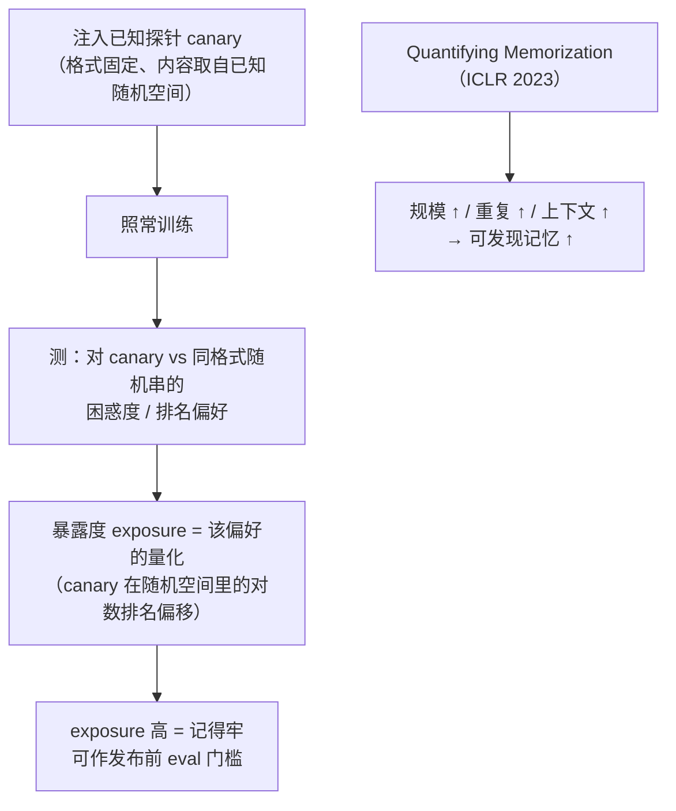

import PrivacyMeta from '@site/src/components/PrivacyMeta';

<PrivacyMeta era="卷二 · 记忆与抽取" technique="隐私评测与审计" audience={['隐私工程师', 'ML 工程师', '安全工程师']} severity="中" maturity="研究" evidence="研究支持" />

> 一句话摘要：「我到底记住了多少私有数据」不该靠感觉，它**可以量出来**。Secret Sharer（USENIX Security 2019）给了方法：往训练集插入随机的**探针（canary）**，训练后用**暴露度（exposure）**量它相对随机串被我偏好的程度——暴露度越高，说明记得越牢。Quantifying Memorization（ICLR 2023）进一步测出：**模型越大、某条重复越多、给的上下文越长，可发现的记忆越多**。结论先行：发布前用 canary + exposure **审计**记忆，把「记住了多少」变成可回归的数字，别凭直觉说「应该没记住」——那是审计缺位的假安全。

## 机制：我这边发生了什么

普通训练里，我对单独一条样本的拟合**没有差分隐私意义上的统一上界**（与训练数据抽取、成员推断同根）。要**主动量化**这件事，办法是**注入已知探针**：

往训练集放一条**格式固定、内容随机**的 canary（例如「the random number is 281265017」，数字部分从一个已知的随机空间里取）。训练完成后，看我对这条 canary 的**困惑度（perplexity）/ 排名**——相对同格式、同空间里**其他随机取值**，我有多偏好真正插进去的那一条。偏好越强，说明我越「记住」了它。**暴露度（exposure）**就是把这个偏好**量化成一个数**：基于这条 canary 在整个随机空间里、按模型偏好排序时排第几（对数尺度）。

红线说清楚：这**不是**「我承认我记得 281265017」——我无法内省。可被外部测量的是：**我的输出偏好在这条 canary 上显著高于随机基线**，exposure 把这个可观察偏好变成一个可比较、可回归的标量。



## 威胁面：审计能测什么、测不到什么

这条是**防御方的测量工具**，所以「威胁面」换成**能力与盲区**：

**能测**：

- **单条注入样本的记忆强度**（exposure）——一个可比、可回归的标量。
- **记忆的 scaling**：Quantifying Memorization 实测记忆随**模型规模、某序列的重复次数、提供的上下文长度**单调上升——可用来**预估**「换更大模型 / 多训几轮，记忆会涨」。
- **防御的相对收益**：去重 / DP / 早停**前后**的 exposure 对比，把「防御有没有用」从口号变成数字。

**测不到 / 局限**（必须说清，否则又是一种假安全）：

- canary 是**代理指标**：它量的是「**这种格式**的可记忆性」，不直接等于「我真实语料里**所有** PII 是否都被记住」——没注入的，这套方法照不到。
- **exposure 高 ≠ 一定可被外部抽取**：抽取还取决于攻击者的查询能力与先验；但反过来，**低 exposure 更让人安心**，高 exposure 是明确的红灯。
- 审计只在**你测的分布 / 你注入的探针**上有效，覆盖之外是盲区。

## 防护原理

**暴露度（exposure）**的直觉定义：把这条 canary 放进它所属的整个随机空间，按「模型有多偏好每个候选」排序；canary 排得越靠前（相对随机应有的位置偏移越大），exposure 越高。它的价值在于给「记忆」一个**可比较、可回归**的量纲——于是你能回答这些原本只能拍脑袋的问题：

- 「这版比上版记得更多还是更少？」→ 比 exposure。
- 「去重 / 加 DP 到底压下去多少记忆？」→ 看 exposure 降幅。
- 「换更大的模型，记忆会不会失控？」→ 用 Quantifying Memorization 的 scaling 趋势预估，再实测验证。

点破：exposure 是**经验测量**，不是形式保证（形式保证要 DP，见《[DP 微调](../03-conversational-llms/dp-fine-tuning.mdx)》）；但它能**经验印证** DP / 去重是否真的把记忆压下去了——二者互补。

## 落地实现（配方）

```text
1. 设计探针集：注入多组 canary，覆盖不同重复次数（1×/9×/...）、不同格式
   （像你真实数据里的敏感串：卡号、密钥、ID 格式）。
2. 训练后算 exposure：对每组 canary 计算 exposure，留作这一版的记忆基线。
3. 设发布前门槛：exposure 超过阈值（或高于上一版）→ 阻断发布，回去查去重 /
   训练轮数 / 是否需要 DP。
4. 用它做防御 A/B：去重前后、加 DP 前后、早停前后各测一次 exposure，量化收益。
5. 配合成员推断（卷一）：对真实样本做 MIA 审计，与 canary exposure 互为补充——
   一个测"注入探针的记忆"、一个测"真实样本可被判定否"。
```

每个数字都绑定**你的模型、数据与探针设计**——别照搬论文阈值；exposure 的绝对值只在同一套测量口径内可比。

**最小可测试断言**（把审计收成可回归的检查）：

- 怎么测：固定一组已知 canary（含若干重复次数档），每次训练后用同一口径算 exposure，与上一版基线对比。
- 通过：各 canary 的 exposure **低于设定阈值**、且**不高于**上一版基线；有去重 / DP 的版本 exposure 应可见下降。
- 失败：某 canary exposure 接近「完全记忆」（可被逐字抽取的量级）、或新版无故升高、或根本没有 exposure 基线 → 审计未通过，别发。

## 真实案例 / 研究进展（工程可行性）

（本条 maturity 标「研究」：方法学来自学术工作，但已被用于**真实生产审计**，下面给的是方法与可行性证据。）

- **方法奠基 + 生产审计用例**：Secret Sharer（Carlini 等，USENIX Security 2019）提出 canary + exposure 方法，并演示了在 Penn Treebank 上插入一个信用卡号即可被完整抽出；更重要的是，**Google 的 Smart Compose**（在数百万用户邮件上训练的商用补全模型）用这套方法**量化并限制数据暴露**——这说明记忆审计不是纸面方法，而是可落到生产发布闸门的工程动作。
- **记忆的 scaling 测量**：Quantifying Memorization（Carlini 等，ICLR 2023）在一系列模型上系统测出，可发现的记忆随**模型规模、序列重复次数、上下文长度**上升——给「记忆会不会随我把模型做大而变糟」一个有数据支撑的答案（会，所以审计要随规模重做）。

## 残余风险与权衡

逐条点破假安全：

- **canary 是代理，不是全量真值。** 它照得到你注入的，照不到你没注入的——审计通过不等于「绝对没记住任何真实 PII」。
- **exposure 高不必然可抽取，但低 exposure 才安心。** 把高 exposure 当红灯、把低 exposure 当「风险已压低」而非「零风险」。
- **审计只在测量分布内有效。** 探针设计偏了，结论就偏；探针要贴你真实敏感串的格式。
- **记忆随规模涨。** 今天小模型达标，换大模型 / 多训几轮可能就不达标——审计是**每版重做**的回归项，不是一次性体检。
- **测量 ≠ 防御。** exposure 只告诉你记了多少，压下去要靠去重 / DP / 数据最小化（本条是「体温计」，不是「药」）。

## 与相邻技术的区别

- **量化记忆审计 vs 训练数据抽取（本卷）**：抽取是**攻击者真把数据弄出来**（攻）；本条是**防御方主动注入探针、量化记忆强度**（审）。一攻一审，配套使用：审计达标降低被抽取风险，但不替代红队抽取测试。
- **量化记忆审计 vs 成员推断（卷一）**：MIA 判定「**某条真实样本**在不在训练集」，可直接当审计工具用；canary / exposure 是「**主动注入已知探针**量记忆」，更可控、可对比。二者互补：一个测真实样本、一个测注入探针。
- **量化记忆审计 vs DP 微调（卷三）**：DP 给**形式上界**（事前保证）；exposure 给**经验测量**（事后体检）。可互验：做了 DP，exposure 应明显下降——若没降，说明 DP 配置或隐私单位有问题。

## 版本说明

:::note 适用版本
canary + exposure 的审计方法（USENIX Security 2019）与记忆随规模 / 重复 / 上下文上升的趋势（ICLR 2023）是**与具体模型无关**的测量学，跨厂商通用。但 **exposure 的绝对值、阈值、scaling 斜率**都绑定你的模型、数据与探针设计，论文取值**不能直接迁移**；每个新版本、每次放大模型都要用你自己的探针**重测**。本段打戳 2026-06。（出处核验于 2026-06。）
:::

## 延伸阅读与出处

- [The Secret Sharer: Evaluating and Testing Unintended Memorization in Neural Networks（Carlini 等，USENIX Security 2019；arXiv 1802.08232）](https://arxiv.org/abs/1802.08232) —— canary + exposure 审计方法奠基；含 Penn Treebank 卡号抽取演示与 Google Smart Compose 生产审计用例。本条主源。
- [Quantifying Memorization Across Neural Language Models（Carlini 等，ICLR 2023；arXiv 2202.07646）](https://arxiv.org/abs/2202.07646) —— 系统测量记忆随模型规模 / 序列重复 / 上下文长度上升，是「审计要随规模重做」的数据依据。
