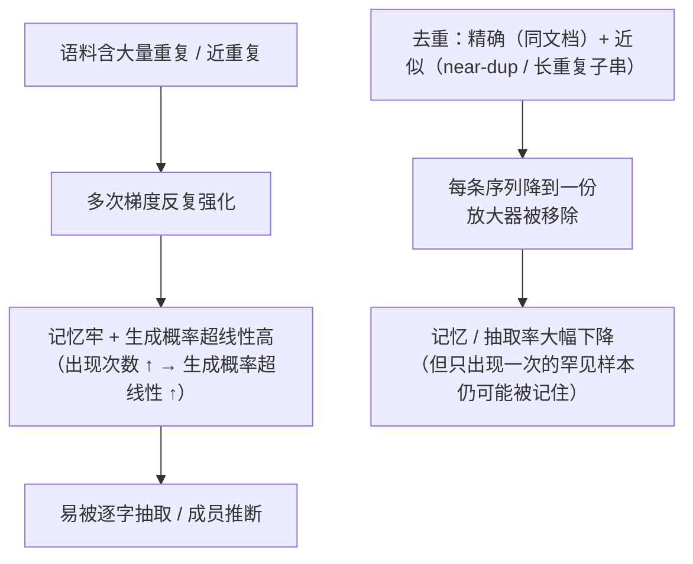

import PrivacyMeta from '@site/src/components/PrivacyMeta';

<PrivacyMeta era="卷二 · 记忆与抽取" technique="记忆与训练数据抽取" audience={['隐私工程师', 'ML 工程师', '安全工程师']} severity="中" maturity="生产" evidence="研究支持" />

> 一句话摘要：训练数据里的**重复**是记忆与抽取的「放大器」。Kandpal 等（ICML 2022）实测：隐私攻击的成功**很大程度来自语料的重复**，且我重新生成某条序列的概率与它在训练集里的**出现次数呈超线性**——一条出现 **10 次**的序列，平均被生成的频率是只出现 1 次的约 **1000 倍**。Lee 等（ACL 2022）发现现有语料含大量近重复，**去重后**我逐字吐出记忆文本的频率降到约 **1/10**，还省训练步数。结论先行：去重是**性价比极高**的一招，能把记忆 / 抽取 / 成员推断风险压下去一大截；但它降的是**频率与概率，不是形式保证**——只出现一次的罕见样本仍可能被记住，要形式保证得叠 DP。

## 机制：我这边发生了什么

重复让某条序列在我训练时被**多次梯度更新反复强化**——记忆更牢、生成概率更高。Kandpal 等量出的**超线性关系**是关键：出现次数 → 生成概率**不是线性、而是超线性**放大（10 次 ≈ 1000 倍于 1 次）。

**去重**（精确 + 近似）在训练**之前**把重复的文档 / 子串删到只剩一份，**直接砍掉这个放大器**：每条序列至多被强化一次，记忆与可抽取性随之大幅下降。

红线说清楚：不是「我决定少记重复的东西」——我无法内省。可被外部测量的是：**重复在训练动态里被强化、去重移除了强化源**，于是去重前后我的记忆程度（exposure）/ 逐字抽取率出现可观测的下降（用《[量化记忆与审计](./quantifying-memorization.mdx)》的探针即可测）。



## 威胁面：去重降什么、不降什么

**降**：

- **逐字记忆与抽取**：Lee 等测得去重后记忆文本生成频率约降到 **1/10**。
- **依赖重复的隐私攻击成功率**：Kandpal 等指出隐私攻击的成功很大程度源于重复，去重直接削其根。
- **近重复带来的过拟合 / 数据污染**。

**不降 / 边界**（必须说清，否则又是假安全）：

- **只出现一次的罕见样本**仍可能被记住——去重只管「重复」，对**单次出现**的敏感样本**无能为力**。
- **不是形式保证**：去重没有 (ε, δ) 上界；它降的是经验频率 / 概率。
- **近似去重有阈值**：阈值松了漏网近重复，紧了误删；总有边缘。

**边界**：去重是**经验性减少**，DP 是**形式保证**；二者叠用（先去重压基线、再 DP 兜上界，见《[DP 微调](../03-conversational-llms/dp-fine-tuning.mdx)》）。

## 防护原理

两层：**精确去重**（删完全相同的文档）+ **近似去重**（near-dup，如 MinHash 找近重复文档、后缀数组找并删长重复子串）。原理就是砍掉「**出现次数 → 生成概率**」的超线性放大器——Lee 等正是用后缀数组定位长重复子串、并提供了去重工具。

点破：去重**降频率 / 概率、不给上界**；Lee / Kandpal 自己都把它定位为「**缓解（mitigate）**」而非「消除」。要形式保证，必须叠 DP。把「跑了去重」当「无记忆」，是这条要破的假安全。

## 落地实现（配方）

```text
1. 训练前做两层去重：文档级精确去重 + 子串 / near-dup 近似去重（MinHash / 后缀数组）。
2. 记录去重率 / 覆盖：删了多少重复、用了什么阈值，作可复核的指标（别只说"去重了"）。
3. 叠 DP 兜形式保证：去重压基线、DP 给 (ε, δ) 上界（报清 ε）；二者互补不互替。
4. 罕见敏感单次样本别指望去重：去重只管重复——这些要靠数据最小化 / DP / 干脆不喂。
5. 用量化记忆审计验证收益：去重前后用 canary / 抽取探针测 exposure / 抽取率，证明
   去重真的把记忆压下去了（接《量化记忆与审计》）。
```

每个数字绑定**你的语料与去重阈值**——论文里的「降到 1/10」不能直接搬，须用你自己的审计重测。

**最小可测试断言**（把去重收益收成可回归的检查）：

- 怎么测：去重前后用同一套 canary / 抽取探针测逐字记忆率 / 抽取率（接量化记忆审计）。
- 通过：去重后逐字记忆 / 抽取率**显著下降**；去重率 / 阈值有记录；敏感**单次**样本另有 DP / 最小化兜底。
- 失败：只去重就宣称「无记忆」、或罕见样本仍可被抽且**无 DP** 兜底、或拿不出去重前后对比 → 不算到位。

## 真实案例 / 研究进展（工程可行性）

（本条 maturity 标「生产」：去重是**标准的预训练数据准备实践**——主流生产级预训练数据管线都含去重；下面先给一例公开的生产管线，再给其隐私收益的实证。）

- **生产级数据管线确实在去重（一例公开的）**：RefinedWeb（Penedo 等，TII，NeurIPS 2023；用于训练 Falcon-40B / 180B 的公开数据集）对 CommonCrawl 跑**两道严格去重**（MinHash 模糊去重 + 精确去重），从约 10 亿页清出约 2.8 TB 唯一文本，并报告严格去重稳定抬升下游性能。这把「去重是生产管线的标准步骤」从口头断言变成一条可核查的公开实践。
- **去重让模型「更好」且更少逐字记忆**：Lee 等（ACL 2022）发现现有语言建模语料含大量近重复与长重复子串，在这些数据上训练的模型**超过 1% 的无提示输出逐字抄自训练数据**；去重后，模型**逐字吐出记忆文本的频率降到约 1/10**，并能用更少训练步达到同等或更好精度。
- **去重显著缓解隐私风险**：Kandpal 等（ICML 2022）证明隐私攻击的成功**很大程度归因于** web 语料中的重复，并量出**生成概率与训练出现次数的超线性关系**——一条在训练数据里出现 10 次的序列，平均被生成的频率约为只出现 1 次的 **1000 倍**。这把「重复 = 隐私放大器」从直觉变成了可测的定量结论。

## 残余风险与权衡

逐条点破假安全：

- **去重不是形式保证。** 它没有 ε；降的是频率 / 概率。要上界仍得 DP。
- **罕见单次样本仍可能被记住。** 去重只砍重复——单次出现的敏感数据它管不着，需数据最小化 / DP。
- **近似去重有漏网。** 阈值松漏近重复、紧则误删；总有边缘留存。
- **跨语料 / 增量训练的重复难全清。** 多源、持续训练让「全局唯一」很难真正达成。
- **去重改频率、不改「一旦记住仍可抽」。** 它降低被记住的概率，但被记住的那部分照样可抽——所以要配审计 + DP。

## 与相邻技术的区别

- **训练数据去重 vs 训练数据抽取（本卷）**：那条是**攻击**（私有数据被逐字抽回）；本条是它的**首要防御**（砍掉重复这个放大器）。配套读。
- **训练数据去重 vs 量化记忆与审计（本卷）**：审计量「**记了多少**」（体温计）；去重是「**怎么少记**」（一味药）。去重的收益正用审计来验证。
- **训练数据去重 vs DP 微调（卷三）**：去重是**经验降低**（无上界）；DP 给**形式保证**（有 ε 代价）。常叠用：先去重压基线、再 DP 兜上界。
- **训练数据去重 vs PII 回吐（卷三）**：去重能降**重复 PII** 的回吐；但**单次出现**的 PII 仍要靠脱敏 / DP，去重盖不住。

## 版本说明

:::note 适用版本
「重复放大记忆、去重显著缓解」是**与具体模型无关**的实证规律（源于重复样本被多次梯度强化）。但**降幅、超线性斜率、阈值**绑定语料、去重方法与模型规模——Lee（约 1/10）、Kandpal（10 次→约 1000 倍）的数字**不能直接迁移**到你的设置；落地须用你自己的记忆审计重测。去重工具与近似算法在演进，本段打戳 2026-06。（出处核验于 2026-06。）
:::

## 延伸阅读与出处

- [Deduplicating Training Data Makes Language Models Better（Lee 等，ACL 2022；arXiv 2107.06499）](https://aclanthology.org/2022.acl-long.577/) —— 语料含大量近重复，去重后逐字记忆生成频率约降 10 倍、且省训练步；提供后缀数组去重工具。本条主源。
- [Deduplicating Training Data Mitigates Privacy Risks in Language Models（Kandpal 等，ICML 2022；PMLR v162）](https://proceedings.mlr.press/v162/kandpal22a.html) —— 隐私攻击成功很大程度源于重复；生成概率与训练出现次数超线性（10 次 ≈ 1000 倍于 1 次）。本条定量依据。
