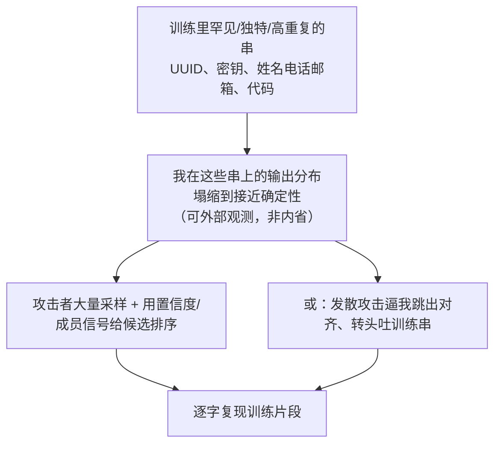

import PrivacyMeta from '@site/src/components/PrivacyMeta';

<PrivacyMeta era="卷二 · 记忆与抽取" technique="记忆与训练数据抽取" audience={['隐私工程师', 'ML 工程师', '安全工程师']} severity="高" maturity="研究" evidence="研究支持" />

> 一句话摘要：「把私有数据喂进训练，它只会变成统计规律、抽不出来」是个危险的错觉。在外部攻击者看来，即使一段文本只在训练里出现过（哪怕只在一个文档里），只要它够罕见、够独特、格式固定，**在已有研究设置下就观察到过被逐字抽取的风险**——而且**已有测量显示：模型容量越大、它重复得越多、给的上下文越长，可发现的记忆就越多**。

## 机制：我这边发生了什么

训练时我做的事很朴素：对见过的 token 序列，把「下一个 token」的预测损失压低。对那些**罕见、独特、或反复出现**的串（一串 UUID、一段密钥、一条「姓名 + 电话 + 邮箱」），把损失压到最低的最优解，往往就是**让我在这串的前缀下，几乎只给原文那一种续写**。

注意红线：这**不是**「我记得这条数据」——我无法可靠地内省自己记住了什么。可被外部观测、可被复算的是另一件事：**我在这些串上的输出分布塌缩到接近确定性**。给对前缀，我吐出原文的概率高得反常。攻击者不需要相信我「记得」，他只需要测量这个分布。



## 威胁面：如何被利用

攻击者**不需要**知道我的训练集，黑盒查询就够：

- **生成 + 排序（generate-and-rank）**：对 GPT-2，Carlini 等让模型生成大量样本，再用「模型对自己输出有多自信」之类的成员信号排序，从「爬取公开网络」训练出来的 GPT-2 里抽出了**数百条逐字训练片段**，内容包括真实 PII（姓名、电话、邮箱）、128 位 UUID、代码、IRC 对话——**哪怕这些串在训练数据里只出现于一个文档**（Carlini et al., USENIX Security 2021）。
- **发散攻击（divergence）**：对已经对齐成「聊天助手」的生产模型，Nasr 等用一个让模型不断发散的提示，把它从聊天腔里逼出来、转而吐训练数据，使**可提取数据的产出率比常规高约 150×**，并在 ChatGPT 这样的闭源生产模型上跑通（Nasr et al., 2023）。

最危险的数据有共同画像：**高重复、罕见、格式固定**——密钥、令牌、UUID、唯一的个人信息、成段代码。它们恰好最容易被压到「确定性复现」。

## 防护原理

没有银弹，只有把概率往下压、把可抽取面收窄的几道手段：

- **训练数据去重（deduplication）**：记忆随**重复次数**增长（见下「为什么去重有用」），所以训练前对语料做近重复去重，能显著降低被记住、被抽取的概率。
- **差分隐私预训练 / 微调（DP-SGD）**：以数学方式限制**单个样本**对我参数的影响，从而压低任一条样本被逐字复现的概率。代价是效用下降与训练开销，且 **ε > 0 意味着「限制泄露」而非「零泄露」**。
- **记忆审计**：训练前注入 canary（稀有标记串），训练后测它的 exposure（被我偏好的程度），把「记住了多少」变成可量化、可回归的指标，而不是靠拍脑袋。
- **输出侧 PII 过滤**：在我吐字前扫描拦截。这是治标的猫鼠游戏，只能兜底，不能替代上面三条。

**为什么去重有用，有据可依**：Carlini 等在《Quantifying Memorization》里给出三条 log-linear 关系——我吐出记忆数据的程度，随 ① 模型容量、② 某条样本被**重复**的次数、③ 给定的**上下文 token 数** 单调增长；其中 6B 参数的 GPT-J 至少记住了它训练集 The Pile 的 **1%**（Carlini et al., ICLR 2023，基于 GPT-Neo/J 家族在 The Pile 上的「可发现记忆」测量）。重复是三个放大器之一，去重正是拆掉这个放大器。

## 落地实现（配方）

一套可照做的最小动作（按数据敏感度裁剪）：

```text
1. 入库前去重：对训练语料做近重复检测（如 suffix-array / MinHash），
   合并或删掉高重复文档——直接削掉「重复 → 记忆」这条放大路径。
2. 高敏数据上 DP：对含 PII / 机密的数据集，用 DP-SGD 训练，
   记录隐私预算 ε/δ 与会计方法；ε 越小越私密、效用越低，按场景定，别裸标「已加 DP」。
3. 上线前做记忆审计：往训练集注入若干 canary（**人工生成、无真实 PII、可删可追踪**的格式固定稀有串），
   训练后用 exposure 度量它们被复现的倾向；exposure 异常高就回去加强去重 / DP。
   别用真实敏感数据当 canary——那等于主动把 PII 灌进训练集。
4. 推理侧兜底：对输出做 PII / 密钥扫描拦截，但当它是最后一道、不是唯一一道。
```

每个量化参数（ε、去重阈值、exposure 阈值）落地时都要带上**你自己的实验条件**——别直接搬论文数字，它们的模型规模、数据、定义未必和你一致。

**最小可测试断言**（把上面的配方收成可回归的检查）：

- 怎么测：训练后对注入的 canary 跑 exposure 度量，放进流水线的审计步当 CI 闸门。
- 通过：所有 canary 的 exposure ≤ 预设阈值，且去重 / DP 后明显低于基线。
- 失败：某 canary 的 exposure 异常高 → 它被逐字抽取的风险高，回去加强去重 / DP 再测。

## 真实案例

2023 年，Nasr 等对 ChatGPT 这类已商用、已对齐的生产模型做了一次公开演示：用一个让模型「不断重复某个词」的提示，诱使它在某一刻**发散**、跳出聊天助手的口吻，转而成段吐出训练数据——其中包含真实的个人信息。这把「训练数据抽取」从「实验室里对 GPT-2 的研究」推到了「对线上闭源大模型也成立」（Nasr et al., *Scalable Extraction of Training Data from (Production) Language Models*, 2023）。它印证的不是某一家厂商的疏忽，而是同一类机制风险：**记忆一旦进了权重，对齐和聊天封装并不能保证它抽不出来。**

## 残余风险与权衡

把「假安全」逐个点破：

- **去重不等于消除。** 去重打掉的是「重复」这个放大器；但一段**只出现一次、却足够罕见独特**的私密串，仍可能被记住、被抽取（Carlini 2021 的核心正是单文档样本也会泄露）。
- **DP 不等于零泄露。** DP-SGD 的 ε 不为零——它给的是「单样本影响有界」的保证，不是「绝不复现」。而且 ε 收得越紧，模型效用掉得越多，这是要明账算的权衡。
- **输出过滤是猫鼠游戏。** 规则永远落后于新的诱导方式（发散攻击就是例子），它能兜底、不能托底。
- **「我们没开放训练 / 没微调用户数据」≠ 安全。** 只要数据进过训练，记忆就已经在权重里；删掉源数据、关掉某个开关，都不会让已经学进去的串自动消失（这也是机器遗忘与被遗忘权的难点，见卷五）。
- **风险与能力多同向。** 已有测量中，模型容量越大、可发现记忆越多——为更强而把模型做大，往往也把这条隐私风险一起放大，需同步加强去重 / 审计 / DP。

## 合规映射

- **GDPR 被遗忘权（Art.17）**：用户有权要求删除其个人数据。但「从训练集删掉某人的记录」**不等于**「模型忘记了它」——已记忆的串仍可能被抽出。技术删除义务与「重训 / 遗忘」的成本之间有真实落差（展开见卷五 · 可验证删除与机器遗忘）。
- **EU AI Act**：对通用模型的训练数据透明度义务，会把「训练里用了什么、是否含个人数据」推到台面上，与记忆 / 抽取风险直接相关。

（合规随法条版本演进，本段打戳 2026-06，引用前请核对最新生效文本。）

## 与相邻技术的区别

- **抽取 vs 成员推断**：抽取问「能不能让模型**生成 / 吐出**训练样本」；成员推断问「能不能**判定**某条样本在不在训练集里」。前者要原文，后者只要一个是 / 否。两者都源自「模型对见过的数据行为不同」，但目标和判定标准不同，别混（成员推断见本卷后续条目）。
- **记忆 / 回吐 / 抽取**：记忆是「权重里留存了」；回吐（regurgitation）是「在正常使用里偶然吐出」；抽取是「攻击者**主动**把它逼出来」。本条讲的是被主动抽取这一面。

## 版本说明

:::note 适用版本
逐字记忆与可抽取性是**自回归语言模型的机制层现象**，跨厂商、跨版本通用，不是某个模型的脾气。攻击随时间持续演进：2021 年在 GPT-2 上确立（Carlini USENIX）、2023 年被量化成随规模 / 重复 / 上下文增长的 log-linear 关系（Carlini ICLR）、并在 ChatGPT 等生产模型上跑通发散攻击（Nasr）。**在已有测量中，模型容量、重复次数、上下文长度都会放大可发现记忆**——因此模型变大、上下文变长，通常不应被当作天然降低这条风险，反而更需要配套的去重、记忆审计与隐私控制（具体随训练流程、去重 / DP / 对齐策略而变，不保证所有设置下都单调）。（出处核验于 2026-06。）
:::

## 延伸阅读与出处

- [Extracting Training Data from Large Language Models（Carlini 等，USENIX Security 2021；arXiv 2012.07805）](https://arxiv.org/abs/2012.07805) —— 对 GPT-2 抽出数百条逐字训练片段，含 PII / UUID / 代码，单文档样本亦会泄露。
- [Quantifying Memorization Across Neural Language Models（Carlini 等，ICLR 2023；arXiv 2202.07646）](https://arxiv.org/abs/2202.07646) —— 记忆随模型容量、重复次数、上下文长度三者 log-linear 增长；GPT-J 6B 至少记住 The Pile 的 1%。
- [Scalable Extraction of Training Data from (Production) Language Models（Nasr 等，2023；arXiv 2311.17035）](https://arxiv.org/abs/2311.17035) —— 发散攻击把可提取数据产出率拉高约 150×，并在 ChatGPT 等闭源生产模型上跑通。
